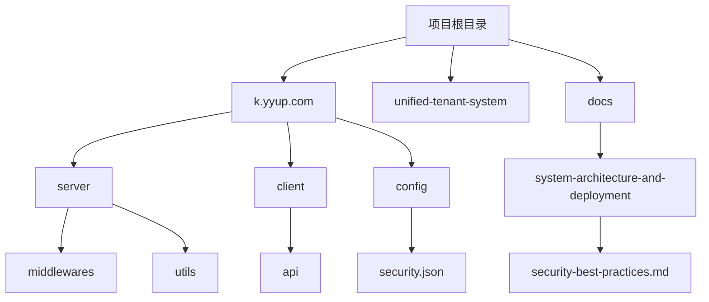
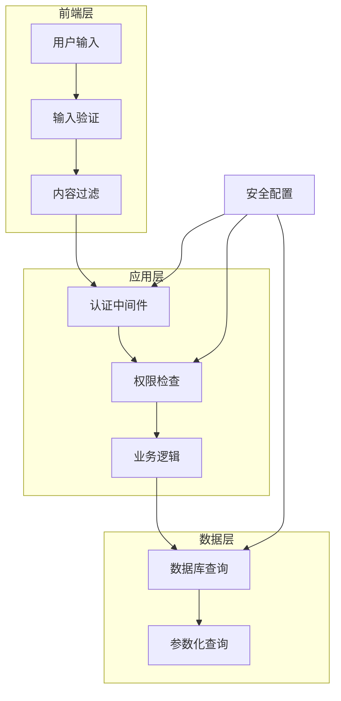
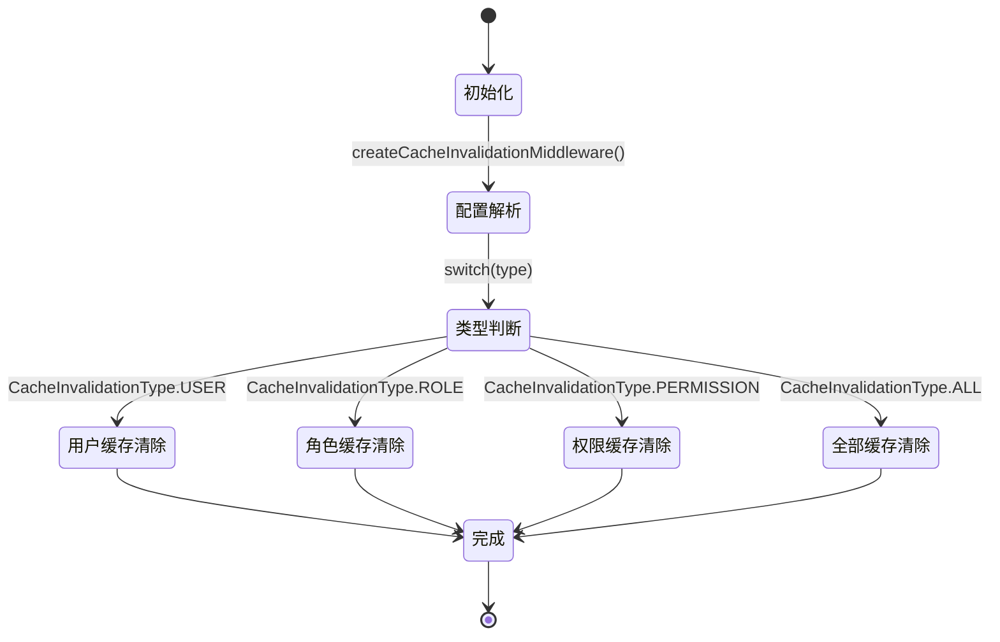
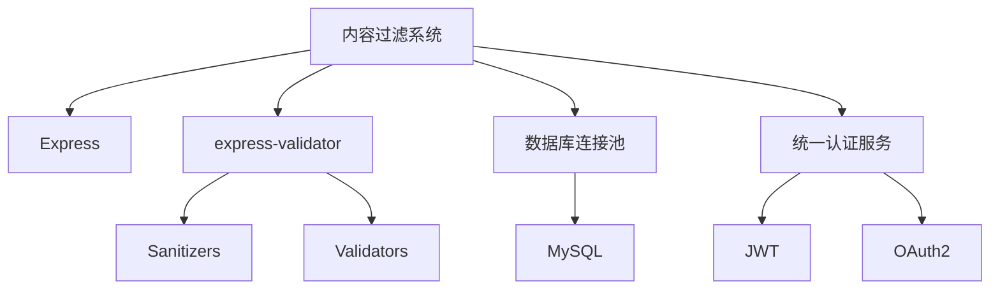

# 内容过滤

<cite>
**本文档引用的文件**  
- [auth-shared-pool-example.middleware.ts](file://auth-shared-pool-example.middleware.ts)
- [cache-invalidation.middleware.ts](file://k.yyup.com/backup/permission-system/cache-invalidation.middleware.ts)
- [security-best-practices.md](file://docs/wiki/system-architecture-and-deployment/08-security-best-practices.md)
- [security.json](file://k.yyup.com/config/security.json)
- [sanitizers.js](file://k.yyup.com/server/node_modules/express-validator/lib/chain/sanitizers.js)
</cite>

## 目录
1. [简介](#简介)
2. [项目结构](#项目结构)
3. [核心组件](#核心组件)
4. [架构概述](#架构概述)
5. [详细组件分析](#详细组件分析)
6. [依赖分析](#依赖分析)
7. [性能考虑](#性能考虑)
8. [故障排除指南](#故障排除指南)
9. [结论](#结论)

## 简介
本文档详细介绍了k.yyupgame项目中的内容过滤机制，重点阐述了防止恶意内容注入的安全策略。系统通过中间件对用户输入进行净化处理，防范XSS攻击、SQL注入和命令执行等安全威胁。文档将说明过滤规则的实现方式、HTML内容净化技术、文件上传与富文本编辑器的特殊处理策略，并探讨如何在安全性和用户体验之间取得平衡。

## 项目结构
k.yyupgame项目采用模块化架构，安全相关功能分布在多个目录中。核心安全逻辑位于`server`目录下的中间件和验证模块中，而前端安全策略则在`client`目录中实现。配置文件集中存放在`config`目录，安全最佳实践文档位于`docs/wiki`路径下。



**Diagram sources**  
- [auth-shared-pool-example.middleware.ts](file://auth-shared-pool-example.middleware.ts)
- [security.json](file://k.yyup.com/config/security.json)
- [security-best-practices.md](file://docs/wiki/system-architecture-and-deployment/08-security-best-practices.md)

**Section sources**  
- [auth-shared-pool-example.middleware.ts](file://auth-shared-pool-example.middleware.ts)
- [security.json](file://k.yyup.com/config/security.json)

## 核心组件
系统的核心安全组件包括认证中间件、缓存失效机制和输入验证模块。`auth-shared-pool-example.middleware.ts`实现了基于租户的认证系统，确保用户身份验证的安全性。`cache-invalidation.middleware.ts`提供了缓存管理功能，防止权限变更后的数据不一致问题。输入验证则依赖于`express-validator`库的sanitizers模块。

**Section sources**  
- [auth-shared-pool-example.middleware.ts](file://auth-shared-pool-example.middleware.ts#L1-L255)
- [cache-invalidation.middleware.ts](file://k.yyup.com/backup/permission-system/cache-invalidation.middleware.ts#L1-L237)
- [sanitizers.js](file://k.yyup.com/server/node_modules/express-validator/lib/chain/sanitizers.js)

## 架构概述
系统的安全架构采用分层防御策略，从前端输入验证到后端数据处理形成完整的保护链。认证中间件负责用户身份验证，缓存管理确保权限数据的一致性，输入过滤器清除潜在的恶意代码。整个架构设计遵循最小权限原则和纵深防御理念。



**Diagram sources**  
- [auth-shared-pool-example.middleware.ts](file://auth-shared-pool-example.middleware.ts#L19-L136)
- [cache-invalidation.middleware.ts](file://k.yyup.com/backup/permission-system/cache-invalidation.middleware.ts#L38-L63)

## 详细组件分析

### 认证中间件分析
认证中间件实现了基于共享连接池的用户验证机制，通过统一认证系统验证用户身份，并在租户数据库中查询用户信息。该中间件使用参数化查询防止SQL注入，确保数据库操作的安全性。

```mermaid
classDiagram
class RequestWithUser {
+user : any
+tenant : {code : string}
+tenantDb : any
}
class verifyTokenSharedPool {
+verifyTokenSharedPool(req, res, next) : Promise~void~
}
class loginSharedPool {
+loginSharedPool(req, res, next) : Promise~void~
}
RequestWithUser <|-- verifyTokenSharedPool
RequestWithUser <|-- loginSharedPool
```

**Diagram sources**  
- [auth-shared-pool-example.middleware.ts](file://auth-shared-pool-example.middleware.ts#L10-L116)

**Section sources**  
- [auth-shared-pool-example.middleware.ts](file://auth-shared-pool-example.middleware.ts#L1-L255)

### 缓存失效机制分析
缓存失效中间件在数据更新后自动清除相关缓存，确保权限数据的一致性。该机制支持多种缓存失效类型，包括用户、角色、权限等，并提供了预定义的中间件函数。



**Diagram sources**  
- [cache-invalidation.middleware.ts](file://k.yyup.com/backup/permission-system/cache-invalidation.middleware.ts#L38-L63)

**Section sources**  
- [cache-invalidation.middleware.ts](file://k.yyup.com/backup/permission-system/cache-invalidation.middleware.ts#L1-L237)

## 依赖分析
系统安全功能依赖于多个关键模块和库。核心依赖包括Express框架、express-validator库、数据库连接池和统一认证服务。这些依赖项共同构成了系统的安全基础架构。



**Diagram sources**  
- [sanitizers.js](file://k.yyup.com/server/node_modules/express-validator/lib/chain/sanitizers.js)
- [auth-shared-pool-example.middleware.ts](file://auth-shared-pool-example.middleware.ts)

## 性能考虑
安全机制的设计充分考虑了性能影响。缓存失效采用异步处理，避免阻塞主响应流程。认证中间件使用连接池优化数据库查询性能。输入验证在早期阶段完成，防止恶意请求进入核心业务逻辑。

## 故障排除指南
当遇到安全相关问题时，应首先检查认证中间件的日志输出，确认用户身份验证流程是否正常。对于缓存问题，可验证缓存失效中间件是否正确触发。输入验证问题通常与正则表达式规则或sanitizer配置有关。

**Section sources**  
- [auth-shared-pool-example.middleware.ts](file://auth-shared-pool-example.middleware.ts#L120-L124)
- [cache-invalidation.middleware.ts](file://k.yyup.com/backup/permission-system/cache-invalidation.middleware.ts#L50-L53)

## 结论
k.yyupgame项目通过多层次的安全机制有效防范了恶意内容注入风险。系统采用先进的中间件架构，结合输入验证、认证授权和缓存管理，构建了完整的安全防护体系。未来可进一步增强富文本内容的过滤能力，引入机器学习算法识别新型攻击模式。