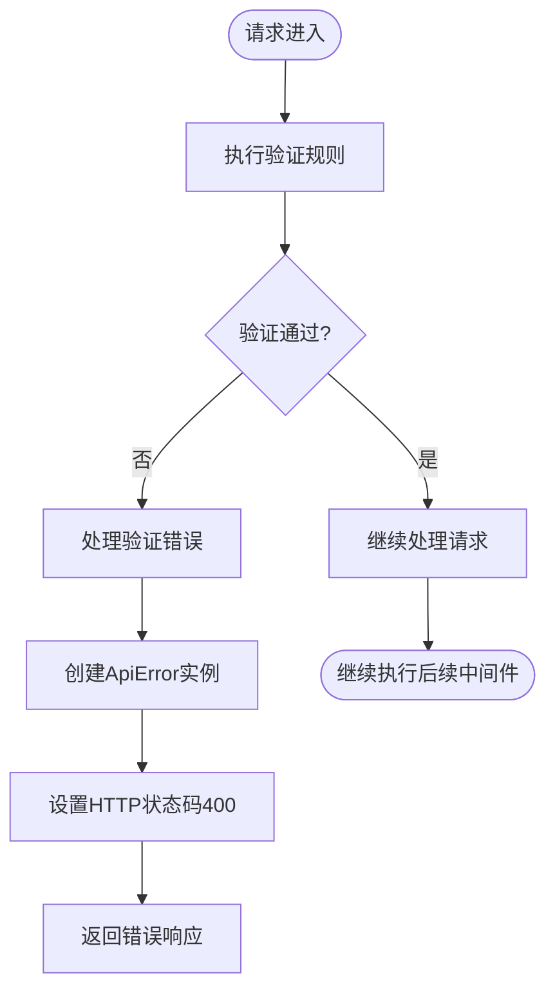
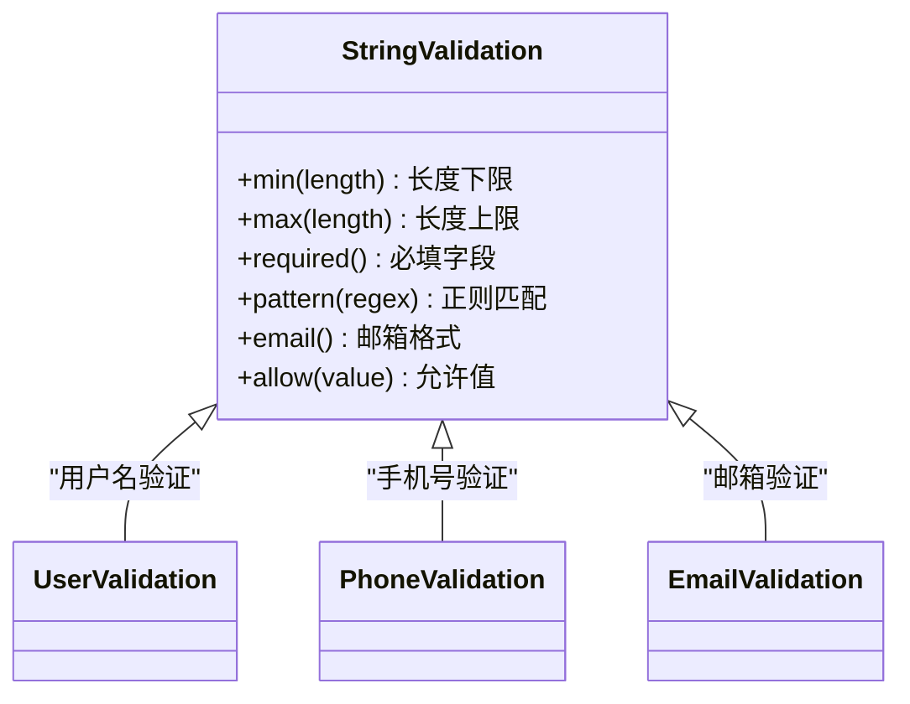
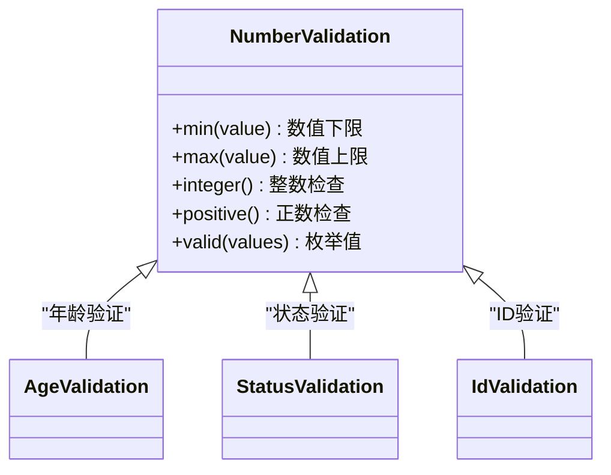
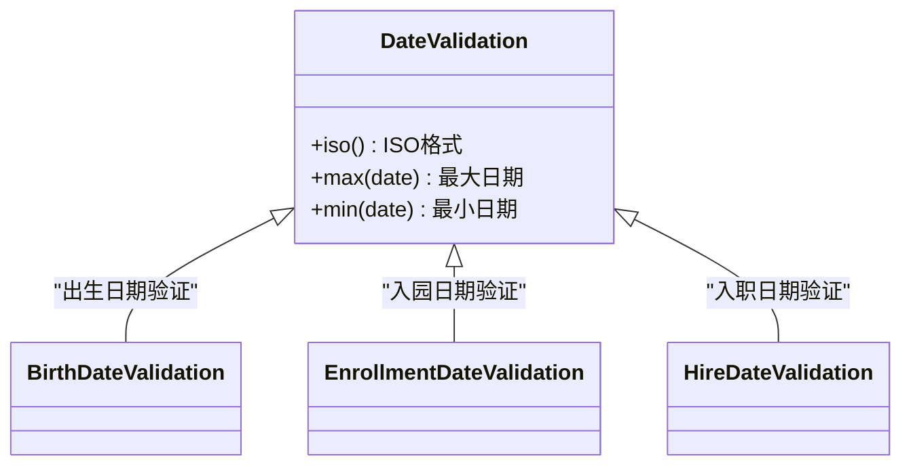
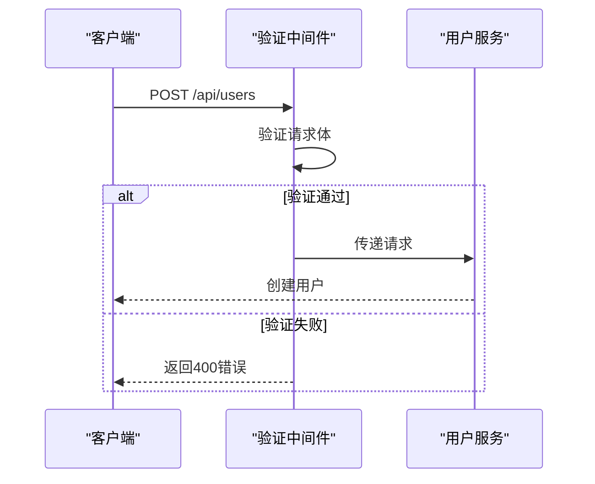

# 数据验证

<cite>
**本文档引用的文件**
- [user.validation.ts](file://k.yyup.com/server/src/validations/user.validation.ts)
- [student.validation.ts](file://k.yyup.com/server/src/validations/student.validation.ts)
- [teacher.validation.ts](file://k.yyup.com/server/src/validations/teacher.validation.ts)
- [parent.validation.ts](file://k.yyup.com/server/src/validations/parent.validation.ts)
- [apiError.ts](file://k.yyup.com/server/src/utils/apiError.ts)
</cite>

## 目录
1. [数据验证概述](#数据验证概述)
2. [验证规则配置](#验证规则配置)
3. [验证中间件实现](#验证中间件实现)
4. [数据类型验证规则](#数据类型验证规则)
5. [实际应用场景](#实际应用场景)
6. [自定义验证规则](#自定义验证规则)
7. [错误处理机制](#错误处理机制)

## 数据验证概述

k.yyupgame系统采用基于Joi库的数据验证机制，通过中间件对请求参数进行类型检查、格式验证和范围限制。验证系统覆盖用户、学生、教师、家长等核心实体的数据操作，确保API接口接收的数据符合预期格式和业务规则。

验证系统的主要特点包括：
- 基于Joi的声明式验证规则定义
- 统一的错误处理机制
- 支持多种数据类型的验证
- 可配置的验证消息
- 中间件模式集成到请求处理流程

**本节来源**
- [user.validation.ts](file://k.yyup.com/server/src/validations/user.validation.ts)
- [student.validation.ts](file://k.yyup.com/server/src/validations/student.validation.ts)

## 验证规则配置

系统通过Joi库定义验证规则，支持在路由中配置必填字段、正则表达式匹配、数值范围等约束条件。验证规则以模块化方式组织，每个实体类型都有独立的验证文件。

### 验证规则结构

验证规则采用Joi对象模式定义，包含字段约束和自定义错误消息：

```typescript
export const createUserSchema = Joi.object({
  username: Joi.string()
    .min(3)
    .max(30)
    .required()
    .messages({
      'string.min': '用户名长度不能小于3个字符',
      'string.max': '用户名长度不能超过30个字符',
      'any.required': '用户名不能为空'
    }),
  // 其他字段...
});
```

### 配置选项

验证规则支持以下配置选项：

| 配置项 | 说明 | 示例 |
|-------|------|------|
| required | 必填字段 | `.required()` |
| min/max | 长度或数值范围 | `.min(6).max(30)` |
| pattern | 正则表达式匹配 | `.pattern(/^1[3-9]\d{9}$/)` |
| valid | 枚举值限制 | `.valid(0, 1)` |
| allow | 允许空值 | `.allow('')` |
| default | 默认值 | `.default(1)` |

**本节来源**
- [user.validation.ts](file://k.yyup.com/server/src/validations/user.validation.ts)
- [teacher.validation.ts](file://k.yyup.com/server/src/validations/teacher.validation.ts)

## 验证中间件实现

验证中间件是数据验证的核心组件，负责在请求处理流程中执行验证逻辑。中间件采用统一的处理模式，确保验证失败时能够正确返回错误信息。

### 中间件工作流程



**图表来源**
- [user.validation.ts](file://k.yyup.com/server/src/validations/user.validation.ts#L129-L141)
- [apiError.ts](file://k.yyup.com/server/src/utils/apiError.ts#L1-L87)

### 中间件实现模式

验证中间件采用标准的Express中间件模式：

```typescript
export const validateCreateUser = async (req: Request, res: Response, next: NextFunction) => {
  try {
    const { error } = createUserSchema.validate(req.body, { abortEarly: false });
    if (error) {
      const errorMessage = error.details.map(detail => detail.message).join(', ');
      throw new ApiError(400, errorMessage);
    }
    next();
  } catch (error) {
    next(error);
  }
};
```

关键特性：
- 使用`abortEarly: false`选项收集所有验证错误
- 将验证错误转换为统一的ApiError
- 通过`next()`传递控制权
- 异常处理确保错误被正确传递

**本节来源**
- [user.validation.ts](file://k.yyup.com/server/src/validations/user.validation.ts#L129-L141)
- [student.validation.ts](file://k.yyup.com/server/src/validations/student.validation.ts#L350-L361)

## 数据类型验证规则

系统实现了多种数据类型的验证规则，涵盖字符串、数字、日期等基本类型。

### 字符串验证

字符串验证包括长度限制、格式要求和必填检查：



**图表来源**
- [user.validation.ts](file://k.yyup.com/server/src/validations/user.validation.ts#L7-L15)
- [student.validation.ts](file://k.yyup.com/server/src/validations/student.validation.ts#L7-L12)

### 数字验证

数字验证包括范围限制、整数检查和枚举值：



**图表来源**
- [student.validation.ts](file://k.yyup.com/server/src/validations/student.validation.ts#L19-L23)
- [teacher.validation.ts](file://k.yyup.com/server/src/validations/teacher.validation.ts#L104-L115)

### 日期验证

日期验证确保日期格式正确且符合业务逻辑：



**图表来源**
- [student.validation.ts](file://k.yyup.com/server/src/validations/student.validation.ts#L35-L38)
- [teacher.validation.ts](file://k.yyup.com/server/src/validations/teacher.validation.ts#L50-L55)

## 实际应用场景

验证系统在多个业务场景中得到应用，确保数据的完整性和一致性。

### 用户注册场景

用户注册时的验证流程：



**图表来源**
- [user.validation.ts](file://k.yyup.com/server/src/validations/user.validation.ts#L6-L62)
- [user.validation.ts](file://k.yyup.com/server/src/validations/user.validation.ts#L129-L141)

### 学生信息提交

学生信息管理的验证规则：

```typescript
export const createStudentSchema = Joi.object({
  name: Joi.string().max(50).required(),
  studentNo: Joi.string().max(50).required(),
  kindergartenId: Joi.number().integer().positive().required(),
  classId: Joi.number().integer().positive().allow(null),
  gender: Joi.number().valid(0, 1, 2).required(),
  birthDate: Joi.date().iso().required(),
  enrollmentDate: Joi.date().iso().required(),
  status: Joi.number().valid(0, 1, 2).default(1)
});
```

**本节来源**
- [student.validation.ts](file://k.yyup.com/server/src/validations/student.validation.ts#L6-L98)

### 教师信息管理

教师信息的复杂验证规则：

```typescript
export const createTeacherSchema = Joi.object({
  name: Joi.string().min(2).max(50).required(),
  email: Joi.string().email().required(),
  phone: Joi.string().pattern(/^1[3-9]\d{9}$/).required(),
  birthDate: Joi.date().max('now').required(),
  hireDate: Joi.date().max('now').required(),
  teachingExperience: Joi.number().integer().min(0).max(50).required(),
  specialties: Joi.array().items(Joi.string().valid(...teacherSpecialties)).min(1).max(5).required()
}).custom((value, helpers) => {
  // 自定义年龄验证
  const age = new Date().getFullYear() - new Date(value.birthDate).getFullYear();
  if (age < 18 || age > 65) {
    return helpers.error('custom.ageRange', { message: '教师年龄必须在18-65岁之间' });
  }
  return value;
});
```

**本节来源**
- [teacher.validation.ts](file://k.yyup.com/server/src/validations/teacher.validation.ts#L22-L219)

## 自定义验证规则

系统支持通过Joi的custom方法实现复杂的业务逻辑验证。

### 自定义验证示例

教师信息中的自定义验证逻辑：

```typescript
}).custom((value, helpers) => {
  // 验证年龄合理性
  const age = new Date().getFullYear() - new Date(value.birthDate).getFullYear();
  if (age < 18 || age > 65) {
    return helpers.error('custom.ageRange', { message: '教师年龄必须在18-65岁之间' });
  }

  // 验证入职日期不能早于出生日期
  if (new Date(value.hireDate) < new Date(value.birthDate)) {
    return helpers.error('custom.hireDateInvalid', { message: '入职日期不能早于出生日期' });
  }

  // 验证教学经验与年龄的合理性
  const workingAge = age - 18;
  if (value.teachingExperience > workingAge) {
    return helpers.error('custom.experienceInvalid', { message: '教学经验不能超过工作年限' });
  }

  return value;
});
```

### 自定义验证类型

| 验证类型 | 说明 |
|--------|------|
| 年龄范围验证 | 确保年龄在合理范围内 |
| 日期逻辑验证 | 确保日期之间的逻辑关系正确 |
| 数值合理性验证 | 确保数值与相关字段的合理性 |
| 业务规则验证 | 实现特定业务规则的验证 |

**本节来源**
- [teacher.validation.ts](file://k.yyup.com/server/src/validations/teacher.validation.ts#L200-L219)

## 错误处理机制

系统采用统一的错误处理机制，确保验证失败时返回一致的错误响应。

### 错误信息生成

验证失败时，系统会生成详细的错误信息：

```typescript
if (error) {
  const errorMessage = error.details.map(detail => detail.message).join(', ');
  throw new ApiError(400, errorMessage);
}
```

错误信息特点：
- 包含所有验证错误的详细信息
- 使用中文错误消息
- 通过ApiError类统一管理

### HTTP状态码处理

系统使用标准的HTTP状态码：

| 状态码 | 说明 |
|-------|------|
| 400 | 请求参数验证失败 |
| 401 | 未授权访问 |
| 403 | 禁止访问 |
| 404 | 资源未找到 |
| 500 | 服务器内部错误 |

ApiError类提供了静态方法创建不同类型的错误：

```typescript
static badRequest(message: string, code = 'BAD_REQUEST'): ApiError {
  return new ApiError(400, message, code);
}
```

**本节来源**
- [user.validation.ts](file://k.yyup.com/server/src/validations/user.validation.ts#L133-L136)
- [apiError.ts](file://k.yyup.com/server/src/utils/apiError.ts#L38-L68)