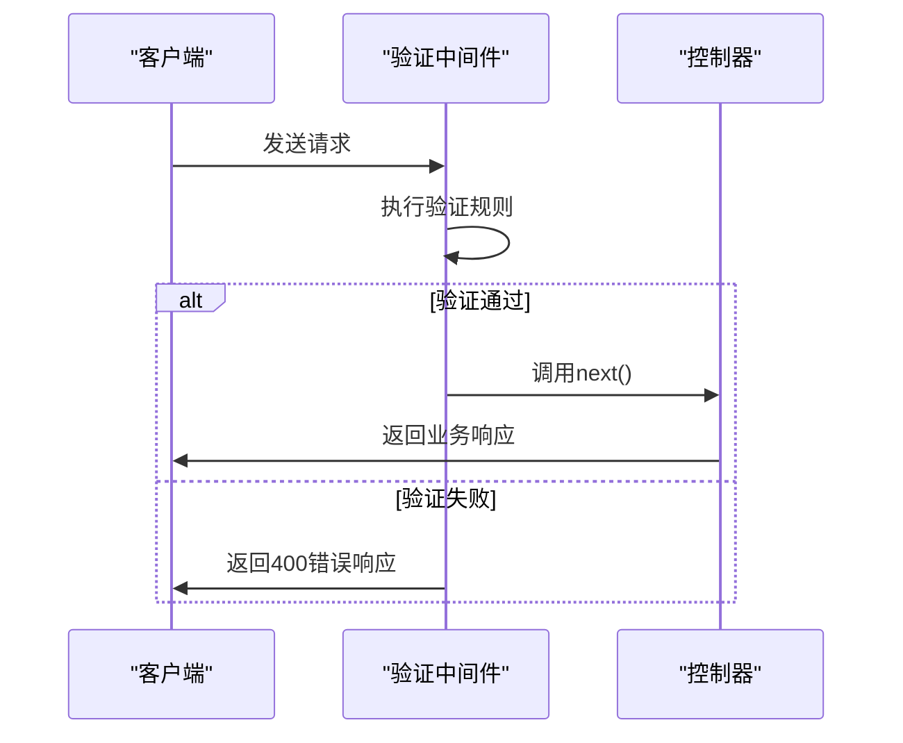
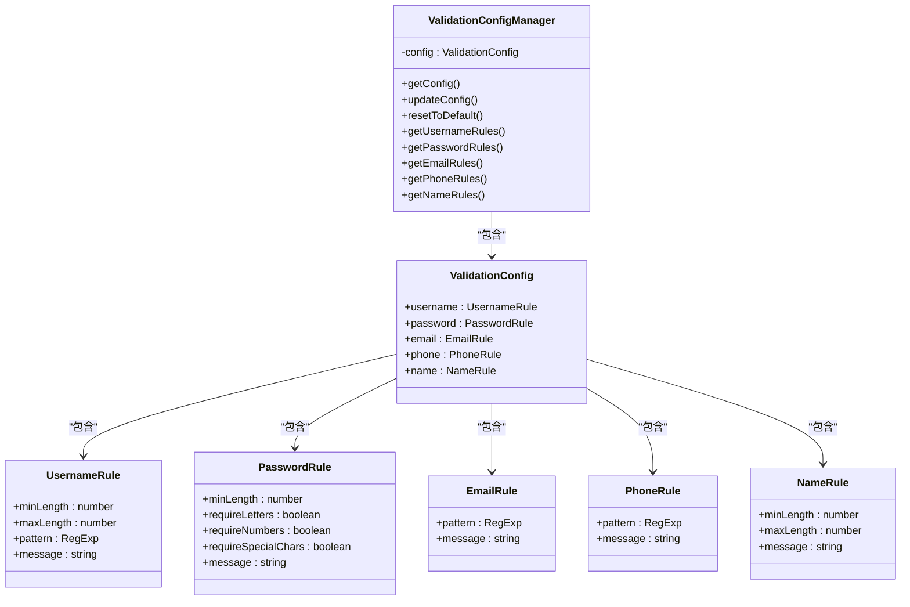

# 输入验证与过滤

<cite>
**本文档引用的文件**  
- [validation.middleware.ts](file://k.yyup.com/server/src/middleware/validation.middleware.ts)
- [validation-config.ts](file://k.yyup.com/client/src/config/validation-config.ts)
</cite>

## 目录
1. [输入验证机制概述](#输入验证机制概述)
2. [验证中间件实现原理](#验证中间件实现原理)
3. [数据过滤与安全防护](#数据过滤与安全防护)
4. [验证规则配置体系](#验证规则配置体系)
5. [路由中的验证使用示例](#路由中的验证使用示例)
6. [常见攻击防范策略](#常见攻击防范策略)
7. [错误处理与用户反馈](#错误处理与用户反馈)

## 输入验证机制概述

k.yyupgame系统建立了完善的输入验证与过滤机制，确保用户输入数据的安全性与合规性。系统采用分层验证策略，在前端和后端均实施严格的输入检查，防止恶意数据进入系统核心。验证机制涵盖类型检查、格式验证、长度限制等多个维度，有效防范各类输入相关的安全风险。

**Section sources**
- [validation.middleware.ts](file://k.yyup.com/server/src/middleware/validation.middleware.ts#L1-L30)
- [validation-config.ts](file://k.yyup.com/client/src/config/validation-config.ts#L1-L415)

## 验证中间件实现原理

系统采用Express框架的`express-validator`库实现验证中间件。验证流程分为两个阶段：验证规则定义和验证结果处理。`validateRequest`中间件负责处理验证结果，当检测到验证错误时，会收集所有错误信息并返回标准化的错误响应，包含错误字段、错误消息和对应值。

验证中间件通过`validationResult(req)`方法获取请求的验证结果，若存在错误，则构造包含详细错误信息的JSON响应，状态码为400。这种设计确保了验证逻辑与业务逻辑的分离，提高了代码的可维护性。

**Diagram sources**
- [validation.middleware.ts](file://k.yyup.com/server/src/middleware/validation.middleware.ts#L8-L27)

**Section sources**
- [validation.middleware.ts](file://k.yyup.com/server/src/middleware/validation.middleware.ts#L8-L27)

## 数据过滤与安全防护

系统通过正则表达式和内置验证器对用户输入进行严格过滤，清除潜在的恶意代码和特殊字符。对于用户名、密码、邮箱、手机号等关键字段，系统定义了精确的格式模式，确保输入数据符合预期格式。

数据过滤机制包括：特殊字符过滤、SQL注入防护、XSS攻击防范等。系统对输入数据进行多层检查，包括字符集限制、长度控制和模式匹配，有效阻止恶意payload的注入。对于富文本输入，系统采用白名单机制，只允许安全的HTML标签和属性。

**Section sources**
- [validation-config.ts](file://k.yyup.com/client/src/config/validation-config.ts#L6-L146)

## 验证规则配置体系

系统采用集中式验证配置管理，通过`ValidationConfigManager`类统一管理所有验证规则。配置体系支持多种数据类型的验证规则，包括用户名、密码、邮箱、手机号、姓名、年龄等。

验证规则配置包含必填字段检查、数据格式验证、范围限制等功能。每种规则都定义了最小长度、最大长度、正则模式和错误消息等属性。系统支持动态更新验证配置，允许在运行时调整验证规则，提高了系统的灵活性。

**Diagram sources**
- [validation-config.ts](file://k.yyup.com/client/src/config/validation-config.ts#L6-L146)

**Section sources**
- [validation-config.ts](file://k.yyup.com/client/src/config/validation-config.ts#L6-L146)

## 路由中的验证使用示例

在实际路由中，验证中间件与其他中间件组合使用，形成完整的请求处理链。典型的使用模式是在路由定义中，将验证规则中间件和验证结果处理中间件按顺序排列。当请求到达时，系统依次执行各个中间件，直到所有验证通过后才进入业务逻辑处理。

这种设计模式使得验证逻辑可复用，相同的验证规则可以应用于多个路由，减少了代码重复。同时，标准化的错误响应格式便于前端统一处理验证错误，提升了用户体验。

**Section sources**
- [validation.middleware.ts](file://k.yyup.com/server/src/middleware/validation.middleware.ts#L8-L27)

## 常见攻击防范策略

系统针对常见的输入攻击提供了全面的防护措施：
- **命令注入**：通过输入过滤和参数化查询，阻止恶意命令执行
- **路径遍历**：严格验证文件路径输入，禁止使用`../`等危险字符序列
- **SQL注入**：使用参数化查询和ORM框架，避免直接拼接SQL语句
- **XSS攻击**：对用户输入进行HTML转义，过滤危险的JavaScript代码
- **CSRF攻击**：实施CSRF令牌验证，确保请求来源的合法性

这些防护策略与输入验证机制协同工作，构建了多层次的安全防线，有效保护系统免受各种攻击威胁。

**Section sources**
- [validation-config.ts](file://k.yyup.com/client/src/config/validation-config.ts#L150-L268)

## 错误处理与用户反馈

当验证失败时，系统返回结构化的错误响应，包含`success: false`标识、错误消息和详细的错误列表。每个错误条目包含出错的字段名、错误消息和提交的值，便于前端精确定位问题。

前端根据错误响应动态更新表单界面，高亮显示错误字段并显示相应的错误提示。这种即时反馈机制帮助用户快速识别和修正输入错误，提升了表单填写的效率和用户体验。系统还支持多语言错误消息，满足国际化需求。

**Section sources**
- [validation.middleware.ts](file://k.yyup.com/server/src/middleware/validation.middleware.ts#L18-L22)
- [validation-config.ts](file://k.yyup.com/client/src/config/validation-config.ts#L154-L268)