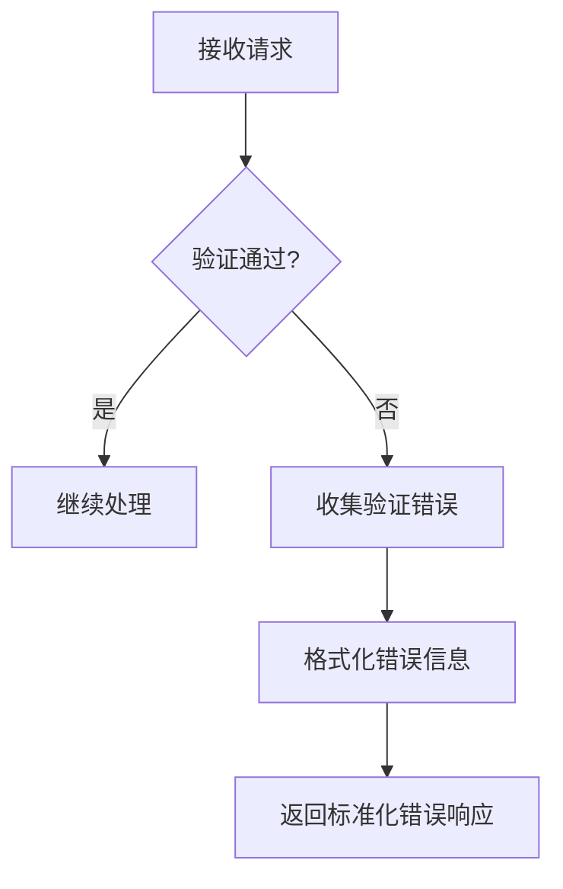
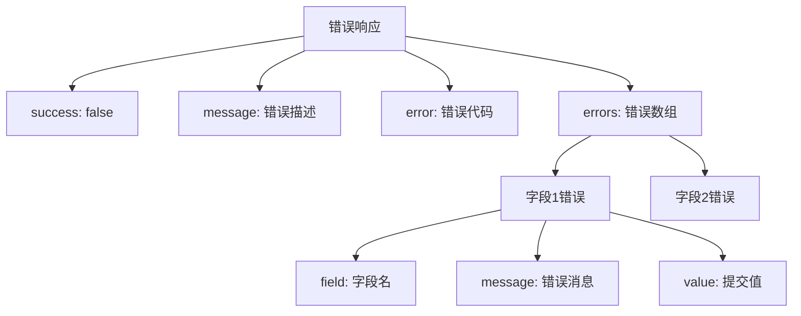
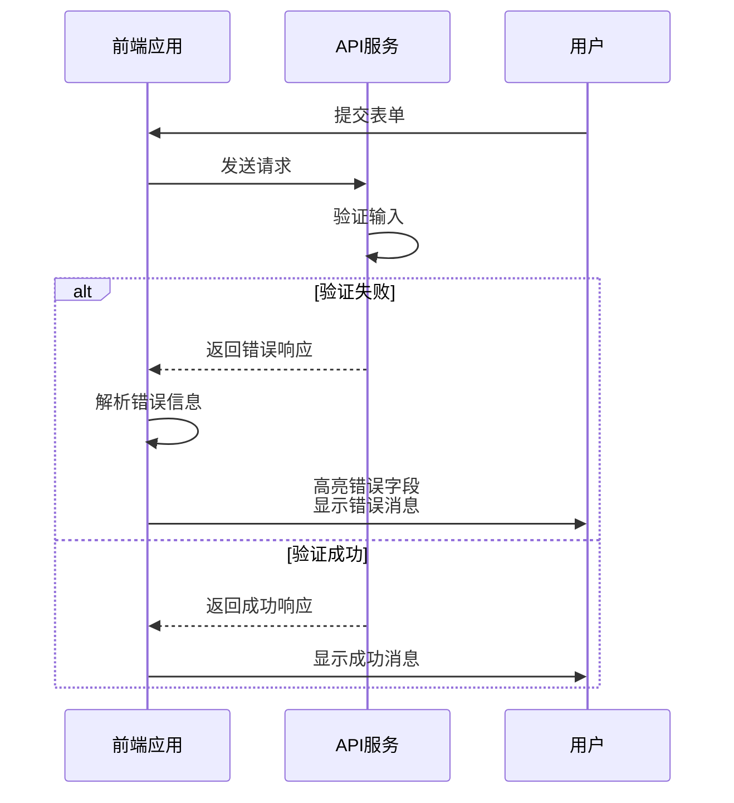
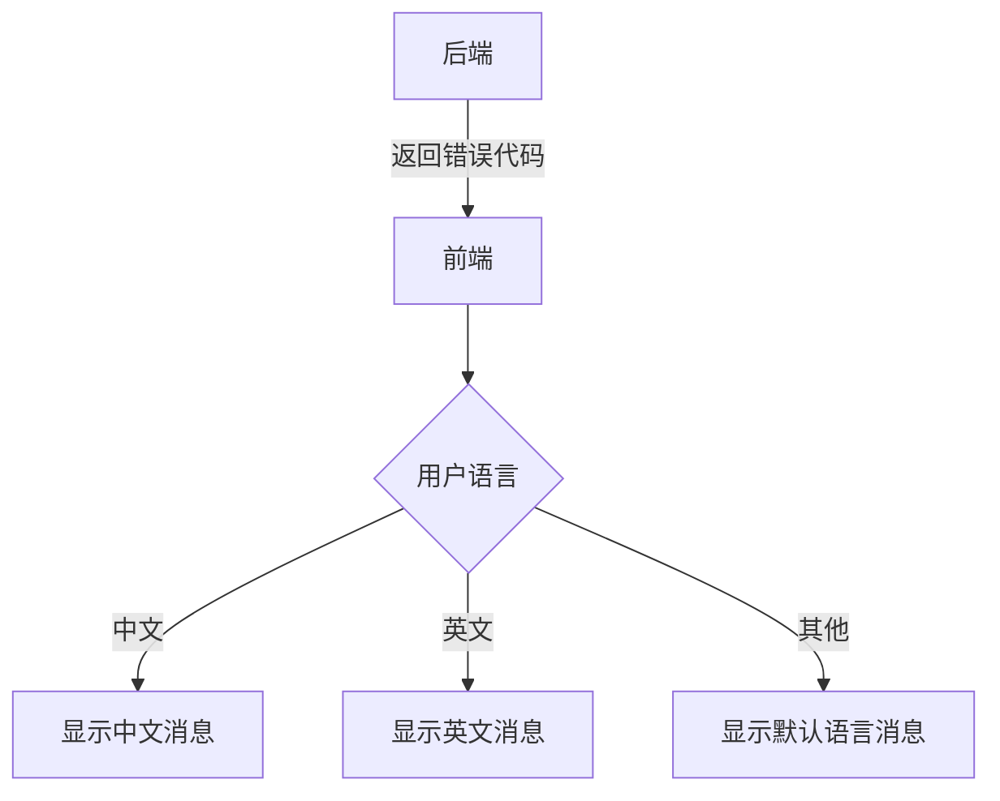

# 错误处理

<cite>
**本文档引用的文件**
- [validation.middleware.ts](file://k.yyup.com/server/src/middleware/validation.middleware.ts)
- [auth-shared-pool-example.middleware.ts](file://k.yyup.com/auth-shared-pool-example.middleware.ts)
- [api-response.ts](file://k.yyup.com/client/src/types/api-response.ts)
- [api-response-handler.ts](file://k.yyup.com/client/src/utils/api-response-handler.ts)
</cite>

## 目录
1. [简介](#简介)
2. [验证错误响应机制](#验证错误响应机制)
3. [错误响应JSON结构](#错误响应json结构)
4. [前端错误处理](#前端错误处理)
5. [多语言支持](#多语言支持)
6. [错误日志记录](#错误日志记录)
7. [结论](#结论)

## 简介
本文档详细介绍了k.yyupgame系统中的错误处理机制，重点关注输入验证失败后的错误响应机制。文档涵盖了验证错误的统一收集和格式化、错误响应的JSON结构设计、前端错误展示以及错误日志记录等方面。

## 验证错误响应机制

k.yyupgame系统使用`express-validator`进行输入验证，并通过专门的中间件统一处理验证错误。当输入验证失败时，系统会收集所有字段级错误并以标准化格式返回。

验证中间件`validateRequest`负责处理`express-validator`的验证结果，将错误信息统一格式化为包含字段名、错误消息和受影响值的对象数组。



**Diagram sources**
- [validation.middleware.ts](file://k.yyup.com/server/src/middleware/validation.middleware.ts#L8-L27)

**Section sources**
- [validation.middleware.ts](file://k.yyup.com/server/src/middleware/validation.middleware.ts#L8-L27)

## 错误响应JSON结构

系统采用统一的JSON结构来响应错误，确保前后端交互的一致性和可预测性。错误响应包含成功标志、消息、错误代码和详细的字段级错误信息。

```mermaid
erDiagram
ERROR_RESPONSE {
boolean success
string message
string error
array errors
}
FIELD_ERROR {
string field
string message
string value
}
ERROR_RESPONSE ||--o{ FIELD_ERROR : "包含"
}
```

标准错误响应结构如下：
- `success`: 布尔值，表示请求是否成功
- `message`: 用户友好的错误消息
- `error`: 错误代码，用于程序识别
- `errors`: 字段级错误数组，包含具体字段的验证失败信息

每个字段错误包含：
- `field`: 发生错误的字段名
- `message`: 该字段的具体错误消息
- `value`: 提交的无效值



**Diagram sources**
- [validation.middleware.ts](file://k.yyup.com/server/src/middleware/validation.middleware.ts#L18-L22)
- [auth-shared-pool-example.middleware.ts](file://k.yyup.com/auth-shared-pool-example.middleware.ts#L28-L32)

**Section sources**
- [validation.middleware.ts](file://k.yyup.com/server/src/middleware/validation.middleware.ts#L18-L22)
- [auth-shared-pool-example.middleware.ts](file://k.yyup.com/auth-shared-pool-example.middleware.ts#L28-L32)

## 前端错误处理

前端系统通过统一的响应处理机制解析和展示后端返回的错误信息，为用户提供良好的反馈体验。



前端通过`api-response-handler.ts`处理所有API响应，自动识别错误响应并提取错误信息，在相应表单字段旁边显示具体的错误提示。

**Diagram sources**
- [api-response-handler.ts](file://k.yyup.com/client/src/utils/api-response-handler.ts)
- [api-response.ts](file://k.yyup.com/client/src/types/api-response.ts)

**Section sources**
- [api-response-handler.ts](file://k.yyup.com/client/src/utils/api-response-handler.ts)
- [api-response.ts](file://k.yyup.com/client/src/types/api-response.ts)

## 多语言支持

系统设计考虑了多语言支持，错误消息可以根据用户的语言偏好进行本地化。虽然当前实现主要使用中文，但错误代码的设计为多语言支持提供了基础。

错误处理机制通过错误代码而非硬编码的消息文本进行程序判断，允许前端根据用户的语言设置显示相应的本地化消息。



**Diagram sources**
- [validation.middleware.ts](file://k.yyup.com/server/src/middleware/validation.middleware.ts)
- [api-response-handler.ts](file://k.yyup.com/client/src/utils/api-response-handler.ts)

## 错误日志记录

系统在处理验证错误时会记录必要的日志信息用于安全审计和问题排查，同时避免泄露敏感信息。

```mermaid
flowchart TD
A[验证失败] --> B[记录日志]
B --> C{日志内容}
C --> D[时间戳]
C --> E[请求路径]
C --> F[错误类型]
C --> G[客户端IP]
C --> H[用户ID(如已认证)]
C --> I[不记录敏感数据]
I --> J[不记录密码]
I --> K[不记录完整请求体]
```

日志记录遵循安全原则：
- 记录足够的信息用于问题排查
- 避免记录敏感信息如密码、完整请求体等
- 包含上下文信息如时间戳、IP地址、请求路径
- 使用结构化日志格式便于分析

**Diagram sources**
- [auth-shared-pool-example.middleware.ts](file://k.yyup.com/auth-shared-pool-example.middleware.ts#L128-L135)

## 结论
k.yyupgame系统的错误处理机制设计合理，通过统一的中间件处理验证错误，采用标准化的JSON响应格式，支持前端友好的错误展示，并具备安全的日志记录能力。该机制确保了系统在输入验证失败时能够提供清晰、一致且安全的错误响应。