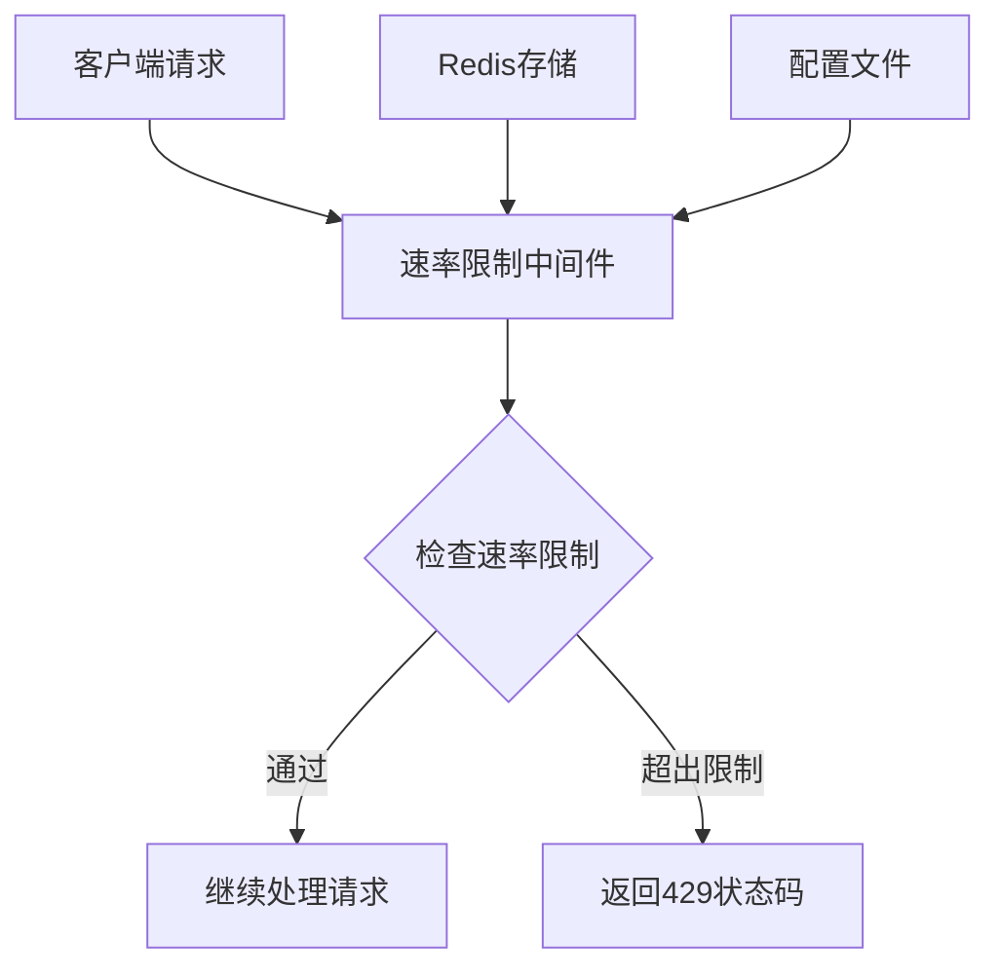
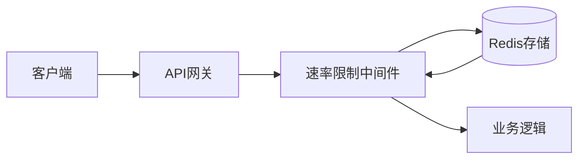
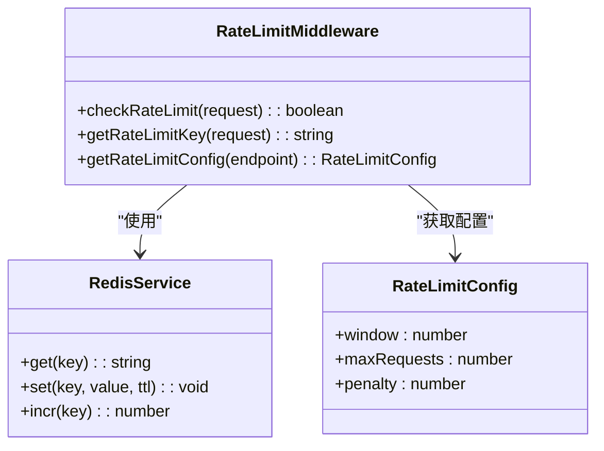
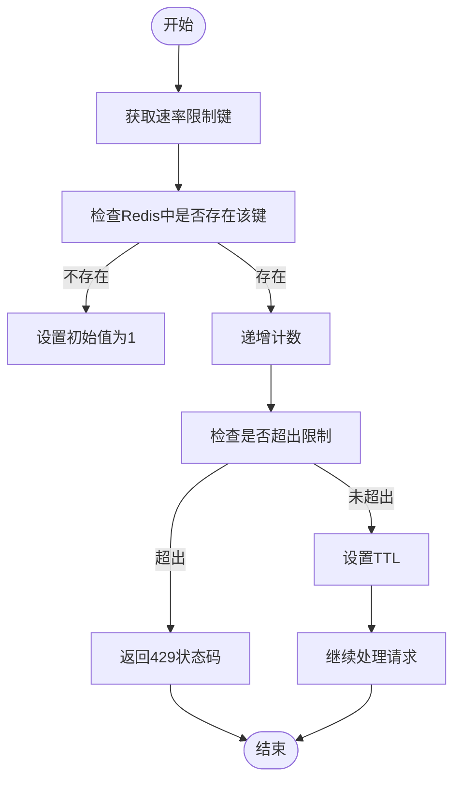
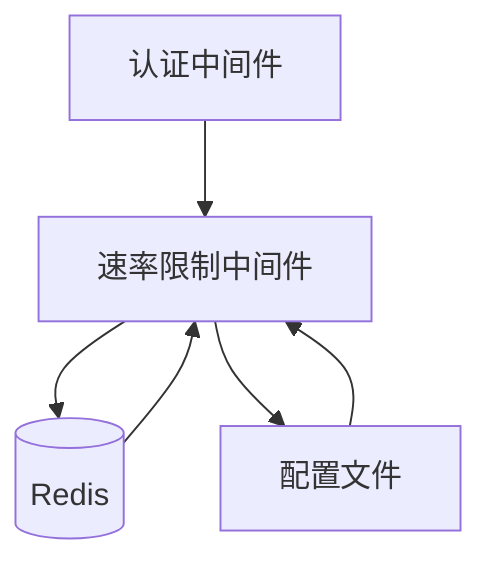

# 速率限制

<cite>
**本文档引用的文件**  
- [rate-limit.middleware.ts](file://k.yyup.com/server/src/middlewares/rate-limit.middleware.ts)
- [redis.config.ts](file://k.yyup.com/server/src/config/redis.config.ts)
- [auth-shared-pool-example.middleware.ts](file://auth-shared-pool-example.middleware.ts)
</cite>

## 目录
1. [简介](#简介)
2. [项目结构](#项目结构)
3. [核心组件](#核心组件)
4. [架构概述](#架构概述)
5. [详细组件分析](#详细组件分析)
6. [依赖分析](#依赖分析)
7. [性能考虑](#性能考虑)
8. [故障排除指南](#故障排除指南)
9. [结论](#结论)

## 简介
本文档详细介绍了k.yyupgame平台的API访问频率控制机制。文档重点阐述了基于IP地址和用户标识的请求频率限制实现原理，配置参数（包括请求窗口大小、最大请求数量和惩罚机制），以及在分布式环境下使用Redis共享状态的速率限制实现。同时提供了实际配置示例、不同场景下的策略建议，以及监控和告警机制。

## 项目结构
k.yyupgame项目的速率限制功能主要实现在服务器端的中间件层，通过Redis进行分布式状态管理。核心文件位于服务器源码的middlewares目录下，配置文件则在config目录中。

**图表来源**  
- [rate-limit.middleware.ts](file://k.yyup.com/server/src/middlewares/rate-limit.middleware.ts)
- [redis.config.ts](file://k.yyup.com/server/src/config/redis.config.ts)

**章节来源**  
- [k.yyup.com/server/src/middlewares](file://k.yyup.com/server/src/middlewares)
- [k.yyup.com/server/src/config](file://k.yyup.com/server/src/config)

## 核心组件
速率限制的核心组件包括速率限制中间件、Redis配置和相关的TTL（生存时间）设置。中间件负责拦截请求并检查是否超出预设的速率限制，Redis用于在分布式环境中共享限制状态，TTL配置则定义了不同限制策略的持续时间。

**章节来源**  
- [rate-limit.middleware.ts](file://k.yyup.com/server/src/middlewares/rate-limit.middleware.ts)
- [redis.config.ts](file://k.yyup.com/server/src/config/redis.config.ts)

## 架构概述
k.yyupgame的速率限制架构采用中间件模式，所有API请求在到达业务逻辑之前都会经过速率限制中间件的检查。该中间件使用Redis作为共享存储，确保在多实例部署环境下速率限制的一致性。

**图表来源**  
- [rate-limit.middleware.ts](file://k.yyup.com/server/src/middlewares/rate-limit.middleware.ts)
- [redis.config.ts](file://k.yyup.com/server/src/config/redis.config.ts)

## 详细组件分析

### 速率限制中间件分析
速率限制中间件实现了基于IP地址和用户标识的请求频率控制。它通过Redis存储每个客户端的请求计数，并根据配置的窗口大小和最大请求数量来判断是否超出限制。

#### 对于速率限制中间件：

**图表来源**  
- [rate-limit.middleware.ts](file://k.yyup.com/server/src/middlewares/rate-limit.middleware.ts)
- [redis.config.ts](file://k.yyup.com/server/src/config/redis.config.ts)

### 速率限制配置分析
速率限制的配置主要通过RedisTTL和RedisKeyPrefix常量来定义，这些配置决定了不同场景下的限制策略和存储方式。

#### 对于速率限制配置：

**图表来源**  
- [redis.config.ts](file://k.yyup.com/server/src/config/redis.config.ts)
- [rate-limit.middleware.ts](file://k.yyup.com/server/src/middlewares/rate-limit.middleware.ts)

**章节来源**  
- [k.yyup.com/server/src/config/redis.config.ts](file://k.yyup.com/server/src/config/redis.config.ts)
- [k.yyup.com/server/src/middlewares/rate-limit.middleware.ts](file://k.yyup.com/server/src/middlewares/rate-limit.middleware.ts)

## 依赖分析
速率限制功能依赖于Redis服务进行状态共享，同时依赖于配置文件中的TTL和Key前缀设置。此外，它还与其他中间件（如认证中间件）协同工作，以实现基于用户标识的限制。

**图表来源**  
- [rate-limit.middleware.ts](file://k.yyup.com/server/src/middlewares/rate-limit.middleware.ts)
- [redis.config.ts](file://k.yyup.com/server/src/config/redis.config.ts)
- [auth-shared-pool-example.middleware.ts](file://auth-shared-pool-example.middleware.ts)

**章节来源**  
- [k.yyup.com/server/src/middlewares](file://k.yyup.com/server/src/middlewares)
- [k.yyup.com/server/src/config](file://k.yyup.com/server/src/config)

## 性能考虑
速率限制的性能主要受Redis访问速度的影响。由于Redis是内存数据库，其读写速度非常快，因此对整体性能的影响较小。此外，通过合理的TTL设置，可以避免Redis中存储过多的过期数据。

## 故障排除指南
当遇到速率限制相关问题时，可以检查Redis服务是否正常运行，确认配置文件中的TTL和Key前缀设置是否正确，以及中间件是否正确地拦截了请求。

**章节来源**  
- [rate-limit.middleware.ts](file://k.yyup.com/server/src/middlewares/rate-limit.middleware.ts)
- [redis.config.ts](file://k.yyup.com/server/src/config/redis.config.ts)

## 结论
k.yyupgame平台的速率限制机制通过中间件和Redis的结合，实现了高效、可靠的API访问频率控制。该机制不仅能够防止滥用，还能在分布式环境下保持一致性，为平台的稳定运行提供了有力保障。