# RBAC设计

<cite>
**本文档引用文件**   
- [permissions.ts](file://k.yyup.com/backup/permission-system/permissions.ts)
- [rbac.middleware.ts](file://k.yyup.com/server/src/middlewares/rbac.middleware.ts)
- [auth-permissions.ts](file://k.yyup.com/client/src/api/modules/auth-permissions.ts)
- [permission-cache.service.ts](file://k.yyup.com/backup/permission-system/permission-cache.service.ts)
- [role-cache.service.ts](file://k.yyup.com/backup/permission-system/role-cache.service.ts)
- [permissions.ts](file://k.yyup.com/client/src/stores/permissions.ts)
</cite>

## 目录
1. [用户、角色与权限关系模型](#用户角色与权限关系模型)
2. [角色继承机制](#角色继承机制)
3. [权限粒度设计](#权限粒度设计)
4. [权限定义代码示例](#权限定义代码示例)
5. [角色模板设计](#角色模板设计)
6. [创建新角色最佳实践](#创建新角色最佳实践)

## 用户角色与权限关系模型

在k.yyupgame系统中，用户、角色和权限三者之间通过多对多关联进行建模。一个用户可以拥有多个角色，而每个角色又可以被多个用户共享。同时，角色与权限之间也是多对多的关系，即一个角色可以包含多个权限，而一个权限也可以被多个角色所拥有。

这种设计允许灵活地分配权限，支持复杂的组织结构需求。例如，园长可能同时具有“管理”和“财务”两个角色，从而继承这两个角色的所有权限。系统通过中间表来维护这些关系，确保数据的一致性和完整性。

**Section sources**
- [rbac.middleware.ts](file://k.yyup.com/server/src/middlewares/rbac.middleware.ts#L25-L156)
- [auth-permissions.ts](file://k.yyup.com/client/src/api/modules/auth-permissions.ts#L7-L42)

## 角色继承机制

角色继承机制是k.yyupgame系统中实现权限复用的关键特性。通过角色层级结构，子角色可以继承父角色的权限，并在此基础上进行扩展或覆盖。例如，系统预设了“教师”角色作为基础角色，其他特定类型的教师（如“班主任”）可以从“教师”角色继承所有基本权限，并根据需要添加额外权限。

当某个角色继承另一个角色时，其权限集合会自动包含父角色的所有权限。如果子角色需要修改某项权限的行为，可以通过显式地重新定义该权限来实现覆盖。这种机制简化了权限管理，减少了重复配置的工作量。

**Diagram sources**
- [rbac.middleware.ts](file://k.yyup.com/server/src/middlewares/rbac.middleware.ts#L65-L156)
- [permission-cache.service.ts](file://k.yyup.com/backup/permission-system/permission-cache.service.ts#L19-L33)

## 权限粒度设计

权限粒度的设计原则是将系统功能分解为原子化的权限点，确保每个权限都具有明确的边界和单一职责。这样做的好处是可以精确控制用户的访问范围，避免过度授权带来的安全风险。

在k.yyupgame系统中，权限被细分为多个层次：
- **菜单级权限**：控制用户是否能看到某个菜单项。
- **页面级权限**：决定用户能否访问特定页面。
- **操作级权限**：限制用户在页面内的具体操作，如创建、编辑、删除等。
- **数据级权限**：进一步细化到数据记录级别，例如只能查看自己负责的学生信息。

通过这种分层设计，系统能够提供细粒度的访问控制，满足不同场景下的安全要求。

**Section sources**
- [permissions.ts](file://k.yyup.com/backup/permission-system/permissions.ts#L219-L247)
- [rbac.middleware.ts](file://k.yyup.com/server/src/middlewares/rbac.middleware.ts#L307-L504)

## 权限定义代码示例

以下是`permissions.ts`文件中权限常量的组织方式示例。权限以枚举形式定义，每个权限都有唯一的代码、名称和描述，便于管理和引用。

```mermaid
erDiagram
USER ||--o{ USER_ROLE : "用户角色"
ROLE ||--o{ USER_ROLE : "用户角色"
ROLE ||--o{ ROLE_PERMISSION : "角色权限"
PERMISSION ||--o{ ROLE_PERMISSION : "角色权限"
USER {
string id PK
string username
string email
}
ROLE {
string code PK
string name
string description
}
PERMISSION {
string code PK
string name
string description
string type
string path
int sort
int status
}
USER_ROLE {
string user_id FK
string role_code FK
}
ROLE_PERMISSION {
string role_code FK
string permission_code FK
}
```

**Diagram sources**
- [permissions.ts](file://k.yyup.com/backup/permission-system/permissions.ts#L7-L216)
- [auth-permissions.ts](file://k.yyup.com/client/src/api/modules/auth-permissions.ts#L7-L42)

## 角色模板设计

系统预设了多种角色模板，包括园长、教师和家长，每种角色都有预配置的权限集合。这些模板旨在快速部署常见角色，减少手动配置的工作量。

- **园长角色**：拥有学校范围内大部分功能的访问权限，但不包括系统级配置。
- **教师角色**：主要关注教学相关功能，如课程管理、学生评估等。
- **家长角色**：仅限于查看孩子相关信息及与教师沟通的功能。

角色模板的设计遵循最小权限原则，即只授予完成工作所必需的最低限度权限，从而降低潜在的安全风险。

**Section sources**
- [rbac.middleware.ts](file://k.yyup.com/server/src/middlewares/rbac.middleware.ts#L85-L135)
- [role-cache.service.ts](file://k.yyup.com/backup/permission-system/role-cache.service.ts#L12-L23)

## 创建新角色最佳实践

为开发者提供创建新角色的最佳实践指南，包括以下几点：

1. **权限命名规范**：使用清晰且一致的命名规则，如`模块_操作`格式（例如`student_view`、`course_edit`），以便于理解和维护。
2. **角色分类原则**：按照业务领域对角色进行分类，如“教学类”、“管理类”、“财务类”，有助于组织和查找角色。
3. **安全审计要求**：每次创建或修改角色后，必须记录变更日志，并定期审查权限分配情况，确保符合安全策略。

此外，建议在开发过程中使用自动化工具验证权限配置的正确性，避免人为错误导致的安全漏洞。

**Section sources**
- [rbac.middleware.ts](file://k.yyup.com/server/src/middlewares/rbac.middleware.ts#L509-L538)
- [permission-cache.service.ts](file://k.yyup.com/backup/permission-system/permission-cache.service.ts#L457-L484)