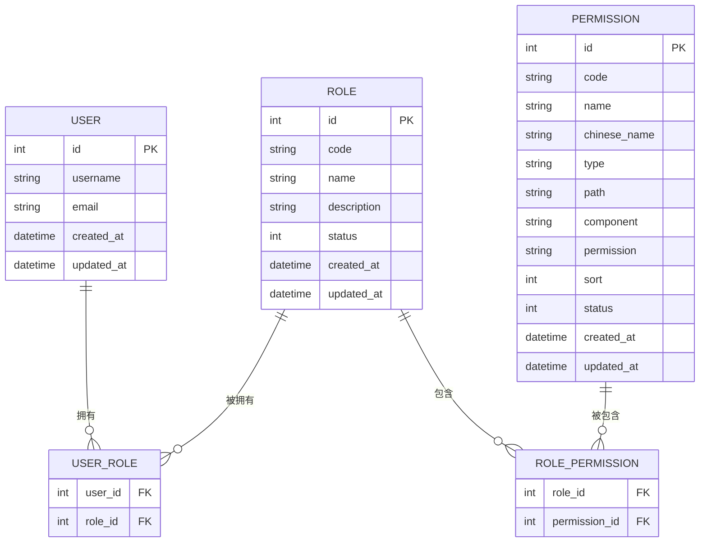
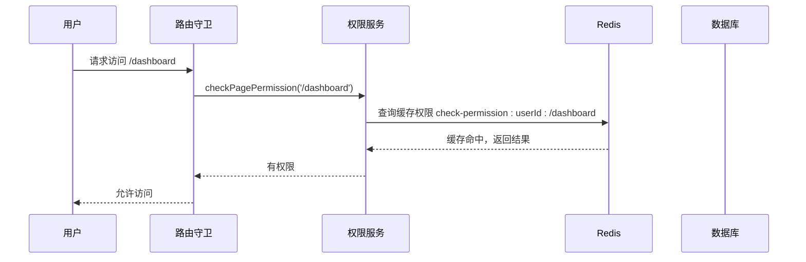
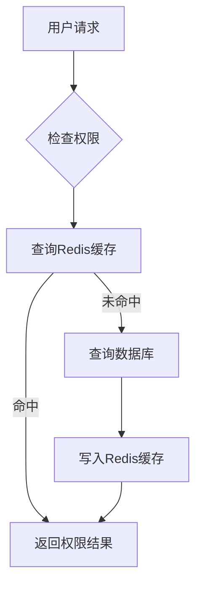
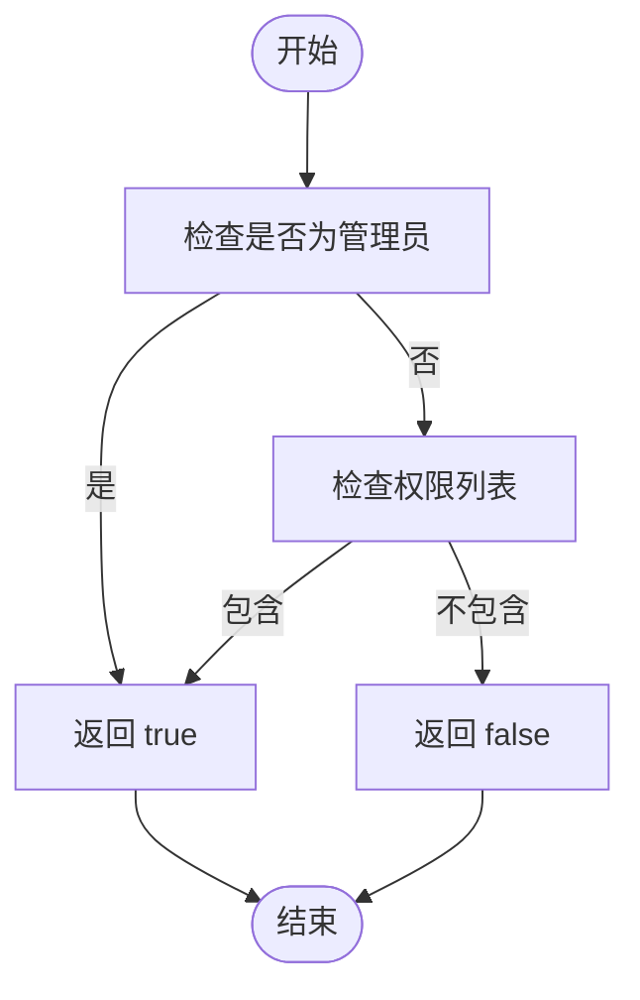

# 授权机制

<cite>
**本文档引用的文件**
- [permissions.ts](file://k.yyup.com/backup/permission-system/permissions.ts)
- [permission-cache.service.ts](file://k.yyup.com/backup/permission-system/permission-cache.service.ts)
- [permission-cache.controller.ts](file://k.yyup.com/backup/permission-system/permission-cache.controller.ts)
- [cache-invalidation.middleware.ts](file://k.yyup.com/backup/permission-system/cache-invalidation.middleware.ts)
- [route-cache.service.ts](file://k.yyup.com/backup/permission-system/route-cache.service.ts)
</cite>

## 目录
1. [引言](#引言)
2. [权限模型设计](#权限模型设计)
3. [权限检查实现](#权限检查实现)
4. [权限缓存机制](#权限缓存机制)
5. [动态权限分配](#动态权限分配)
6. [细粒度权限控制](#细粒度权限控制)
7. [权限配置示例](#权限配置示例)
8. [开发者集成指南](#开发者集成指南)
9. [总结](#总结)

## 引言

本项目采用基于角色的访问控制（RBAC）系统，为k.yyupgame平台提供安全、灵活的权限管理机制。该系统通过用户、角色、权限三者之间的关系，实现了从路由级别到数据级别的多层次访问控制。本文档详细介绍了授权机制的设计与实现，包括权限模型、检查方式、缓存策略、动态分配和细粒度控制等方面，旨在为开发者提供全面的集成指导。

## 权限模型设计

本项目的权限模型基于经典的RBAC（基于角色的访问控制）架构，包含用户、角色和权限三个核心实体。用户通过被赋予一个或多个角色来获得相应的权限，而权限则定义了系统中可执行的操作和可访问的资源。

### 用户、角色、权限关系

在本系统中，用户与角色之间是多对多的关系，即一个用户可以拥有多个角色，一个角色也可以被多个用户共享。同样，角色与权限之间也是多对多的关系，一个角色可以包含多个权限，而一个权限也可以被多个角色引用。这种设计使得权限管理更加灵活，便于根据组织结构和业务需求进行调整。



**图源**
- [permission-cache.service.ts](file://k.yyup.com/backup/permission-system/permission-cache.service.ts#L19-L33)

**本节来源**
- [permission-cache.service.ts](file://k.yyup.com/backup/permission-system/permission-cache.service.ts#L19-L33)

## 权限检查实现

权限检查是授权机制的核心功能，确保只有具备相应权限的用户才能访问特定的资源或执行特定的操作。本系统在路由级别和数据级别均实现了严格的权限验证。

### 路由级别访问控制

在路由级别，系统通过中间件对用户的访问请求进行拦截和验证。当用户尝试访问某个页面时，系统会检查该用户是否具有访问该路径的权限。对于管理员用户，系统默认授予所有权限，无需额外验证。



**图源**
- [permissions.ts](file://k.yyup.com/backup/permission-system/permissions.ts#L335-L408)

**本节来源**
- [permissions.ts](file://k.yyup.com/backup/permission-system/permissions.ts#L335-L408)

### 数据级别访问控制

在数据级别，系统通过服务层的方法调用来验证用户对特定资源的操作权限。例如，在执行数据修改或删除操作前，系统会检查用户是否具有相应的权限代码。这种细粒度的控制确保了即使用户能够访问某个页面，也无法执行超出其权限范围的操作。

## 权限缓存机制

为了提高权限验证的性能，系统采用了多层次的缓存机制，结合Redis和内存缓存，显著减少了数据库查询的频率和响应时间。

### 缓存策略

系统使用Redis作为主要的缓存存储，对用户权限、角色权限、动态路由等数据进行缓存。缓存的过期时间根据数据的更新频率和重要性进行设置，例如用户权限缓存的TTL为1小时，而路径权限缓存的TTL为5分钟。



**图源**
- [permission-cache.service.ts](file://k.yyup.com/backup/permission-system/permission-cache.service.ts#L50-L134)

**本节来源**
- [permission-cache.service.ts](file://k.yyup.com/backup/permission-system/permission-cache.service.ts#L50-L134)

### 缓存失效

当权限数据发生变更时，系统会自动触发缓存失效机制，清除相关的缓存条目，确保数据的一致性。缓存失效通过中间件实现，在用户、角色或权限的更新操作成功后，异步清除对应的缓存。

**本节来源**
- [cache-invalidation.middleware.ts](file://k.yyup.com/backup/permission-system/cache-invalidation.middleware.ts#L38-L63)

## 动态权限分配

系统支持动态的权限分配，管理员可以通过管理界面创建和修改角色的权限。当权限配置发生变化时，系统会自动刷新缓存，确保所有用户的权限信息保持最新。

### 角色权限管理

管理员可以为不同的角色分配具体的权限，这些权限可以是菜单访问、按钮操作或API调用等。通过角色的权限配置，可以快速地为一组用户授予或撤销权限，提高了管理效率。

**本节来源**
- [permission-cache.controller.ts](file://k.yyup.com/backup/permission-system/permission-cache.controller.ts#L22-L84)

## 细粒度权限控制

系统实现了细粒度的权限控制，能够对特定资源的读、写、删除等操作进行精确的权限管理。通过权限代码（permission code）的方式，可以为每个操作定义独立的权限标识。

### 权限代码检查

在前端，系统提供了`hasPermissionCode`方法，用于检查用户是否具有某个权限代码。该方法首先检查用户是否为管理员，如果是则直接返回true；否则，检查用户的权限列表中是否包含指定的权限代码。



**图源**
- [permissions.ts](file://k.yyup.com/backup/permission-system/permissions.ts#L249-L266)

**本节来源**
- [permissions.ts](file://k.yyup.com/backup/permission-system/permissions.ts#L249-L266)

## 权限配置示例

以下是一个为不同用户角色分配权限的示例。假设系统中有“管理员”、“教师”和“家长”三种角色，每种角色具有不同的权限集合。

```json
{
  "roles": [
    {
      "code": "admin",
      "name": "管理员",
      "permissions": [
        "DASHBOARD_HOME",
        "PERSONNEL_CENTER",
        "ACTIVITY_CENTER",
        "ENROLLMENT_CENTER",
        "MARKETING_CENTER",
        "FINANCE_CENTER",
        "TEACHING_CENTER",
        "SYSTEM_CENTER"
      ]
    },
    {
      "code": "teacher",
      "name": "教师",
      "permissions": [
        "DASHBOARD_HOME",
        "ACTIVITY_CENTER",
        "TEACHING_CENTER"
      ]
    },
    {
      "code": "parent",
      "name": "家长",
      "permissions": [
        "DASHBOARD_HOME",
        "ACTIVITY_CENTER"
      ]
    }
  ]
}
```

**本节来源**
- [permissions.ts](file://k.yyup.com/backup/permission-system/permissions.ts#L22-L48)

## 开发者集成指南

为了在新功能中添加权限控制，开发者需要遵循以下步骤：

1. **定义权限代码**：为新功能定义唯一的权限代码，通常采用大写字母和下划线的命名方式，如`NEW_FEATURE_ACCESS`。
2. **添加权限检查**：在路由守卫和关键操作方法中添加权限检查逻辑，使用`hasPermission`或`hasPermissionCode`方法。
3. **配置权限数据**：在数据库中添加相应的权限记录，并通过管理界面将其分配给需要的角色。
4. **测试权限控制**：使用不同角色的账户测试权限控制是否按预期工作。

**本节来源**
- [permissions.ts](file://k.yyup.com/backup/permission-system/permissions.ts#L219-L247)

## 总结

本项目的授权机制通过基于角色的访问控制模型，实现了灵活、安全的权限管理。系统结合了多层次的缓存策略和动态的权限分配机制，既保证了高性能的权限验证，又提供了便捷的管理方式。细粒度的权限控制确保了系统的安全性，而清晰的开发者指南则降低了集成的复杂度。整体设计充分考虑了可扩展性和维护性，为平台的长期发展奠定了坚实的基础。