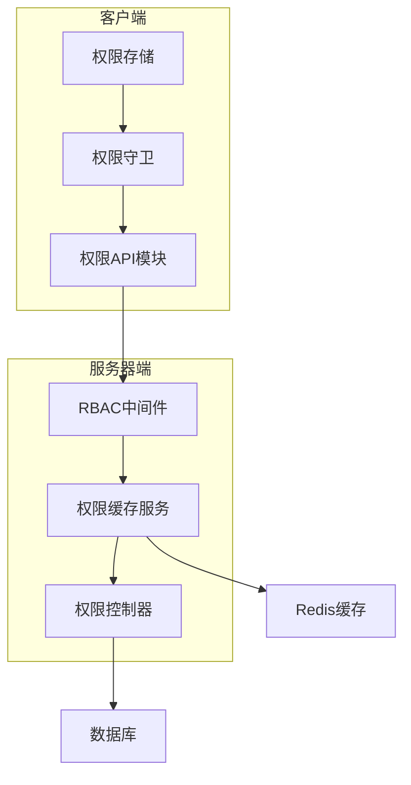
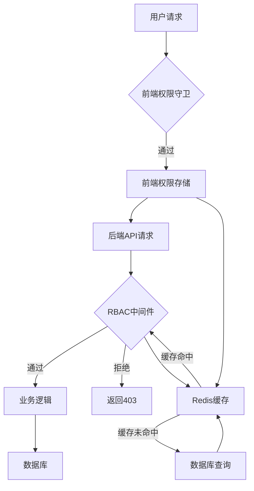
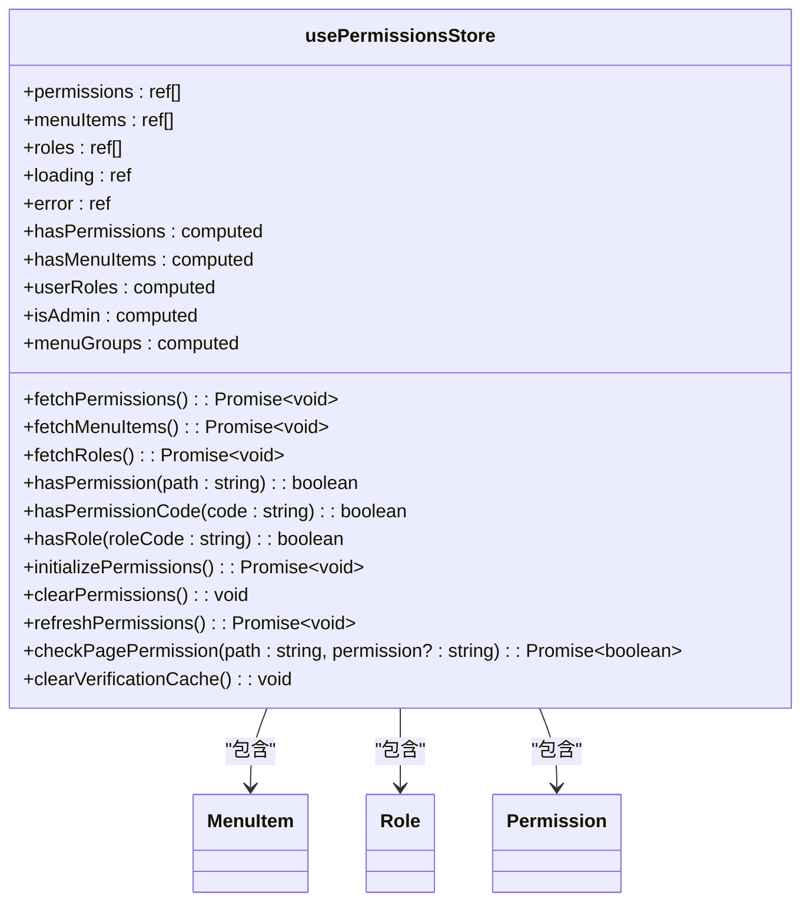
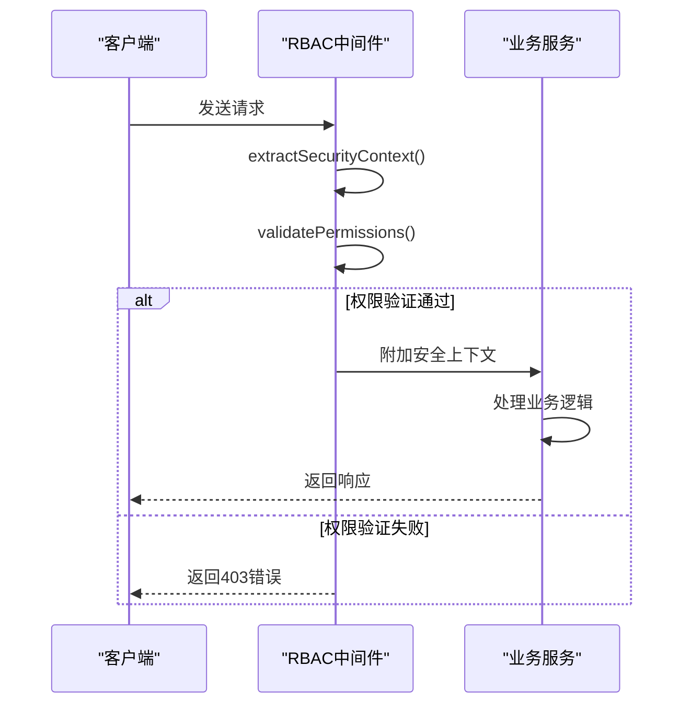
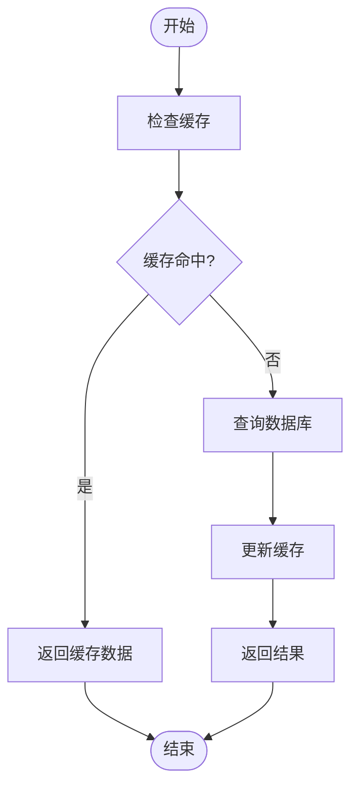
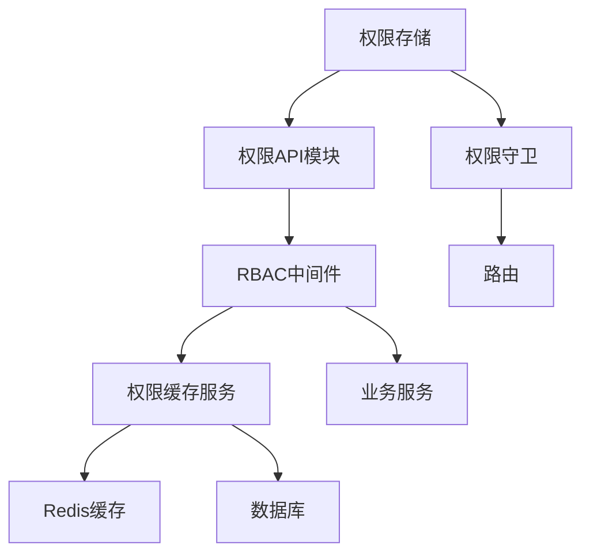

# 权限管理

<cite>
**本文档引用的文件**   
- [permissions.ts](file://k.yyup.com/backup/permission-system/permissions.ts)
- [permission-cache.service.ts](file://k.yyup.com/backup/permission-system/permission-cache.service.ts)
- [role-cache.service.ts](file://k.yyup.com/backup/permission-system/role-cache.service.ts)
- [permission-cache.controller.ts](file://k.yyup.com/backup/permission-system/permission-cache.controller.ts)
- [rbac.middleware.ts](file://k.yyup.com/server/src/middlewares/rbac.middleware.ts)
- [role.ts](file://k.yyup.com/client/src/api/modules/role.ts)
- [auth-permissions.ts](file://k.yyup.com/client/src/api/modules/auth-permissions.ts)
- [permission.guard.ts](file://k.yyup.com/client/src/guards/permission.guard.ts)
- [add-permission.js](file://k.yyup.com/add-permission.js)
- [add-ai-assistant-permissions.sql](file://k.yyup.com/add-ai-assistant-permissions.sql)
</cite>

## 目录
1. [简介](#简介)
2. [项目结构](#项目结构)
3. [核心组件](#核心组件)
4. [架构概述](#架构概述)
5. [详细组件分析](#详细组件分析)
6. [依赖分析](#依赖分析)
7. [性能考虑](#性能考虑)
8. [故障排除指南](#故障排除指南)
9. [结论](#结论)
10. [附录](#附录)（如有必要）

## 简介
本文档详细介绍了k.yyupgame系统中动态权限分配的实现机制。系统采用基于角色的访问控制（RBAC）模型，通过前端权限管理、后端中间件验证和Redis缓存服务相结合的方式，实现了高效、安全的权限管理。管理员可以通过管理界面创建新角色、修改角色权限并分配用户到角色。当角色权限更新时，系统通过缓存机制同步影响所有关联用户。权限审计日志记录了所有权限变更的历史操作，支持权限批量操作API，并提供了权限版本控制策略。

## 项目结构
k.yyupgame系统的权限管理功能主要分布在客户端和服务器端。客户端包含权限相关的API模块、权限守卫和权限存储，服务器端包含RBAC中间件、权限缓存服务和权限控制器。数据库迁移文件和权限脚本用于初始化和更新权限配置。



**图表来源**
- [permissions.ts](file://k.yyup.com/backup/permission-system/permissions.ts)
- [rbac.middleware.ts](file://k.yyup.com/server/src/middlewares/rbac.middleware.ts)
- [permission-cache.service.ts](file://k.yyup.com/backup/permission-system/permission-cache.service.ts)
- [permission-cache.controller.ts](file://k.yyup.com/backup/permission-system/permission-cache.controller.ts)

**章节来源**
- [permissions.ts](file://k.yyup.com/backup/permission-system/permissions.ts)
- [rbac.middleware.ts](file://k.yyup.com/server/src/middlewares/rbac.middleware.ts)

## 核心组件
权限管理的核心组件包括权限存储、权限缓存服务、RBAC中间件和权限控制器。权限存储负责管理用户权限、角色和菜单项，权限缓存服务通过Redis缓存提高权限验证的性能，RBAC中间件在服务器端验证请求权限，权限控制器提供管理员缓存管理接口。

**章节来源**
- [permissions.ts](file://k.yyup.com/backup/permission-system/permissions.ts)
- [permission-cache.service.ts](file://k.yyup.com/backup/permission-system/permission-cache.service.ts)
- [rbac.middleware.ts](file://k.yyup.com/server/src/middlewares/rbac.middleware.ts)
- [permission-cache.controller.ts](file://k.yyup.com/backup/permission-system/permission-cache.controller.ts)

## 架构概述
k.yyupgame系统的权限管理架构采用分层设计，包括前端权限管理、后端权限验证和缓存服务。前端通过权限存储和权限守卫实现页面和按钮级别的权限控制，后端通过RBAC中间件验证请求权限，缓存服务通过Redis缓存用户权限和角色权限，提高系统性能。



**图表来源**
- [permissions.ts](file://k.yyup.com/backup/permission-system/permissions.ts)
- [rbac.middleware.ts](file://k.yyup.com/server/src/middlewares/rbac.middleware.ts)
- [permission-cache.service.ts](file://k.yyup.com/backup/permission-system/permission-cache.service.ts)

## 详细组件分析
### 权限存储分析
权限存储是前端权限管理的核心，负责管理用户权限、角色和菜单项。它通过API模块获取用户权限、菜单和角色信息，并提供权限验证方法。

#### 类图


**图表来源**
- [permissions.ts](file://k.yyup.com/backup/permission-system/permissions.ts)

**章节来源**
- [permissions.ts](file://k.yyup.com/backup/permission-system/permissions.ts)

### RBAC中间件分析
RBAC中间件是后端权限验证的核心，负责验证用户角色和权限。它通过提取安全上下文、验证权限和附加安全信息到请求对象来实现权限控制。

#### 序列图


**图表来源**
- [rbac.middleware.ts](file://k.yyup.com/server/src/middlewares/rbac.middleware.ts)

**章节来源**
- [rbac.middleware.ts](file://k.yyup.com/server/src/middlewares/rbac.middleware.ts)

### 权限缓存服务分析
权限缓存服务通过Redis缓存用户权限、角色权限和动态路由，提高权限验证的性能。它提供获取和设置缓存的方法，并支持清除缓存和获取缓存统计信息。

#### 流程图


**图表来源**
- [permission-cache.service.ts](file://k.yyup.com/backup/permission-system/permission-cache.service.ts)

**章节来源**
- [permission-cache.service.ts](file://k.yyup.com/backup/permission-system/permission-cache.service.ts)

## 依赖分析
权限管理功能依赖于多个组件和服务，包括Redis缓存、数据库、API模块和权限守卫。这些组件通过API调用和数据流相互协作，实现完整的权限管理功能。



**图表来源**
- [permissions.ts](file://k.yyup.com/backup/permission-system/permissions.ts)
- [rbac.middleware.ts](file://k.yyup.com/server/src/middlewares/rbac.middleware.ts)
- [permission-cache.service.ts](file://k.yyup.com/backup/permission-system/permission-cache.service.ts)

**章节来源**
- [permissions.ts](file://k.yyup.com/backup/permission-system/permissions.ts)
- [rbac.middleware.ts](file://k.yyup.com/server/src/middlewares/rbac.middleware.ts)
- [permission-cache.service.ts](file://k.yyup.com/backup/permission-system/permission-cache.service.ts)

## 性能考虑
权限管理系统的性能主要依赖于缓存机制。通过Redis缓存用户权限、角色权限和动态路由，系统避免了频繁的数据库查询，提高了权限验证的性能。缓存服务提供5分钟的缓存有效期，并支持手动刷新和清除缓存。

## 故障排除指南
### 权限验证失败
如果用户无法访问特定页面或功能，首先检查用户角色和权限配置。确保用户角色具有相应的权限代码，并检查权限缓存是否正常。

### 缓存问题
如果权限变更未生效，检查权限缓存是否已更新。可以通过权限控制器的手动刷新接口刷新缓存，或清除相关缓存。

### 数据库连接问题
如果权限查询失败，检查数据库连接是否正常。确保数据库服务正在运行，并检查数据库配置是否正确。

**章节来源**
- [permission-cache.controller.ts](file://k.yyup.com/backup/permission-system/permission-cache.controller.ts)
- [permission-cache.service.ts](file://k.yyup.com/backup/permission-system/permission-cache.service.ts)

## 结论
k.yyupgame系统的权限管理功能通过前端权限存储、后端RBAC中间件和Redis缓存服务相结合的方式，实现了高效、安全的权限管理。系统支持动态权限分配、权限审计日志、权限批量操作和权限版本控制，为管理员提供了强大的权限管理工具。开发者可以通过扩展权限工作流、集成审批流程和实现多级权限审核机制来进一步增强权限管理功能。

## 附录
### 权限API示例
```javascript
// 创建角色
const createRole = async (data) => {
  return await post('/api/roles', data);
};

// 更新角色权限
const updateRole = async (id, data) => {
  return await put(`/api/roles/${id}`, data);
};

// 分配用户到角色
const assignUserToRole = async (userId, roleId) => {
  return await post('/api/user-roles', { userId, roleId });
};

// 批量分配权限
const batchAssignPermissions = async (roleIds, permissionIds) => {
  return await post('/api/role-permissions/batch', { roleIds, permissionIds });
};
```

### 权限版本控制策略
权限版本控制通过数据库迁移文件和权限脚本实现。每次权限配置变更时，创建相应的SQL脚本或JavaScript脚本，并在部署时执行。版本控制策略包括：
- 为每个权限变更创建唯一的迁移文件
- 在迁移文件中包含权限变更的描述和时间戳
- 支持回滚操作，确保权限配置的可追溯性

**章节来源**
- [add-permission.js](file://k.yyup.com/add-permission.js)
- [add-ai-assistant-permissions.sql](file://k.yyup.com/add-ai-assistant-permissions.sql)