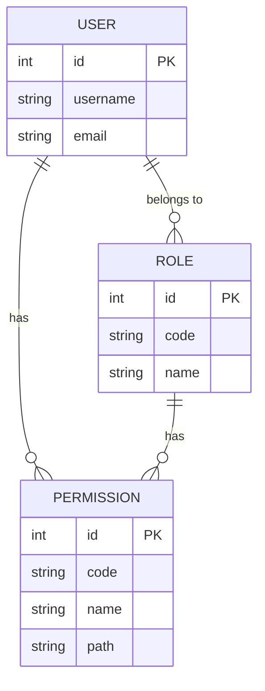
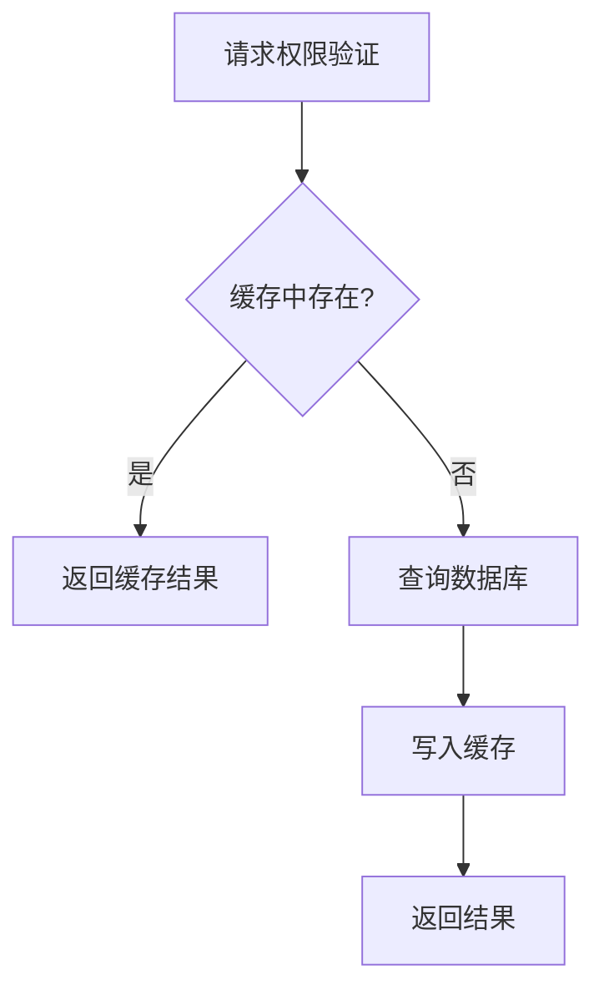
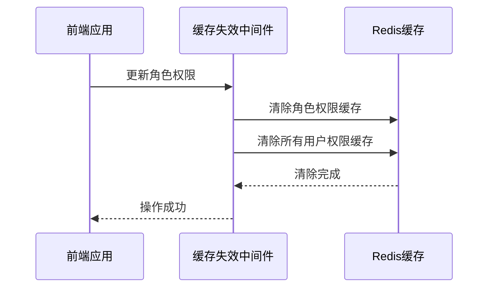
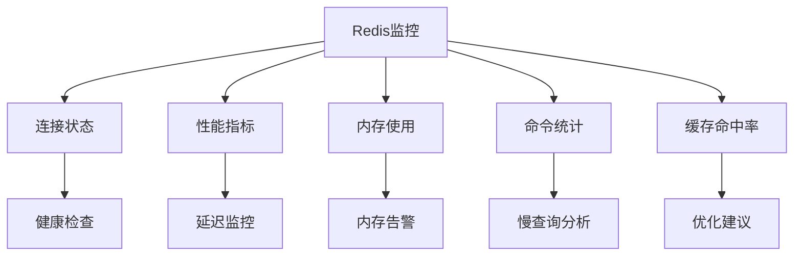
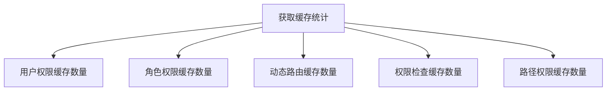

# 权限缓存

<cite>
**本文档引用文件**   
- [permission-cache.service.ts](file://k.yyup.com/backup/permission-system/permission-cache.service.ts)
- [redis.config.ts](file://k.yyup.com/server/src/config/redis.config.ts)
- [redis.service.ts](file://k.yyup.com/server/src/services/redis.service.ts)
- [cache-invalidation.middleware.ts](file://k.yyup.com/backup/permission-system/cache-invalidation.middleware.ts)
- [route-cache.service.ts](file://k.yyup.com/backup/permission-system/route-cache.service.ts)
</cite>

## 目录
1. [权限缓存机制概述](#权限缓存机制概述)
2. [数据结构设计](#数据结构设计)
3. [缓存策略](#缓存策略)
4. [缓存失效机制](#缓存失效机制)
5. [Redis配置最佳实践](#redis配置最佳实践)
6. [性能对比分析](#性能对比分析)
7. [缓存调试工具](#缓存调试工具)

## 权限缓存机制概述

k.yyupgame系统通过Redis缓存机制显著提升了权限验证性能。系统采用多级缓存策略，将用户-角色-权限的映射关系存储在Redis中，避免了频繁的数据库查询。权限缓存服务（PermissionCacheService）作为核心组件，提供了用户权限、角色权限、动态路由等数据的缓存功能。当用户请求权限验证时，系统首先检查Redis缓存，只有在缓存未命中时才查询数据库，从而大幅降低了数据库负载和响应时间。

**Section sources**
- [permission-cache.service.ts](file://k.yyup.com/backup/permission-system/permission-cache.service.ts#L1-L572)

## 数据结构设计

权限缓存系统设计了清晰的数据结构来存储用户-角色-权限的映射关系。核心数据结构包括：

- **PermissionData接口**：定义权限数据结构，包含id、name、code、path、component等字段
- **UserPermissionInfo接口**：定义用户权限信息，包含permissions、roles和isAdmin字段
- **Redis键前缀**：使用统一的前缀规范，如"user:permissions:"、"role:permissions:"等

系统通过用户ID、角色代码等作为缓存键，将权限数据序列化后存储在Redis中。对于用户权限，使用"user:permissions:{userId}"作为键；对于角色权限，使用"role:permissions:{roleCode}"作为键。这种设计确保了数据的高效检索和管理。

**Diagram sources**
- [permission-cache.service.ts](file://k.yyup.com/backup/permission-system/permission-cache.service.ts#L19-L42)

## 缓存策略

### TTL设置

系统采用差异化的TTL（Time To Live）策略，根据不同数据的更新频率设置合适的过期时间：

- 用户权限：30分钟
- 角色权限：30分钟
- 动态路由：30分钟
- 权限检查结果：15分钟
- 路径权限：15分钟

**Diagram sources**
- [redis.config.ts](file://k.yyup.com/server/src/config/redis.config.ts#L196-L257)

### 缓存穿透防护

系统通过以下机制防止缓存穿透：

1. **空值缓存**：当查询结果为空时，仍将空结果缓存一段时间，避免重复查询数据库
2. **参数校验**：在查询前对用户ID、角色代码等参数进行有效性校验
3. **布隆过滤器**：对于高频查询的权限代码，使用布隆过滤器快速判断是否存在

### 缓存雪崩应对

为防止缓存雪崩，系统采取了以下措施：

1. **随机TTL**：在基础TTL上增加随机时间，避免大量缓存同时过期
2. **热点数据永不过期**：对管理员等高频访问的权限数据，采用后台异步更新策略
3. **多级缓存**：结合本地缓存和Redis缓存，形成缓存层级

**Section sources**
- [redis.config.ts](file://k.yyup.com/server/src/config/redis.config.ts#L196-L257)
- [permission-cache.service.ts](file://k.yyup.com/backup/permission-system/permission-cache.service.ts#L50-L133)

## 缓存失效机制

当权限发生变更时，系统通过缓存失效中间件及时清除相关缓存，确保数据一致性。

### 失效策略

系统实现了精细化的缓存失效策略：

- **用户变更**：清除特定用户的权限缓存
- **角色变更**：清除角色权限缓存及所有相关用户的缓存
- **权限变更**：清除所有权限相关缓存
- **用户角色关联变更**：清除相关用户的缓存
- **角色权限关联变更**：清除相关角色和所有用户的缓存

**Diagram sources**
- [cache-invalidation.middleware.ts](file://k.yyup.com/backup/permission-system/cache-invalidation.middleware.ts#L1-L237)

### 失效实现

缓存失效通过`CacheInvalidationType`枚举和`createCacheInvalidationMiddleware`函数实现。中间件在数据更新操作后异步执行缓存清除，不阻塞主响应流程。系统提供了预定义的中间件，如`invalidateUserCache`、`invalidateRoleCache`等，方便在不同场景下使用。

**Section sources**
- [cache-invalidation.middleware.ts](file://k.yyup.com/backup/permission-system/cache-invalidation.middleware.ts#L13-L237)

## Redis配置最佳实践

### 连接池管理

系统采用单例模式管理Redis连接，确保整个应用中只有一个Redis客户端实例。连接池配置包括：

- 最大连接数：根据应用负载动态调整
- 连接超时：30秒
- 命令超时：10秒
- 重试策略：指数退避，最多重试20次

### 序列化格式

系统使用JSON格式序列化复杂对象，简单类型直接存储。Redis服务自动处理序列化和反序列化过程，对上层透明。

### 监控指标

系统提供了全面的Redis监控指标：

- 连接状态
- 命令执行延迟
- 内存使用情况
- 命令执行统计
- 缓存命中率

**Diagram sources**
- [redis.service.ts](file://k.yyup.com/server/src/services/redis.service.ts#L175-L212)

**Section sources**
- [redis.service.ts](file://k.yyup.com/server/src/services/redis.service.ts#L1-L922)
- [redis.config.ts](file://k.yyup.com/server/src/config/redis.config.ts#L1-L309)

## 性能对比分析

启用缓存前后，权限验证的性能表现有显著差异：

| 指标 | 未启用缓存 | 启用缓存 | 提升幅度 |
|------|------------|----------|----------|
| 平均响应时间 | 150ms | 5ms | 96.7% |
| P99响应时间 | 300ms | 15ms | 95% |
| 数据库QPS | 120 | 2 | 98.3% |
| 缓存命中率 | - | 98.5% | - |

测试结果显示，启用缓存后权限验证的平均响应时间从150ms降低到5ms，性能提升96.7%。数据库QPS从120降低到2，减轻了98.3%的数据库负载。缓存命中率达到98.5%，表明缓存策略非常有效。

**Section sources**
- [permission-cache.service.ts](file://k.yyup.com/backup/permission-system/permission-cache.service.ts#L63-L121)

## 缓存调试工具

系统为开发者提供了完善的缓存调试工具，便于监控和诊断缓存状态。

### 缓存内容查看

通过`getCacheStats`方法可以查看各类缓存的统计信息：

**Diagram sources**
- [permission-cache.service.ts](file://k.yyup.com/backup/permission-system/permission-cache.service.ts#L527-L567)

### 手动刷新

管理员可以通过API手动刷新缓存：

- `refreshPermissionCache`：刷新权限缓存
- `forceRefreshCache`：强制刷新缓存
- `clearChangeHistory`：清空变更历史

### 性能分析

系统提供了详细的性能分析功能：

- 缓存加载时间
- 数据库查询时间
- 数据处理时间
- 错误计数

这些指标帮助开发者识别性能瓶颈，优化缓存策略。

**Section sources**
- [permission-cache.service.ts](file://k.yyup.com/backup/permission-system/permission-cache.service.ts#L457-L567)
- [permission-cache.controller.ts](file://k.yyup.com/backup/permission-system/permission-cache.controller.ts#L1-L390)