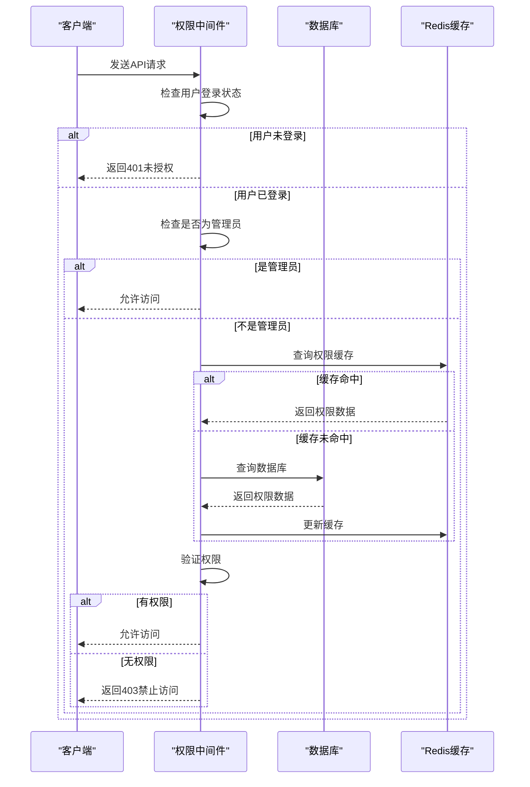
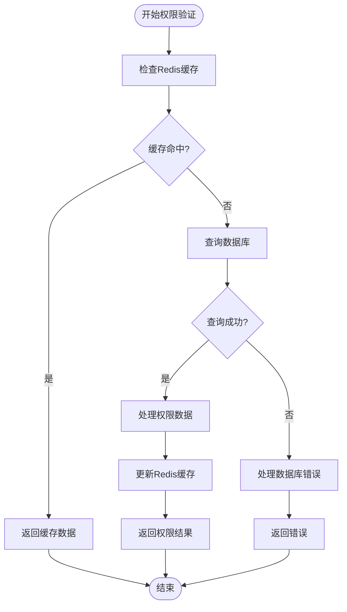
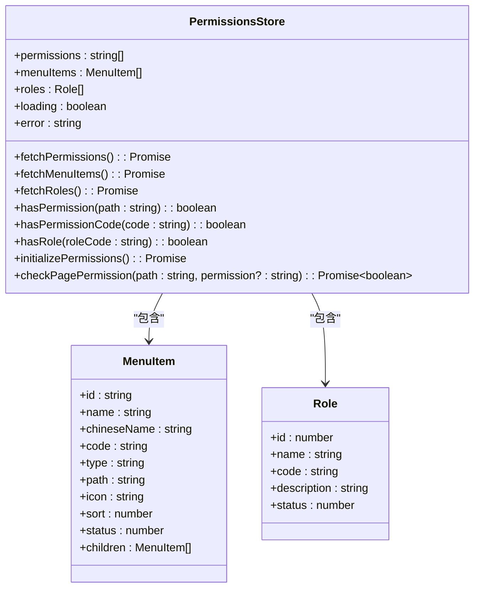
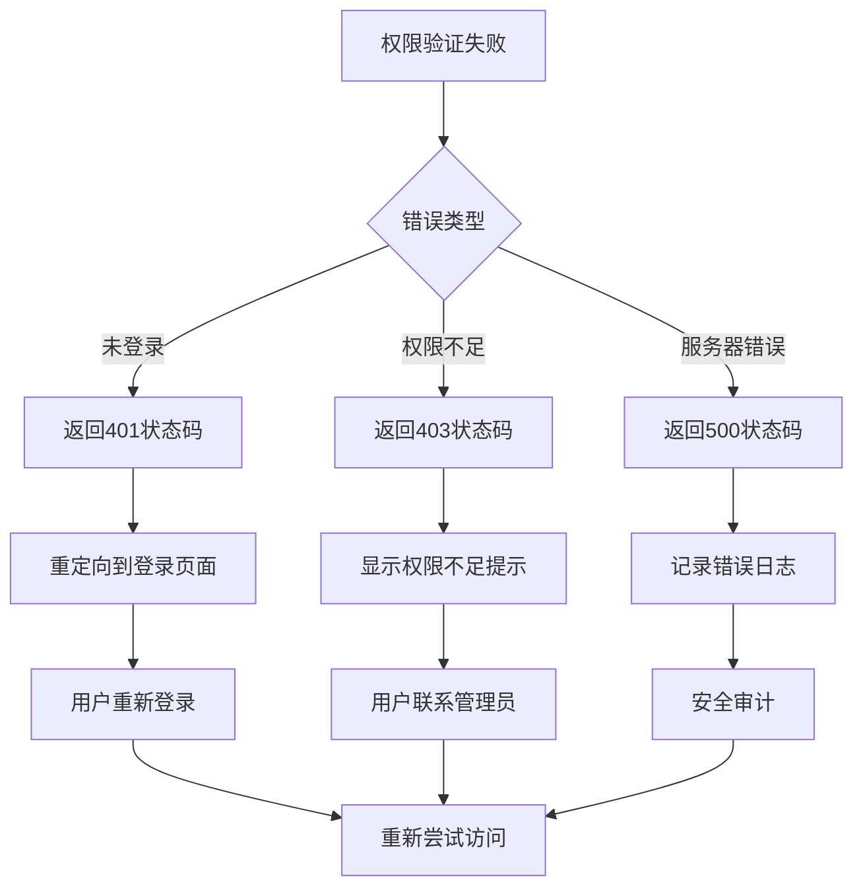

# 权限验证

<cite>
**本文档引用的文件**   
- [permission.middleware.ts](file://k.yyup.com/server/src/middlewares/permission.middleware.ts)
- [permissions.ts](file://k.yyup.com/backup/permission-system/permissions.ts)
- [permission-cache.service.ts](file://k.yyup.com/backup/permission-system/permission-cache.service.ts)
- [permission-cache.controller.ts](file://k.yyup.com/backup/permission-system/permission-cache.controller.ts)
- [cache-invalidation.middleware.ts](file://k.yyup.com/backup/permission-system/cache-invalidation.middleware.ts)
- [route-cache.service.ts](file://k.yyup.com/server/src/services/route-cache.service.ts)
- [role-cache.service.ts](file://k.yyup.com/server/src/services/role-cache.service.ts)
</cite>

## 目录
1. [权限验证机制概述](#权限验证机制概述)
2. [Express中间件中的权限检查](#express中间件中的权限检查)
3. [权限服务核心算法](#权限服务核心算法)
4. [前端权限控制实现](#前端权限控制实现)
5. [权限验证失败处理流程](#权限验证失败处理流程)
6. [新API端点集成指南](#新api端点集成指南)

## 权限验证机制概述

k.yyupgame系统采用分层权限验证机制，结合后端Express中间件和前端Vue组件，实现全面的访问控制。系统通过角色-权限模型管理用户访问权限，支持路由级别和操作级别的细粒度控制。权限数据存储在数据库中，并通过Redis缓存提高访问性能。

**Section sources**
- [permission.middleware.ts](file://k.yyup.com/server/src/middlewares/permission.middleware.ts#L1-L97)
- [permissions.ts](file://k.yyup.com/backup/permission-system/permissions.ts#L1-L513)

## Express中间件中的权限检查

系统在Express框架中实现了权限中间件，用于拦截请求并验证用户权限。中间件通过检查用户角色和权限代码来决定是否允许访问特定API端点。

**Diagram sources**
- [permission.middleware.ts](file://k.yyup.com/server/src/middlewares/permission.middleware.ts#L12-L87)
- [permission-cache.service.ts](file://k.yyup.com/backup/permission-system/permission-cache.service.ts#L50-L133)

## 权限服务核心算法

权限服务采用缓存优先的策略，首先尝试从Redis获取权限数据，如果缓存未命中则查询数据库。系统实现了多层缓存机制，包括用户权限缓存、角色权限缓存和动态路由缓存。

**Diagram sources**
- [permission-cache.service.ts](file://k.yyup.com/backup/permission-system/permission-cache.service.ts#L50-L331)
- [route-cache.service.ts](file://k.yyup.com/server/src/services/route-cache.service.ts#L55-L353)

## 前端权限控制实现

前端通过Pinia状态管理实现权限控制，动态渲染UI组件和导航菜单。系统根据用户权限加载相应的菜单项，并在路由守卫中进行权限验证。

**Diagram sources**
- [permissions.ts](file://k.yyup.com/backup/permission-system/permissions.ts#L53-L512)
- [permission-cache.service.ts](file://k.yyup.com/backup/permission-system/permission-cache.service.ts#L19-L33)

## 权限验证失败处理流程

当权限验证失败时，系统会返回相应的HTTP状态码和错误信息，并记录安全日志。处理流程包括客户端和服务器端的错误处理机制。

**Diagram sources**
- [permission.middleware.ts](file://k.yyup.com/server/src/middlewares/permission.middleware.ts#L20-L85)
- [permissions.ts](file://k.yyup.com/backup/permission-system/permissions.ts#L331-L418)

## 新API端点集成指南

为新API端点集成权限验证，开发者需要按照以下步骤操作：

1. 在路由定义中添加权限中间件
2. 指定所需的权限代码
3. 确保前端组件进行相应的权限检查

**Section sources**
- [permission.middleware.ts](file://k.yyup.com/server/src/middlewares/permission.middleware.ts#L12-L87)
- [permissions.ts](file://k.yyup.com/backup/permission-system/permissions.ts#L249-L266)