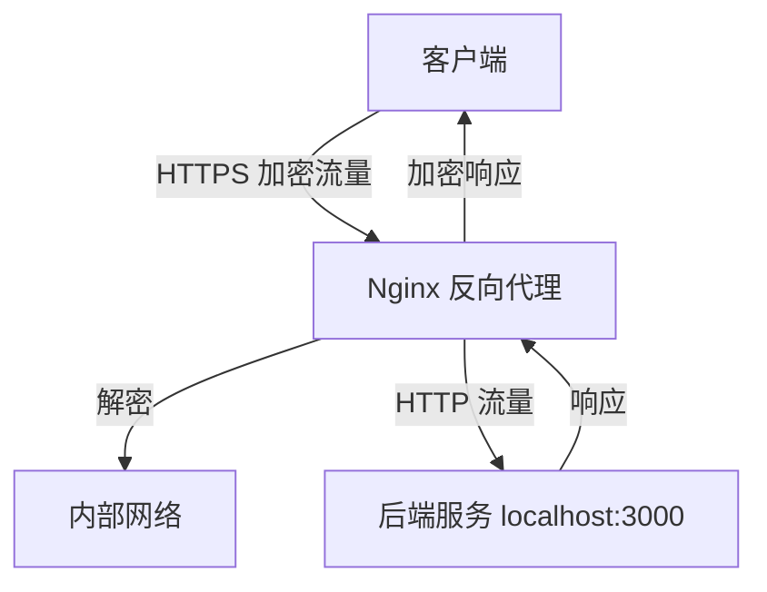

# 传输安全

<cite>
**本文档引用的文件**  
- [k.yyup.com/nginx.conf](file://k.yyup.com/nginx.conf)
- [unified-tenant-system/nginx.conf](file://unified-tenant-system/nginx.conf)
- [k.yyup.com/docker/nginx.conf](file://k.yyup.com/docker/nginx.conf)
- [unified-tenant-system/docker/nginx.conf](file://unified-tenant-system/docker/nginx.conf)
- [k.yyup.com/server/src/server.ts](file://k.yyup.com/server/src/server.ts)
- [unified-tenant-system/server/src/server.ts](file://unified-tenant-system/server/src/server.ts)
</cite>

## 目录
1. [简介](#简介)
2. [TLS/SSL 配置实现](#tlsssl-配置实现)
3. [HTTP 严格传输安全 (HSTS)](#http-严格传输安全-hsts)
4. [Nginx 反向代理与 SSL 终止](#nginx-反向代理与-ssl-终止)
5. [安全 HTTP 头配置](#安全-http-头配置)
6. [后端服务间通信安全](#后端服务间通信安全)
7. [SSL 配置测试方法](#ssl-配置测试方法)
8. [证书轮换与自动化管理](#证书轮换与自动化管理)

## 简介
本文档详细描述了 k.yyupgame 项目中数据传输安全的实现机制。重点介绍通过 Nginx 实现的 TLS/SSL 加密、HSTS 安全策略、安全 HTTP 头配置以及后端服务间的通信安全保障。文档还涵盖了证书管理策略和配置验证方法，确保系统在传输层具备完善的安全防护能力。

## TLS/SSL 配置实现

本项目通过 Nginx 配置实现了强加密的 TLS 通信，确保所有数据在传输过程中的机密性和完整性。

### 证书加载方式
系统使用标准的 PEM 格式证书文件，通过以下指令在 Nginx 配置中指定：
- `ssl_certificate` 指向证书文件路径 `/path/to/ssl/cert.pem`
- `ssl_certificate_key` 指向私钥文件路径 `/path/to/ssl/private.key`

这种配置方式允许 Nginx 在启动时加载证书和私钥，为 HTTPS 连接提供加密支持。

### 支持的 TLS 版本
系统明确配置支持现代安全的 TLS 版本，禁用不安全的旧版本：
```
ssl_protocols TLSv1.2 TLSv1.3;
```
此配置确保只允许使用 TLS 1.2 和 TLS 1.3 协议，这两个版本提供了强大的安全保证，抵御已知的协议层攻击。

### 加密套件配置
系统配置了经过精心选择的加密套件，优先使用基于椭圆曲线的前向安全算法：
```
ssl_ciphers ECDHE-RSA-AES128-GCM-SHA256:ECDHE-RSA-AES256-GCM-SHA384:ECDHE-RSA-CHACHA20-POLY1305;
```
这些加密套件具有以下特点：
- 使用 ECDHE 密钥交换，提供完美的前向安全性（PFS）
- 采用 AES-GCM 或 ChaCha20-Poly1305 认证加密模式
- 支持现代浏览器和客户端的高性能加密

同时，配置中明确禁用了服务器端密码套件优先级：
```
ssl_prefer_server_ciphers off;
```
这允许客户端选择其支持的最佳加密套件，提高兼容性。

**Section sources**
- [k.yyup.com/nginx.conf](file://k.yyup.com/nginx.conf#L14-L16)
- [unified-tenant-system/nginx.conf](file://unified-tenant-system/nginx.conf#L14-L16)

## HTTP 严格传输安全 (HSTS)

系统通过 HSTS 头强制浏览器使用 HTTPS 连接，防止降级攻击和中间人攻击。

### HSTS 配置
在 Nginx 配置中，通过以下指令设置 HSTS 头：
```
add_header Strict-Transport-Security "max-age=31536000; includeSubDomains" always;
```

### 配置参数说明
- `max-age=31536000`：HSTS 策略有效期为一年（31,536,000 秒）
- `includeSubDomains`：策略适用于所有子域名
- `always`：确保该头在所有响应中都添加，包括错误响应

### 作用与优势
HSTS 策略的主要作用包括：
1. **防止协议降级攻击**：浏览器收到 HSTS 头后，会自动将所有 HTTP 请求升级为 HTTPS
2. **防止 SSL 剥离攻击**：攻击者无法拦截并降级到不安全的 HTTP 连接
3. **提高性能**：减少 HTTP 到 HTTPS 的重定向次数
4. **增强用户安全**：即使用户手动输入 http:// 地址，浏览器也会自动使用 HTTPS

结合配置中的 HTTP 到 HTTPS 重定向规则，形成了双重安全防护机制。

**Section sources**
- [k.yyup.com/nginx.conf](file://k.yyup.com/nginx.conf#L118)
- [unified-tenant-system/nginx.conf](file://unified-tenant-system/nginx.conf#L118)

## Nginx 反向代理与 SSL 终止

系统采用 Nginx 作为反向代理服务器，实现 SSL 终止和流量管理。

### SSL 终止架构


**Diagram sources**
- [k.yyup.com/nginx.conf](file://k.yyup.com/nginx.conf#L39-L48)
- [unified-tenant-system/nginx.conf](file://unified-tenant-system/nginx.conf#L39-L48)

### 反向代理配置
关键配置包括：
- 监听 443 端口并启用 SSL 和 HTTP/2
- 将 `/api` 路径的请求代理到 `http://localhost:3000`
- 设置适当的代理头信息，如 `X-Forwarded-For` 和 `X-Forwarded-Proto`

### 优势分析
这种架构具有以下优势：
1. **集中化 SSL 管理**：所有证书管理和加密操作集中在 Nginx 层
2. **性能优化**：Nginx 高效处理 SSL 握手和加密解密
3. **简化后端**：后端服务无需处理 SSL，专注于业务逻辑
4. **灵活扩展**：易于添加负载均衡、缓存等额外功能

**Section sources**
- [k.yyup.com/nginx.conf](file://k.yyup.com/nginx.conf#L6-L7)
- [unified-tenant-system/nginx.conf](file://unified-tenant-system/nginx.conf#L6-L7)

## 安全 HTTP 头配置

系统配置了多项安全 HTTP 头，以防范常见的 Web 攻击。

### 安全头配置表
| 安全头 | 配置值 | 作用 |
|--------|-------|------|
| X-Frame-Options | "SAMEORIGIN" | 防止点击劫持攻击，只允许同源页面嵌套 |
| X-Content-Type-Options | "nosniff" | 禁止 MIME 类型嗅探，防止内容类型混淆攻击 |
| X-XSS-Protection | "1; mode=block" | 启用浏览器 XSS 过滤器，发现攻击时阻止页面渲染 |
| Strict-Transport-Security | "max-age=31536000; includeSubDomains" | 强制 HTTPS 连接，防止降级攻击 |

### 配置实现
这些安全头通过 Nginx 的 `add_header` 指令统一添加：
```
add_header X-Frame-Options "SAMEORIGIN" always;
add_header X-Content-Type-Options "nosniff" always;
add_header X-XSS-Protection "1; mode=block" always;
add_header Strict-Transport-Security "max-age=31536000; includeSubDomains" always;
```

### 防护效果
这些安全头共同提供了多层防护：
- **点击劫持防护**：X-Frame-Options 防止页面被嵌入恶意网站
- **MIME 类型攻击防护**：X-Content-Type-Options 确保资源按声明的类型处理
- **XSS 攻击防护**：X-XSS-Protection 作为最后一道防线拦截反射型 XSS
- **协议安全防护**：HSTS 确保通信始终加密

**Section sources**
- [k.yyup.com/nginx.conf](file://k.yyup.com/nginx.conf#L115-L118)
- [unified-tenant-system/nginx.conf](file://unified-tenant-system/nginx.conf#L115-L118)

## 后端服务间通信安全

虽然 Nginx 处理了外部 SSL 终止，但系统也考虑了内部通信的安全性。

### 内部通信架构
在当前配置中，Nginx 与后端服务运行在同一主机上，通过 `localhost` 进行通信：
```
proxy_pass http://localhost:3000;
```

### 安全考量
这种设计的安全特点包括：
1. **网络隔离**：内部通信限制在本地回环接口，不暴露于外部网络
2. **信任边界**：Nginx 作为可信的边界代理，验证和过滤所有进入的请求
3. **简化配置**：避免了服务间复杂的证书管理和双向 TLS 配置

### 潜在增强
对于更高安全要求的场景，可考虑：
- 在后端服务间实施相互 TLS（mTLS）认证
- 使用服务网格实现细粒度的通信控制
- 添加内部 API 网关进行额外的安全检查

**Section sources**
- [k.yyup.com/nginx.conf](file://k.yyup.com/nginx.conf#L40)
- [unified-tenant-system/nginx.conf](file://unified-tenant-system/nginx.conf#L40)

## SSL 配置测试方法

为验证 SSL 配置的有效性，建议使用专业工具进行测试。

### SSL Labs 测试
使用 Qualys SSL Labs 的在线工具（https://www.ssllabs.com/ssltest/）进行全面评估：
1. 输入域名 k.yyup.cc
2. 获取详细的 SSL/TLS 配置评分
3. 检查协议支持、密钥交换、加密套件等各项指标
4. 验证证书链的完整性和有效性

### 本地测试命令
使用 OpenSSL 命令行工具进行基本验证：
```bash
# 测试支持的 TLS 版本
openssl s_client -connect k.yyup.cc:443 -tls1_2
openssl s_client -connect k.yyup.cc:443 -tls1_3

# 查看服务器证书
openssl s_client -connect k.yyup.cc:443 -showcerts

# 测试特定加密套件
openssl s_client -connect k.yyup.cc:443 -cipher ECDHE-RSA-AES128-GCM-SHA256
```

### 预期结果
正确的配置应获得 SSL Labs 的 A+ 评级，具体要求包括：
- 支持 TLS 1.2 和 1.3
- 不支持弱加密算法
- 完整的证书链
- 启用 HSTS 且有效期足够长

**Section sources**
- [k.yyup.com/nginx.conf](file://k.yyup.com/nginx.conf#L14-L16)
- [unified-tenant-system/nginx.conf](file://unified-tenant-system/nginx.conf#L14-L16)

## 证书轮换与自动化管理

系统需要有效的证书生命周期管理策略。

### 证书轮换策略
建议的证书轮换策略包括：
1. **轮换周期**：在证书到期前 30 天开始轮换流程
2. **自动化监控**：设置证书有效期监控告警
3. **测试环境验证**：在生产部署前在测试环境验证新证书
4. **回滚计划**：准备旧证书作为回滚方案

### 自动化管理方案
推荐使用 Let's Encrypt 和 Certbot 实现自动化管理：
```bash
# 安装 Certbot
sudo apt-get install certbot

# 获取并安装证书（自动配置 Nginx）
sudo certbot --nginx -d k.yyup.cc

# 测试自动续期
sudo certbot renew --dry-run

# 设置自动续期定时任务
echo "0 12 * * * /usr/bin/certbot renew --quiet" | sudo crontab -
```

### Nginx 集成
自动化方案与 Nginx 的集成要点：
- Certbot 自动更新 Nginx 配置中的证书路径
- 续期后自动重载 Nginx 配置
- 支持通配符证书，便于子域名管理
- 提供钩子机制，可在证书更新后执行自定义脚本

这种自动化方案确保了证书的持续有效性，避免因证书过期导致的服务中断。

**Section sources**
- [k.yyup.com/nginx.conf](file://k.yyup.com/nginx.conf#L10-L11)
- [unified-tenant-system/nginx.conf](file://unified-tenant-system/nginx.conf#L10-L11)