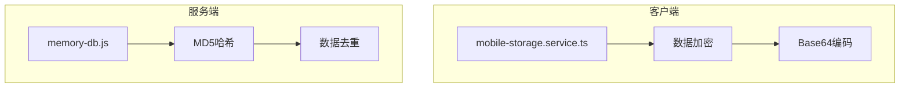
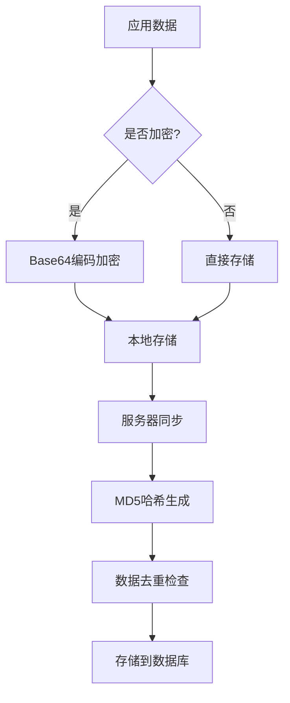
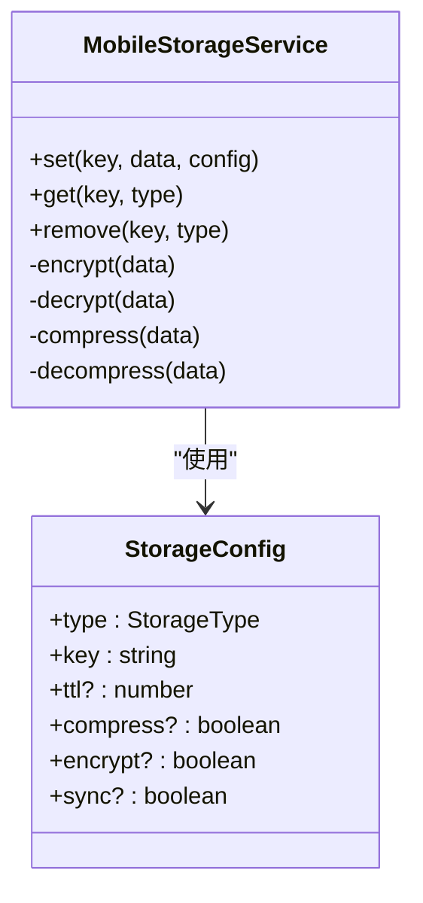
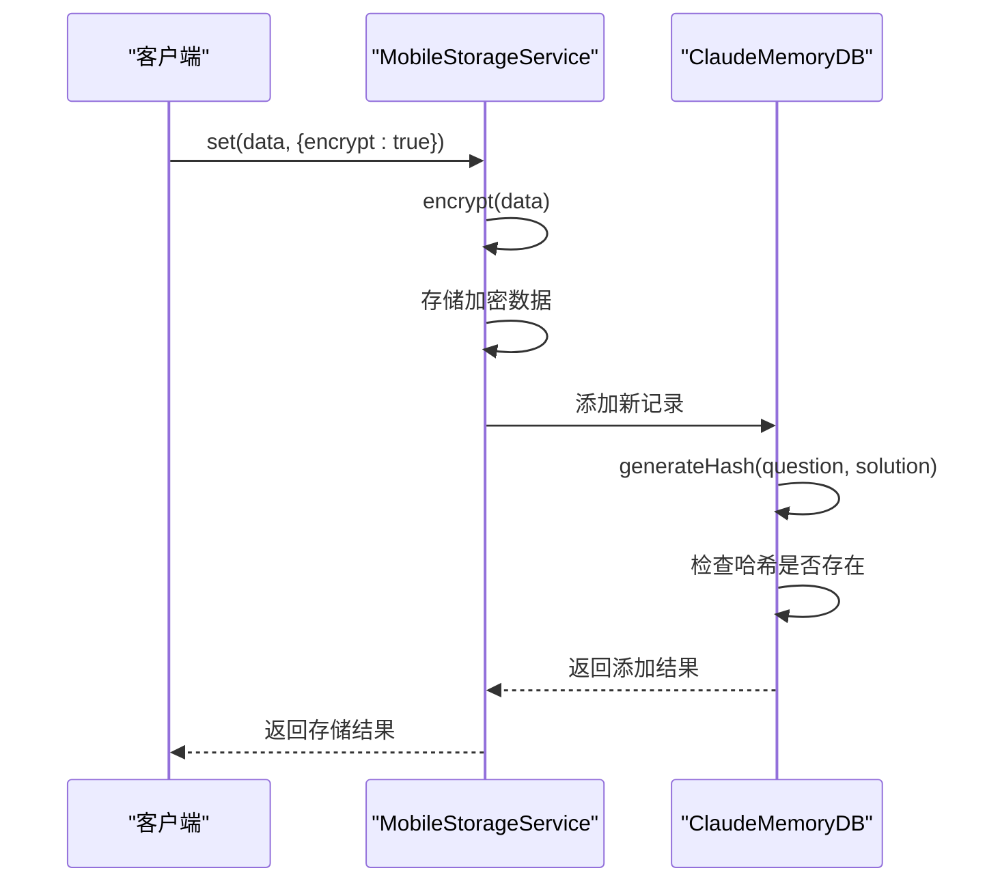
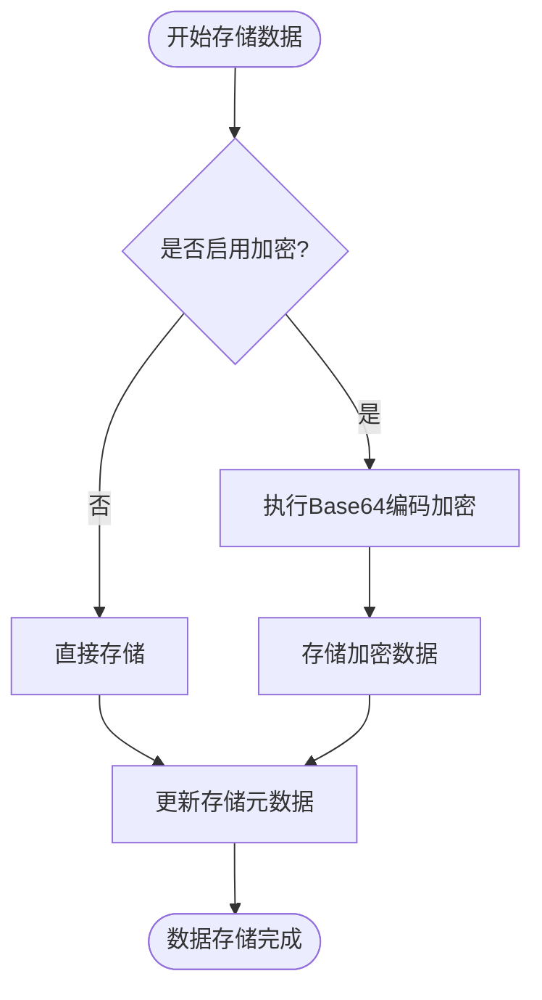
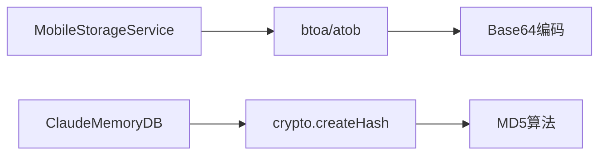

# 加密策略

<cite>
**本文档引用的文件**
- [mobile-storage.service.ts](file://k.yyup.com/client/aimobile/services/mobile-storage.service.ts)
- [memory-db.js](file://docs/claude-memory/memory-db.js)
</cite>

## 目录
1. [简介](#简介)
2. [项目结构](#项目结构)
3. [核心组件](#核心组件)
4. [架构概述](#架构概述)
5. [详细组件分析](#详细组件分析)
6. [依赖分析](#依赖分析)
7. [性能考虑](#性能考虑)
8. [故障排除指南](#故障排除指南)
9. [结论](#结论)
10. [附录](#附录)（如有必要）

## 简介
本项目实现了移动端数据存储的加密策略，重点在客户端侧对敏感数据进行保护。系统通过配置化的加密机制，在数据持久化过程中提供基础的安全保障。加密策略主要应用于移动端本地存储场景，确保用户数据在设备端的安全性。

## 项目结构
项目中的加密功能主要分布在客户端和服务端两个部分。客户端实现了数据存储时的加密处理，而服务端则包含基于哈希的数据去重机制。整体结构体现了分层安全设计的思想，将加密能力嵌入到数据存储和管理的核心流程中。

**图源**
- [mobile-storage.service.ts](file://k.yyup.com/client/aimobile/services/mobile-storage.service.ts#L440-L448)
- [memory-db.js](file://docs/claude-memory/memory-db.js#L120-L123)

**节源**
- [mobile-storage.service.ts](file://k.yyup.com/client/aimobile/services/mobile-storage.service.ts#L1-L581)
- [memory-db.js](file://docs/claude-memory/memory-db.js#L1-L226)

## 核心组件
系统的核心加密组件包括移动端存储服务中的加密模块和服务器端的记忆数据库哈希模块。这些组件共同构成了项目的加密体系，分别负责数据内容的保护和数据唯一性的验证。

**节源**
- [mobile-storage.service.ts](file://k.yyup.com/client/aimobile/services/mobile-storage.service.ts#L440-L448)
- [memory-db.js](file://docs/claude-memory/memory-db.js#L120-L123)

## 架构概述
系统的加密架构采用分层设计，客户端负责数据内容的加密处理，服务端负责数据指纹的生成与验证。这种设计既保证了数据的机密性，又实现了高效的数据去重和完整性校验。

**图源**
- [mobile-storage.service.ts](file://k.yyup.com/client/aimobile/services/mobile-storage.service.ts#L133-L136)
- [memory-db.js](file://docs/claude-memory/memory-db.js#L120-L123)

## 详细组件分析
### 移动端存储加密分析
移动端存储服务提供了可配置的加密功能，允许在数据存储时选择是否进行加密处理。该功能通过简单的Base64编码实现，为数据提供基础的保护。

#### 加密组件分析

**图源**
- [mobile-storage.service.ts](file://k.yyup.com/client/aimobile/services/mobile-storage.service.ts#L18-L35)

### 服务端哈希分析
服务端的记忆数据库使用MD5哈希算法来生成数据指纹，用于检测重复记录。这一机制确保了数据的唯一性，防止相同内容的重复存储。

#### 哈希组件分析

**图源**
- [mobile-storage.service.ts](file://k.yyup.com/client/aimobile/services/mobile-storage.service.ts#L113-L172)
- [memory-db.js](file://docs/claude-memory/memory-db.js#L125-L164)

### 数据加密流程分析
系统中的数据加密流程设计简洁，通过配置开关控制加密行为，实现了灵活的数据保护机制。

**图源**
- [mobile-storage.service.ts](file://k.yyup.com/client/aimobile/services/mobile-storage.service.ts#L133-L136)

**节源**
- [mobile-storage.service.ts](file://k.yyup.com/client/aimobile/services/mobile-storage.service.ts#L113-L172)

## 依赖分析
系统中的加密功能依赖于JavaScript的原生编码能力和Node.js的crypto模块。这些基础能力为加密和哈希功能提供了必要的支持。

**图源**
- [mobile-storage.service.ts](file://k.yyup.com/client/aimobile/services/mobile-storage.service.ts#L443-L447)
- [memory-db.js](file://docs/claude-memory/memory-db.js#L121-L123)

**节源**
- [mobile-storage.service.ts](file://k.yyup.com/client/aimobile/services/mobile-storage.service.ts#L1-L581)
- [memory-db.js](file://docs/claude-memory/memory-db.js#L1-L226)

## 性能考虑
当前的加密实现采用了轻量级的Base64编码方案，对性能影响较小。MD5哈希计算也具有较高的效率，适合用于数据去重场景。然而，Base64编码仅提供基础的数据混淆，不具有强加密的安全性。

## 故障排除指南
当遇到加密相关问题时，应首先检查加密配置是否正确设置，然后验证数据编解码过程是否正常。对于哈希冲突问题，需要检查MD5哈希的生成逻辑和去重判断条件。

**节源**
- [mobile-storage.service.ts](file://k.yyup.com/client/aimobile/services/mobile-storage.service.ts#L440-L448)
- [memory-db.js](file://docs/claude-memory/memory-db.js#L120-L123)

## 结论
本项目的加密策略实现了基础的数据保护功能，通过简单的编码和哈希技术满足了基本的安全需求。虽然当前实现较为简单，但为后续增强加密强度提供了良好的架构基础。建议在未来版本中引入更强大的加密算法和密钥管理机制。