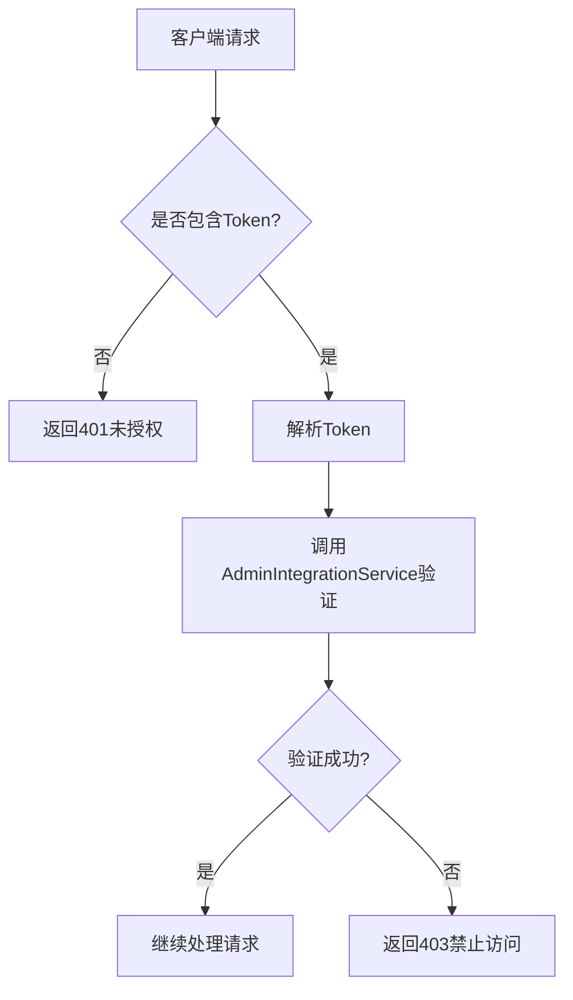
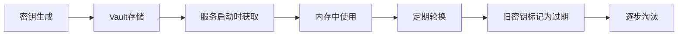

# 密钥管理

<cite>
**本文档引用的文件**  
- [auth-shared-pool-example.middleware.ts](file://auth-shared-pool-example.middleware.ts)
- [.env](file://k.yyup.com/.env)
- [.env.development](file://k.yyup.com/.env.development)
- [.env.production](file://k.yyup.com/.env.production)
- [config/security.json](file://k.yyup.com/config/security.json)
- [unified-tenant-system/config/security.json](file://unified-tenant-system/config/security.json)
</cite>

## 目录
1. [简介](#简介)
2. [主密钥存储与保护机制](#主密钥存储与保护机制)
3. [密钥轮换策略](#密钥轮换策略)
4. [密钥分发机制](#密钥分发机制)
5. [密钥泄露应急处理流程](#密钥泄露应急处理流程)
6. [密钥管理最佳实践建议](#密钥管理最佳实践建议)

## 简介
本项目 `k.yyupgame` 的密钥管理机制主要围绕 JWT（JSON Web Token）认证系统展开，通过环境变量和配置文件实现加密密钥的安全管理。系统采用分层安全策略，确保主密钥不被硬编码在源码中，并通过中间件进行统一的身份验证。本文档详细阐述了密钥的存储、轮换、分发及应急响应机制。

## 主密钥存储与保护机制

项目通过环境变量文件（`.env` 系列）来管理敏感密钥信息，避免将密钥直接写入代码中。开发环境中使用 `.env.development` 文件定义 `JWT_SECRET`，用于生成和验证 JWT 令牌。

生产环境配置中未直接暴露密钥，而是通过外部注入方式提供，符合最小权限原则。此外，系统依赖 `dotenv` 模块加载环境变量，确保密钥在运行时动态获取。

系统还包含共享连接池的认证中间件 `auth-shared-pool-example.middleware.ts`，该模块调用统一认证服务验证 Token，增强了系统的安全性和可维护性。

**图示来源**  
- [auth-shared-pool-example.middleware.ts](file://auth-shared-pool-example.middleware.ts)

**本节来源**  
- [.env.development](file://k.yyup.com/.env.development)
- [auth-shared-pool-example.middleware.ts](file://auth-shared-pool-example.middleware.ts)

## 密钥轮换策略

目前项目中尚未实现自动化的密钥轮换机制。`JWT_SECRET` 在 `.env.development` 中以明文形式存在，且未见相关脚本或配置支持周期性更换密钥。

建议引入以下改进措施：
- 使用外部密钥管理服务（如 Hashicorp Vault）动态获取密钥
- 实现密钥版本化机制，支持新旧密钥并行使用
- 编写自动化脚本定期更新密钥并重新部署服务

当前系统一旦更改 `JWT_SECRET`，所有已签发的 Token 将立即失效，因此缺乏平滑过渡能力。

**本节来源**  
- [.env.development](file://k.yyup.com/.env.development)

## 密钥分发机制

密钥通过环境变量文件分发至不同服务实例。开发环境下，各开发者本地复制 `.env.development` 文件以获取密钥；生产环境下，应通过 CI/CD 流程或配置管理工具（如 Ansible、Kubernetes Secrets）安全注入。

前端通过 `VITE_API_BASE_URL` 等前缀为 `VITE_` 的变量访问必要配置，但不包含任何加密密钥，确保敏感信息不会暴露在客户端。

系统未使用集中式密钥分发服务，建议未来集成 Vault 或 AWS KMS 等专业工具提升安全性。

**本节来源**  
- [.env.development](file://k.yyup.com/.env.development)
- [.env.production](file://k.yyup.com/.env.production)

## 密钥泄露应急处理流程

当前系统未定义明确的密钥泄露应急响应流程。若发生 `JWT_SECRET` 泄露，需手动执行以下步骤：
1. 立即停止服务或限制访问
2. 修改 `.env` 文件中的 `JWT_SECRET`
3. 重新部署所有相关服务
4. 强制用户重新登录以签发新 Token
5. 审查日志排查异常行为

由于缺乏自动化机制，响应速度受限于人工操作效率。建议建立自动化响应流程，结合监控告警系统实现快速响应。

**本节来源**  
- [.env.development](file://k.yyup.com/.env.development)

## 密钥管理最佳实践建议

### 最小权限原则
- 前端仅暴露必要配置（如 API 地址），绝不包含密钥
- 后端服务按需加载环境变量，避免全局暴露
- 数据库连接信息等其他敏感数据也应通过环境变量管理

### 定期审计
- 定期检查 `.env` 文件是否误提交至版本控制
- 使用 `check-hardcoded.js` 等工具扫描代码中是否存在硬编码密钥
- 审计日志中记录密钥相关的操作行为

### 推荐改进方向
1. **引入外部密钥管理服务**：使用 Hashicorp Vault 或云厂商提供的 KMS 服务
2. **实现密钥轮换自动化**：编写脚本定期更新密钥并通知相关服务
3. **增强密钥版本控制**：支持多版本密钥共存，实现无缝切换
4. **加强传输安全**：确保环境变量在 CI/CD 过程中加密传输
5. **完善应急响应机制**：建立自动化的密钥撤销与重置流程

**图示来源**  
- [config/security.json](file://k.yyup.com/config/security.json)
- [unified-tenant-system/config/security.json](file://unified-tenant-system/config/security.json)

**本节来源**  
- [config/security.json](file://k.yyup.com/config/security.json)
- [unified-tenant-system/config/security.json](file://unified-tenant-system/config/security.json)