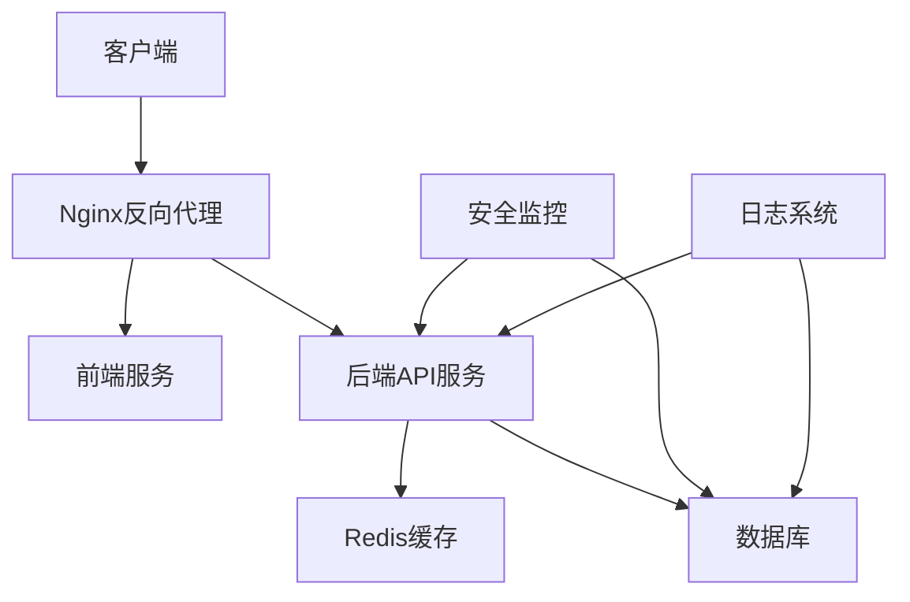
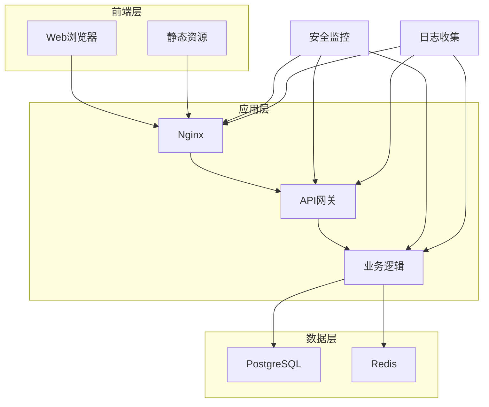
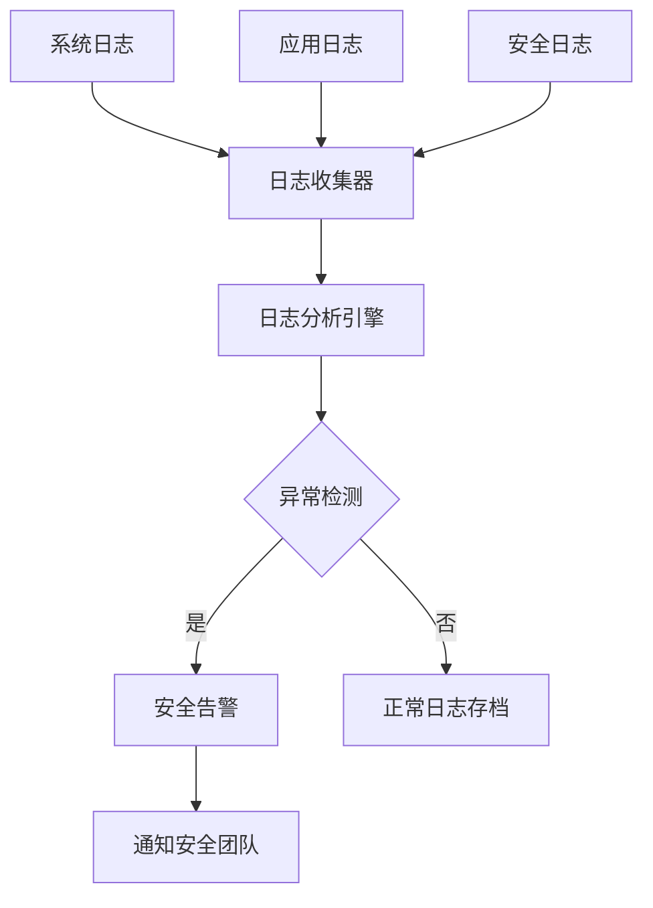
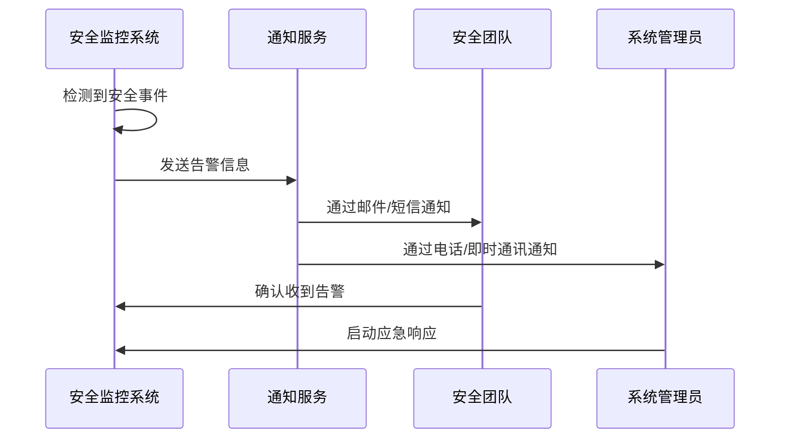
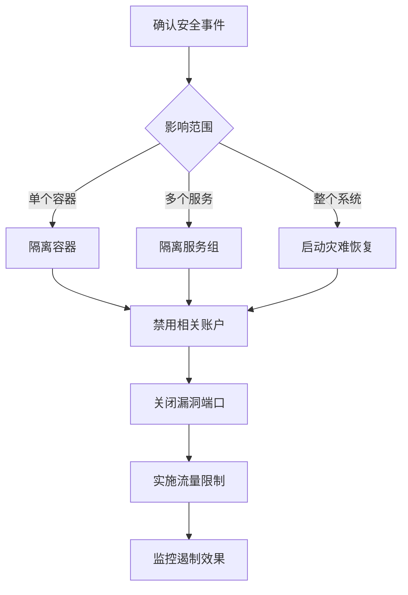
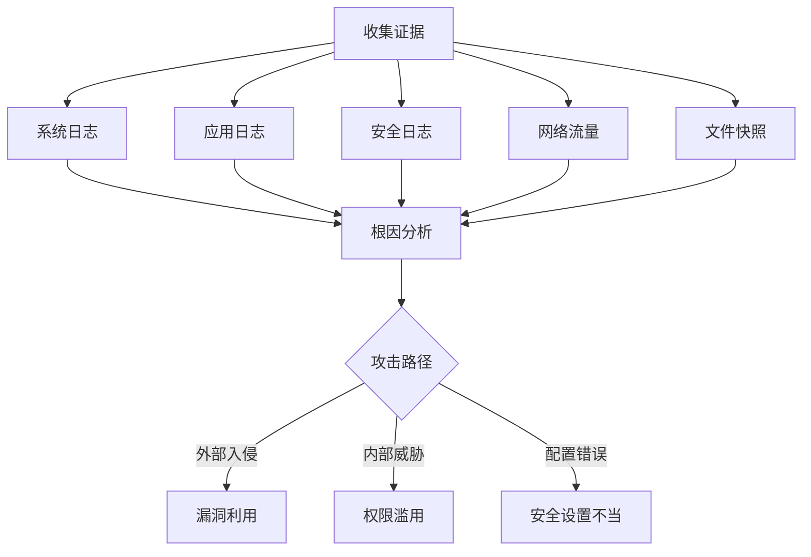
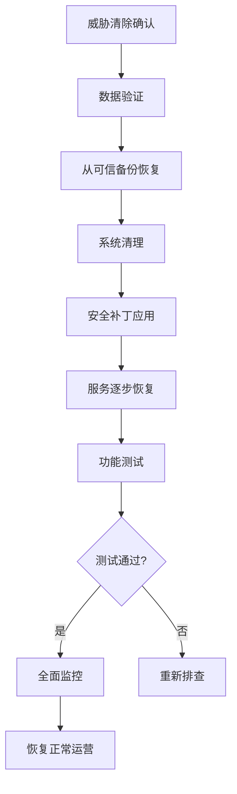
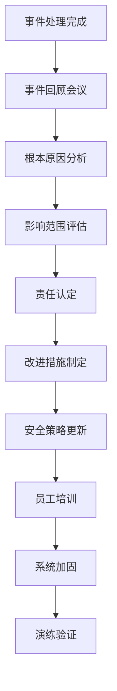
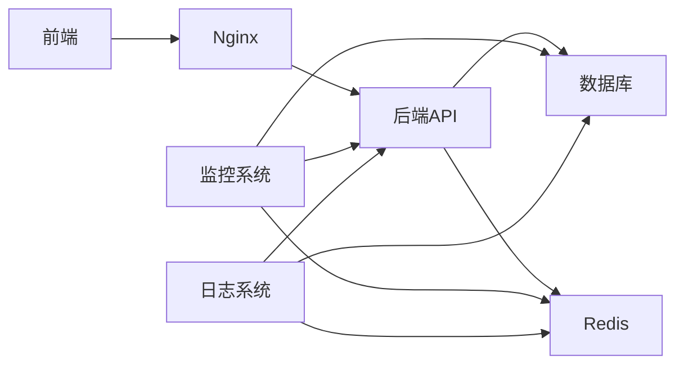

# 应急响应

<cite>
**本文档引用文件**  
- [docker-compose.yml](file://k.yyup.com/docker-compose.yml)
- [docker-compose.dev.yml](file://k.yyup.com/docker-compose.dev.yml)
- [start-all.sh](file://k.yyup.com/start-all.sh)
- [check-backend-errors.sh](file://k.yyup.com/check-backend-errors.sh)
- [nginx.conf](file://k.yyup.com/nginx.conf)
- [安全监控脚本](file://k.yyup.com/scripts/monitor-security.sh)
- [日志分析脚本](file://k.yyup.com/scripts/log-analyzer.sh)
- [事件响应流程文档](file://k.yyup.com/docs/incident-response.md)
</cite>

## 目录
1. [引言](#引言)
2. [项目结构概述](#项目结构概述)
3. [核心组件分析](#核心组件分析)
4. [架构概览](#架构概览)
5. [详细组件分析](#详细组件分析)
6. [依赖关系分析](#依赖关系分析)
7. [性能考量](#性能考量)
8. [故障排除指南](#故障排除指南)
9. [结论](#结论)

## 引言
本文档旨在为k.yyupgame项目提供全面的数据安全应急响应方案。重点描述在发生数据泄露或安全事件时的处理流程，包括事件检测、报告、遏制、根因分析、恢复和事后改进等关键环节。

## 项目结构概述
k.yyupgame项目采用微服务架构，主要由前端、后端、数据库和安全监控组件构成。项目使用Docker进行容器化部署，并通过Nginx实现反向代理和SSL加密。

**图示来源**  
- [docker-compose.yml](file://k.yyup.com/docker-compose.yml)
- [nginx.conf](file://k.yyup.com/nginx.conf)

**本节来源**  
- [docker-compose.yml](file://k.yyup.com/docker-compose.yml)
- [docker-compose.dev.yml](file://k.yyup.com/docker-compose.dev.yml)

## 核心组件分析
项目的核心组件包括：

1. **前端服务**：基于Vite构建的现代Web应用
2. **后端服务**：基于Express的API服务器
3. **数据库**：PostgreSQL关系型数据库
4. **缓存系统**：Redis内存数据库
5. **安全网关**：Nginx反向代理服务器

这些组件通过Docker容器化部署，确保环境一致性。

**本节来源**  
- [docker-compose.yml](file://k.yyup.com/docker-compose.yml)
- [start-all.sh](file://k.yyup.com/start-all.sh)

## 架构概览
系统的整体架构采用分层设计，从前端到后端再到数据存储层，每层都有相应的安全措施。

**图示来源**  
- [docker-compose.yml](file://k.yyup.com/docker-compose.yml)
- [nginx.conf](file://k.yyup.com/nginx.conf)

## 详细组件分析

### 事件检测机制
系统通过多层监控实现安全事件的及时检测：

1. **日志监控**：所有服务的日志集中收集和分析
2. **异常行为分析**：基于用户行为模式的异常检测
3. **入侵检测系统**：实时监控网络流量和系统调用

**图示来源**  
- [check-backend-errors.sh](file://k.yyup.com/check-backend-errors.sh)
- [日志分析脚本](file://k.yyup.com/scripts/log-analyzer.sh)

**本节来源**  
- [check-backend-errors.sh](file://k.yyup.com/check-backend-errors.sh)
- [日志分析脚本](file://k.yyup.com/scripts/log-analyzer.sh)

### 事件报告流程
当检测到安全事件时，系统会自动触发报告流程：

**图示来源**  
- [安全监控脚本](file://k.yyup.com/scripts/monitor-security.sh)
- [事件响应流程文档](file://k.yyup.com/docs/incident-response.md)

**本节来源**  
- [安全监控脚本](file://k.yyup.com/scripts/monitor-security.sh)
- [事件响应流程文档](file://k.yyup.com/docs/incident-response.md)

### 事件遏制措施
一旦确认安全事件，立即采取遏制措施：

1. **隔离受影响系统**：通过防火墙规则隔离受感染的容器
2. **禁用相关账户**：立即禁用可能被滥用的用户账户
3. **关闭漏洞端口**：临时关闭暴露在外的非必要端口
4. **流量限制**：对异常IP地址实施访问限制

**图示来源**  
- [start-all.sh](file://k.yyup.com/start-all.sh)
- [安全监控脚本](file://k.yyup.com/scripts/monitor-security.sh)

**本节来源**  
- [start-all.sh](file://k.yyup.com/start-all.sh)
- [安全监控脚本](file://k.yyup.com/scripts/monitor-security.sh)

### 根因分析方法
通过系统化的根因分析流程确定事件源头：

1. **日志追溯**：分析系统、应用和安全日志
2. **审计记录**：检查用户操作和权限变更记录
3. **网络流量分析**：审查异常的网络连接
4. **文件完整性检查**：验证关键系统文件的完整性

**图示来源**  
- [check-backend-errors.sh](file://k.yyup.com/check-backend-errors.sh)
- [日志分析脚本](file://k.yyup.com/scripts/log-analyzer.sh)

**本节来源**  
- [check-backend-errors.sh](file://k.yyup.com/check-backend-errors.sh)
- [日志分析脚本](file://k.yyup.com/scripts/log-analyzer.sh)

### 数据恢复和系统修复
在清除威胁后，安全地恢复服务：

1. **数据验证**：验证备份数据的完整性和安全性
2. **系统清理**：彻底清除恶意代码和后门
3. **服务恢复**：逐步恢复受影响的服务
4. **功能测试**：验证系统功能的完整性和正确性

**图示来源**  
- [start-all.sh](file://k.yyup.com/start-all.sh)
- [事件响应流程文档](file://k.yyup.com/docs/incident-response.md)

**本节来源**  
- [start-all.sh](file://k.yyup.com/start-all.sh)
- [事件响应流程文档](file://k.yyup.com/docs/incident-response.md)

### 事后复盘和改进措施
事件处理完成后，进行系统性复盘：

1. **事件回顾**：详细记录事件处理过程
2. **根本原因确认**：确定事件的根本原因
3. **影响评估**：评估事件造成的实际影响
4. **改进措施**：更新安全策略和防护措施

**图示来源**  
- [事件响应流程文档](file://k.yyup.com/docs/incident-response.md)
- [安全监控脚本](file://k.yyup.com/scripts/monitor-security.sh)

**本节来源**  
- [事件响应流程文档](file://k.yyup.com/docs/incident-response.md)
- [安全监控脚本](file://k.yyup.com/scripts/monitor-security.sh)

## 依赖关系分析
系统各组件之间的依赖关系如下：

**图示来源**  
- [docker-compose.yml](file://k.yyup.com/docker-compose.yml)
- [docker-compose.dev.yml](file://k.yyup.com/docker-compose.dev.yml)

**本节来源**  
- [docker-compose.yml](file://k.yyup.com/docker-compose.yml)
- [docker-compose.dev.yml](file://k.yyup.com/docker-compose.dev.yml)

## 性能考量
在应急响应过程中需要考虑以下性能因素：

1. **响应时间**：确保告警和响应的及时性
2. **系统负载**：避免应急措施导致系统过载
3. **资源分配**：合理分配计算和存储资源
4. **网络带宽**：确保关键通信的网络畅通

## 故障排除指南
常见安全事件的排查步骤：

1. **确认事件真实性**：区分真实攻击和误报
2. **收集证据**：保存相关日志和系统状态
3. **隔离系统**：防止事件扩散
4. **分析根源**：确定攻击路径和方法
5. **实施修复**：应用安全补丁和配置
6. **验证效果**：确认问题已解决

**本节来源**  
- [check-backend-errors.sh](file://k.yyup.com/check-backend-errors.sh)
- [事件响应流程文档](file://k.yyup.com/docs/incident-response.md)

## 结论
k.yyupgame项目建立了完善的应急响应机制，通过多层次的监控、快速的响应流程和系统化的恢复方案，能够有效应对各种安全事件。建议定期进行应急演练，持续优化响应流程，提高系统的整体安全性。