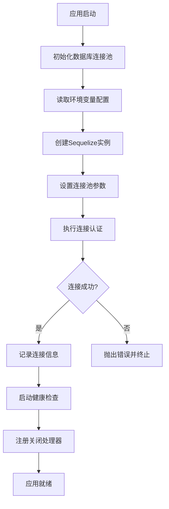
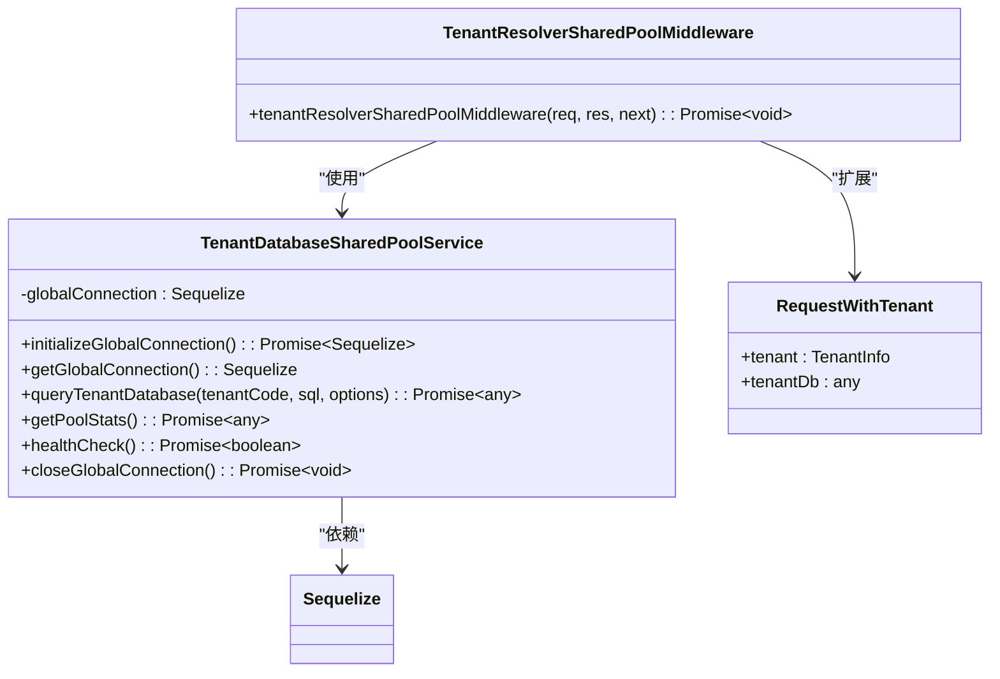
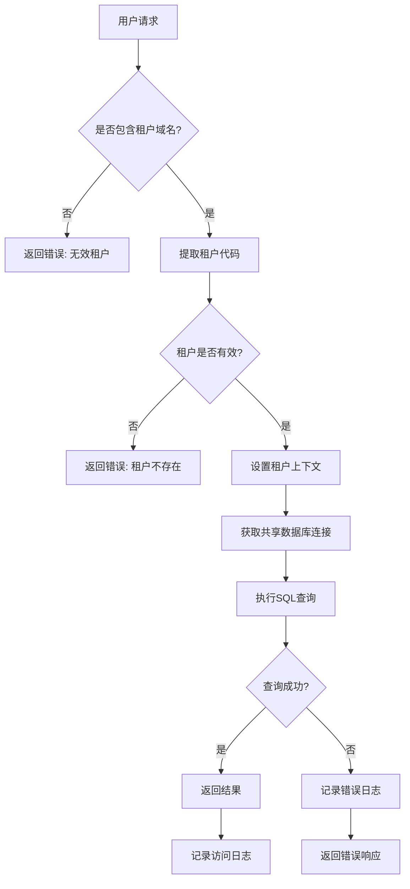

# 数据库安全

<cite>
**本文档引用的文件**  
- [database-initialization.ts](file://database-initialization.ts)
- [tenant-database-shared-pool.service.ts](file://tenant-database-shared-pool.service.ts)
- [tenant-resolver-shared-pool.middleware.ts](file://tenant-resolver-shared-pool.middleware.ts)
</cite>

## 目录
1. [引言](#引言)
2. [数据库连接安全配置](#数据库连接安全配置)
3. [基于角色的访问控制（RBAC）](#基于角色的访问控制rbac)
4. [审计日志机制](#审计日志机制)
5. [数据库备份加密策略](#数据库备份加密策略)
6. [SQL注入防护措施](#sql注入防护措施)
7. [数据库安全配置检查清单](#数据库安全配置检查清单)
8. [结论](#结论)

## 引言
本项目k.yyupgame采用多租户架构，通过共享数据库连接池实现高效的数据访问与安全管理。数据库安全是系统整体安全的核心组成部分，涵盖连接安全、访问控制、操作审计、数据备份和输入防护等多个层面。本文档详细阐述k.yyupgame在数据库安全方面的具体实现措施，确保数据的机密性、完整性和可用性。

## 数据库连接安全配置

### SSL加密连接
当前代码库中未显式配置SSL/TLS加密连接。Sequelize支持通过`dialectOptions`配置SSL参数，但`tenant-database-shared-pool.service.ts`中未设置相关选项。建议在生产环境中启用SSL连接，通过以下方式增强安全性：
- 配置`dialectOptions.ssl`启用加密传输
- 使用受信任的CA证书验证数据库服务器身份
- 强制要求加密连接，防止中间人攻击

### 连接池安全设置
系统采用全局共享连接池，通过`tenant-database-shared-pool.service.ts`实现集中管理。关键安全配置如下：
- **最小连接数**：由`DB_POOL_MIN`环境变量控制，默认为5
- **最大连接数**：由`DB_POOL_MAX`环境变量控制，默认为30
- **获取超时**：30秒，防止连接请求无限等待
- **空闲超时**：10秒，及时释放空闲连接资源
- **日志记录**：开发环境记录所有SQL查询，生产环境关闭以避免敏感信息泄露

连接池初始化在应用启动时完成，通过`initializeDatabasePool()`函数确保连接的可靠性和稳定性。同时，系统注册了`SIGTERM`和`SIGINT`信号处理器，实现优雅关闭，确保连接池在应用终止前被正确释放。

**Diagram sources**
- [database-initialization.ts](file://database-initialization.ts#L13-L88)
- [tenant-database-shared-pool.service.ts](file://tenant-database-shared-pool.service.ts#L15-L55)

**Section sources**
- [database-initialization.ts](file://database-initialization.ts#L1-L88)
- [tenant-database-shared-pool.service.ts](file://tenant-database-shared-pool.service.ts#L1-L55)

## 基于角色的访问控制（RBAC）

### 租户级数据隔离
系统通过共享连接池实现多租户数据隔离。`TenantDatabaseSharedPoolService`类使用`tenant_${tenantCode}`作为数据库前缀，通过`prependTenantDatabase()`方法动态修改SQL语句中的表名，确保每个租户只能访问自己的数据库。

租户识别通过`tenant-resolver-shared-pool.middleware.ts`中间件完成，根据请求域名（如`k001.yyup.cc`）提取租户代码，并验证租户的有效性。只有通过验证的租户才能获得数据库访问权限。

### Sequelize模型与查询权限
虽然当前代码未展示具体的Sequelize模型定义，但系统通过中间件和连接池服务实现了查询层面的访问控制。所有数据库查询都必须通过`queryTenantDatabase()`方法执行，该方法自动为SQL语句添加租户数据库前缀，从根本上防止跨租户数据访问。

权限控制还体现在应用层面，通过`validateTenant()`函数验证租户状态，确保只有激活的租户才能访问系统。这种设计实现了数据库层面的逻辑隔离，避免了物理隔离带来的资源浪费。

**Diagram sources**
- [tenant-database-shared-pool.service.ts](file://tenant-database-shared-pool.service.ts#L9-L173)
- [tenant-resolver-shared-pool.middleware.ts](file://tenant-resolver-shared-pool.middleware.ts#L26-L96)

**Section sources**
- [tenant-database-shared-pool.service.ts](file://tenant-database-shared-pool.service.ts#L9-L173)
- [tenant-resolver-shared-pool.middleware.ts](file://tenant-resolver-shared-pool.middleware.ts#L26-L96)

## 审计日志机制

### 操作日志记录
系统通过`logger`服务记录关键数据库操作，包括：
- 数据库连接池的初始化和关闭
- 连接认证成功或失败
- 租户数据库查询的执行情况
- 健康检查结果

日志信息包含操作类型、时间戳、租户代码、SQL语句（开发环境）和错误详情。这些日志可用于追踪数据访问行为，识别异常操作。

### 用户行为追踪
虽然当前代码未直接实现用户级操作审计，但系统架构支持在应用层面添加审计功能。建议在关键业务逻辑中记录：
- **用户标识**：执行操作的用户ID
- **操作时间**：精确到毫秒的时间戳
- **IP地址**：客户端IP地址，用于安全分析
- **操作详情**：具体执行的CRUD操作和影响的数据

通过结合中间件和业务服务，可以在用户执行创建、更新、删除操作时自动记录审计日志，满足合规性要求。

**Diagram sources**
- [tenant-resolver-shared-pool.middleware.ts](file://tenant-resolver-shared-pool.middleware.ts#L31-L92)
- [tenant-database-shared-pool.service.ts](file://tenant-database-shared-pool.service.ts#L71-L91)

**Section sources**
- [tenant-resolver-shared-pool.middleware.ts](file://tenant-resolver-shared-pool.middleware.ts#L31-L92)
- [tenant-database-shared-pool.service.ts](file://tenant-database-shared-pool.service.ts#L71-L91)

## 数据库备份加密策略

当前代码库中未包含数据库备份的具体实现。但基于系统架构，建议采用以下备份加密策略：
- **备份文件加密**：使用AES-256等强加密算法对备份文件进行加密
- **密钥管理**：将加密密钥存储在安全的密钥管理系统（KMS）中，避免硬编码
- **传输安全**：通过SFTP或HTTPS等安全协议传输备份文件
- **存储安全**：将加密备份存储在访问控制严格的云存储服务中
- **定期轮换**：实施备份文件的定期轮换策略，避免存储空间耗尽

备份操作应通过独立的服务执行，避免影响主应用性能。同时，应定期测试备份恢复流程，确保灾难恢复能力。

## SQL注入防护措施

### 参数化查询
系统通过Sequelize ORM框架执行数据库操作，天然支持参数化查询。Sequelize会自动将参数与SQL语句分离，有效防止SQL注入攻击。尽管`queryTenantDatabase()`方法接受原始SQL字符串，但应用层应始终使用Sequelize的查询接口而非拼接SQL。

### 输入验证
虽然当前代码未展示具体的输入验证逻辑，但系统架构要求所有请求必须通过租户识别中间件。建议在应用层面实施严格的输入验证：
- 验证租户代码格式（如`k\d+`正则表达式）
- 对用户输入进行白名单过滤
- 使用数据验证库（如Joi）定义严格的输入模式
- 对特殊字符进行转义或拒绝

通过结合ORM的参数化查询和应用层的输入验证，可构建多层防御体系，有效抵御SQL注入攻击。

## 数据库安全配置检查清单

以下为数据库安全配置的定期审计检查清单：

| 检查项 | 配置要求 | 当前状态 | 备注 |
|--------|--------|--------|------|
| SSL加密连接 | 生产环境必须启用SSL/TLS | 未配置 | 建议立即实施 |
| 连接池大小 | 根据负载合理设置最大连接数 | 已配置（默认30） | 需监控实际使用情况 |
| 密码管理 | 数据库密码通过环境变量注入 | 已实现 | 确保不硬编码在代码中 |
| 日志安全 | 生产环境不记录敏感SQL | 已实现 | 开发环境需谨慎 |
| 租户隔离 | 严格限制跨租户数据访问 | 已实现 | 通过前缀隔离 |
| 错误处理 | 不向客户端暴露数据库错误详情 | 已实现 | 使用统一错误响应 |
| 备份策略 | 定期加密备份并验证恢复 | 未实现 | 需补充备份机制 |
| 权限最小化 | 数据库用户仅授予必要权限 | 未知 | 需检查数据库用户权限 |
| 安全更新 | 及时更新数据库和驱动版本 | 未知 | 需建立更新机制 |

## 结论
k.yyupgame项目在数据库安全方面建立了较为完善的架构基础，特别是通过共享连接池和租户识别中间件实现了有效的多租户数据隔离。然而，在SSL加密、备份策略和输入验证等方面仍有改进空间。建议尽快实施SSL连接加密，建立完整的数据库备份和恢复机制，并在应用层面加强输入验证和审计日志功能。通过持续的安全审计和改进，确保系统数据的安全性和合规性。