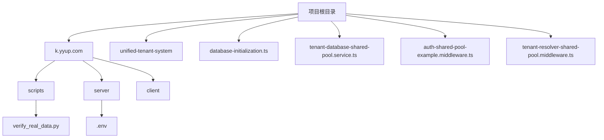
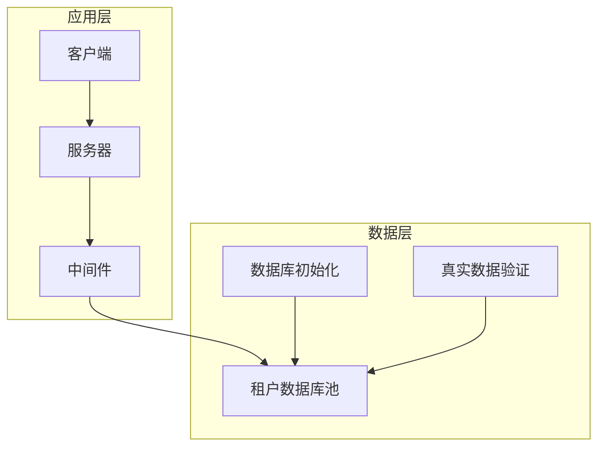
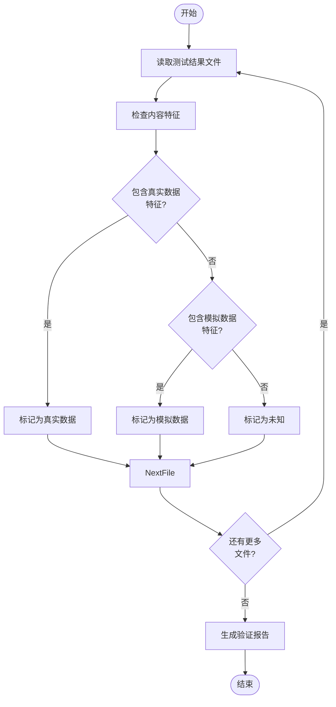
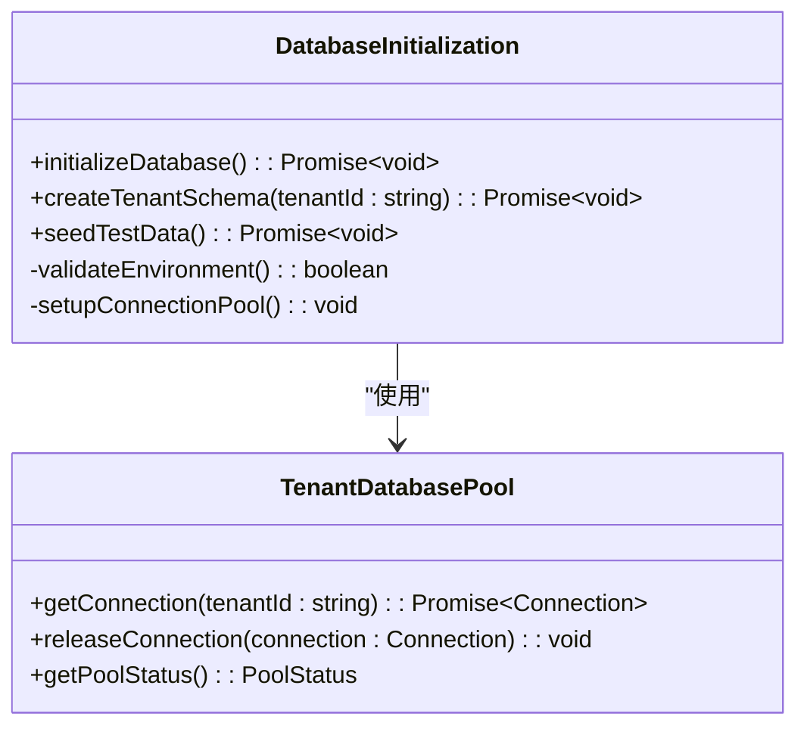
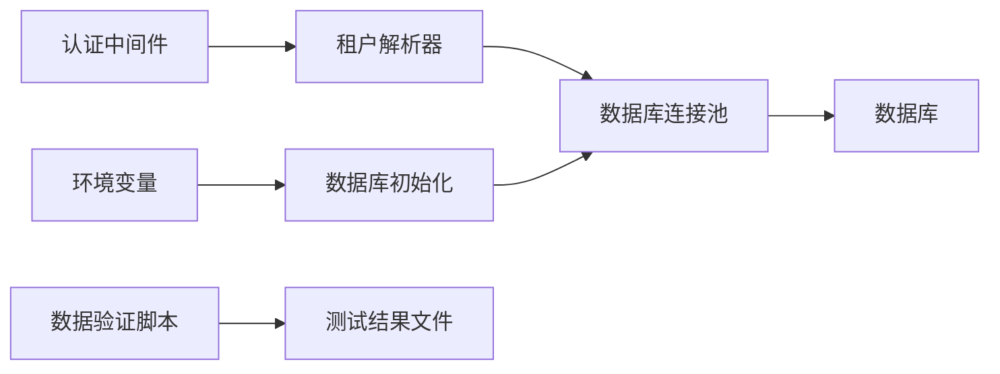

# 数据脱敏

<cite>
**本文档引用的文件**  
- [verify_real_data.py](file://k.yyup.com/verify_real_data.py)
- [database-initialization.ts](file://database-initialization.ts)
- [tenant-database-shared-pool.service.ts](file://tenant-database-shared-pool.service.ts)
- [auth-shared-pool-example.middleware.ts](file://auth-shared-pool-example.middleware.ts)
- [tenant-resolver-shared-pool.middleware.ts](file://tenant-resolver-shared-pool.middleware.ts)
</cite>

## 目录
1. [引言](#引言)
2. [项目结构](#项目结构)
3. [核心组件](#核心组件)
4. [架构概述](#架构概述)
5. [详细组件分析](#详细组件分析)
6. [依赖分析](#依赖分析)
7. [性能考虑](#性能考虑)
8. [故障排除指南](#故障排除指南)
9. [结论](#结论)

## 引言
本文档详细描述了k.yyupgame项目在非生产环境中保护真实用户数据的数据脱敏策略。重点介绍静态数据脱敏（SDM）和动态数据脱敏（DDM）的实现方法，包括使用假名化技术替换敏感信息、自动化脚本清洗敏感字段、脱敏规则配置以及脱敏数据验证等关键方面。

## 项目结构
k.yyupgame项目的目录结构显示了其多租户架构和数据隔离设计。核心数据处理逻辑位于`k.yyup.com`和`unified-tenant-system`两个主要子系统中。数据脱敏相关的配置和脚本分布在多个目录中，包括数据库初始化脚本、中间件和服务层组件。

**Diagram sources**
- [database-initialization.ts](file://database-initialization.ts)
- [tenant-database-shared-pool.service.ts](file://tenant-database-shared-pool.service.ts)

**Section sources**
- [database-initialization.ts](file://database-initialization.ts)
- [tenant-database-shared-pool.service.ts](file://tenant-database-shared-pool.service.ts)

## 核心组件
项目中的数据脱敏功能主要由以下几个核心组件实现：`verify_real_data.py`用于验证测试结果中是否包含真实数据；`database-initialization.ts`负责数据库初始化和数据准备；`tenant-database-shared-pool.service.ts`管理租户数据库连接池；以及相关的认证和租户解析中间件。

**Section sources**
- [verify_real_data.py](file://k.yyup.com/verify_real_data.py)
- [database-initialization.ts](file://database-initialization.ts)

## 架构概述
k.yyupgame采用多租户架构，通过共享数据库池和租户隔离机制来管理不同客户的数据。数据脱敏策略在应用层和数据库层同时实施，确保非生产环境中的数据安全。

**Diagram sources**
- [tenant-database-shared-pool.service.ts](file://tenant-database-shared-pool.service.ts)
- [auth-shared-pool-example.middleware.ts](file://auth-shared-pool-example.middleware.ts)

## 详细组件分析

### 数据验证组件分析
`verify_real_data.py`是关键的数据安全验证工具，负责分析测试结果文件，检测是否意外使用了真实用户数据。

**Diagram sources**
- [verify_real_data.py](file://k.yyup.com/verify_real_data.py)

**Section sources**
- [verify_real_data.py](file://k.yyup.com/verify_real_data.py)

### 数据库初始化组件分析
`database-initialization.ts`负责数据库的初始化和配置，为数据脱敏提供基础支持。

**Diagram sources**
- [database-initialization.ts](file://database-initialization.ts)
- [tenant-database-shared-pool.service.ts](file://tenant-database-shared-pool.service.ts)

**Section sources**
- [database-initialization.ts](file://database-initialization.ts)

## 依赖分析
项目中的数据脱敏功能依赖于多个组件和服务的协同工作。环境变量配置、数据库连接池、认证中间件和租户解析器共同构成了数据安全的基础架构。

**Diagram sources**
- [tenant-resolver-shared-pool.middleware.ts](file://tenant-resolver-shared-pool.middleware.ts)
- [auth-shared-pool-example.middleware.ts](file://auth-shared-pool-example.middleware.ts)

**Section sources**
- [tenant-resolver-shared-pool.middleware.ts](file://tenant-resolver-shared-pool.middleware.ts)
- [auth-shared-pool-example.middleware.ts](file://auth-shared-pool-example.middleware.ts)

## 性能考虑
数据脱敏过程需要在数据安全和系统性能之间取得平衡。批量数据处理、连接池管理和缓存策略是影响性能的关键因素。建议在非高峰时段执行大规模数据脱敏操作，并监控数据库性能指标。

## 故障排除指南
当遇到数据脱敏相关问题时，应首先检查环境变量配置，特别是`AI_USE_MOCK`设置。然后验证数据库连接池状态和租户解析逻辑。最后，使用`verify_real_data.py`脚本确认测试环境中没有泄露真实数据。

**Section sources**
- [verify_real_data.py](file://k.yyup.com/verify_real_data.py)
- [database-initialization.ts](file://database-initialization.ts)

## 结论
k.yyupgame项目通过多层次的数据脱敏策略有效保护了用户隐私。结合静态和动态脱敏方法，利用假名化技术和自动化验证脚本，确保了非生产环境中的数据安全。建议定期审查脱敏规则，并加强开发人员的数据安全培训。