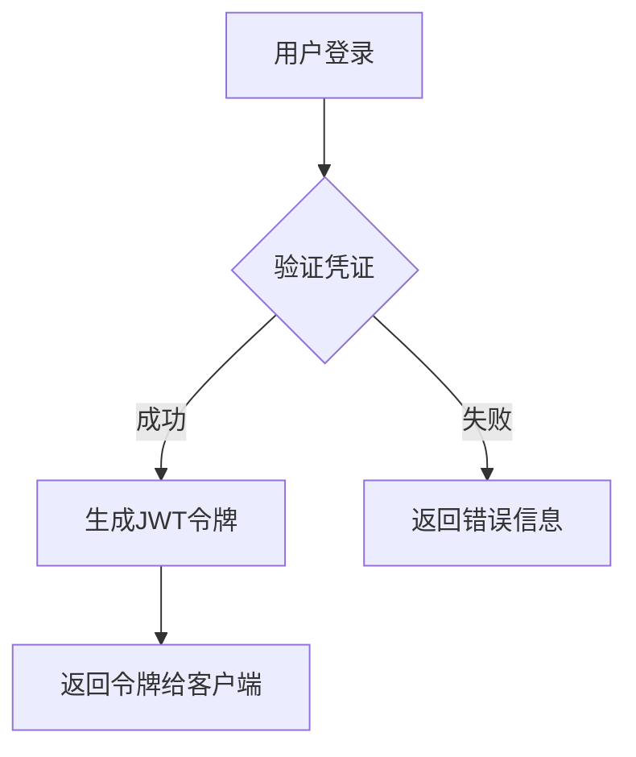
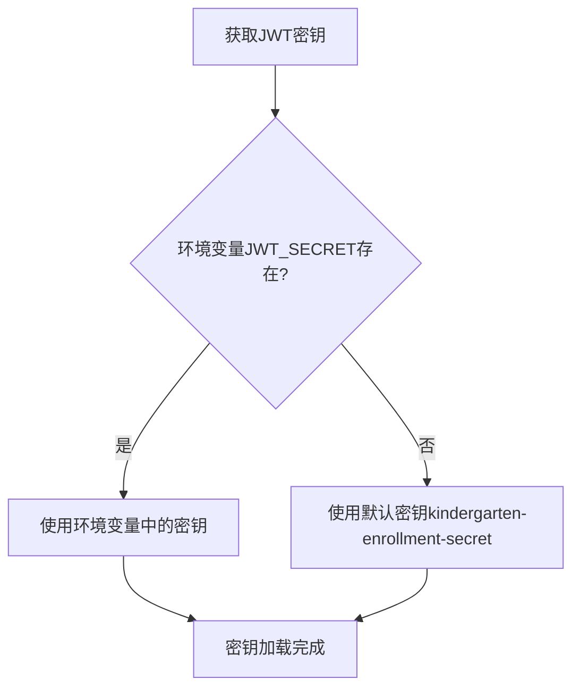
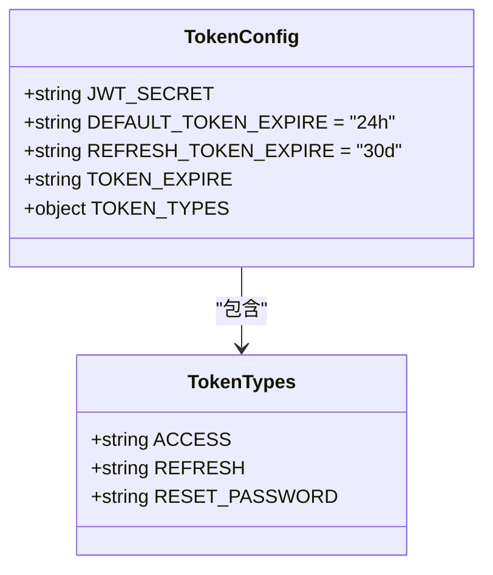
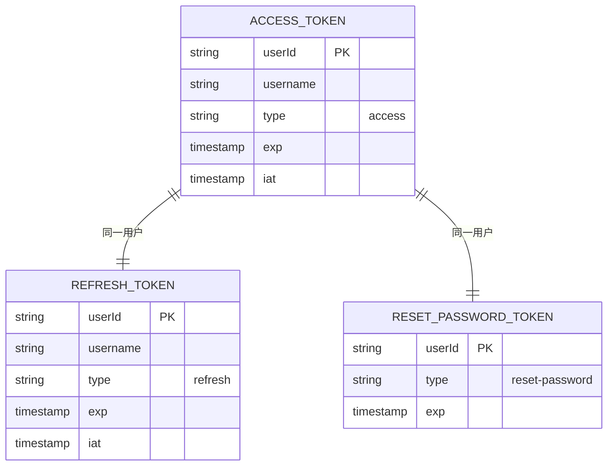
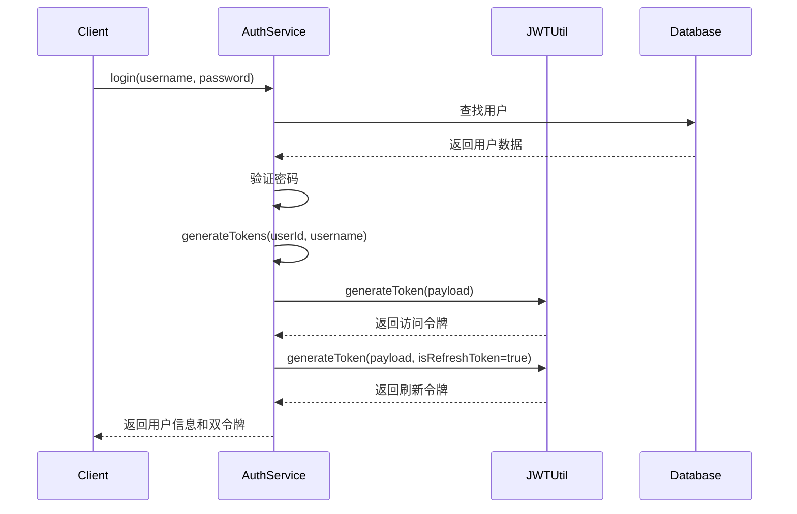
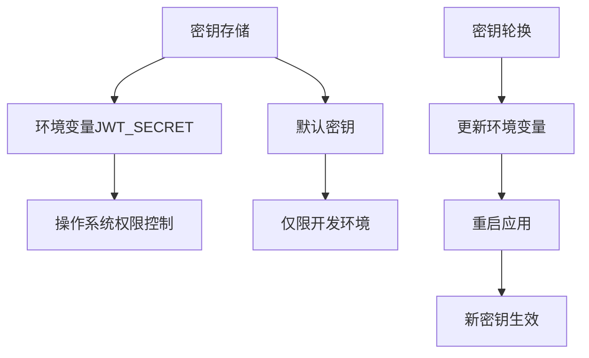
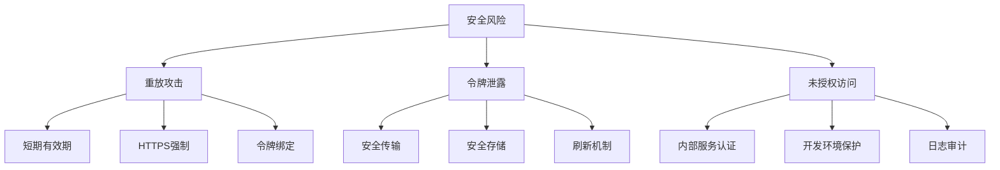

# JWT实现

<cite>
**本文档引用的文件**
- [jwt.ts](file://k.yyup.com/server/src/utils/jwt.ts)
- [jwt.config.ts](file://k.yyup.com/server/src/config/jwt.config.ts)
- [auth.service.ts](file://k.yyup.com/server/src/services/auth/auth.service.ts)
- [auth.middleware.ts](file://k.yyup.com/server/src/middlewares/auth.middleware.ts)
</cite>

## 目录
1. [简介](#简介)
2. [JWT令牌生成过程](#jwt令牌生成过程)
3. [签名算法与密钥管理](#签名算法与密钥管理)
4. [令牌有效期设置](#令牌有效期设置)
5. [令牌声明结构](#令牌声明结构)
6. [令牌签发逻辑实现](#令牌签发逻辑实现)
7. [密钥安全存储与轮换](#密钥安全存储与轮换)
8. [安全风险防范](#安全风险防范)
9. [最佳实践建议](#最佳实践建议)

## 简介

本项目在k.yyupgame中实现了基于JWT（JSON Web Token）的身份认证机制。系统采用无状态认证方式，通过JWT令牌在客户端和服务器之间安全地传递用户身份信息。认证流程遵循标准的JWT规范，结合项目特定需求进行了定制化实现，确保了系统的安全性、可扩展性和易用性。

**Section sources**
- [jwt.ts](file://k.yyup.com/server/src/utils/jwt.ts#L1-L66)
- [jwt.config.ts](file://k.yyup.com/server/src/config/jwt.config.ts#L1-L61)

## JWT令牌生成过程

JWT令牌的生成过程遵循标准的三段式结构（Header.Payload.Signature），在用户身份验证成功后由服务器生成并返回给客户端。

生成流程如下：
1. 用户提交用户名和密码进行登录
2. 服务器验证用户凭证的有效性
3. 验证通过后，系统调用`generateTokens`方法创建访问令牌和刷新令牌
4. 将生成的令牌包含在响应中返回给客户端

令牌生成过程中，系统会根据用户信息和配置参数构建令牌的payload部分，然后使用预设的密钥和算法对令牌进行签名，确保令牌的完整性和防篡改性。

**Diagram sources**
- [auth.service.ts](file://k.yyup.com/server/src/services/auth/auth.service.ts#L24-L65)
- [jwt.ts](file://k.yyup.com/server/src/utils/jwt.ts#L13-L16)

**Section sources**
- [auth.service.ts](file://k.yyup.com/server/src/services/auth/auth.service.ts#L24-L65)
- [jwt.ts](file://k.yyup.com/server/src/utils/jwt.ts#L13-L16)

## 签名算法与密钥管理

### 签名算法

本项目使用HS256（HMAC SHA-256）作为JWT令牌的签名算法。HS256是一种对称加密算法，使用相同的密钥进行签名和验证，具有良好的性能和安全性平衡。

### 密钥管理策略

系统采用分层的密钥管理策略：

1. **环境变量优先**：JWT密钥首先从环境变量`JWT_SECRET`中获取
2. **默认值回退**：如果环境变量未设置，则使用默认密钥`kindergarten-enrollment-secret`
3. **动态加载**：密钥在应用启动时加载，并在整个生命周期中保持不变

这种策略既保证了生产环境的安全性（通过环境变量配置密钥），又确保了开发和测试环境的便利性（使用默认值）。

**Diagram sources**
- [jwt.config.ts](file://k.yyup.com/server/src/config/jwt.config.ts#L7)
- [jwt.ts](file://k.yyup.com/server/src/utils/jwt.ts#L5)

**Section sources**
- [jwt.config.ts](file://k.yyup.com/server/src/config/jwt.config.ts#L7)
- [jwt.ts](file://k.yyup.com/server/src/utils/jwt.ts#L5)

## 令牌有效期设置

系统实现了双令牌机制，包含访问令牌（Access Token）和刷新令牌（Refresh Token），以平衡安全性和用户体验。

### 访问令牌（Access Token）

- **默认有效期**：24小时
- **动态配置**：支持从数据库或全局变量获取动态会话超时时间
- **获取优先级**：
  1. 数据库系统设置中的会话超时配置
  2. 全局变量中的会话超时设置
  3. 默认的24小时配置

### 清单令牌（Refresh Token）

- **有效期**：30天
- **用途**：在访问令牌过期后，用于获取新的访问令牌，避免用户频繁重新登录

这种双令牌机制既保证了系统的安全性（较短的访问令牌有效期），又提升了用户体验（较长的刷新令牌有效期）。

**Diagram sources**
- [jwt.config.ts](file://k.yyup.com/server/src/config/jwt.config.ts#L10-L11)
- [jwt.config.ts](file://k.yyup.com/server/src/config/jwt.config.ts#L49-L54)

**Section sources**
- [jwt.config.ts](file://k.yyup.com/server/src/config/jwt.config.ts#L10-L11)
- [jwt.config.ts](file://k.yyup.com/server/src/config/jwt.config.ts#L49-L54)

## 令牌声明结构

JWT令牌的payload部分包含了用户身份和权限相关的关键信息，采用标准化的声明结构。

### 访问令牌声明

- `userId`：用户唯一标识
- `username`：用户名
- `type`：令牌类型（"access"）
- 其他标准JWT声明（如签发时间、过期时间等）

### 刷新令牌声明

- `userId`：用户唯一标识
- `username`：用户名
- `type`：令牌类型（"refresh"）
- 过期时间（30天）

### 重置密码令牌声明

- `userId`：用户唯一标识
- `type`：令牌类型（"reset-password"）
- 过期时间（1小时）

系统通过`TOKEN_TYPES`常量定义了所有支持的令牌类型，确保类型值的一致性和可维护性。

**Diagram sources**
- [jwt.config.ts](file://k.yyup.com/server/src/config/jwt.config.ts#L49-L54)
- [auth.service.ts](file://k.yyup.com/server/src/services/auth/auth.service.ts#L454-L463)

**Section sources**
- [jwt.config.ts](file://k.yyup.com/server/src/config/jwt.config.ts#L49-L54)
- [auth.service.ts](file://k.yyup.com/server/src/services/auth/auth.service.ts#L454-L463)

## 令牌签发逻辑实现

令牌签发逻辑主要在`auth.service.ts`文件中的`AuthService`类中实现，通过`login`和`generateTokens`方法完成。

### 核心实现流程

1. **用户验证**：通过用户名或邮箱查找用户，验证密码正确性
2. **令牌生成**：调用`generateTokens`方法创建双令牌
3. **响应构建**：将用户基本信息和令牌组合成标准响应格式

### 代码实现要点

- 使用`jsonwebtoken`库进行JWT操作
- 支持MD5和bcrypt密码验证的兼容性处理
- 异常处理机制确保错误信息的清晰传达
- 日志记录便于问题排查和审计

**Diagram sources**
- [auth.service.ts](file://k.yyup.com/server/src/services/auth/auth.service.ts#L24-L65)
- [jwt.ts](file://k.yyup.com/server/src/utils/jwt.ts#L13-L16)

**Section sources**
- [auth.service.ts](file://k.yyup.com/server/src/services/auth/auth.service.ts#L24-L65)
- [jwt.ts](file://k.yyup.com/server/src/utils/jwt.ts#L13-L16)

## 密钥安全存储与轮换

### 安全存储机制

系统采用多层安全措施保护JWT密钥：

1. **环境变量存储**：生产环境中密钥通过环境变量注入，避免硬编码
2. **默认值保护**：开发环境的默认密钥仅用于测试，不应用于生产
3. **访问控制**：环境变量的访问受到操作系统级别的权限控制

### 轮换机制

目前系统尚未实现自动密钥轮换机制，但提供了手动轮换的支持：

1. 更新环境变量中的`JWT_SECRET`值
2. 重启应用使新密钥生效
3. 系统将自动使用新密钥签发令牌
4. 已签发的旧令牌在过期前仍可验证

建议在安全事件发生或定期安全审计后执行密钥轮换操作。

**Diagram sources**
- [jwt.config.ts](file://k.yyup.com/server/src/config/jwt.config.ts#L7)
- [auth.middleware.ts](file://k.yyup.com/server/src/middlewares/auth.middleware.ts#L6)

**Section sources**
- [jwt.config.ts](file://k.yyup.com/server/src/config/jwt.config.ts#L7)
- [auth.middleware.ts](file://k.yyup.com/server/src/middlewares/auth.middleware.ts#L6)

## 安全风险防范

### 重放攻击防范

系统通过以下机制防范重放攻击：

1. **短期有效期**：访问令牌有效期较短（24小时），限制了令牌被滥用的时间窗口
2. **HTTPS强制**：所有认证相关接口必须通过HTTPS访问，防止中间人攻击
3. **令牌绑定**：令牌与用户身份强绑定，无法在不同用户间共享

### 令牌泄露防范

1. **安全传输**：通过Authorization头以Bearer模式传输，避免URL参数泄露
2. **存储建议**：指导客户端安全存储令牌（如HttpOnly Cookie或安全的本地存储）
3. **刷新机制**：使用刷新令牌机制，减少访问令牌的暴露频率

### 其他安全措施

- **内部服务认证**：通过`x-internal-service`头标识内部服务调用，实现服务间安全通信
- **开发环境保护**：开发环境的认证绕过功能在生产环境中被禁用
- **日志审计**：关键认证操作记录详细日志，便于安全审计

**Diagram sources**
- [auth.middleware.ts](file://k.yyup.com/server/src/middlewares/auth.middleware.ts#L142-L378)
- [jwt.ts](file://k.yyup.com/server/src/utils/jwt.ts#L42-L44)

**Section sources**
- [auth.middleware.ts](file://k.yyup.com/server/src/middlewares/auth.middleware.ts#L142-L378)
- [jwt.ts](file://k.yyup.com/server/src/utils/jwt.ts#L42-L44)

## 最佳实践建议

### 开发者集成建议

1. **环境配置**：生产环境务必通过环境变量配置`JWT_SECRET`，避免使用默认密钥
2. **错误处理**：妥善处理认证相关的错误码（401未授权、403禁止访问等）
3. **令牌刷新**：实现自动令牌刷新机制，在访问令牌过期前使用刷新令牌获取新令牌
4. **安全存储**：客户端应使用安全的方式存储令牌，避免XSS攻击导致的令牌泄露

### 安全最佳实践

1. **定期轮换**：建议每3-6个月轮换一次JWT密钥
2. **监控审计**：监控异常的登录行为和令牌使用模式
3. **最小权限**：遵循最小权限原则，确保令牌只包含必要的声明
4. **版本控制**：在payload中包含版本信息，便于未来格式升级

### 性能优化建议

1. **缓存策略**：对于频繁验证的令牌，可考虑在内存中缓存验证结果
2. **异步处理**：非关键的认证操作可采用异步方式处理
3. **连接池**：数据库操作使用连接池，提高并发性能

通过遵循这些最佳实践，开发者可以确保JWT实现的安全性、可靠性和高性能。

**Section sources**
- [auth.service.ts](file://k.yyup.com/server/src/services/auth/auth.service.ts)
- [jwt.config.ts](file://k.yyup.com/server/src/config/jwt.config.ts)
- [auth.middleware.ts](file://k.yyup.com/server/src/middlewares/auth.middleware.ts)