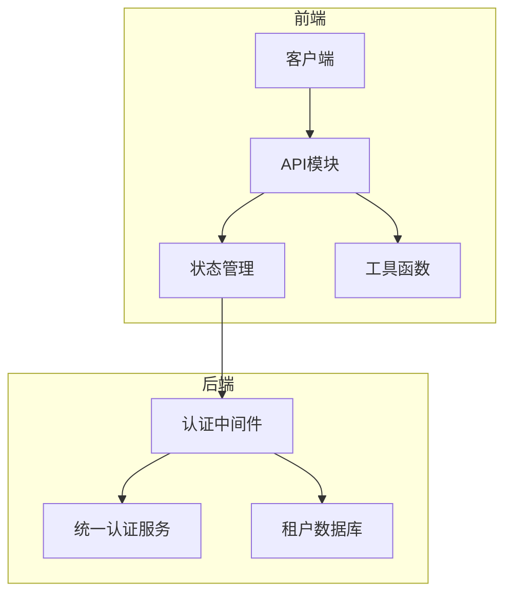
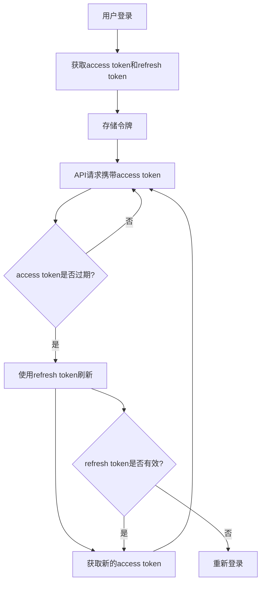
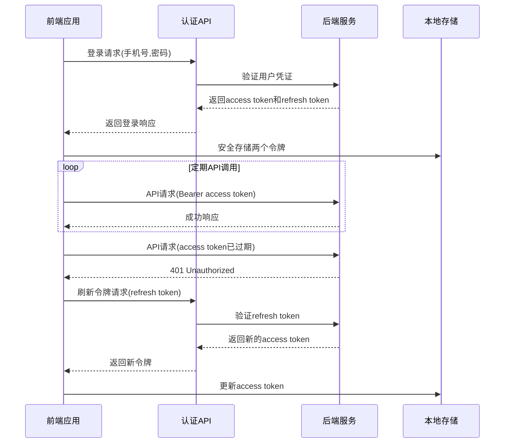
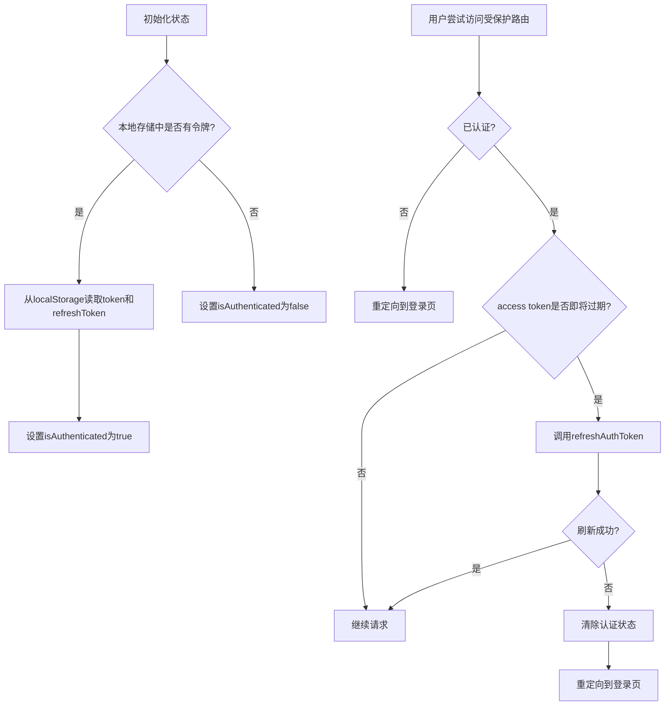
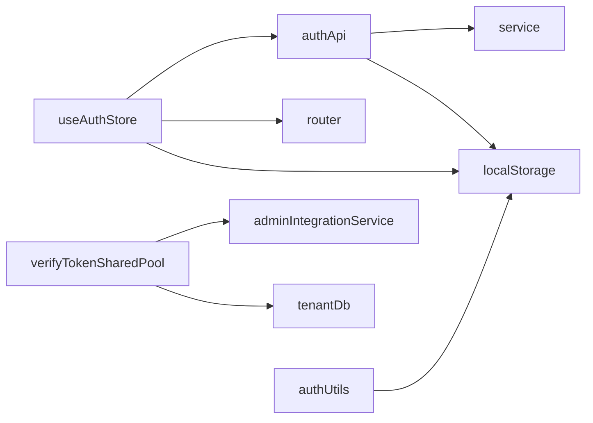

# 令牌刷新

<cite>
**本文档引用的文件**  
- [auth.ts](file://k.yyup.com/client/src/api/auth.ts)
- [auth.ts](file://k.yyup.com/client/src/store/modules/auth.ts)
- [auth.ts](file://k.yyup.com/client/src/api/modules/auth.ts)
- [auth.ts](file://k.yyup.com/client/src/utils/auth.ts)
- [auth-shared-pool-example.middleware.ts](file://auth-shared-pool-example.middleware.ts)
</cite>

## 目录
1. [简介](#简介)
2. [项目结构](#项目结构)
3. [核心组件](#核心组件)
4. [架构概述](#架构概述)
5. [详细组件分析](#详细组件分析)
6. [依赖分析](#依赖分析)
7. [性能考虑](#性能考虑)
8. [故障排除指南](#故障排除指南)
9. [结论](#结论)

## 简介
本文档详细描述了k.yyupgame项目中的令牌刷新机制，重点介绍access token和refresh token的实现方式。文档涵盖了令牌的生成、存储、使用、刷新流程、安全策略以及API端点设计，为开发者提供完整的令牌管理解决方案。

## 项目结构
项目采用前后端分离架构，认证逻辑分布在客户端和服务端。前端位于`k.yyup.com/client`目录，后端认证中间件位于根目录。令牌管理主要涉及API调用、状态存储和拦截器处理。



**图示来源**
- [auth.ts](file://k.yyup.com/client/src/api/auth.ts)
- [auth-shared-pool-example.middleware.ts](file://auth-shared-pool-example.middleware.ts)

**本节来源**
- [auth.ts](file://k.yyup.com/client/src/api/auth.ts)
- [auth-shared-pool-example.middleware.ts](file://auth-shared-pool-example.middleware.ts)

## 核心组件
系统的核心认证组件包括前端的API服务、状态管理模块和后端的认证中间件。这些组件协同工作，实现了安全的令牌刷新机制。

**本节来源**
- [auth.ts](file://k.yyup.com/client/src/api/auth.ts)
- [auth.ts](file://k.yyup.com/client/src/store/modules/auth.ts)

## 架构概述
系统采用JWT（JSON Web Token）进行身份验证，包含access token和refresh token双令牌机制。access token用于常规API请求认证，有效期较短；refresh token用于获取新的access token，有效期较长且存储更安全。



**图示来源**
- [auth.ts](file://k.yyup.com/client/src/api/auth.ts)
- [auth-shared-pool-example.middleware.ts](file://auth-shared-pool-example.middleware.ts)

## 详细组件分析

### 令牌刷新机制分析
系统实现了完整的令牌刷新流程，确保用户在access token过期后无需重新登录即可继续使用服务。

#### 前端API服务
```mermaid
classDiagram
class authApi {
+login(data : LoginRequest) : Promise~LoginResponse~
+refreshToken(refreshToken : string) : Promise~{token : string, refreshToken? : string}~
+verifyToken() : Promise~boolean~
+getCurrentUser() : Promise~User~
}
class LoginRequest {
+phone : string
+password : string
+tenantCode? : string
}
class LoginResponse {
+success : boolean
+token : string
+refreshToken? : string
+user : User
+message? : string
}
class User {
+id : string | number
+username : string
+email? : string
+realName? : string
+phone? : string
+role? : string
}
authApi --> LoginRequest : "使用"
authApi --> LoginResponse : "返回"
authApi --> User : "包含"
```

**图示来源**
- [auth.ts](file://k.yyup.com/client/src/api/auth.ts)

#### 令牌刷新流程


**图示来源**
- [auth.ts](file://k.yyup.com/client/src/api/auth.ts)
- [auth-shared-pool-example.middleware.ts](file://auth-shared-pool-example.middleware.ts)

#### 状态管理逻辑


**图示来源**
- [auth.ts](file://k.yyup.com/client/src/store/modules/auth.ts)

**本节来源**
- [auth.ts](file://k.yyup.com/client/src/api/auth.ts)
- [auth.ts](file://k.yyup.com/client/src/store/modules/auth.ts)
- [auth.ts](file://k.yyup.com/client/src/utils/auth.ts)

## 依赖分析
系统依赖于多个组件协同工作，包括前端状态管理、API服务、本地存储和后端认证服务。



**图示来源**
- [auth.ts](file://k.yyup.com/client/src/api/auth.ts)
- [auth.ts](file://k.yyup.com/client/src/store/modules/auth.ts)
- [auth-shared-pool-example.middleware.ts](file://auth-shared-pool-example.middleware.ts)

**本节来源**
- [auth.ts](file://k.yyup.com/client/src/api/auth.ts)
- [auth-shared-pool-example.middleware.ts](file://auth-shared-pool-example.middleware.ts)

## 性能考虑
令牌刷新机制对系统性能有重要影响，需要考虑以下方面：
- 令牌验证的频率和缓存策略
- 刷新请求的并发处理
- 本地存储的读写性能
- 网络延迟对用户体验的影响

## 故障排除指南
常见问题及解决方案：

1. **令牌刷新失败**
   - 检查refresh token是否已过期
   - 确认网络连接正常
   - 验证后端服务是否可用

2. **无法获取用户信息**
   - 检查access token是否有效
   - 确认用户权限配置

3. **存储问题**
   - 检查浏览器存储限制
   - 验证localStorage访问权限

**本节来源**
- [auth.ts](file://k.yyup.com/client/src/api/auth.ts)
- [auth.ts](file://k.yyup.com/client/src/store/modules/auth.ts)

## 结论
k.yyupgame项目的令牌刷新机制设计合理，通过access token和refresh token的配合使用，既保证了安全性又提升了用户体验。前端通过Pinia状态管理集中处理认证状态，后端采用统一认证服务确保跨租户的安全访问。建议定期审查令牌有效期设置和安全策略，确保系统持续安全稳定运行。