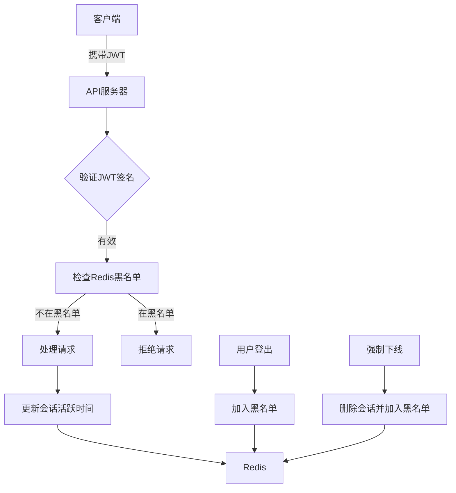
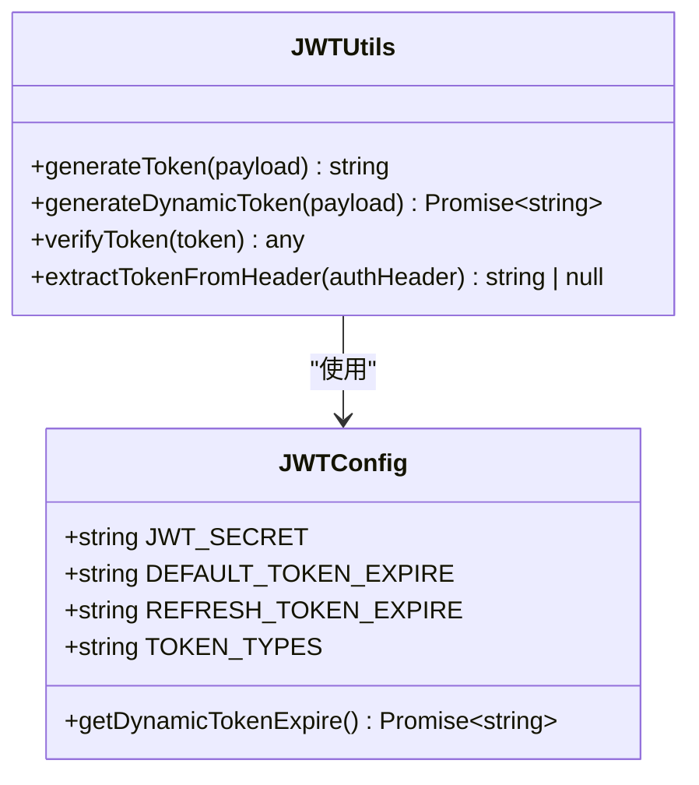
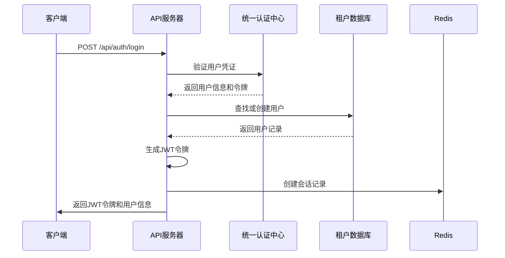
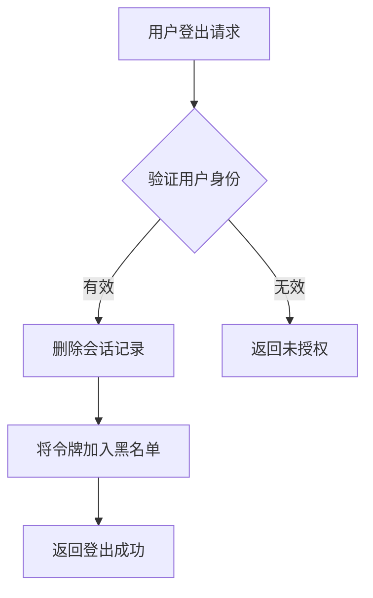
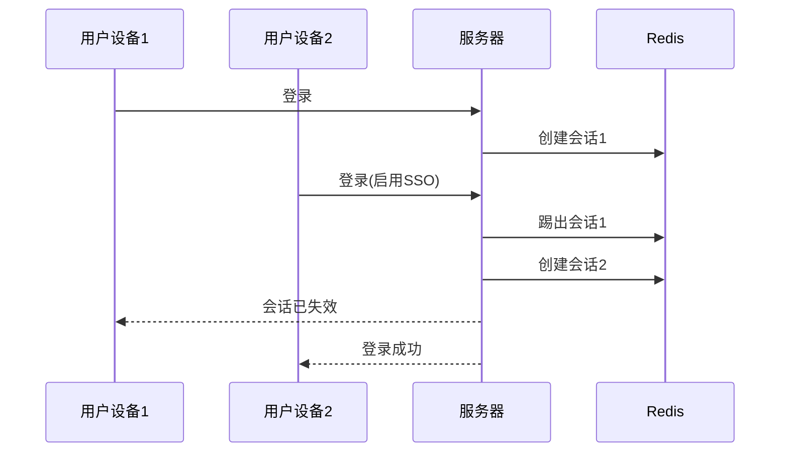
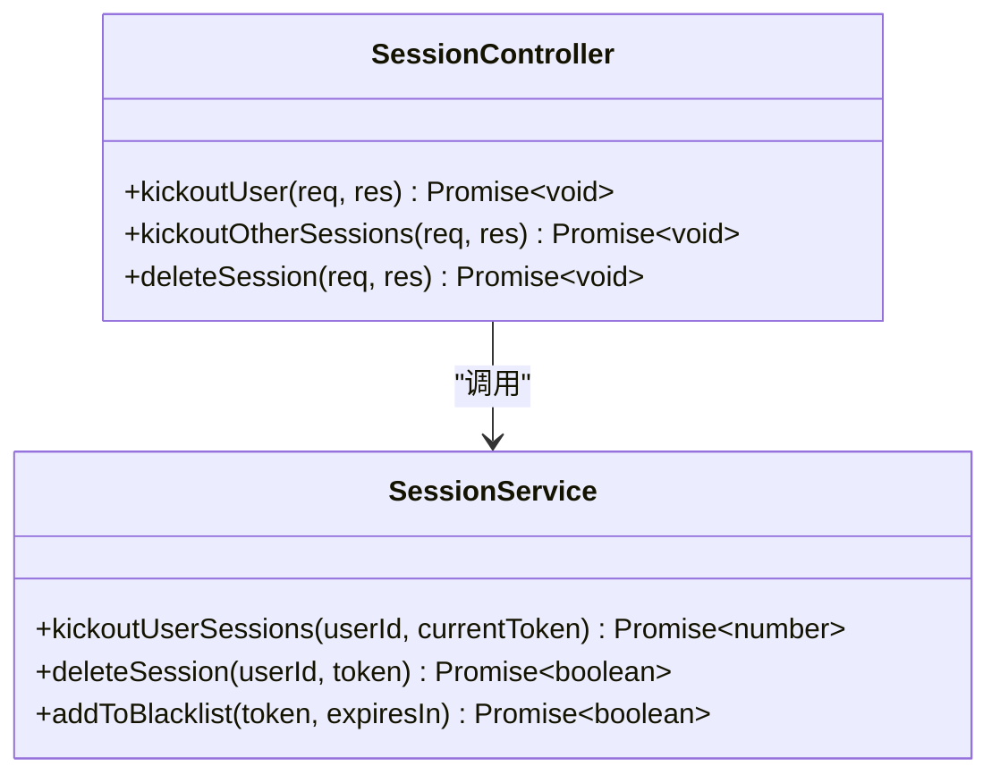
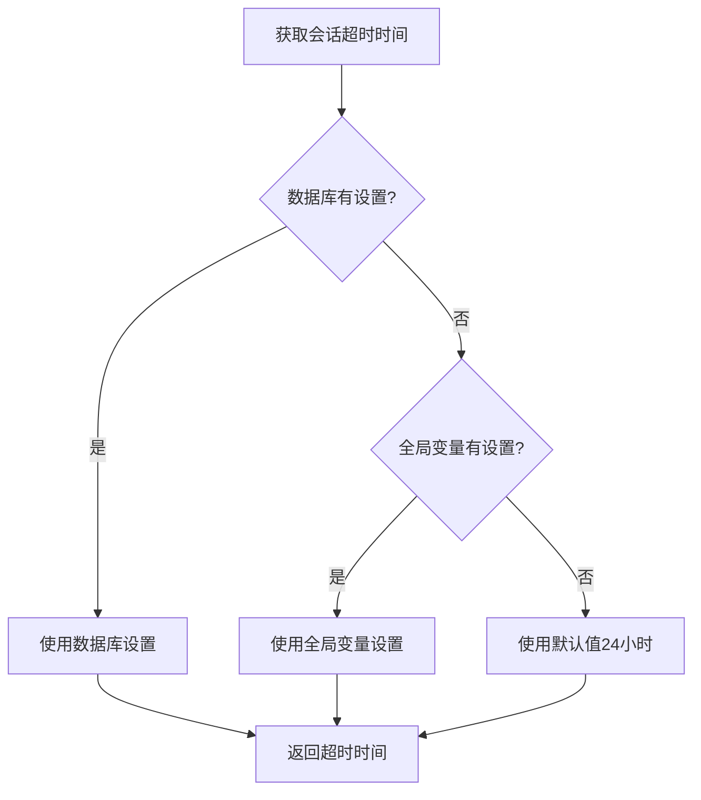
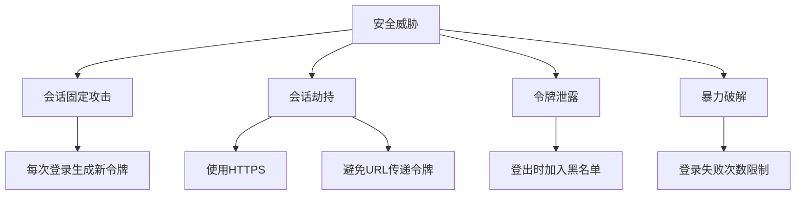

# 会话管理

<cite>
**本文档引用的文件**
- [auth-shared-pool-example.middleware.ts](file://auth-shared-pool-example.middleware.ts)
- [jwt.config.ts](file://k.yyup.com/server/src/config/jwt.config.ts)
- [jwt.ts](file://k.yyup.com/server/src/utils/jwt.ts)
- [session.service.ts](file://k.yyup.com/server/src/services/session.service.ts)
- [session.controller.ts](file://k.yyup.com/server/src/controllers/session.controller.ts)
- [auth.middleware.ts](file://k.yyup.com/server/src/middlewares/auth.middleware.ts)
</cite>

## 目录
1. [简介](#简介)
2. [会话管理架构](#会话管理架构)
3. [基于JWT的无状态会话实现](#基于jwt的无状态会话实现)
4. [用户登录与会话创建](#用户登录与会话创建)
5. [用户登出与会话终止](#用户登出与会话终止)
6. [多设备登录与强制下线](#多设备登录与强制下线)
7. [会话超时与自动登出](#会话超时与自动登出)
8. [会话安全考虑](#会话安全考虑)
9. [开发者集成指南](#开发者集成指南)

## 简介

本项目k.yyupgame采用基于JWT（JSON Web Token）的无状态会话管理机制，结合Redis实现会话状态的集中管理。系统通过统一认证中心进行用户身份验证，并为每个用户生成JWT令牌。会话管理服务负责处理令牌的黑名单、在线用户管理、单点登录等功能，确保系统的安全性和可扩展性。

**Section sources**
- [auth.middleware.ts](file://k.yyup.com/server/src/middlewares/auth.middleware.ts#L1-L800)

## 会话管理架构

本项目的会话管理采用混合架构，结合了无状态JWT和有状态Redis存储的优势。JWT用于在客户端和服务器之间安全地传输用户身份信息，而Redis用于存储会话状态、令牌黑名单和在线用户信息。



**Diagram sources**
- [session.service.ts](file://k.yyup.com/server/src/services/session.service.ts#L1-L361)
- [auth.middleware.ts](file://k.yyup.com/server/src/middlewares/auth.middleware.ts#L142-L377)

**Section sources**
- [session.service.ts](file://k.yyup.com/server/src/services/session.service.ts#L1-L361)
- [auth.middleware.ts](file://k.yyup.com/server/src/middlewares/auth.middleware.ts#L142-L377)

## 基于JWT的无状态会话实现

系统采用JWT作为主要的会话管理机制，实现了无状态的认证流程。JWT令牌包含用户身份信息，并使用密钥进行签名，确保令牌的完整性和安全性。

### JWT配置

JWT配置集中管理在`jwt.config.ts`文件中，包含密钥、过期时间等关键参数。

```typescript
export const JWT_SECRET = process.env.JWT_SECRET || 'kindergarten-enrollment-secret';
export const DEFAULT_TOKEN_EXPIRE = '24h';
export const REFRESH_TOKEN_EXPIRE = '30d';
```

系统支持动态会话超时设置，可以从数据库或全局变量中获取会话超时时间，提供灵活的会话管理策略。



**Diagram sources**
- [jwt.config.ts](file://k.yyup.com/server/src/config/jwt.config.ts#L1-L61)
- [jwt.ts](file://k.yyup.com/server/src/utils/jwt.ts#L1-L66)

**Section sources**
- [jwt.config.ts](file://k.yyup.com/server/src/config/jwt.config.ts#L1-L61)
- [jwt.ts](file://k.yyup.com/server/src/utils/jwt.ts#L1-L66)

## 用户登录与会话创建

用户登录流程涉及与统一认证中心的交互，成功验证后创建本地会话并返回JWT令牌。

### 登录流程

1. 用户提交登录凭证（手机号和密码）
2. 系统调用统一认证中心API验证用户身份
3. 验证成功后，在租户数据库中查找或创建用户记录
4. 生成JWT令牌并创建会话记录
5. 返回令牌和用户信息给客户端



**Diagram sources**
- [auth.middleware.ts](file://k.yyup.com/server/src/middlewares/auth.middleware.ts#L142-L377)
- [session.service.ts](file://k.yyup.com/server/src/services/session.service.ts#L98-L142)

**Section sources**
- [auth.middleware.ts](file://k.yyup.com/server/src/middlewares/auth.middleware.ts#L142-L377)
- [session.service.ts](file://k.yyup.com/server/src/services/session.service.ts#L98-L142)

## 用户登出与会话终止

用户登出时，系统将JWT令牌加入黑名单，确保令牌无法再被使用，实现会话的立即终止。

### 登出机制

登出操作通过`deleteSession`方法实现，该方法删除会话记录并将令牌加入黑名单。



**Diagram sources**
- [session.service.ts](file://k.yyup.com/server/src/services/session.service.ts#L222-L247)
- [session.controller.ts](file://k.yyup.com/server/src/controllers/session.controller.ts#L135-L168)

**Section sources**
- [session.service.ts](file://k.yyup.com/server/src/services/session.service.ts#L222-L247)
- [session.controller.ts](file://k.yyup.com/server/src/controllers/session.controller.ts#L135-L168)

## 多设备登录与强制下线

系统支持多设备登录，并提供强制用户下线的功能，管理员可以踢出指定用户的会话。

### 单点登录支持

通过`createSession`方法的`enableSSO`参数控制是否启用单点登录。启用时，新登录会踢出该用户的所有其他会话。



### 强制下线功能

管理员可以通过API强制用户下线，系统会删除用户的所有会话记录并将令牌加入黑名单。



**Diagram sources**
- [session.service.ts](file://k.yyup.com/server/src/services/session.service.ts#L256-L293)
- [session.controller.ts](file://k.yyup.com/server/src/controllers/session.controller.ts#L83-L130)

**Section sources**
- [session.service.ts](file://k.yyup.com/server/src/services/session.service.ts#L256-L293)
- [session.controller.ts](file://k.yyup.com/server/src/controllers/session.controller.ts#L83-L130)

## 会话超时与自动登出

系统实现会话超时机制，通过JWT的过期时间和Redis的TTL双重保障会话的安全性。

### 会话超时配置

会话超时时间可动态配置，优先从数据库获取，其次从全局变量获取，最后使用默认值。



### 自动登出实现

系统通过JWT的过期时间自动实现会话过期。当JWT过期后，用户需要重新登录或使用刷新令牌获取新的访问令牌。

**Diagram sources**
- [jwt.config.ts](file://k.yyup.com/server/src/config/jwt.config.ts#L17-L44)
- [jwt.ts](file://k.yyup.com/server/src/utils/jwt.ts#L23-L35)

**Section sources**
- [jwt.config.ts](file://k.yyup.com/server/src/config/jwt.config.ts#L17-L44)
- [jwt.ts](file://k.yyup.com/server/src/utils/jwt.ts#L23-L35)

## 会话安全考虑

系统采取多种措施确保会话安全，防止常见的会话攻击。

### 安全措施

1. **防止会话固定攻击**：每次登录都生成新的JWT令牌，旧令牌立即失效
2. **防止会话劫持**：使用HTTPS传输令牌，避免在URL中传递令牌
3. **令牌泄露防护**：提供登出功能，可立即使令牌失效
4. **暴力破解防护**：统一认证中心实现登录失败次数限制



**Diagram sources**
- [auth.middleware.ts](file://k.yyup.com/server/src/middlewares/auth.middleware.ts#L142-L377)
- [session.service.ts](file://k.yyup.com/server/src/services/session.service.ts#L56-L65)

**Section sources**
- [auth.middleware.ts](file://k.yyup.com/server/src/middlewares/auth.middleware.ts#L142-L377)
- [session.service.ts](file://k.yyup.com/server/src/services/session.service.ts#L56-L65)

## 开发者集成指南

为开发者提供会话管理的集成指南，包括API使用和最佳实践。

### API端点

| 端点 | 方法 | 描述 | 权限 |
|------|------|------|------|
| /api/sessions | GET | 获取当前用户的所有会话 | 用户 |
| /api/sessions/online | GET | 获取在线用户列表 | 管理员 |
| /api/sessions/stats | GET | 获取会话统计信息 | 管理员 |
| /api/sessions/kickout/:userId | POST | 踢出指定用户 | 管理员 |
| /api/sessions/kickout-other | POST | 踢出其他会话 | 用户 |
| /api/sessions/:token | DELETE | 删除指定会话 | 用户 |

### 最佳实践

1. **客户端存储**：将JWT存储在HttpOnly Cookie中，防止XSS攻击
2. **令牌刷新**：实现刷新令牌机制，避免频繁登录
3. **错误处理**：妥善处理401和403错误，引导用户重新登录
4. **安全传输**：始终使用HTTPS传输包含令牌的请求

**Section sources**
- [session.controller.ts](file://k.yyup.com/server/src/controllers/session.controller.ts#L15-L205)
- [session.service.ts](file://k.yyup.com/server/src/services/session.service.ts#L1-L361)