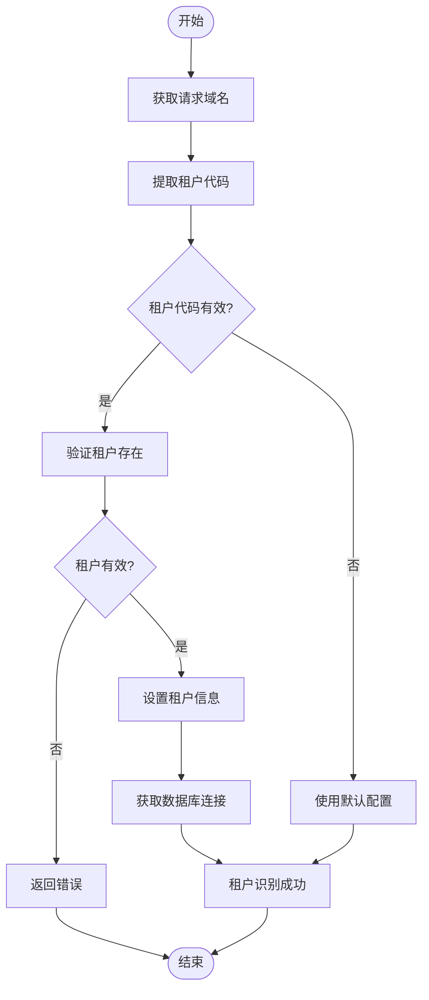
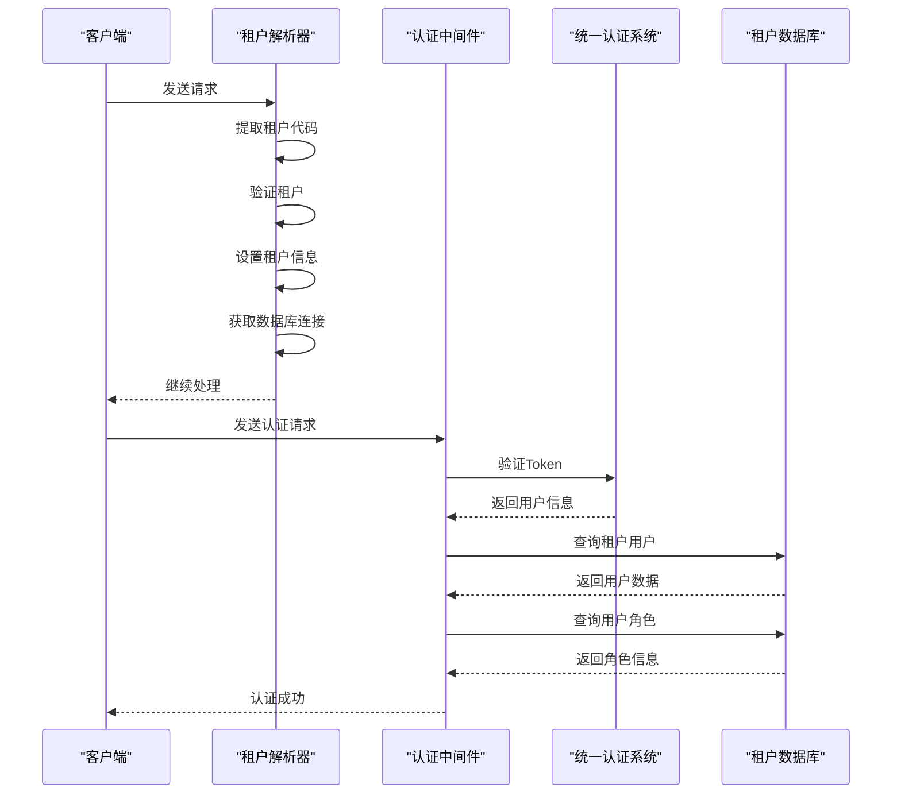
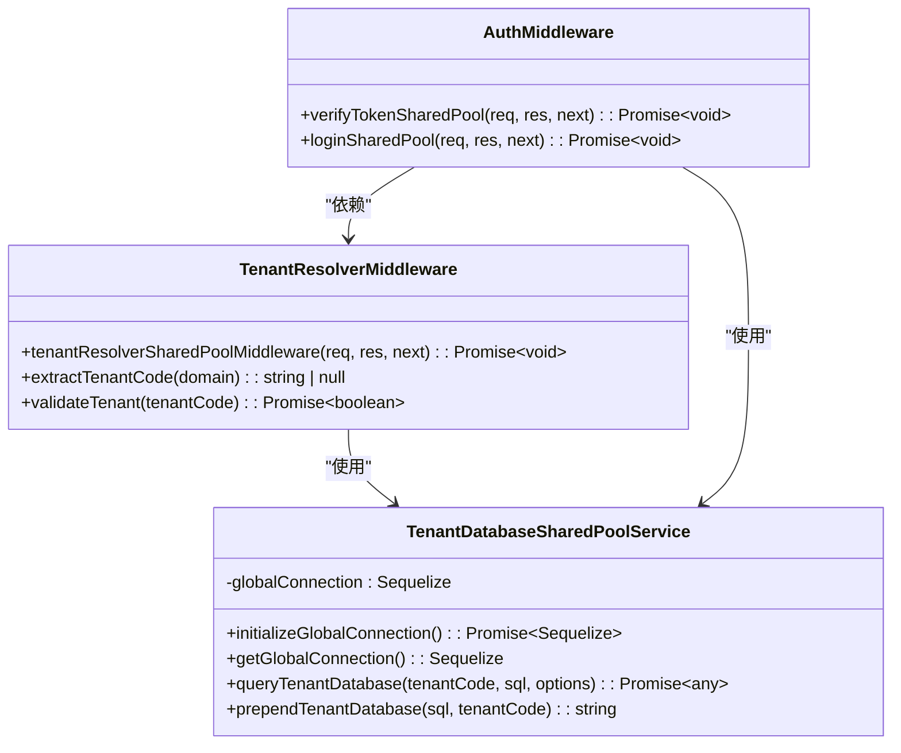
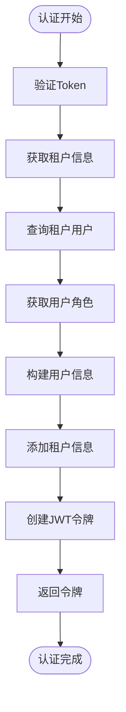
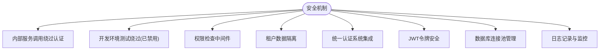

# 多租户认证

<cite>
**本文档引用的文件**  
- [tenant-resolver-shared-pool.middleware.ts](file://tenant-resolver-shared-pool.middleware.ts)
- [auth-shared-pool-example.middleware.ts](file://auth-shared-pool-example.middleware.ts)
- [tenant-database-shared-pool.service.ts](file://tenant-database-shared-pool.service.ts)
- [k.yyup.com/server/src/middlewares/auth.middleware.ts](file://k.yyup.com/server/src/middlewares/auth.middleware.ts)
- [k.yyup.com/server/src/services/admin-integration.service.ts](file://k.yyup.com/server/src/services/admin-integration.service.ts)
</cite>

## 目录
1. [引言](#引言)
2. [租户识别流程](#租户识别流程)
3. [认证流程与租户解析器的协同工作](#认证流程与租户解析器的协同工作)
4. [用户数据隔离机制](#用户数据隔离机制)
5. [租户特定的认证策略](#租户特定的认证策略)
6. [JWT令牌中的租户信息编码](#jwt令牌中的租户信息编码)
7. [安全考虑与最佳实践](#安全考虑与最佳实践)

## 引言
本项目实现了基于共享连接池的多租户认证系统，通过子域名识别租户，并与统一认证系统集成，确保在多租户环境下实现安全、隔离的用户认证。系统采用数据库共享连接池模式，通过完整的数据库.表名格式访问不同租户的数据，实现了高效且安全的多租户支持。

**Section sources**
- [tenant-resolver-shared-pool.middleware.ts](file://tenant-resolver-shared-pool.middleware.ts#L1-L142)
- [auth-shared-pool-example.middleware.ts](file://auth-shared-pool-example.middleware.ts#L1-L255)

## 租户识别流程
系统通过HTTP请求的Host头或hostname来识别租户。租户代码从域名中提取，支持k001.yyup.cc和[标识符].kindergarten.com等多种格式。提取的租户代码经过验证后，用于构建租户数据库名称（如tenant_k001），并设置到请求对象中供后续处理使用。

**Diagram sources**
- [tenant-resolver-shared-pool.middleware.ts](file://tenant-resolver-shared-pool.middleware.ts#L33-L77)

**Section sources**
- [tenant-resolver-shared-pool.middleware.ts](file://tenant-resolver-shared-pool.middleware.ts#L33-L77)

## 认证流程与租户解析器的协同工作
认证流程与租户解析器紧密协作，确保用户凭证在正确的租户上下文中进行验证。首先，租户解析器中间件识别租户并建立数据库连接，然后认证中间件使用该连接在特定租户数据库中验证用户身份。这种设计确保了认证过程的上下文正确性。

**Diagram sources**
- [tenant-resolver-shared-pool.middleware.ts](file://tenant-resolver-shared-pool.middleware.ts#L26-L92)
- [auth-shared-pool-example.middleware.ts](file://auth-shared-pool-example.middleware.ts#L19-L135)

**Section sources**
- [tenant-resolver-shared-pool.middleware.ts](file://tenant-resolver-shared-pool.middleware.ts#L26-L92)
- [auth-shared-pool-example.middleware.ts](file://auth-shared-pool-example.middleware.ts#L19-L135)

## 用户数据隔离机制
系统通过数据库级别的隔离机制防止跨租户访问。每个租户拥有独立的数据库（如tenant_k001），所有数据查询都使用完整的数据库.表名格式（如tenant_k001.users）。共享连接池服务自动为SQL语句添加正确的数据库前缀，确保数据访问的隔离性。

**Diagram sources**
- [tenant-database-shared-pool.service.ts](file://tenant-database-shared-pool.service.ts#L9-L173)
- [tenant-resolver-shared-pool.middleware.ts](file://tenant-resolver-shared-pool.middleware.ts#L26-L92)
- [auth-shared-pool-example.middleware.ts](file://auth-shared-pool-example.middleware.ts#L19-L135)

**Section sources**
- [tenant-database-shared-pool.service.ts](file://tenant-database-shared-pool.service.ts#L9-L173)

## 租户特定的认证策略
虽然当前实现中租户特定的认证策略（如不同的密码策略或SSO配置）尚未完全实现，但系统架构已为此预留了扩展点。通过统一认证系统，可以为不同租户配置不同的认证方式和安全策略，未来可以轻松实现租户特定的认证需求。

**Section sources**
- [auth-shared-pool-example.middleware.ts](file://auth-shared-pool-example.middleware.ts#L38-L47)
- [k.yyup.com/server/src/services/admin-integration.service.ts](file://k.yyup.com/server/src/services/admin-integration.service.ts#L18-L32)

## JWT令牌中的租户信息编码
在认证成功后，系统在JWT令牌中编码租户信息，包括租户代码、租户域名和租户数据库名称。这些信息在后续请求中被用于维持租户上下文，确保用户在整个会话期间保持在正确的租户环境中。

**Diagram sources**
- [auth-shared-pool-example.middleware.ts](file://auth-shared-pool-example.middleware.ts#L49-L116)
- [k.yyup.com/server/src/middlewares/auth.middleware.ts](file://k.yyup.com/server/src/middlewares/auth.middleware.ts#L217-L336)

**Section sources**
- [auth-shared-pool-example.middleware.ts](file://auth-shared-pool-example.middleware.ts#L49-L116)
- [k.yyup.com/server/src/middlewares/auth.middleware.ts](file://k.yyup.com/server/src/middlewares/auth.middleware.ts#L217-L336)

## 安全考虑与最佳实践
系统实现了多层安全机制，包括内部服务调用绕过认证、开发环境测试绕过（已禁用）、权限检查等。最佳实践包括使用共享连接池提高性能、通过完整表名确保数据隔离、调用统一认证系统进行集中式认证管理。

**Diagram sources**
- [k.yyup.com/server/src/middlewares/auth.middleware.ts](file://k.yyup.com/server/src/middlewares/auth.middleware.ts#L142-L163)
- [k.yyup.com/server/src/middlewares/auth.middleware.ts](file://k.yyup.com/server/src/middlewares/auth.middleware.ts#L380-L489)

**Section sources**
- [k.yyup.com/server/src/middlewares/auth.middleware.ts](file://k.yyup.com/server/src/middlewares/auth.middleware.ts#L142-L163)
- [k.yyup.com/server/src/middlewares/auth.middleware.ts](file://k.yyup.com/server/src/middlewares/auth.middleware.ts#L380-L489)