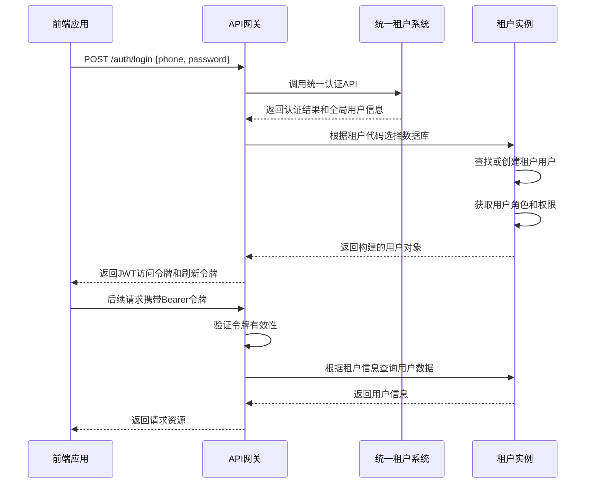

# 认证流程

<cite>
**本文档引用的文件**
- [jwt.config.ts](file://k.yyup.com/server/src/config/jwt.config.ts)
- [jwt.ts](file://k.yyup.com/server/src/utils/jwt.ts)
- [auth.middleware.ts](file://k.yyup.com/server/src/middlewares/auth.middleware.ts)
- [auth.controller.ts](file://k.yyup.com/server/src/controllers/auth.controller.ts)
- [tenant-resolver.middleware.ts](file://k.yyup.com/server/src/middlewares/tenant-resolver.middleware.ts)
- [tenant-token.service.ts](file://k.yyup.com/server/src/services/tenant-token.service.ts)
- [auth.routes.ts](file://k.yyup.com/server/src/routes/auth.routes.ts)
</cite>

## 目录
1. [简介](#简介)
2. [JWT令牌生成](#jwt令牌生成)
3. [令牌验证中间件](#令牌验证中间件)
4. [令牌刷新机制](#令牌刷新机制)
5. [会话管理与令牌失效](#会话管理与令牌失效)
6. [多租户认证隔离](#多租户认证隔离)
7. [认证流程序列图](#认证流程序列图)
8. [开发者集成指南](#开发者集成指南)

## 简介
k.yyupgame的用户认证机制基于JWT（JSON Web Token）实现，采用统一租户系统进行集中认证管理。系统通过与统一租户系统(rent.yyup.cc)的API集成，实现了跨租户的用户身份验证和权限管理。认证流程包括用户登录、JWT令牌生成、令牌验证、刷新和失效处理等环节，确保了系统的安全性和可扩展性。

**Section sources**
- [auth.middleware.ts](file://k.yyup.com/server/src/middlewares/auth.middleware.ts)
- [auth.controller.ts](file://k.yyup.com/server/src/controllers/auth.controller.ts)

## JWT令牌生成
JWT令牌的生成过程由`jwt.ts`工具文件中的`generateToken`和`generateDynamicToken`函数处理。系统使用HS256算法进行签名，密钥从环境变量`JWT_SECRET`获取，若未设置则使用默认值`kindergarten-enrollment-secret`。

访问令牌的默认有效期为24小时，刷新令牌的有效期为30天。系统支持动态会话超时设置，可通过数据库或全局变量配置会话超时时间。`generateDynamicToken`函数会根据配置动态调整令牌的有效期。

令牌的payload包含用户ID、用户名、角色、邮箱、手机号等基本信息，以及令牌类型和过期时间等元数据。对于刷新令牌，会在payload中设置`isRefreshToken`标志。

**Section sources**
- [jwt.config.ts](file://k.yyup.com/server/src/config/jwt.config.ts)
- [jwt.ts](file://k.yyup.com/server/src/utils/jwt.ts)

## 令牌验证中间件
令牌验证由`auth.middleware.ts`中的`verifyToken`中间件实现。该中间件首先检查请求头中的Bearer令牌，然后调用统一租户系统的API验证令牌的有效性。

验证过程包括：
1. 检查内部服务调用标识，内部服务可绕过认证
2. 提取并验证JWT令牌
3. 调用统一租户API验证令牌
4. 根据租户信息选择相应的数据库连接
5. 在租户数据库中查找或创建用户记录
6. 获取用户角色和权限信息
7. 构建完整的用户对象并附加到请求中

对于受保护的路由，系统使用`checkPermission`中间件进行权限检查，确保用户具有执行操作所需的权限。

**Section sources**
- [auth.middleware.ts](file://k.yyup.com/server/src/middlewares/auth.middleware.ts)

## 令牌刷新机制
系统实现了基于刷新令牌的令牌刷新机制。当访问令牌即将过期时，客户端可以使用刷新令牌获取新的访问令牌。刷新令牌的有效期为30天，存储在客户端的安全存储中。

刷新过程包括：
1. 客户端发送包含刷新令牌的请求
2. 服务器验证刷新令牌的有效性
3. 生成新的访问令牌和刷新令牌
4. 返回新的令牌对

系统还实现了刷新令牌的轮换策略，每次使用刷新令牌后都会生成新的刷新令牌，旧的刷新令牌将被标记为失效，防止重放攻击。

**Section sources**
- [jwt.config.ts](file://k.yyup.com/server/src/config/jwt.config.ts)
- [jwt.ts](file://k.yyup.com/server/src/utils/jwt.ts)

## 会话管理与令牌失效
会话管理通过JWT令牌的过期机制实现。系统支持用户主动登出和强制下线功能。

用户登出时，前端清除本地存储的令牌，服务器端不维护会话状态。对于强制下线需求，系统通过缩短令牌有效期或在统一租户系统中标记用户为非活动状态来实现。

`tenant-token.service.ts`实现了租户级别的MD5令牌安全机制，用于增强租户间的安全隔离。该服务生成包含用户手机号、租户代码、域名和数据库名的MD5令牌，有效期为30分钟，防止跨租户的令牌滥用。

**Section sources**
- [auth.controller.ts](file://k.yyup.com/server/src/controllers/auth.controller.ts)
- [tenant-token.service.ts](file://k.yyup.com/server/src/services/tenant-token.service.ts)

## 多租户认证隔离
多租户环境下的认证隔离通过`tenant-resolver.middleware.ts`中间件实现。该中间件根据请求域名识别租户，使用共享连接池模式访问相应的租户数据库。

租户识别过程：
1. 从请求头中获取域名
2. 解析租户代码（如k001.yyup.cc中的k001）
3. 验证租户是否存在且已激活
4. 设置租户信息到请求对象
5. 获取共享的数据库连接

每个租户拥有独立的数据库（如tenant_k001），但使用共享的数据库连接池，提高了资源利用率。用户在不同租户间的凭证完全隔离，确保了数据安全。

**Section sources**
- [tenant-resolver.middleware.ts](file://k.yyup.com/server/src/middlewares/tenant-resolver.middleware.ts)
- [auth.middleware.ts](file://k.yyup.com/server/src/middlewares/auth.middleware.ts)

## 认证流程序列图

**Diagram sources**
- [auth.middleware.ts](file://k.yyup.com/server/src/middlewares/auth.middleware.ts)
- [auth.routes.ts](file://k.yyup.com/server/src/routes/auth.routes.ts)

## 开发者集成指南
开发者在集成认证功能时，应遵循以下指南：

1. **登录流程**：
   - 调用`/auth/login`接口进行用户登录
   - 保存返回的访问令牌和刷新令牌
   - 将访问令牌添加到后续请求的Authorization头中

2. **令牌存储**：
   - 使用HttpOnly Cookie或安全的本地存储（如Secure Storage）保存令牌
   - 避免在URL参数或日志中暴露令牌

3. **令牌刷新**：
   - 监听401响应，触发令牌刷新流程
   - 使用刷新令牌获取新的访问令牌
   - 更新本地存储的令牌对

4. **错误处理**：
   - 处理401（未授权）和403（禁止访问）错误
   - 在令牌失效时引导用户重新登录

5. **多租户支持**：
   - 根据用户访问的域名确定租户代码
   - 在登录请求中包含租户上下文信息

**Section sources**
- [auth.routes.ts](file://k.yyup.com/server/src/routes/auth.routes.ts)
- [auth.middleware.ts](file://k.yyup.com/server/src/middlewares/auth.middleware.ts)