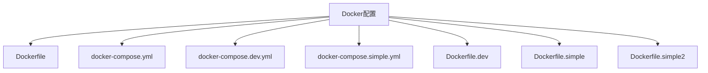
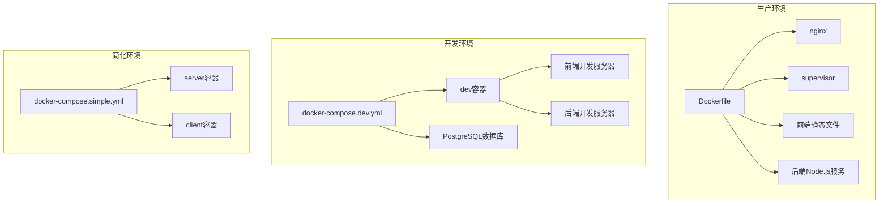
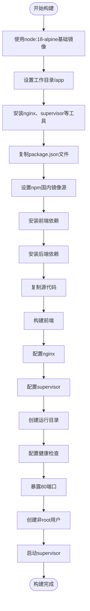
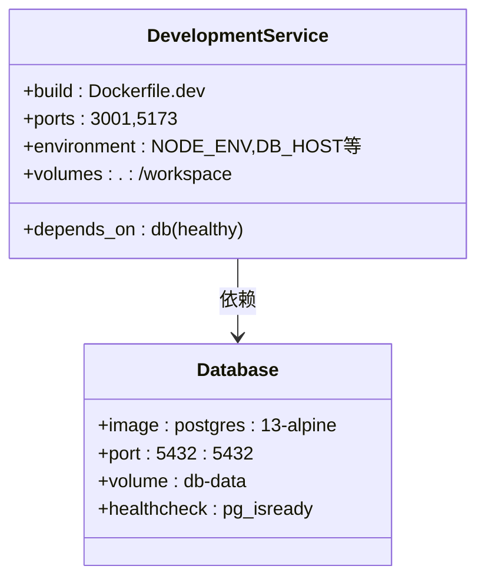
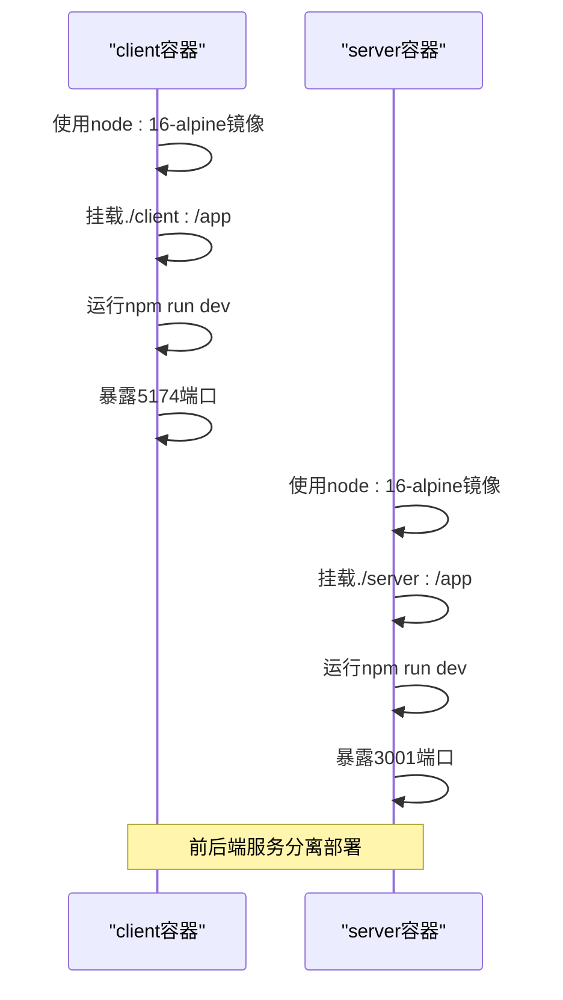
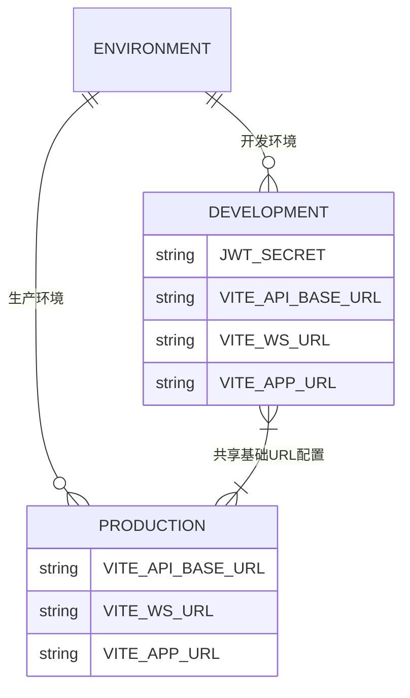
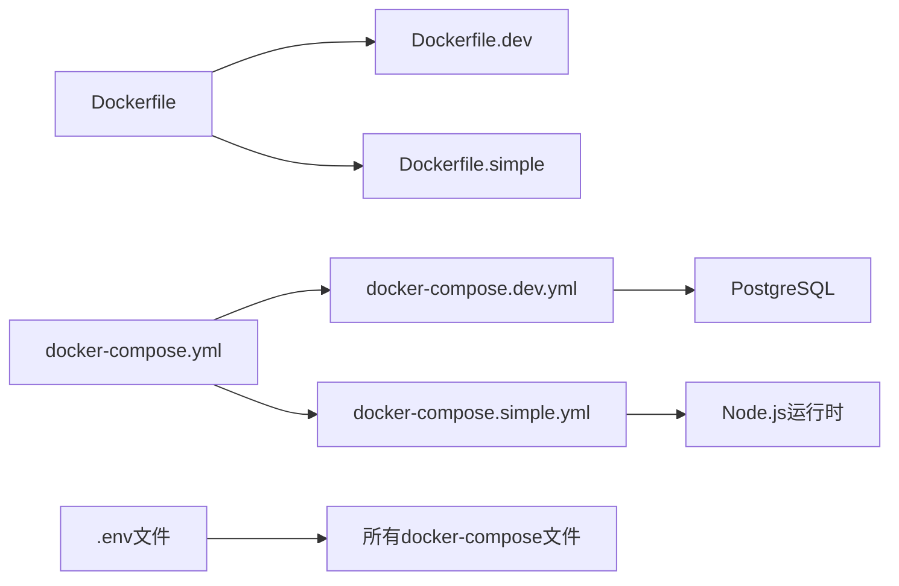

# Docker配置

<cite>
**本文档中引用的文件**  
- [Dockerfile](file://k.yyup.com/Dockerfile)
- [docker-compose.yml](file://k.yyup.com/docker-compose.yml)
- [docker-compose.dev.yml](file://k.yyup.com/docker-compose.dev.yml)
- [docker-compose.simple.yml](file://k.yyup.com/docker-compose.simple.yml)
- [Dockerfile.dev](file://k.yyup.com/Dockerfile.dev)
- [Dockerfile.simple](file://k.yyup.com/Dockerfile.simple)
- [Dockerfile.simple2](file://k.yyup.com/Dockerfile.simple2)
- [.env](file://k.yyup.com/.env)
- [.env.development](file://k.yyup.com/.env.development)
- [.env.production](file://k.yyup.com/.env.production)
- [entrypoint.sh](file://k.yyup.com/entrypoint.sh)
</cite>

## 目录
1. [简介](#简介)
2. [项目结构](#项目结构)
3. [核心组件](#核心组件)
4. [架构概述](#架构概述)
5. [详细组件分析](#详细组件分析)
6. [依赖分析](#依赖分析)
7. [性能考虑](#性能考虑)
8. [故障排除指南](#故障排除指南)
9. [结论](#结论)

## 简介
本文档提供k.yyupgame项目的完整Docker配置指南，涵盖开发、测试和生产环境的容器化部署方案。文档详细说明了Dockerfile的构建过程、docker-compose配置文件的结构与参数含义，并提供不同场景下的最佳实践。

## 项目结构
k.yyupgame项目采用前后端分离架构，通过Docker实现服务容器化部署。项目包含多个Docker配置文件，支持不同环境下的部署需求。

**Diagram sources**
- [Dockerfile](file://k.yyup.com/Dockerfile)
- [docker-compose.yml](file://k.yyup.com/docker-compose.yml)
- [docker-compose.dev.yml](file://k.yyup.com/docker-compose.dev.yml)
- [docker-compose.simple.yml](file://k.yyup.com/docker-compose.simple.yml)

**Section sources**
- [Dockerfile](file://k.yyup.com/Dockerfile)
- [docker-compose.yml](file://k.yyup.com/docker-compose.yml)

## 核心组件
项目包含多个Docker配置文件，分别用于不同场景：
- **Dockerfile**: 生产环境构建文件，使用Alpine Linux基础镜像，集成nginx和supervisor
- **Dockerfile.dev**: 开发环境镜像，预装开发工具和依赖
- **Dockerfile.simple/simple2**: 简化打包方案，用于快速部署
- **docker-compose.yml**: 基础服务编排配置
- **docker-compose.dev.yml**: 开发环境完整服务栈，包含数据库
- **docker-compose.simple.yml**: 简化版服务编排，分离前后端服务

**Section sources**
- [Dockerfile](file://k.yyup.com/Dockerfile)
- [Dockerfile.dev](file://k.yyup.com/Dockerfile.dev)
- [Dockerfile.simple](file://k.yyup.com/Dockerfile.simple)
- [Dockerfile.simple2](file://k.yyup.com/Dockerfile.simple2)
- [docker-compose.yml](file://k.yyup.com/docker-compose.yml)
- [docker-compose.dev.yml](file://k.yyup.com/docker-compose.dev.yml)
- [docker-compose.simple.yml](file://k.yyup.com/docker-compose.simple.yml)

## 架构概述
k.yyupgame项目采用多阶段Docker构建策略，通过docker-compose实现服务编排。生产环境使用单一容器运行nginx、supervisor和应用服务，开发环境则采用多容器分离架构。

**Diagram sources**
- [Dockerfile](file://k.yyup.com/Dockerfile)
- [docker-compose.dev.yml](file://k.yyup.com/docker-compose.dev.yml)
- [docker-compose.simple.yml](file://k.yyup.com/docker-compose.simple.yml)

## 详细组件分析

### Dockerfile构建分析
生产环境Dockerfile采用优化的构建策略，充分利用Docker缓存机制。

**Diagram sources**
- [Dockerfile](file://k.yyup.com/Dockerfile#L1-L83)

**Section sources**
- [Dockerfile](file://k.yyup.com/Dockerfile#L1-L83)

### docker-compose配置分析

#### 开发环境配置
开发环境使用docker-compose.dev.yml，包含完整的开发服务栈。

**Diagram sources**
- [docker-compose.dev.yml](file://k.yyup.com/docker-compose.dev.yml#L1-L55)

**Section sources**
- [docker-compose.dev.yml](file://k.yyup.com/docker-compose.dev.yml#L1-L55)

#### 简化环境配置
简化环境使用docker-compose.simple.yml，分离前后端服务。

**Diagram sources**
- [docker-compose.simple.yml](file://k.yyup.com/docker-compose.simple.yml#L1-L29)

**Section sources**
- [docker-compose.simple.yml](file://k.yyup.com/docker-compose.simple.yml#L1-L29)

### 环境变量配置
项目通过.env文件管理不同环境的配置参数。

**Diagram sources**
- [.env.development](file://k.yyup.com/.env.development#L1-L7)
- [.env.production](file://k.yyup.com/.env.production#L1-L5)

**Section sources**
- [.env.development](file://k.yyup.com/.env.development#L1-L7)
- [.env.production](file://k.yyup.com/.env.production#L1-L5)

## 依赖分析
k.yyupgame项目的Docker配置存在明确的依赖关系，确保服务按正确顺序启动。

**Diagram sources**
- [Dockerfile](file://k.yyup.com/Dockerfile)
- [Dockerfile.dev](file://k.yyup.com/Dockerfile.dev)
- [Dockerfile.simple](file://k.yyup.com/Dockerfile.simple)
- [docker-compose.yml](file://k.yyup.com/docker-compose.yml)
- [docker-compose.dev.yml](file://k.yyup.com/docker-compose.dev.yml)
- [docker-compose.simple.yml](file://k.yyup.com/docker-compose.simple.yml)

**Section sources**
- [Dockerfile](file://k.yyup.com/Dockerfile)
- [docker-compose.yml](file://k.yyup.com/docker-compose.yml)

## 性能考虑
Docker配置经过优化，考虑了构建效率、运行性能和资源利用率。

- **构建优化**: Dockerfile中先复制package.json再安装依赖，充分利用Docker缓存
- **镜像大小**: 使用Alpine Linux基础镜像，减小最终镜像体积
- **运行效率**: 生产环境使用supervisor管理多个进程，减少容器数量
- **网络性能**: 合理配置端口映射，避免端口冲突
- **存储优化**: 使用命名卷存储数据库数据，确保数据持久化

## 故障排除指南
### 常见问题及解决方案

**容器启动失败**
- 检查Dockerfile中的路径是否正确
- 确认依赖安装命令的退出状态处理
- 验证端口映射是否冲突

**网络连接问题**
- 检查服务间的依赖关系配置
- 验证环境变量中的主机名是否正确
- 确认健康检查配置是否合理

**数据卷挂载错误**
- 检查主机路径是否存在
- 验证容器内挂载路径的权限
- 确认卷的命名和引用是否一致

**环境变量未生效**
- 检查.env文件的加载顺序
- 验证docker-compose中environment配置
- 确认应用代码中环境变量的读取逻辑

**Section sources**
- [docker-compose.dev.yml](file://k.yyup.com/docker-compose.dev.yml)
- [Dockerfile](file://k.yyup.com/Dockerfile)
- [entrypoint.sh](file://k.yyup.com/entrypoint.sh)

## 结论
k.yyupgame项目提供了完善的Docker配置方案，支持多种部署场景。通过合理的Dockerfile设计和docker-compose编排，实现了开发、测试和生产环境的一致性。建议根据实际需求选择合适的配置方案，并遵循最佳实践进行部署和维护。