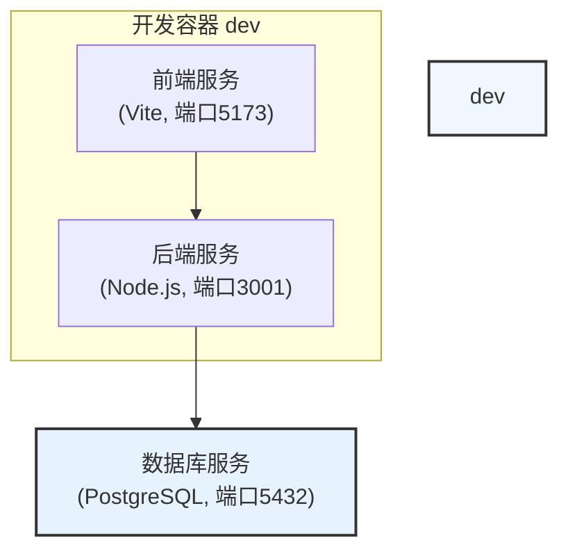
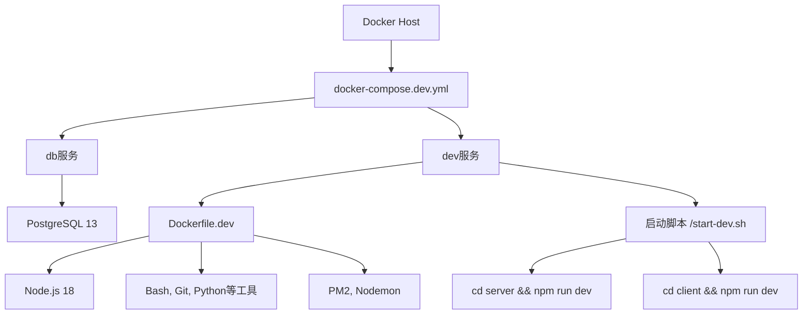
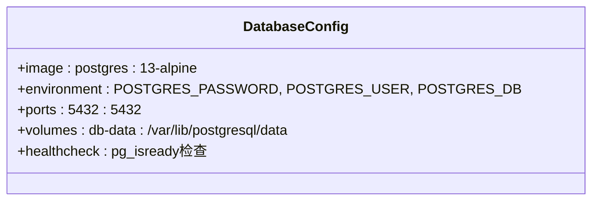
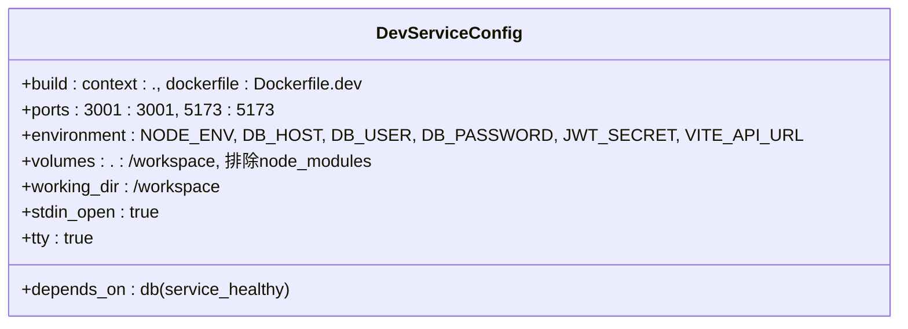
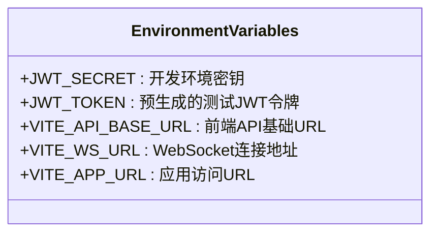
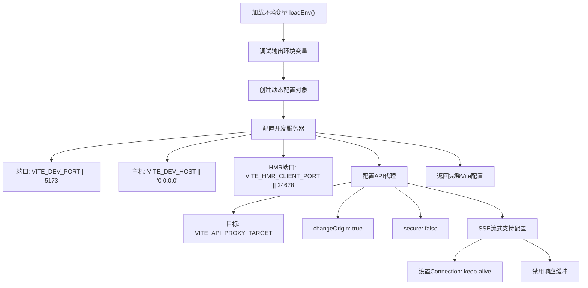
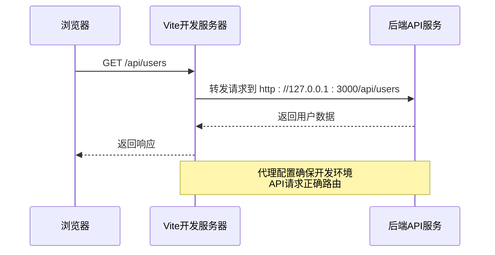

# 开发环境Docker配置

<cite>
**本文档引用文件**  
- [docker-compose.dev.yml](file://k.yyup.com/docker-compose.dev.yml)
- [.env.development](file://k.yyup.com/.env.development)
- [Dockerfile.dev](file://k.yyup.com/Dockerfile.dev)
- [client/vite.config.ts](file://k.yyup.com/client/vite.config.ts)
- [package.json](file://k.yyup.com/package.json)
</cite>

## 目录
1. [项目结构](#项目结构)
2. [核心组件](#核心组件)
3. [架构概述](#架构概述)
4. [详细组件分析](#详细组件分析)
5. [依赖分析](#依赖分析)
6. [性能考虑](#性能考虑)
7. [故障排除指南](#故障排除指南)
8. [结论](#结论)

## 项目结构

k.yyupgame项目的开发环境采用Docker容器化方案，通过`docker-compose.dev.yml`文件定义多服务开发环境。项目主要包含前端（client）、后端（server）和数据库（db）三个核心组件，通过统一的Docker配置实现开发环境的一致性。



**图示来源**  
- [docker-compose.dev.yml](file://k.yyup.com/docker-compose.dev.yml#L22-L52)

**本节来源**  
- [docker-compose.dev.yml](file://k.yyup.com/docker-compose.dev.yml#L1-L55)

## 核心组件

开发环境的核心组件包括数据库服务、统一开发容器以及前后端分离的服务配置。通过`docker-compose.dev.yml`中的`dev`服务构建开发镜像，集成前后端开发服务器，并通过卷挂载实现代码热重载。

**本节来源**  
- [docker-compose.dev.yml](file://k.yyup.com/docker-compose.dev.yml#L22-L52)
- [Dockerfile.dev](file://k.yyup.com/Dockerfile.dev#L1-L56)

## 架构概述

k.yyupgame项目的开发环境采用多容器架构，包含数据库服务和统一开发服务。开发容器通过构建`Dockerfile.dev`镜像，集成Node.js运行时、开发工具和依赖包，支持同时运行前后端开发服务器。



**图示来源**  
- [docker-compose.dev.yml](file://k.yyup.com/docker-compose.dev.yml#L1-L55)
- [Dockerfile.dev](file://k.yyup.com/Dockerfile.dev#L1-L56)

## 详细组件分析

### Docker Compose开发配置分析

`docker-compose.dev.yml`文件定义了开发环境的两个核心服务：数据库服务和开发服务。

#### 数据库服务配置
数据库服务使用PostgreSQL 13-alpine镜像，配置了必要的环境变量和端口映射，确保开发环境的数据持久化和健康检查。



**图示来源**  
- [docker-compose.dev.yml](file://k.yyup.com/docker-compose.dev.yml#L5-L19)

#### 开发服务配置
开发服务通过`Dockerfile.dev`构建，配置了端口映射、环境变量、卷挂载等关键开发特性。



**图示来源**  
- [docker-compose.dev.yml](file://k.yyup.com/docker-compose.dev.yml#L22-L52)

### 环境变量配置分析

`.env.development`文件定义了开发环境特有的环境变量，这些变量在Docker容器启动时注入，影响前后端的行为。



**图示来源**  
- [.env.development](file://k.yyup.com/.env.development#L1-L7)

### Vite开发服务器配置分析

前端开发环境使用Vite作为开发服务器，其配置文件`vite.config.ts`中包含了关键的代理设置和开发服务器配置。

#### 开发服务器配置
Vite配置动态读取环境变量，设置开发服务器的端口、主机和HMR（热模块替换）端口。



**图示来源**  
- [client/vite.config.ts](file://k.yyup.com/client/vite.config.ts#L13-L43)

#### API代理配置
Vite配置了`/api`路径的代理，将前端开发服务器的API请求转发到后端服务，解决了开发环境的跨域问题。



**图示来源**  
- [client/vite.config.ts](file://k.yyup.com/client/vite.config.ts#L134-L158)

## 依赖分析

项目通过Dockerfile.dev安装了多种开发工具和依赖，确保开发容器具备完整的开发环境。

```mermaid
graph TD
A[Dockerfile.dev] --> B[基础镜像 node:18-alpine]
B --> C[安装系统工具]
C --> D[apk add: bash, git, curl, vim, postgresql-client, python3]
C --> E[npm install -g: pm2, nodemon]
A --> F[安装Node.js依赖]
F --> G[npm install (server)]
F --> H[npm install (client)]
A --> I[创建启动脚本 /start-dev.sh]
I --> J[启动后端: npm run dev]
I --> K[启动前端: npm run dev -- --host 0.0.0.0 --port 5173]
```

**图示来源**  
- [Dockerfile.dev](file://k.yyup.com/Dockerfile.dev#L1-L56)

**本节来源**  
- [Dockerfile.dev](file://k.yyup.com/Dockerfile.dev#L1-L56)
- [package.json](file://k.yyup.com/package.json#L3-L318)

## 性能考虑

开发环境的Docker配置考虑了多个性能和开发效率因素：

1. **卷挂载优化**：通过排除`node_modules`目录的挂载，避免了容器内外npm包的权限冲突和性能问题
2. **依赖预安装**：在Docker镜像构建阶段安装依赖，减少容器启动时间
3. **热重载支持**：通过卷挂载实现代码更改的实时同步，支持Vite和nodemon的热重载功能
4. **资源隔离**：数据库使用独立的卷存储数据，确保数据持久化且不影响代码开发

## 故障排除指南

### 开发环境调试最佳实践

#### 源码挂载与热更新
通过`.:/workspace`卷挂载实现宿主机代码与容器的实时同步，任何代码更改都会立即反映在容器内，支持前端Vite和后端nodemon的热重载功能。

**本节来源**  
- [docker-compose.dev.yml](file://k.yyup.com/docker-compose.dev.yml#L43-L48)

#### 实时日志查看
启动开发容器后，可以通过以下方式查看实时日志：
- 使用`docker logs -f <container_name>`命令查看容器输出
- 在Vite配置中启用`createLogger()`插件，提供详细的控制台日志
- 使用`createFileLogger()`插件记录日志到文件

**本节来源**  
- [client/vite.config.ts](file://k.yyup.com/client/vite.config.ts#L47-L48)
- [docker-compose.dev.yml](file://k.yyup.com/docker-compose.dev.yml#L51-L52)

#### 容器内问题排查
可以通过以下命令进入开发容器进行问题排查：
```bash
docker exec -it <container_name> /bin/bash
```

在容器内可以：
- 检查环境变量：`printenv`
- 测试数据库连接：`psql -h db -U postgres -d kindergarten`
- 手动运行npm命令：`npm run dev`
- 检查文件系统：`ls -la /workspace`

**本节来源**  
- [Dockerfile.dev](file://k.yyup.com/Dockerfile.dev#L56)
- [docker-compose.dev.yml](file://k.yyup.com/docker-compose.dev.yml#L51-L52)

## 结论

k.yyupgame项目的开发环境Docker配置提供了一套完整的容器化开发解决方案。通过`docker-compose.dev.yml`文件定义了数据库和开发服务，利用`Dockerfile.dev`构建包含完整开发工具链的镜像，实现了前后端一体化的开发环境。配置中特别关注了热重载、端口映射、API代理等开发关键特性，同时通过环境变量文件`.env.development`管理开发环境特有的配置。这套配置确保了开发环境的一致性，提高了开发效率，为团队协作提供了可靠的基础。