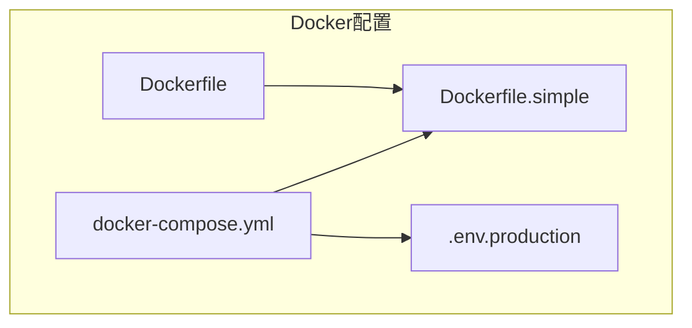
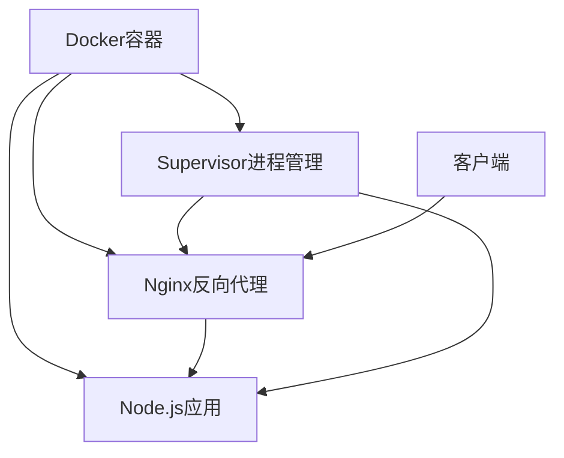
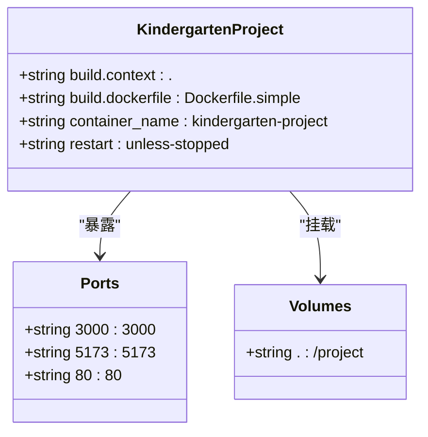
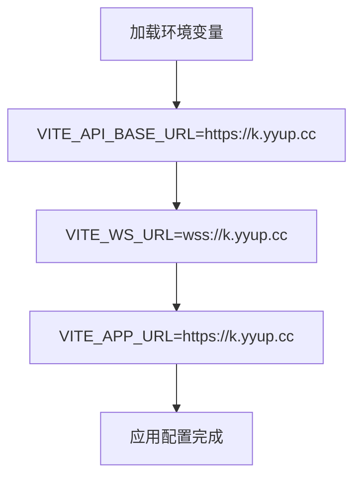
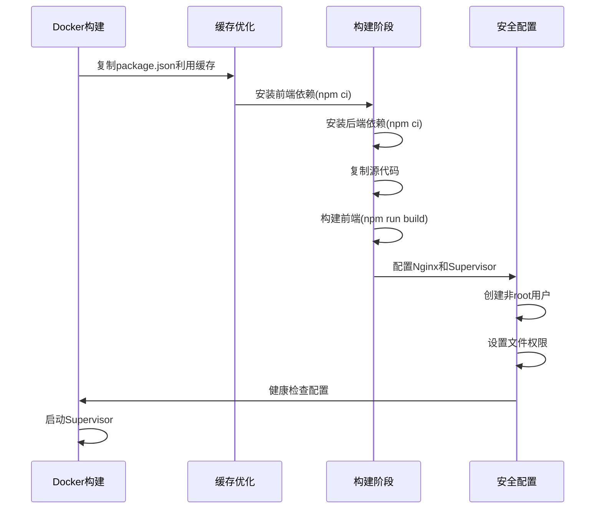
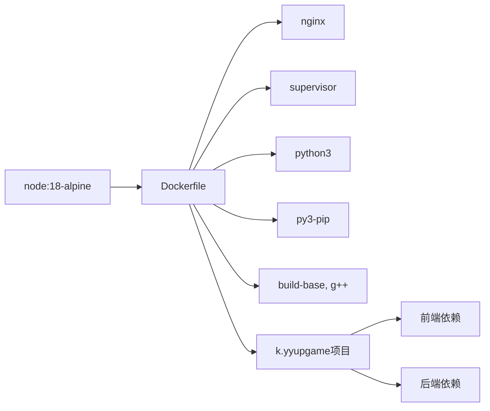

# 生产环境Docker配置

<cite>
**本文档中引用的文件**  
- [docker-compose.yml](file://k.yyup.com/docker-compose.yml)
- [.env.production](file://k.yyup.com/.env.production)
- [Dockerfile](file://k.yyup.com/Dockerfile)
- [Dockerfile.simple](file://k.yyup.com/Dockerfile.simple)
</cite>

## 目录
1. [简介](#简介)
2. [项目结构](#项目结构)
3. [核心组件](#核心组件)
4. [架构概述](#架构概述)
5. [详细组件分析](#详细组件分析)
6. [依赖分析](#依赖分析)
7. [性能考虑](#性能考虑)
8. [故障排除指南](#故障排除指南)
9. [结论](#结论)

## 简介
本文档详细介绍了k.yyupgame项目在生产环境中的Docker容器化部署最佳实践。重点解析了生产级配置的关键要素，包括服务编排、环境变量管理、镜像构建优化以及容器运行时的安全与性能配置。

## 项目结构
k.yyupgame项目的Docker配置主要由docker-compose.yml、Dockerfile和环境变量文件组成，采用前后端一体化的容器化部署方案。项目通过Dockerfile.simple构建基础镜像，并使用docker-compose进行服务编排。

**Diagram sources**
- [docker-compose.yml](file://k.yyup.com/docker-compose.yml#L1-L42)
- [Dockerfile](file://k.yyup.com/Dockerfile#L1-L83)
- [Dockerfile.simple](file://k.yyup.com/Dockerfile.simple#L1-L17)
- [.env.production](file://k.yyup.com/.env.production#L1-L5)

**Section sources**
- [docker-compose.yml](file://k.yyup.com/docker-compose.yml#L1-L42)
- [Dockerfile](file://k.yyup.com/Dockerfile#L1-L83)

## 核心组件
生产环境的核心组件包括基于Ubuntu 20.04的基础镜像、Node.js运行时环境、Nginx反向代理服务器和Supervisor进程管理器。这些组件共同构成了一个稳定可靠的生产环境运行平台。

**Section sources**
- [Dockerfile](file://k.yyup.com/Dockerfile#L1-L83)
- [Dockerfile.simple](file://k.yyup.com/Dockerfile.simple#L1-L17)

## 架构概述
k.yyupgame的生产环境采用单容器多服务架构，通过Supervisor统一管理Nginx和Node.js应用进程。这种架构简化了部署复杂性，同时确保了服务的高可用性。

**Diagram sources**
- [Dockerfile](file://k.yyup.com/Dockerfile#L8-L14)
- [Dockerfile](file://k.yyup.com/Dockerfile#L45-L51)
- [Dockerfile](file://k.yyup.com/Dockerfile#L82-L83)

## 详细组件分析

### Docker Compose配置分析
生产环境的docker-compose.yml文件定义了kindergarten-project服务，采用Dockerfile.simple进行构建，映射了多个端口并设置了容器重启策略。

#### 服务编排配置

**Diagram sources**
- [docker-compose.yml](file://k.yyup.com/docker-compose.yml#L2-L13)

### 环境变量管理
生产环境使用.env.production文件管理敏感配置，通过环境变量注入的方式确保配置的安全性。

#### 生产环境变量配置

**Diagram sources**
- [.env.production](file://k.yyup.com/.env.production#L1-L5)

### 镜像构建分析
Dockerfile实现了多阶段构建策略，优化了镜像大小和构建效率，同时增强了安全性。

#### 镜像构建流程

**Diagram sources**
- [Dockerfile](file://k.yyup.com/Dockerfile#L16-L39)
- [Dockerfile](file://k.yyup.com/Dockerfile#L63-L68)
- [Dockerfile](file://k.yyup.com/Dockerfile#L73-L74)

## 依赖分析
项目依赖关系清晰，通过Dockerfile和docker-compose.yml文件明确定义了基础镜像、运行时依赖和构建工具。

**Diagram sources**
- [Dockerfile](file://k.yyup.com/Dockerfile#L8-L14)
- [Dockerfile](file://k.yyup.com/Dockerfile#L17-L29)

## 性能考虑
生产环境配置充分考虑了性能优化，包括使用Alpine Linux基础镜像减小体积、国内镜像源加速依赖安装、多阶段构建优化等策略。

**Section sources**
- [Dockerfile](file://k.yyup.com/Dockerfile#L2-L3)
- [Dockerfile](file://k.yyup.com/Dockerfile#L20-L21)

## 故障排除指南
当生产环境出现问题时，可检查以下关键配置：

1. 确保.dockerignore文件正确配置，避免不必要的文件被复制到镜像中
2. 检查健康检查脚本是否正常工作
3. 验证环境变量是否正确加载
4. 确认端口映射是否正确

**Section sources**
- [docker-compose.yml](file://k.yyup.com/docker-compose.yml#L6-L9)
- [Dockerfile](file://k.yyup.com/Dockerfile#L55-L58)

## 结论
k.yyupgame项目的生产环境Docker配置采用了现代化的容器化实践，通过合理的架构设计和配置优化，确保了应用的稳定性、安全性和可维护性。建议在实际部署中根据具体需求调整资源限制和日志策略。