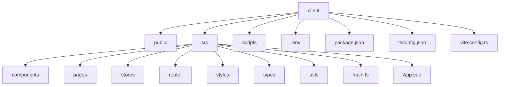

# 前端依赖安装

<cite>
**本文档引用的文件**  
- [package.json](file://k.yyup.com/client/package.json)
- [tsconfig.json](file://k.yyup.com/client/tsconfig.json)
- [vite.config.ts](file://k.yyup.com/client/vite.config.ts)
- [vite.config.prod.ts](file://k.yyup.com/client/vite.config.prod.ts)
- [vite.config.k-yyup.ts](file://k.yyup.com/client/vite.config.k-yyup.ts)
- [.env](file://k.yyup.com/client/.env)
- [.env.development](file://k.yyup.com/client/.env.development)
- [.env.production](file://k.yyup.com/client/.env.production)
- [main.ts](file://k.yyup.com/client/src/main.ts)
- [App.vue](file://k.yyup.com/client/src/App.vue)
</cite>

## 目录
1. [项目结构](#项目结构)
2. [核心前端依赖安装](#核心前端依赖安装)
3. [Vite构建工具配置](#vite构建工具配置)
4. [TypeScript配置要点](#typescript配置要点)
5. [依赖冲突处理](#依赖冲突处理)
6. [安装验证方法](#安装验证方法)
7. [前端依赖管理最佳实践](#前端依赖管理最佳实践)

## 项目结构

k.yyupgame项目的前端部分位于`k.yyup.com/client`目录下，采用Vue3 + Vite + TypeScript技术栈。项目包含完整的开发、测试和生产环境配置，支持多环境部署和模块化开发。



**Diagram sources**
- [package.json](file://k.yyup.com/client/package.json)
- [main.ts](file://k.yyup.com/client/src/main.ts)
- [App.vue](file://k.yyup.com/client/src/App.vue)

**Section sources**
- [package.json](file://k.yyup.com/client/package.json)
- [main.ts](file://k.yyup.com/client/src/main.ts)

## 核心前端依赖安装

k.yyupgame项目的前端依赖通过npm在client目录下进行管理。项目使用Vue3作为核心框架，Pinia作为状态管理工具，Vite作为构建工具。

### 安装命令

在项目根目录执行以下命令进入client目录并安装依赖：

```bash
cd k.yyup.com/client
npm install
```

或者使用yarn：

```bash
cd k.yyup.com/client
yarn install
```

项目提供了便捷的全局安装脚本，可在项目根目录直接执行：

```bash
npm run install:client
```

### 核心依赖版本

根据package.json文件，关键依赖的版本如下：

- **Vue**: ^3.5.16
- **Pinia**: ^2.0.22
- **Vite**: ^4.5.14
- **Vue Router**: ^4.1.5
- **Element Plus**: ^2.2.16
- **Vant**: ^4.9.21
- **TypeScript**: ^4.8.3

### 依赖版本锁定

项目通过package-lock.json文件锁定依赖版本，确保团队成员安装的依赖版本一致。建议始终使用npm install而非npm update来避免版本冲突。

**Section sources**
- [package.json](file://k.yyup.com/client/package.json)

## Vite构建工具配置

Vite作为现代前端构建工具，在k.yyupgame项目中扮演着核心角色。项目提供了多个Vite配置文件以适应不同环境需求。

### 主要配置文件

- `vite.config.ts`: 默认开发配置
- `vite.config.prod.ts`: 生产环境配置
- `vite.config.k-yyup.ts`: 专为localhost域名优化的配置
- `vite.config.pc.ts`: PC端专用配置
- `vite.config.turbo.ts`: 高性能编译配置

### 开发服务器配置

在vite.config.ts中，开发服务器配置包括：

- 端口: 5173
- 主机: 0.0.0.0（允许外部访问）
- HMR端口: 24678
- API代理: 将/api请求代理到后端服务

### API代理配置

Vite配置了API代理以解决开发环境的跨域问题：

```javascript
proxy: {
  '/api': {
    target: env.VITE_API_PROXY_TARGET?.replace('localhost', '127.0.0.1') || 'http://127.0.0.1:3000',
    changeOrigin: true,
    secure: false,
    ws: true,
    proxyTimeout: 0,
    timeout: 0,
    headers: {
      'Connection': 'keep-alive',
      'Cache-Control': 'no-cache',
    },
    onProxyRes: (proxyRes, req, res) => {
      if (proxyRes.headers['content-type']?.includes('text/event-stream')) {
        proxyRes.setEncoding('utf8');
        res.setHeader('X-Accel-Buffering', 'no');
      }
    }
  }
}
```

此配置特别处理SSE（Server-Sent Events）流式数据，确保AI助手等实时功能正常工作。

### 构建优化配置

生产环境构建配置包含多项性能优化：

- 代码分割：将依赖库拆分为独立的chunk
- 源码映射：生产环境禁用sourcemap
- 压缩：使用esbuild进行快速压缩
- 缓存：通过hash命名文件实现长期缓存

**Section sources**
- [vite.config.ts](file://k.yyup.com/client/vite.config.ts)
- [vite.config.prod.ts](file://k.yyup.com/client/vite.config.prod.ts)
- [vite.config.k-yyup.ts](file://k.yyup.com/client/vite.config.k-yyup.ts)

## TypeScript配置要点

TypeScript在k.yyupgame项目中提供类型安全和开发体验优化。

### tsconfig.json配置

核心配置包括：

- **target**: ES2020 - 确保兼容现代浏览器
- **module**: ESNext - 支持现代模块系统
- **strict**: true - 启用严格模式
- **baseUrl**: . - 设置基础路径
- **paths**: {"@/*": ["src/*"]} - 配置路径别名

### 类型定义

项目包含以下类型定义：

- Vite客户端类型: "vite/client"
- Element Plus全局类型: "element-plus/global"
- 自定义类型文件: src/types目录

### 包含和排除

- **include**: src目录下的所有ts、tsx、vue文件
- **exclude**: node_modules、dist等构建输出目录

**Section sources**
- [tsconfig.json](file://k.yyup.com/client/tsconfig.json)

## 依赖冲突处理

在安装前端依赖时可能遇到版本冲突问题，以下是处理策略：

### 常见冲突场景

1. **Peer依赖冲突**: 当多个包需要不同版本的同一依赖时
2. **版本不兼容**: 新版本依赖与现有代码不兼容
3. **重复安装**: 同一包被多次安装在不同版本

### 解决方案

1. **使用npm ls检查依赖树**:
```bash
npm ls vue
npm ls pinia
```

2. **强制重新安装**:
```bash
rm -rf node_modules package-lock.json
npm cache clean --force
npm install
```

3. **使用resolutions（yarn）**:
在package.json中指定强制版本：
```json
"resolutions": {
  "vue": "3.5.16",
  "pinia": "2.0.22"
}
```

4. **检查Vite插件兼容性**:
确保Vite插件与核心依赖版本兼容，特别是：
- @vitejs/plugin-vue
- unplugin-auto-import
- unplugin-vue-components

**Section sources**
- [package.json](file://k.yyup.com/client/package.json)

## 安装验证方法

安装完成后，需要验证前端依赖是否正确安装和配置。

### 运行开发服务器

```bash
npm run dev
```

或使用特定配置：
```bash
npm run dev:localhost
```

成功启动后，访问http://localhost:5173应能看到应用界面。

### 构建生产版本

```bash
npm run build:prod
```

构建成功后，dist目录将包含优化后的静态文件。

### 运行测试

```bash
npm run test:unit
npm run test:e2e
```

确保所有测试通过，验证依赖的完整性和兼容性。

### 类型检查

```bash
npm run typecheck
```

确保TypeScript类型检查无错误。

**Section sources**
- [package.json](file://k.yyup.com/client/package.json)

## 前端依赖管理最佳实践

### 1. 依赖更新策略

- 定期更新依赖，但避免频繁更新
- 先在开发环境测试新版本
- 使用npm outdated检查过期依赖

### 2. 依赖分类管理

- **dependencies**: 生产环境必需的运行时依赖
- **devDependencies**: 开发和构建工具
- **peerDependencies**: 插件系统依赖

### 3. 环境变量管理

项目使用多环境变量文件：
- `.env`: 默认配置
- `.env.development`: 开发环境
- `.env.production`: 生产环境

### 4. 性能优化

- 启用Vite的依赖预构建
- 使用代码分割减少初始加载体积
- 合理配置缓存策略

### 5. 安全考虑

- 定期检查依赖漏洞：`npm audit`
- 避免使用不受维护的包
- 最小化生产环境依赖

遵循这些最佳实践，可以确保k.yyupgame项目的前端依赖管理系统稳定、高效且易于维护。

**Section sources**
- [package.json](file://k.yyup.com/client/package.json)
- [.env](file://k.yyup.com/client/.env)
- [.env.development](file://k.yyup.com/client/.env.development)
- [.env.production](file://k.yyup.com/client/.env.production)