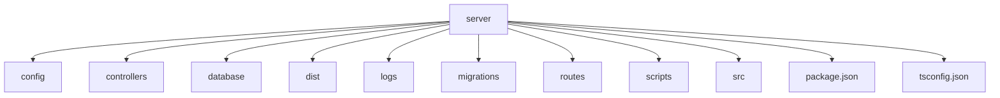

# 后端依赖安装

<cite>
**本文档引用的文件**
- [package.json](file://k.yyup.com/package.json)
- [server/package.json](file://k.yyup.com/server/package.json)
- [server/tsconfig.json](file://k.yyup.com/server/tsconfig.json)
- [server/src/app.ts](file://k.yyup.com/server/src/app.ts)
</cite>

## 目录
1. [项目结构](#项目结构)
2. [核心依赖安装](#核心依赖安装)
3. [Express框架配置](#express框架配置)
4. [Sequelize ORM配置](#sequelize-orm配置)
5. [依赖验证与测试](#依赖验证与测试)
6. [最佳实践建议](#最佳实践建议)

## 项目结构

k.yyupgame项目的后端代码位于`k.yyup.com/server`目录下，采用TypeScript + Express + Sequelize的技术栈。项目结构清晰，包含配置、控制器、数据库迁移、路由、服务等标准目录。



**Diagram sources**
- [server/package.json](file://k.yyup.com/server/package.json)
- [server/tsconfig.json](file://k.yyup.com/server/tsconfig.json)

**Section sources**
- [server/package.json](file://k.yyup.com/server/package.json)
- [server/tsconfig.json](file://k.yyup.com/server/tsconfig.json)

## 核心依赖安装

### 安装命令

在`k.yyup.com`项目根目录下，使用以下命令安装后端依赖：

```bash
# 使用npm安装
npm run install:server

# 或者直接进入server目录安装
cd server && npm install

# 使用yarn安装（如果项目使用yarn）
cd server && yarn install
```

这些命令会安装`server/package.json`中定义的所有生产依赖和开发依赖。

### 核心依赖版本

根据`server/package.json`文件，关键依赖的版本如下：

- **Express**: ^4.17.1
- **Sequelize**: ^6.12.0-beta.3
- **TypeScript**: ^4.5.3
- **MySQL2**: ^2.3.3
- **Nodemon**: ^2.0.15
- **Ts-node**: ^10.9.2

### 依赖版本管理

项目使用`package.json`进行依赖版本管理，采用`^`符号允许次要版本更新，确保兼容性的同时获取安全补丁和功能改进。

### 依赖冲突处理

当出现依赖冲突时，建议采取以下步骤：

1. 清理node_modules和package-lock.json
```bash
cd server && rm -rf node_modules package-lock.json
```

2. 重新安装依赖
```bash
npm install
```

3. 如果问题仍然存在，使用`npm ls <package-name>`检查依赖树，确定冲突来源。

**Section sources**
- [server/package.json](file://k.yyup.com/server/package.json)

## Express框架配置

### 基本配置

在`server/src/app.ts`中，Express应用的基本配置包括：

1. **中间件配置**：
   - `helmet()`：提供安全头
   - `cors()`：配置跨域访问
   - `express.json()`：解析JSON请求体
   - `express.urlencoded()`：解析URL编码的请求体

2. **静态文件服务**：
   - 配置`/uploads`路径提供静态文件服务

3. **错误处理**：
   - 全局错误捕获中间件
   - 自定义错误处理中间件

### CORS配置

项目配置了宽松的CORS策略，允许所有域名访问：

```typescript
const corsOptions = {
  origin: '*',
  credentials: true,
  methods: ['GET', 'POST', 'PUT', 'DELETE', 'OPTIONS'],
  allowedHeaders: ['Content-Type', 'Authorization', 'X-Request-ID', 'X-Request-Time', 'X-Source'],
  exposedHeaders: ['X-Request-ID'],
  maxAge: 86400
};
```

### 安全配置

使用`helmet`中间件增强应用安全性，自动设置各种HTTP头来防范常见的Web漏洞。

**Section sources**
- [server/src/app.ts](file://k.yyup.com/server/src/app.ts)

## Sequelize ORM配置

### 数据库连接

Sequelize的数据库连接配置在`server/src/init.ts`文件中（未直接显示，但从app.ts的导入可知）。连接配置包括：

- 数据库类型（MySQL）
- 主机、端口、用户名、密码
- 数据库名称
- 连接池配置

### 模型定义

项目使用Sequelize的模型定义方式，在`server/src/models`目录下定义了各个数据模型，包括用户、学生、教师、班级等。

### 迁移管理

项目使用Sequelize CLI进行数据库迁移管理，相关脚本在`server/package.json`中定义：

```json
"scripts": {
  "db:migrate": "ts-node src/scripts/migrate.ts",
  "db:migrate:undo": "ts-node src/scripts/migrateUndo.ts",
  "db:reset": "ts-node src/scripts/resetDatabase.ts"
}
```

### 连接池配置

在多租户环境下，项目使用共享连接池模式，通过`getTenantDatabaseName`函数动态获取租户数据库名称。

**Section sources**
- [server/src/app.ts](file://k.yyup.com/server/src/app.ts)
- [server/package.json](file://k.yyup.com/server/package.json)

## 依赖验证与测试

### 启动后端服务

安装完成后，可以通过以下命令启动后端服务：

```bash
# 开发模式启动
npm run dev

# 或使用预定义脚本
npm run start:backend
```

### 健康检查

服务启动后，可以通过访问`/health`或`/api/health`端点验证服务状态：

```bash
curl http://localhost:3000/health
```

预期返回：
```json
{
  "status": "up",
  "timestamp": "2025-07-11T21:48:19.672Z",
  "checks": [
    { "name": "api", "status": "up" }
  ]
}
```

### 数据库连接测试

项目提供了数据库连接测试脚本：

```bash
# 运行数据库诊断
npm run db:diagnose

# 检查数据库结构
npm run check-db
```

### 环境变量配置

确保`.env`和`.env.local`文件正确配置了数据库连接信息和其他必要环境变量。

**Section sources**
- [server/src/app.ts](file://k.yyup.com/server/src/app.ts)
- [server/package.json](file://k.yyup.com/server/package.json)

## 最佳实践建议

### 安全依赖更新

1. **定期更新**：定期运行`npm outdated`检查过时的依赖
2. **安全审计**：使用`npm audit`检查安全漏洞
3. **选择性更新**：优先更新有安全漏洞的依赖

### 性能优化依赖

1. **缓存配置**：合理配置Redis缓存，减少数据库查询
2. **连接池优化**：根据应用负载调整Sequelize连接池大小
3. **静态资源优化**：使用CDN提供静态资源，减轻服务器压力

### 开发环境优化

1. **使用nodemon**：开发时使用nodemon实现热重载
2. **源码映射**：配置source-map便于调试TypeScript代码
3. **环境隔离**：使用不同的环境变量文件（.env.development, .env.production）隔离环境配置

### 依赖管理策略

1. **锁定版本**：在生产环境中使用package-lock.json锁定依赖版本
2. **分层依赖**：将生产依赖和开发依赖明确分离
3. **定期清理**：定期检查并移除未使用的依赖

**Section sources**
- [server/package.json](file://k.yyup.com/server/package.json)
- [server/tsconfig.json](file://k.yyup.com/server/tsconfig.json)
- [server/src/app.ts](file://k.yyup.com/server/src/app.ts)