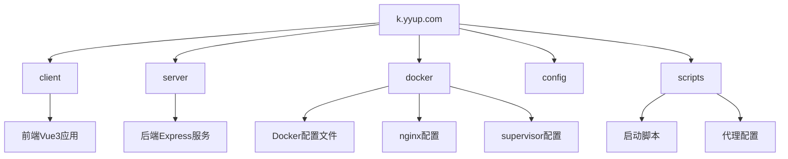

# 开发环境搭建

<cite>
**本文档中引用的文件**  
- [package.json](file://k.yyup.com/package.json)
- [Dockerfile](file://k.yyup.com/Dockerfile)
- [docker-compose.yml](file://k.yyup.com/docker-compose.yml)
- [docker-compose.dev.yml](file://k.yyup.com/docker-compose.dev.yml)
- [docker-compose.simple.yml](file://k.yyup.com/docker-compose.simple.yml)
- [.env](file://k.yyup.com/.env)
- [.env.development](file://k.yyup.com/.env.development)
- [.env.production](file://k.yyup.com/.env.production)
- [start-all.sh](file://k.yyup.com/start-all.sh)
- [tsconfig.json](file://k.yyup.com/tsconfig.json)
- [supervisord.conf](file://k.yyup.com/docker/supervisord.conf)
- [nginx.conf](file://k.yyup.com/docker/nginx.conf)
- [default.conf](file://k.yyup.com/docker/default.conf)
- [scripts/setup-proxy.sh](file://k.yyup.com/scripts/setup-proxy.sh)
</cite>

## 目录
1. [项目结构](#项目结构)
2. [核心依赖版本要求](#核心依赖版本要求)
3. [Node.js与TypeScript环境配置](#nodejs与typescript环境配置)
4. [Vue3与Express环境配置](#vue3与express环境配置)
5. [Sequelize数据库配置](#sequelize数据库配置)
6. [Docker环境配置](#docker环境配置)
7. [环境变量配置说明](#环境变量配置说明)
8. [Windows与Linux系统差异](#windows与linux系统差异)
9. [常见环境问题解决方案](#常见环境问题解决方案)
10. [环境验证测试步骤](#环境验证测试步骤)

## 项目结构

本项目采用前后端分离架构，主要包含以下目录结构：



**Diagram sources**
- [k.yyup.com/package.json](file://k.yyup.com/package.json)
- [k.yyup.com/Dockerfile](file://k.yyup.com/Dockerfile)
- [k.yyup.com/docker-compose.yml](file://k.yyup.com/docker-compose.yml)

**Section sources**
- [k.yyup.com/package.json](file://k.yyup.com/package.json#L1-L318)
- [k.yyup.com/Dockerfile](file://k.yyup.com/Dockerfile#L1-L83)

## 核心依赖版本要求

根据package.json文件，本项目的核心依赖版本要求如下：

| 依赖库 | 版本要求 | 用途 |
|--------|---------|------|
| Node.js | ^18.x | 运行时环境 |
| TypeScript | ^5.x | 类型检查与编译 |
| Vue | ^3.5.14 | 前端框架 |
| Express | ^5.1.0 | 后端Web框架 |
| Sequelize | ^6.37.7 | ORM数据库操作 |
| Vite | ^4.5.14 | 前端构建工具 |
| Pinia | ^3.0.2 | 状态管理 |
| Element Plus | ^2.3.1 | UI组件库 |

**Section sources**
- [k.yyup.com/package.json](file://k.yyup.com/package.json#L256-L295)

## Node.js与TypeScript环境配置

### Node.js安装

1. 推荐使用Node.js 18.x版本
2. 可通过nvm（Node Version Manager）进行版本管理：
```bash
nvm install 18
nvm use 18
```

3. 验证安装：
```bash
node --version
npm --version
```

### TypeScript配置

项目已配置tsconfig.json，主要配置项包括：

```json
{
  "compilerOptions": {
    "target": "ESNext",
    "module": "ESNext",
    "strict": true,
    "jsx": "preserve",
    "resolveJsonModule": true,
    "esModuleInterop": true,
    "lib": ["ESNext", "DOM"],
    "baseUrl": ".",
    "paths": {
      "@/*": ["src/*"]
    }
  },
  "include": ["client/src/**/*.ts", "client/src/**/*.d.ts", "client/src/**/*.tsx", "client/src/**/*.vue"]
}
```

**Section sources**
- [k.yyup.com/package.json](file://k.yyup.com/package.json#L4-L38)
- [k.yyup.com/tsconfig.json](file://k.yyup.com/tsconfig.json#L1-L21)

## Vue3与Express环境配置

### Vue3前端配置

1. 进入client目录安装依赖：
```bash
cd client
npm install
```

2. 启动开发服务器：
```bash
npm run dev
```

3. 构建生产版本：
```bash
npm run build:prod
```

### Express后端配置

1. 进入server目录安装依赖：
```bash
cd server
npm install
```

2. 启动开发服务器：
```bash
npm run dev
```

3. 编译TypeScript：
```bash
npm run compile
```

**Section sources**
- [k.yyup.com/package.json](file://k.yyup.com/package.json#L40-L255)
- [k.yyup.com/start-all.sh](file://k.yyup.com/start-all.sh#L1-L289)

## Sequelize数据库配置

Sequelize作为ORM框架，配置要点如下：

1. 安装MySQL2驱动：
```bash
npm install mysql2
```

2. 数据库连接配置在环境变量中：
- DB_HOST: 数据库主机
- DB_PORT: 数据库端口
- DB_NAME: 数据库名称
- DB_USER: 数据库用户名
- DB_PASSWORD: 数据库密码

3. 项目中已包含数据库迁移文件：
```bash
database/migrations/
```

**Section sources**
- [k.yyup.com/package.json](file://k.yyup.com/package.json#L33)
- [k.yyup.com/.env.development](file://k.yyup.com/.env.development#L1-L7)

## Docker环境配置

### Docker Compose配置

项目提供多种Docker Compose配置文件：

#### 开发环境配置 (docker-compose.dev.yml)
```yaml
version: '3.8'
services:
  db:
    image: postgres:13-alpine
    environment:
      POSTGRES_PASSWORD: postgres
      POSTGRES_USER: postgres
      POSTGRES_DB: kindergarten
    ports:
      - "5432:5432"
  dev:
    build:
      context: .
      dockerfile: Dockerfile.dev
    ports:
      - "3001:3001"
      - "5173:5173"
    depends_on:
      db:
        condition: service_healthy
```

#### 简化配置 (docker-compose.simple.yml)
```yaml
services:
  server:
    image: node:16-alpine
    working_dir: /app
    command: sh -c "npm install && npm run dev"
    ports:
      - "3001:3001"
  client:
    image: node:16-alpine
    working_dir: /app
    command: sh -c "npm install && npm run dev -- --host 0.0.0.0 --port 5174"
    ports:
      - "5174:5174"
```

### 启动Docker服务

```bash
# 启动开发环境
docker-compose -f docker-compose.dev.yml up --build

# 启动简化环境
docker-compose -f docker-compose.simple.yml up --build

# 启动生产环境
docker-compose up --build
```

**Diagram sources**
- [k.yyup.com/docker-compose.dev.yml](file://k.yyup.com/docker-compose.dev.yml#L1-L55)
- [k.yyup.com/docker-compose.simple.yml](file://k.yyup.com/docker-compose.simple.yml#L1-L29)
- [k.yyup.com/docker-compose.yml](file://k.yyup.com/docker-compose.yml#L1-L42)

**Section sources**
- [k.yyup.com/docker-compose.dev.yml](file://k.yyup.com/docker-compose.dev.yml#L1-L55)
- [k.yyup.com/docker-compose.simple.yml](file://k.yyup.com/docker-compose.simple.yml#L1-L29)
- [k.yyup.com/docker-compose.yml](file://k.yyup.com/docker-compose.yml#L1-L42)

## 环境变量配置说明

项目使用多个.env文件进行环境配置：

### .env文件
```env
PUBLIC_BUILDER_KEY=b43bda84b6fe433783752fd226949fa0
```

### .env.development（开发环境）
```env
JWT_SECRET=your_secret_key
JWT_TOKEN=eyJhbGciOiJIUzI1NiIsInR5cCI6IkpXVCJ9...
VITE_API_BASE_URL=https://k.yyup.cc
VITE_WS_URL=wss://tphezdvikvva.sealoshzh.site
VITE_APP_URL=https://k.yyup.cc
```

### .env.production（生产环境）
```env
VITE_API_BASE_URL=https://k.yyup.cc
VITE_WS_URL=wss://k.yyup.cc
VITE_APP_URL=https://k.yyup.cc
```

### 环境变量作用说明

| 环境变量 | 作用 | 适用环境 |
|---------|------|---------|
| JWT_SECRET | JWT令牌密钥 | 所有环境 |
| VITE_API_BASE_URL | API基础URL | 开发/生产 |
| VITE_WS_URL | WebSocket地址 | 开发/生产 |
| VITE_APP_URL | 应用访问URL | 开发/生产 |
| NODE_ENV | 环境模式 | 所有环境 |
| DB_HOST | 数据库主机 | 开发/生产 |
| DB_PORT | 数据库端口 | 开发/生产 |

**Section sources**
- [k.yyup.com/.env](file://k.yyup.com/.env#L1-L3)
- [k.yyup.com/.env.development](file://k.yyup.com/.env.development#L1-L7)
- [k.yyup.com/.env.production](file://k.yyup.com/.env.production#L1-L5)

## Windows与Linux系统差异

### 文件路径差异
- Windows: 使用反斜杠`\`作为路径分隔符
- Linux: 使用正斜杠`/`作为路径分隔符

### 权限管理差异
- Linux需要处理文件权限问题，特别是Docker容器运行
- Windows通常不需要特殊权限配置

### 端口占用处理
Linux系统使用以下命令检查端口占用：
```bash
lsof -i :3000
```

Windows系统使用：
```cmd
netstat -ano | findstr :3000
```

### 脚本执行差异
- Linux/Mac: 直接执行.sh脚本
- Windows: 需要使用Git Bash或WSL执行.sh脚本

### Docker配置差异
Linux系统可能需要添加用户到docker组：
```bash
sudo usermod -aG docker $USER
```

**Section sources**
- [k.yyup.com/start-all.sh](file://k.yyup.com/start-all.sh#L33-L52)
- [k.yyup.com/scripts/setup-proxy.sh](file://k.yyup.com/scripts/setup-proxy.sh#L1-L32)

## 常见环境问题解决方案

### 端口冲突
```bash
# 检查端口占用
lsof -i :3000

# 终止占用进程
kill -9 <PID>

# 或使用脚本自动处理
./start-all.sh stop
```

### 依赖安装失败
1. 清理npm缓存：
```bash
npm cache clean --force
```

2. 使用国内镜像源：
```bash
npm config set registry https://registry.npmmirror.com/
```

3. 重新安装依赖：
```bash
rm -rf node_modules package-lock.json
npm install
```

### Docker权限问题
1. 将用户添加到docker组：
```bash
sudo usermod -aG docker $USER
```

2. 重启Docker服务：
```bash
sudo systemctl restart docker
```

3. 检查Docker状态：
```bash
docker info
```

### 网络代理问题
使用项目提供的代理配置脚本：
```bash
source scripts/setup-proxy.sh
```

### 文件权限问题
修复Docker容器中的文件权限：
```bash
chmod -R 755 /app
chown -R app:nodejs /app
```

**Section sources**
- [k.yyup.com/start-all.sh](file://k.yyup.com/start-all.sh#L33-L52)
- [k.yyup.com/scripts/setup-proxy.sh](file://k.yyup.com/scripts/setup-proxy.sh#L1-L32)
- [k.yyup.com/Dockerfile](file://k.yyup.com/Dockerfile#L63-L68)

## 环境验证测试步骤

### 1. 启动服务
```bash
# 方法一：使用启动脚本
./start-all.sh

# 方法二：使用npm脚本
npm run dev

# 方法三：使用Docker
docker-compose up --build
```

### 2. 验证前端服务
访问以下地址验证前端是否正常：
- http://localhost:5173
- http://k.yyup.cc

### 3. 验证后端服务
使用curl命令测试API：
```bash
curl http://localhost:3000/api/health
```

### 4. 验证Docker服务
检查容器运行状态：
```bash
docker ps
```

查看容器日志：
```bash
docker logs <container_name>
```

### 5. 运行测试脚本
```bash
# 运行单元测试
npm run test:unit

# 运行端到端测试
npm run test:e2e

# 检查服务状态
./start-all.sh status
```

### 6. 验证环境变量
检查关键环境变量是否正确加载：
```bash
echo $VITE_API_BASE_URL
echo $NODE_ENV
```

### 7. 验证数据库连接
```bash
# 进入容器执行数据库命令
docker exec -it kindergarten-project psql -U postgres -d kindergarten
```

**Section sources**
- [k.yyup.com/start-all.sh](file://k.yyup.com/start-all.sh#L233-L289)
- [k.yyup.com/package.json](file://k.yyup.com/package.json#L40-L255)
- [k.yyup.com/docker-compose.yml](file://k.yyup.com/docker-compose.yml#L1-L42)