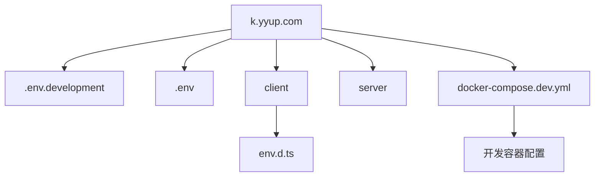
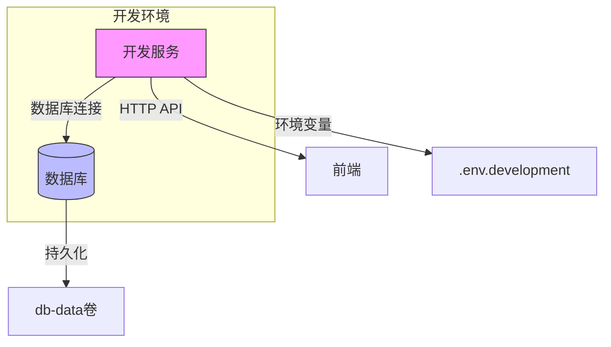
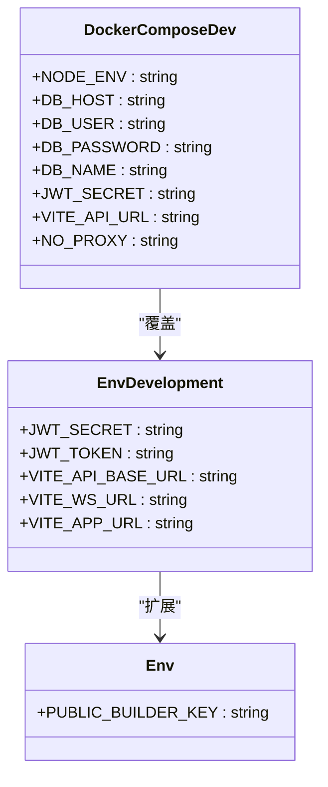
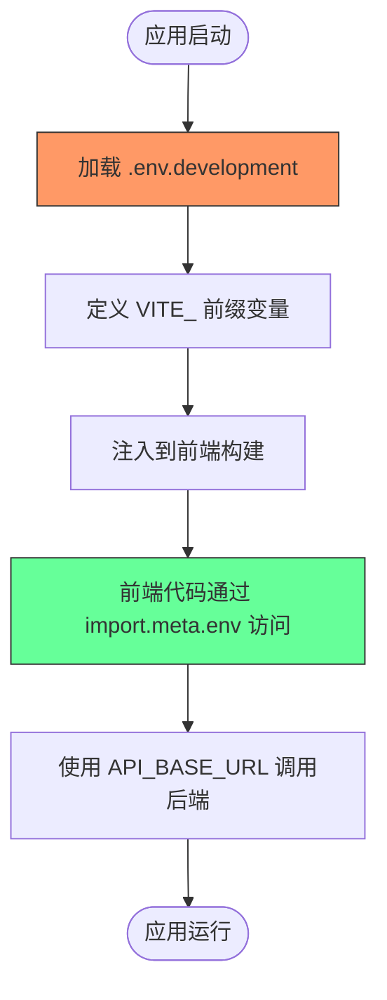
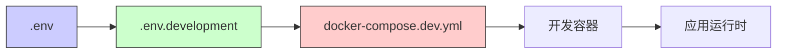

# 开发环境变量

<cite>
**本文档中引用的文件**  
- [.env.development](file://k.yyup.com/.env.development)
- [.env](file://k.yyup.com/.env)
- [client/env.d.ts](file://k.yyup.com/client/env.d.ts)
- [docker-compose.dev.yml](file://k.yyup.com/docker-compose.dev.yml)
</cite>

## 目录
1. [简介](#简介)
2. [项目结构](#项目结构)
3. [核心组件](#核心组件)
4. [架构概述](#架构概述)
5. [详细组件分析](#详细组件分析)
6. [依赖分析](#依赖分析)
7. [性能考虑](#性能考虑)
8. [故障排除指南](#故障排除指南)
9. [结论](#结论)

## 简介
本文档为k.yyup.com项目的开发环境提供详细的环境变量配置指南。重点介绍开发专用的配置参数，包括数据库连接、服务端口、调试模式、API密钥等关键设置。文档还包含本地开发环境中加载和验证这些变量的步骤，以及常见配置错误的排查方法。

## 项目结构
k.yyup.com项目采用前后端分离的架构，包含客户端、服务器端、配置文件和Docker开发环境配置。项目根目录下包含多个环境变量文件和Docker配置文件，支持开发、测试和生产环境的差异化配置。

**图示来源**  
- [.env.development](file://k.yyup.com/.env.development)
- [.env](file://k.yyup.com/.env)
- [client/env.d.ts](file://k.yyup.com/client/env.d.ts)
- [docker-compose.dev.yml](file://k.yyup.com/docker-compose.dev.yml)

**本节来源**  
- [.env.development](file://k.yyup.com/.env.development)
- [.env](file://k.yyup.com/.env)
- [docker-compose.dev.yml](file://k.yyup.com/docker-compose.dev.yml)

## 核心组件
项目的核心环境变量配置主要集中在`.env.development`文件中，该文件定义了开发环境专用的配置参数。前端通过Vite构建工具读取以`VITE_`为前缀的环境变量，后端服务则使用标准的Node.js环境变量机制。

**本节来源**  
- [.env.development](file://k.yyup.com/.env.development)
- [client/env.d.ts](file://k.yyup.com/client/env.d.ts)

## 架构概述
k.yyup.com项目采用微容器化开发架构，通过Docker Compose管理开发环境的各个服务。开发环境包含PostgreSQL数据库和统一开发服务，通过环境变量实现服务间的配置传递和连接。

**图示来源**  
- [docker-compose.dev.yml](file://k.yyup.com/docker-compose.dev.yml)
- [.env.development](file://k.yyup.com/.env.development)

## 详细组件分析

### 环境变量配置分析
项目使用多层级的环境变量配置机制，确保开发环境的安全性和灵活性。

#### 环境变量文件结构

**图示来源**  
- [.env.development](file://k.yyup.com/.env.development)
- [.env](file://k.yyup.com/.env)
- [docker-compose.dev.yml](file://k.yyup.com/docker-compose.dev.yml)

#### 前端环境变量流程

**图示来源**  
- [.env.development](file://k.yyup.com/.env.development)
- [client/env.d.ts](file://k.yyup.com/client/env.d.ts)

**本节来源**  
- [.env.development](file://k.yyup.com/.env.development)
- [.env](file://k.yyup.com/.env)
- [client/env.d.ts](file://k.yyup.com/client/env.d.ts)
- [docker-compose.dev.yml](file://k.yyup.com/docker-compose.dev.yml)

## 依赖分析
项目开发环境的配置依赖关系清晰，通过Docker Compose文件定义了服务间的依赖和环境变量传递机制。

**图示来源**  
- [.env](file://k.yyup.com/.env)
- [.env.development](file://k.yyup.com/.env.development)
- [docker-compose.dev.yml](file://k.yyup.com/docker-compose.dev.yml)

**本节来源**  
- [.env](file://k.yyup.com/.env)
- [.env.development](file://k.yyup.com/.env.development)
- [docker-compose.dev.yml](file://k.yyup.com/docker-compose.dev.yml)

## 性能考虑
开发环境配置考虑了性能优化因素，如通过卷挂载实现代码热重载，同时排除node_modules以避免权限问题。数据库连接配置也针对开发场景进行了优化。

## 故障排除指南
当遇到环境变量相关问题时，可按照以下步骤进行排查：

1. 确认`.env.development`文件存在且格式正确
2. 检查环境变量前缀是否正确（前端需使用VITE_前缀）
3. 验证Docker容器是否正确加载了环境变量
4. 检查网络配置和代理设置
5. 确认JWT密钥等安全配置的正确性

**本节来源**  
- [.env.development](file://k.yyup.com/.env.development)
- [docker-compose.dev.yml](file://k.yyup.com/docker-compose.dev.yml)

## 结论
k.yyup.com项目的开发环境变量配置体系完善，通过`.env.development`文件和`docker-compose.dev.yml`文件实现了开发环境的快速搭建和配置管理。建议开发者遵循现有命名规范，合理使用环境变量前缀，确保开发环境的稳定性和安全性。