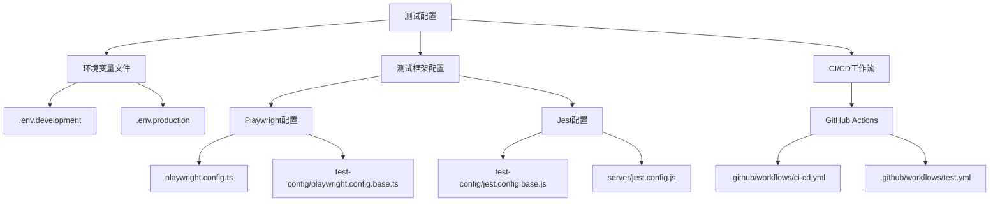
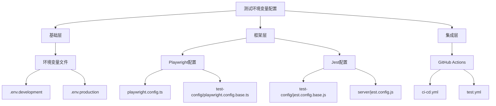
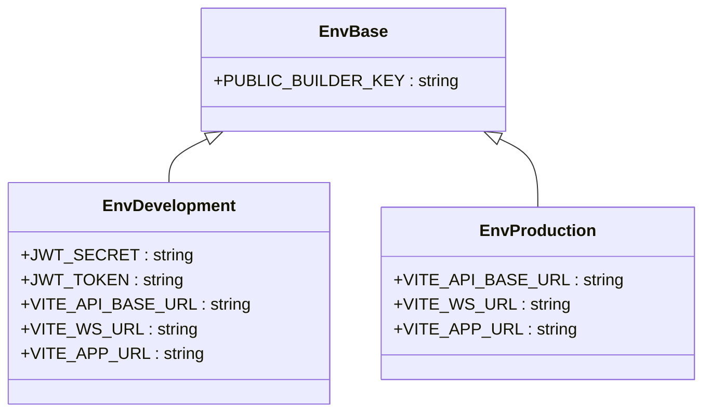
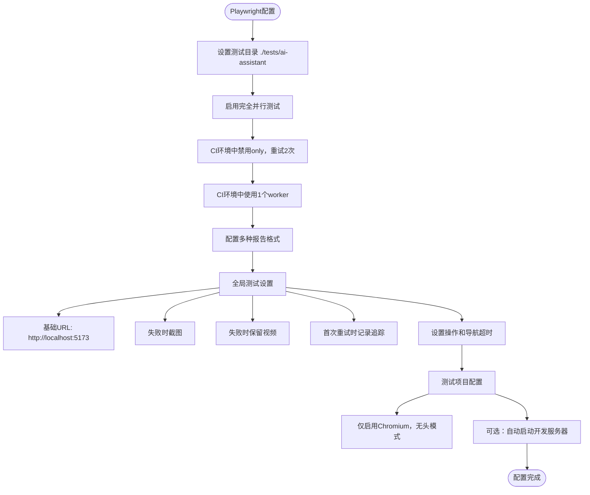
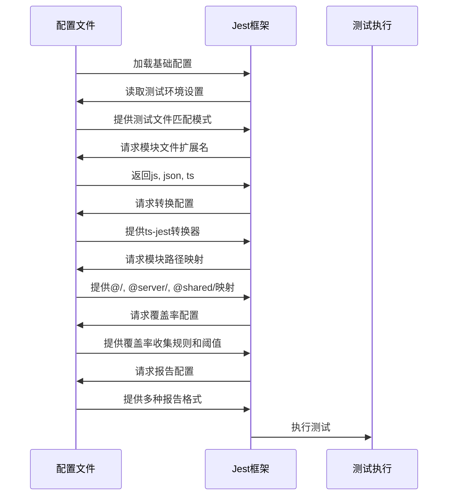
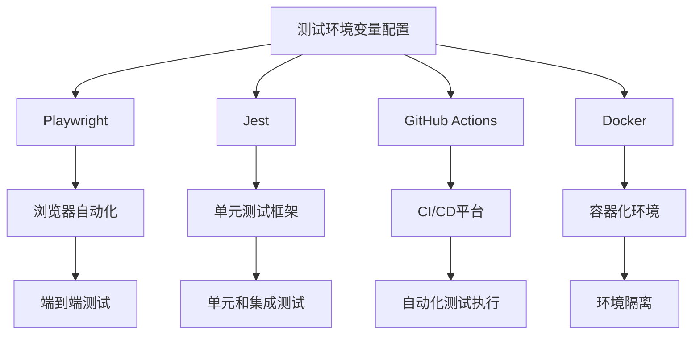

# 测试环境变量

<cite>
**本文档中引用的文件**  
- [.env](file://k.yyup.com/.env)
- [.env.development](file://k.yyup.com/.env.development)
- [.env.production](file://k.yyup.com/.env.production)
- [playwright.config.ts](file://k.yyup.com/playwright.config.ts)
- [test-config/playwright.config.base.ts](file://k.yyup.com/test-config/playwright.config.base.ts)
- [test-config/jest.config.base.js](file://k.yyup.com/test-config/jest.config.base.js)
- [server/jest.config.js](file://k.yyup.com/server/jest.config.js)
- [.github/workflows/ci-cd.yml](file://k.yyup.com/.github/workflows/ci-cd.yml)
- [.github/workflows/test.yml](file://k.yyup.com/.github/workflows/test.yml)
- [docker-compose.dev.yml](file://k.yyup.com/docker-compose.dev.yml)
</cite>

## 目录
1. [简介](#简介)
2. [项目结构](#项目结构)
3. [核心组件](#核心组件)
4. [架构概述](#架构概述)
5. [详细组件分析](#详细组件分析)
6. [依赖分析](#依赖分析)
7. [性能考虑](#性能考虑)
8. [故障排除指南](#故障排除指南)
9. [结论](#结论)
10. [附录](#附录)（如有必要）

## 简介
本文档旨在为k.yyup.com项目提供详细的测试环境变量配置指南。重点介绍测试环境专用的环境变量设置，涵盖测试数据库配置、自动化测试参数、CI/CD集成配置、模拟服务设置等关键参数。文档详细说明了每个测试环境变量的作用，包括如何配置单元测试、集成测试和端到端测试所需的特殊环境。此外，还提供了测试环境特有的配置选项，如测试数据生成规则、性能测试阈值、覆盖率报告配置等。文档包含如何在不同测试场景下正确加载和管理这些变量的步骤，以及测试环境与开发、生产环境的隔离策略。最后，为测试工程师提供最佳实践建议，如测试环境变量的版本控制和共享策略。

## 项目结构
k.yyup.com项目的测试环境变量配置主要分布在多个关键文件中，包括环境变量文件、测试框架配置文件和CI/CD工作流文件。项目采用分层的测试策略，结合Playwright进行端到端测试，Jest进行单元和集成测试，并通过GitHub Actions实现CI/CD集成。

**Diagram sources**
- [.env.development](file://k.yyup.com/.env.development)
- [.env.production](file://k.yyup.com/.env.production)
- [playwright.config.ts](file://k.yyup.com/playwright.config.ts)
- [test-config/playwright.config.base.ts](file://k.yyup.com/test-config/playwright.config.base.ts)
- [test-config/jest.config.base.js](file://k.yyup.com/test-config/jest.config.base.js)
- [server/jest.config.js](file://k.yyup.com/server/jest.config.js)
- [.github/workflows/ci-cd.yml](file://k.yyup.com/.github/workflows/ci-cd.yml)
- [.github/workflows/test.yml](file://k.yyup.com/.github/workflows/test.yml)

**Section sources**
- [k.yyup.com/](file://k.yyup.com/)
- [k.yyup.com/.env](file://k.yyup.com/.env)
- [k.yyup.com/.env.development](file://k.yyup.com/.env.development)
- [k.yyup.com/.env.production](file://k.yyup.com/.env.production)

## 核心组件
k.yyup.com项目的测试环境变量配置核心组件包括环境变量管理、测试框架配置和CI/CD集成。环境变量文件(.env系列)用于定义不同环境下的基础配置，测试框架配置文件(Playwright和Jest)用于定义测试执行的具体参数，CI/CD工作流文件(GitHub Actions)用于定义自动化测试的触发条件和执行流程。

**Section sources**
- [k.yyup.com/.env](file://k.yyup.com/.env)
- [k.yyup.com/.env.development](file://k.yyup.com/.env.development)
- [k.yyup.com/.env.production](file://k.yyup.com/.env.production)
- [playwright.config.ts](file://k.yyup.com/playwright.config.ts)
- [test-config/jest.config.base.js](file://k.yyup.com/test-config/jest.config.base.js)

## 架构概述
k.yyup.com项目的测试环境变量配置采用分层架构，从基础环境变量到具体测试框架配置，再到CI/CD集成，形成完整的测试配置体系。该架构确保了测试环境的一致性和可重复性，同时提供了足够的灵活性来适应不同的测试需求。

**Diagram sources**
- [.env.development](file://k.yyup.com/.env.development)
- [.env.production](file://k.yyup.com/.env.production)
- [playwright.config.ts](file://k.yyup.com/playwright.config.ts)
- [test-config/playwright.config.base.ts](file://k.yyup.com/test-config/playwright.config.base.ts)
- [test-config/jest.config.base.js](file://k.yyup.com/test-config/jest.config.base.js)
- [server/jest.config.js](file://k.yyup.com/server/jest.config.js)
- [.github/workflows/ci-cd.yml](file://k.yyup.com/.github/workflows/ci-cd.yml)
- [.github/workflows/test.yml](file://k.yyup.com/.github/workflows/test.yml)

## 详细组件分析
### 环境变量配置分析
k.yyup.com项目的环境变量配置分为多个层次，每个层次针对不同的环境和用途。开发环境(.env.development)和生产环境(.env.production)的配置文件定义了基础的API端点和WebSocket连接，而测试专用的配置则通过测试框架的配置文件来管理。

#### 环境变量文件

**Diagram sources**
- [.env](file://k.yyup.com/.env)
- [.env.development](file://k.yyup.com/.env.development)
- [.env.production](file://k.yyup.com/.env.production)

**Section sources**
- [.env](file://k.yyup.com/.env)
- [.env.development](file://k.yyup.com/.env.development)
- [.env.production](file://k.yyup.com/.env.production)

### 测试框架配置分析
#### Playwright配置
Playwright测试框架的配置文件定义了端到端测试的执行环境和参数。主配置文件playwright.config.ts针对AI助手系统的无头单元测试进行了专门配置，而基础配置文件test-config/playwright.config.base.ts则提供了统一的E2E测试配置。

**Diagram sources**
- [playwright.config.ts](file://k.yyup.com/playwright.config.ts)
- [test-config/playwright.config.base.ts](file://k.yyup.com/test-config/playwright.config.base.ts)

**Section sources**
- [playwright.config.ts](file://k.yyup.com/playwright.config.ts)
- [test-config/playwright.config.base.ts](file://k.yyup.com/test-config/playwright.config.base.ts)

#### Jest配置
Jest测试框架的配置文件为后端测试提供了统一的配置基础。基础配置文件test-config/jest.config.base.js定义了测试环境、文件匹配模式、转换配置、覆盖率收集和报告等核心参数，而服务器特定的配置文件server/jest.config.js则在此基础上进行了扩展和定制。

**Diagram sources**
- [test-config/jest.config.base.js](file://k.yyup.com/test-config/jest.config.base.js)
- [server/jest.config.js](file://k.yyup.com/server/jest.config.js)

**Section sources**
- [test-config/jest.config.base.js](file://k.yyup.com/test-config/jest.config.base.js)
- [server/jest.config.js](file://k.yyup.com/server/jest.config.js)

### CI/CD集成配置分析
GitHub Actions工作流文件定义了自动化测试的触发条件和执行流程。ci-cd.yml和test.yml文件配置了在代码推送和拉取请求时自动运行测试的流程，确保代码质量的持续监控。

**Diagram sources**
- [.github/workflows/ci-cd.yml](file://k.yyup.com/.github/workflows/ci-cd.yml)
- [.github/workflows/test.yml](file://k.yyup.com/.github/workflows/test.yml)

**Section sources**
- [.github/workflows/ci-cd.yml](file://k.yyup.com/.github/workflows/ci-cd.yml)
- [.github/workflows/test.yml](file://k.yyup.com/.github/workflows/test.yml)

## 依赖分析
k.yyup.com项目的测试环境变量配置依赖于多个外部组件和工具，包括Playwright、Jest、GitHub Actions和Docker。这些依赖项通过package.json和docker-compose文件进行管理，确保测试环境的一致性和可重复性。

**Diagram sources**
- [package.json](file://k.yyup.com/package.json)
- [docker-compose.dev.yml](file://k.yyup.com/docker-compose.dev.yml)
- [playwright.config.ts](file://k.yyup.com/playwright.config.ts)
- [test-config/jest.config.base.js](file://k.yyup.com/test-config/jest.config.base.js)

**Section sources**
- [package.json](file://k.yyup.com/package.json)
- [docker-compose.dev.yml](file://k.yyup.com/docker-compose.dev.yml)

## 性能考虑
在配置测试环境变量时，需要考虑多个性能因素，包括测试执行速度、资源利用率和报告生成效率。通过合理配置并行度、超时时间和报告格式，可以优化测试流程的性能。

**Section sources**
- [playwright.config.ts](file://k.yyup.com/playwright.config.ts)
- [test-config/jest.config.base.js](file://k.yyup.com/test-config/jest.config.base.js)

## 故障排除指南
当测试环境变量配置出现问题时，可以按照以下步骤进行排查：
1. 检查环境变量文件是否正确加载
2. 验证测试框架配置文件的语法是否正确
3. 确认CI/CD工作流文件的触发条件是否正确
4. 检查依赖项是否正确安装
5. 查看测试报告和日志文件以获取详细错误信息

**Section sources**
- [.env.development](file://k.yyup.com/.env.development)
- [playwright.config.ts](file://k.yyup.com/playwright.config.ts)
- [test-config/jest.config.base.js](file://k.yyup.com/test-config/jest.config.base.js)
- [.github/workflows/ci-cd.yml](file://k.yyup.com/.github/workflows/ci-cd.yml)

## 结论
k.yyup.com项目的测试环境变量配置体系完整且层次分明，通过环境变量文件、测试框架配置和CI/CD集成的有机结合，实现了测试环境的高效管理和自动化。该配置体系不仅确保了测试的一致性和可重复性，还提供了足够的灵活性来适应不同的测试需求。建议测试工程师遵循本文档的最佳实践，合理配置和管理测试环境变量，以提高测试效率和质量。