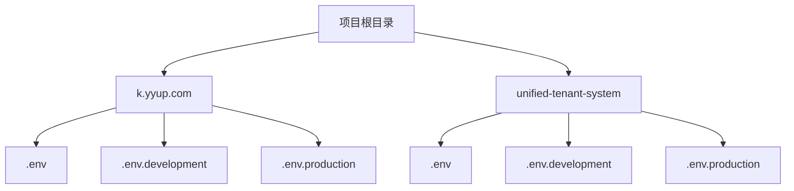
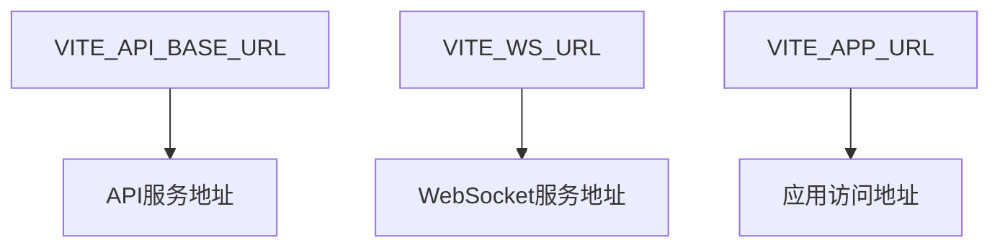
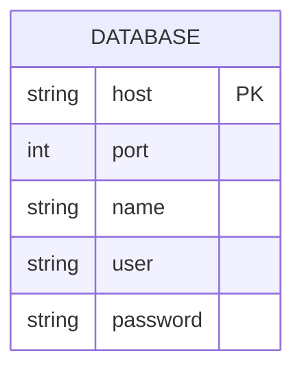
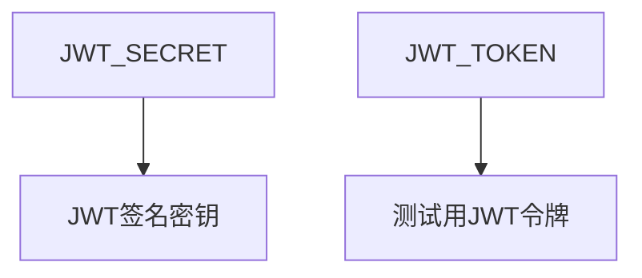

# 环境变量设置

<cite>
**本文档引用的文件**  
- [.env](file://k.yyup.com/.env)
- [.env.development](file://k.yyup.com/.env.development)
- [.env.production](file://k.yyup.com/.env.production)
- [unified-tenant-system/.env](file://unified-tenant-system/.env)
- [unified-tenant-system/.env.development](file://unified-tenant-system/.env.development)
- [unified-tenant-system/.env.production](file://unified-tenant-system/.env.production)
- [package.json](file://k.yyup.com/package.json)
- [unified-tenant-system/package.json](file://unified-tenant-system/package.json)
</cite>

## 目录
1. [简介](#简介)
2. [项目结构与环境变量文件](#项目结构与环境变量文件)
3. [核心环境变量配置](#核心环境变量配置)
4. [不同环境的配置差异](#不同环境的配置差异)
5. [环境变量安全管理](#环境变量安全管理)
6. [环境变量验证与故障处理](#环境变量验证与故障处理)
7. [最佳实践建议](#最佳实践建议)

## 简介
本指南详细介绍了k.yyupgame项目中环境变量的设置方法，重点分析了各个.env文件的作用和配置项。文档涵盖了开发、生产、测试等不同环境下的环境变量配置差异，包括数据库连接、API密钥、服务端口等关键配置。同时提供了环境变量的安全管理建议、验证方法和故障处理方案，为开发者提供全面的配置指导。

## 项目结构与环境变量文件
项目包含两个主要子系统：k.yyup.com和unified-tenant-system，每个子系统都有独立的环境变量配置文件。这些文件用于管理不同环境下的配置参数，确保应用在不同部署环境中能够正确运行。

**Diagram sources**
- [k.yyup.com/.env](file://k.yyup.com/.env)
- [k.yyup.com/.env.development](file://k.yyup.com/.env.development)
- [k.yyup.com/.env.production](file://k.yyup.com/.env.production)
- [unified-tenant-system/.env](file://unified-tenant-system/.env)
- [unified-tenant-system/.env.development](file://unified-tenant-system/.env.development)
- [unified-tenant-system/.env.production](file://unified-tenant-system/.env.production)

**Section sources**
- [k.yyup.com/.env](file://k.yyup.com/.env)
- [unified-tenant-system/.env](file://unified-tenant-system/.env)

## 核心环境变量配置
项目中的环境变量主要分为前端API配置、数据库连接、安全密钥和系统集成等几大类。这些配置通过dotenv等工具加载到应用中，实现配置与代码的分离。

### 前端API配置
前端环境变量以VITE_为前缀，用于配置API基础URL、WebSocket连接和应用URL等。

**Diagram sources**
- [k.yyup.com/.env.development](file://k.yyup.com/.env.development)
- [k.yyup.com/.env.production](file://k.yyup.com/.env.production)
- [unified-tenant-system/.env.development](file://unified-tenant-system/.env.development)
- [unified-tenant-system/.env.production](file://unified-tenant-system/.env.production)

### 数据库连接配置
数据库相关环境变量包括主机地址、端口、数据库名称、用户名和密码等，用于建立数据库连接。

**Diagram sources**
- [unified-tenant-system/.env](file://unified-tenant-system/.env)

### 安全密钥配置
安全相关的环境变量包括JWT密钥和令牌，用于身份验证和会话管理。

**Diagram sources**
- [k.yyup.com/.env.development](file://k.yyup.com/.env.development)
- [unified-tenant-system/.env.development](file://unified-tenant-system/.env.development)

**Section sources**
- [k.yyup.com/.env.development](file://k.yyup.com/.env.development)
- [unified-tenant-system/.env.development](file://unified-tenant-system/.env.development)

## 不同环境的配置差异
项目通过不同的.env文件来区分开发、生产和测试环境的配置，确保各环境的独立性和安全性。

### 开发环境配置
开发环境配置主要用于本地开发和测试，使用测试服务器和开发密钥。

| 配置项 | k.yyup.com | unified-tenant-system |
|--------|-----------|----------------------|
| VITE_API_BASE_URL | https://k.yyup.cc | https://tphezdvikvva.sealoshzh.site |
| VITE_WS_URL | wss://tphezdvikvva.sealoshzh.site | wss://tphezdvikvva.sealoshzh.site |
| JWT_SECRET | your_secret_key | your_secret_key |

**Section sources**
- [k.yyup.com/.env.development](file://k.yyup.com/.env.development)
- [unified-tenant-system/.env.development](file://unified-tenant-system/.env.development)

### 生产环境配置
生产环境配置用于正式部署，指向生产服务器和域名。

| 配置项 | 值 |
|--------|-----|
| VITE_API_BASE_URL | https://k.yyup.cc |
| VITE_WS_URL | wss://k.yyup.cc |
| VITE_APP_URL | https://k.yyup.cc |

**Section sources**
- [k.yyup.com/.env.production](file://k.yyup.com/.env.production)
- [unified-tenant-system/.env.production](file://unified-tenant-system/.env.production)

### 统一租户系统配置
统一租户系统有专门的数据库和租户管理配置。

| 配置项 | 说明 |
|--------|------|
| DB_HOST | dbconn.sealoshzh.site |
| DB_PORT | 43906 |
| DB_NAME | kargerdensales |
| DB_USER | root |
| DB_PASSWORD | pwk5ls7j |
| UNIFIED_TENANT_BASE_URL | http://rent.yyup.cc |
| BASE_DOMAIN | yyup.cc |

**Section sources**
- [unified-tenant-system/.env](file://unified-tenant-system/.env)

## 环境变量安全管理
为确保敏感信息的安全，项目采用了多种安全措施来管理环境变量。

### 敏感信息保护
- 所有包含敏感信息的.env文件都应添加到.gitignore中，防止意外提交到版本控制系统
- 生产环境的JWT密钥等敏感信息不应硬编码在代码中
- 数据库密码等机密信息应使用强密码并定期更换

### 加密与存储
- 建议使用专门的密钥管理服务（如AWS KMS、Hashicorp Vault）来存储和管理敏感环境变量
- 在CI/CD管道中，应使用加密的环境变量功能来保护敏感信息
- 避免在日志中输出包含敏感信息的环境变量

**Section sources**
- [k.yyup.com/.env](file://k.yyup.com/.env)
- [unified-tenant-system/.env](file://unified-tenant-system/.env)

## 环境变量验证与故障处理
为确保环境变量配置正确，需要建立验证机制和故障处理流程。

### 配置验证步骤
1. 检查必要的环境变量是否存在
2. 验证API URL格式是否正确
3. 测试数据库连接是否成功
4. 验证JWT密钥长度和复杂度
5. 检查WebSocket连接是否可用

### 加载失败处理
当环境变量加载失败时，应采取以下措施：
- 提供清晰的错误信息，指出缺失或无效的配置项
- 使用合理的默认值作为后备方案
- 记录详细的错误日志以便排查问题
- 在启动时进行配置验证，防止应用在错误配置下运行

**Section sources**
- [k.yyup.com/package.json](file://k.yyup.com/package.json)
- [unified-tenant-system/package.json](file://unified-tenant-system/package.json)

## 最佳实践建议
为提高配置管理的效率和安全性，建议遵循以下最佳实践。

### 统一配置管理
- 使用统一的配置管理方案，如dotenv或专门的配置服务
- 建立配置模板文件（如.env.template），方便新开发者快速配置
- 在文档中详细说明每个环境变量的作用和取值范围

### 命名规范
- 使用一致的命名约定，如全部大写，单词间用下划线分隔
- 为不同类型的配置使用前缀，如VITE_用于前端，DB_用于数据库
- 避免使用模糊或容易混淆的名称

### 版本控制
- 将.env.example或.env.template文件纳入版本控制，作为配置参考
- 在.gitignore中排除实际的.env文件
- 在文档中说明如何从模板创建实际的配置文件

**Section sources**
- [k.yyup.com/package.json](file://k.yyup.com/package.json)
- [unified-tenant-system/package.json](file://unified-tenant-system/package.json)