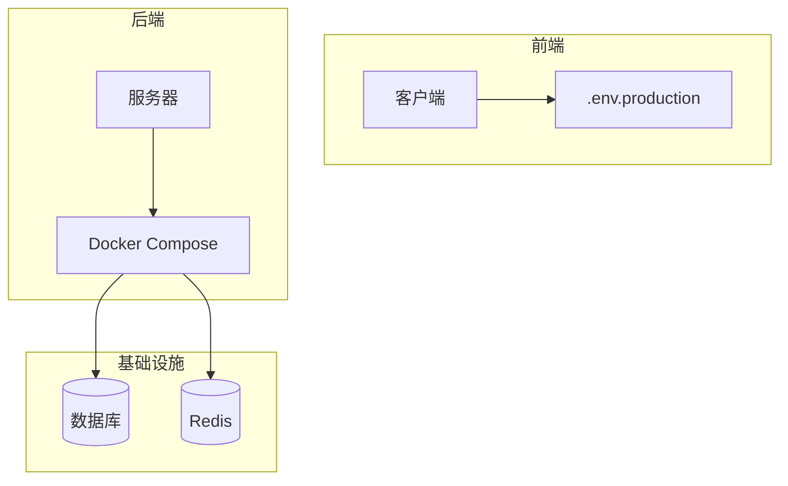
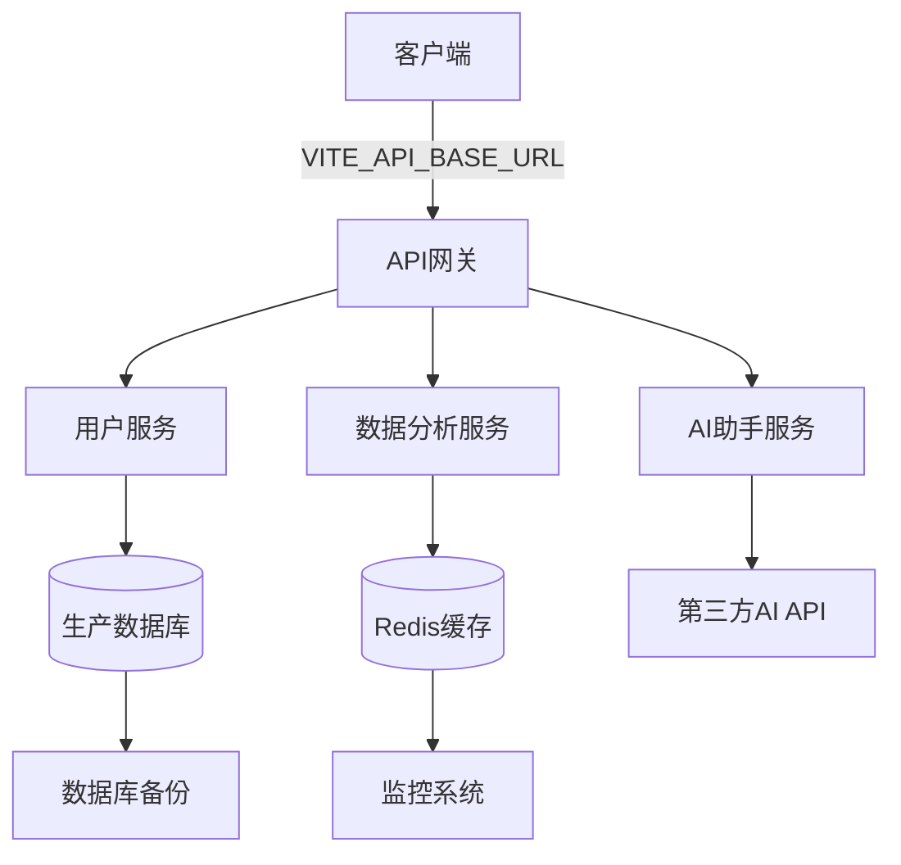
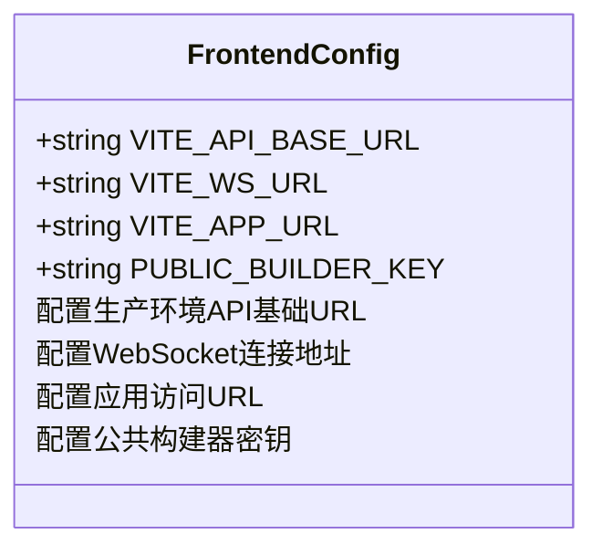
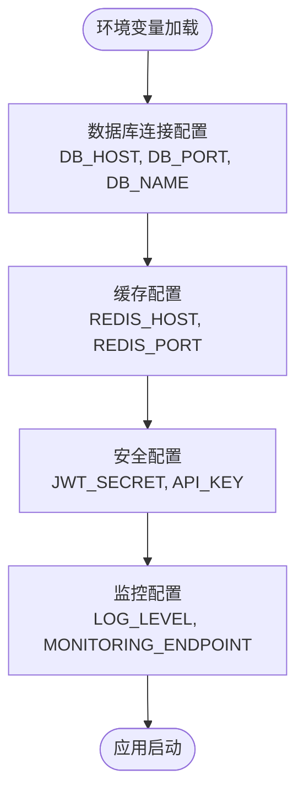
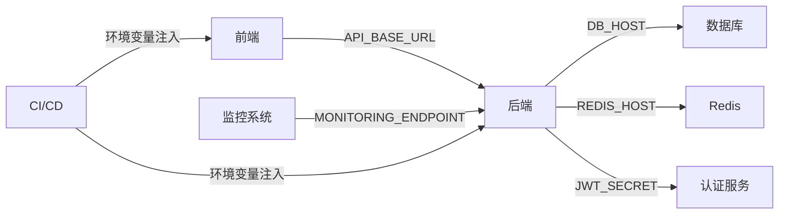

# 生产环境变量

<cite>
**本文档中引用的文件**  
- [.env.production](file://k.yyup.com/.env.production)
- [docker-compose.yml](file://k.yyup.com/docker-compose.yml)
- [client/tests/environment/production-consistency.test.ts](file://k.yyup.com/client/tests/environment/production-consistency.test.ts)
- [client/tests/integration/real-env.config.ts](file://k.yyup.com/client/tests/integration/real-env.config.ts)
</cite>

## 目录
1. [引言](#引言)
2. [项目结构](#项目结构)
3. [核心组件](#核心组件)
4. [架构概述](#架构概述)
5. [详细组件分析](#详细组件分析)
6. [依赖分析](#依赖分析)
7. [性能考虑](#性能考虑)
8. [故障排除指南](#故障排除指南)
9. [结论](#结论)
10. [附录](#附录)（如有必要）

## 引言
本文档旨在为k.yyup.com项目的生产环境提供详细的环境变量配置指南。重点介绍生产环境专用的配置参数，包括数据库连接、安全密钥、API端点、监控配置和日志级别等关键设置。文档还强调了生产环境变量的安全性要求，如敏感信息加密、访问控制和备份策略，并提供部署、验证和应急恢复的最佳实践。

## 项目结构
k.yyup.com项目采用典型的前后端分离架构，包含客户端、服务器端、数据库和Docker部署配置。生产环境变量主要分布在`.env.production`文件和Docker Compose配置中。

**Diagram sources**
- [.env.production](file://k.yyup.com/.env.production)
- [docker-compose.yml](file://k.yyup.com/docker-compose.yml)

**Section sources**
- [.env.production](file://k.yyup.com/.env.production)
- [docker-compose.yml](file://k.yyup.com/docker-compose.yml)

## 核心组件
生产环境的核心组件包括前端应用、后端服务、数据库和缓存系统。环境变量在这些组件之间建立连接，确保系统在生产环境中的稳定运行。

**Section sources**
- [.env.production](file://k.yyup.com/.env.production)
- [docker-compose.yml](file://k.yyup.com/docker-compose.yml)

## 架构概述
k.yyup.com的生产环境采用微服务架构，通过Docker容器化部署。前端通过环境变量配置API基础URL，后端服务通过环境变量连接数据库和缓存系统。

**Diagram sources**
- [.env.production](file://k.yyup.com/.env.production)
- [docker-compose.yml](file://k.yyup.com/docker-compose.yml)

## 详细组件分析

### 前端环境变量分析
前端生产环境变量主要配置API连接和应用URL。

**Diagram sources**
- [.env.production](file://k.yyup.com/.env.production)
- [.env](file://k.yyup.com/.env)

**Section sources**
- [.env.production](file://k.yyup.com/.env.production)
- [.env](file://k.yyup.com/.env)

### 后端环境变量分析
后端环境变量配置包括数据库连接、JWT密钥和监控设置。

**Diagram sources**
- [docker-compose.yml](file://k.yyup.com/docker-compose.yml)
- [client/tests/environment/production-consistency.test.ts](file://k.yyup.com/client/tests/environment/production-consistency.test.ts)

**Section sources**
- [docker-compose.yml](file://k.yyup.com/docker-compose.yml)
- [client/tests/environment/production-consistency.test.ts](file://k.yyup.com/client/tests/environment/production-consistency.test.ts)

## 依赖分析
生产环境的组件依赖关系通过环境变量进行配置和管理。

**Diagram sources**
- [.env.production](file://k.yyup.com/.env.production)
- [docker-compose.yml](file://k.yyup.com/docker-compose.yml)

**Section sources**
- [.env.production](file://k.yyup.com/.env.production)
- [docker-compose.yml](file://k.yyup.com/docker-compose.yml)

## 性能考虑
生产环境的性能优化通过环境变量配置实现，包括连接池大小、缓存策略和日志级别。

**Section sources**
- [docker-compose.yml](file://k.yyup.com/docker-compose.yml)
- [client/tests/integration/real-env.config.ts](file://k.yyup.com/client/tests/integration/real-env.config.ts)

## 故障排除指南
生产环境变量配置的常见问题及解决方案。

**Section sources**
- [client/tests/environment/production-consistency.test.ts](file://k.yyup.com/client/tests/environment/production-consistency.test.ts)
- [client/tests/integration/real-env.config.ts](file://k.yyup.com/client/tests/integration/real-env.config.ts)

## 结论
本文档详细介绍了k.yyup.com项目生产环境变量的配置方法和最佳实践。通过合理配置环境变量，可以确保系统在生产环境中的稳定性、安全性和可维护性。