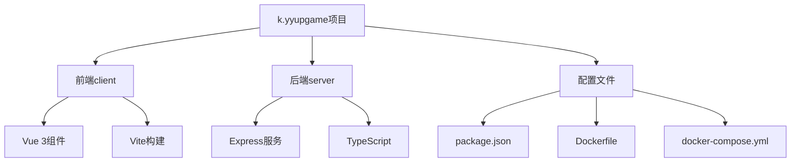
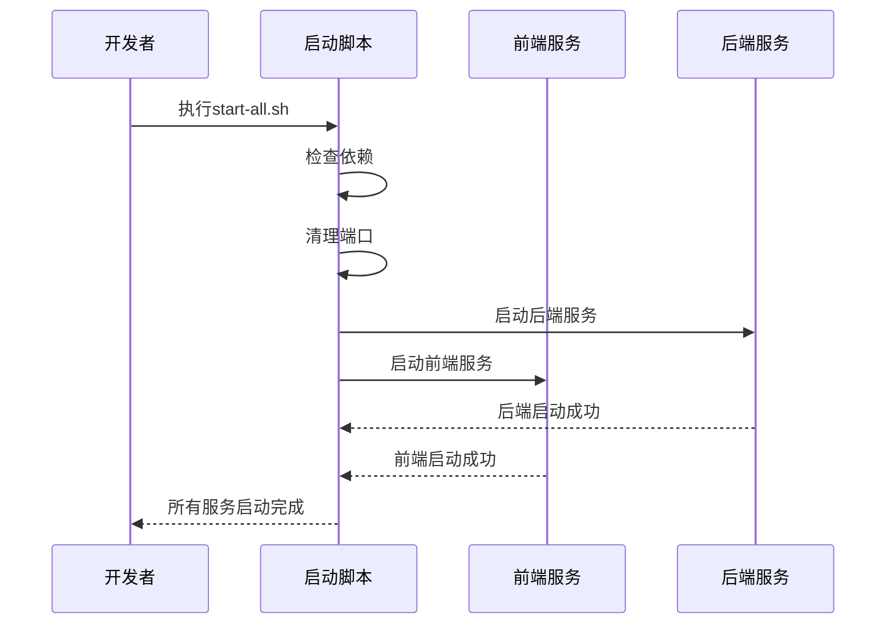
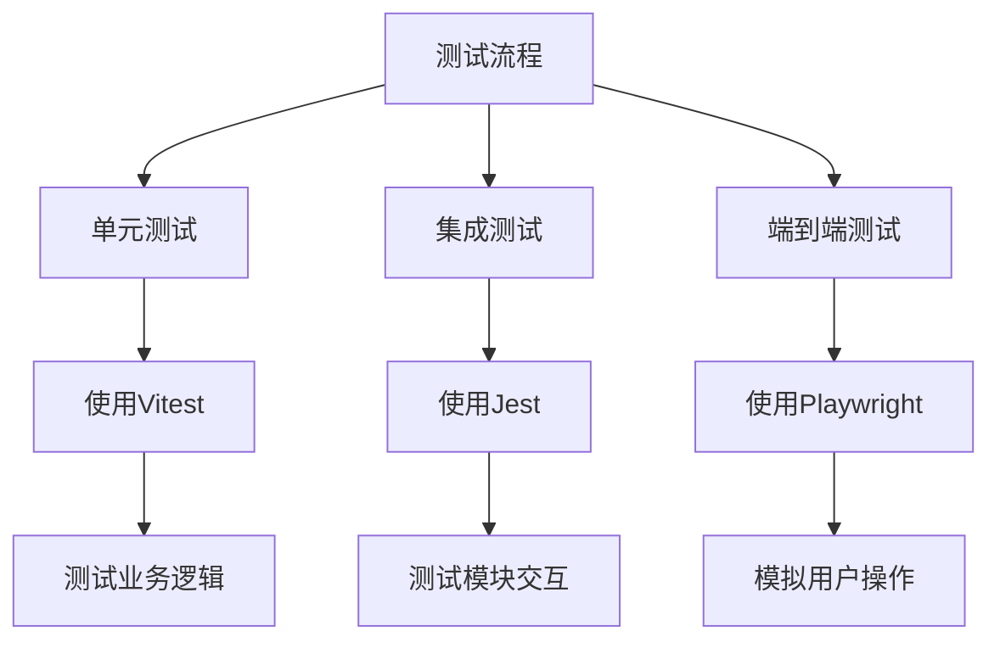

# 开发者指南

<cite>
**本文档中引用的文件**  
- [package.json](file://k.yyup.com/package.json)
- [tsconfig.json](file://k.yyup.com/tsconfig.json)
- [Dockerfile](file://k.yyup.com/Dockerfile)
- [docker-compose.yml](file://k.yyup.com/docker-compose.yml)
- [start-all.sh](file://k.yyup.com/start-all.sh)
- [start-frontend.bat](file://k.yyup.com/start-frontend.bat)
- [start-backend.sh](file://k.yyup.com/start-backend.sh)
- [.env](file://k.yyup.com/.env)
- [playwright.config.ts](file://k.yyup.com/playwright.config.ts)
- [client/package.json](file://k.yyup.com/client/package.json)
- [server/package.json](file://k.yyup.com/server/package.json)
- [client/vitest.config.ts](file://k.yyup.com/client/vitest.config.ts)
- [CONTRIBUTING.md](file://k.yyup.com/CONTRIBUTING.md)
- [.gitignore](file://k.yyup.com/.gitignore)
- [docker-compose.dev.yml](file://k.yyup.com/docker-compose.dev.yml)
- [docker-compose.simple.yml](file://k.yyup.com/docker-compose.simple.yml)
</cite>

## 目录
1. [简介](#简介)
2. [项目结构](#项目结构)
3. [开发环境准备](#开发环境准备)
4. [项目启动步骤](#项目启动步骤)
5. [代码规范](#代码规范)
6. [调试技巧](#调试技巧)
7. [测试流程](#测试流程)
8. [快速上手指南](#快速上手指南)

## 简介
本开发者指南旨在为新加入k.yyupgame项目的开发者提供全面的开发环境搭建和日常开发流程指导。文档详细介绍了开发环境的准备、项目启动步骤、代码规范、调试技巧和测试流程，帮助开发者快速上手并高效地进行开发工作。

## 项目结构
k.yyupgame项目采用前后端分离的架构，主要包含前端和后端两个部分。前端使用Vue 3框架，后端使用Node.js和Express框架。项目根目录下包含多个关键文件和目录，如`package.json`、`Dockerfile`、`docker-compose.yml`等，用于管理项目依赖、构建和部署。



**图示来源**
- [package.json](file://k.yyup.com/package.json)
- [Dockerfile](file://k.yyup.com/Dockerfile)
- [docker-compose.yml](file://k.yyup.com/docker-compose.yml)

**本节来源**
- [package.json](file://k.yyup.com/package.json)
- [Dockerfile](file://k.yyup.com/Dockerfile)
- [docker-compose.yml](file://k.yyup.com/docker-compose.yml)

## 开发环境准备
为了顺利进行k.yyupgame项目的开发，您需要准备以下开发环境：

### Node.js安装
项目要求Node.js版本为18.x。您可以使用nvm（Node Version Manager）来管理Node.js版本：
```bash
nvm install 18
nvm use 18
```

### TypeScript配置
项目使用TypeScript进行开发，相关配置在`tsconfig.json`文件中定义。主要配置包括：
- 目标ECMAScript版本：ESNext
- 模块系统：ESNext
- 严格类型检查：启用
- 路径别名：@/* 指向src目录

### Docker配置
项目提供了Docker支持，用于构建和部署。Dockerfile基于node:18-alpine镜像，安装了必要的依赖并配置了nginx和supervisor服务。

### 环境变量
项目使用`.env`文件管理环境变量。开发环境中，您需要创建`.env.development`文件并配置相关变量。

**本节来源**
- [package.json](file://k.yyup.com/package.json)
- [tsconfig.json](file://k.yyup.com/tsconfig.json)
- [Dockerfile](file://k.yyup.com/Dockerfile)
- [.env](file://k.yyup.com/.env)

## 项目启动步骤
k.yyupgame项目提供了多种启动方式，包括一键启动脚本、分别启动前端和后端服务。

### 一键启动脚本
项目提供了`start-all.sh`脚本，可以一键启动前后端服务：
```bash
./start-all.sh
```
该脚本会自动检查依赖、清理占用端口，并启动前后端服务。

### 分别启动前端和后端
您也可以分别启动前端和后端服务：

**启动前端服务：**
```bash
cd client
npm run dev
```

**启动后端服务：**
```bash
cd server
npm run dev
```

### 使用Docker启动
项目提供了docker-compose配置，可以使用Docker快速启动开发环境：
```bash
docker-compose up
```



**图示来源**
- [start-all.sh](file://k.yyup.com/start-all.sh)
- [client/package.json](file://k.yyup.com/client/package.json)
- [server/package.json](file://k.yyup.com/server/package.json)

**本节来源**
- [start-all.sh](file://k.yyup.com/start-all.sh)
- [start-frontend.bat](file://k.yyup.com/start-frontend.bat)
- [start-backend.sh](file://k.yyup.com/start-backend.sh)
- [docker-compose.yml](file://k.yyup.com/docker-compose.yml)

## 代码规范
为了保持代码的一致性和可维护性，项目制定了严格的代码规范。

### TypeScript编码规范
- 使用interface定义对象类型
- 异步函数返回Promise类型
- 变量和函数使用camelCase命名
- 类和接口使用PascalCase命名
- 常量使用UPPER_SNAKE_CASE命名

### Vue组件编写规范
- 使用`<script setup>`语法糖
- 组件props使用interface定义并设置默认值
- 使用computed属性处理计算逻辑
- 样式使用scoped属性避免样式污染

### Git提交规范
项目采用标准化的Git提交信息格式：
```
<type>(<scope>): <subject>

<body>

<footer>
```
其中type包括：feat（新功能）、fix（Bug修复）、docs（文档更新）、style（代码格式）、refactor（重构）、perf（性能优化）、test（测试）、chore（构建工具）。

**本节来源**
- [CONTRIBUTING.md](file://k.yyup.com/CONTRIBUTING.md)
- [client/package.json](file://k.yyup.com/client/package.json)
- [server/package.json](file://k.yyup.com/server/package.json)

## 调试技巧
有效的调试技巧可以帮助开发者快速定位和解决问题。

### 前端调试
- 使用浏览器开发者工具检查组件状态和props
- 在Vue Devtools中查看组件树和状态
- 使用console.log或debugger语句进行断点调试
- 利用Vite的热重载功能快速查看修改效果

### 后端调试
- 使用Node.js的--inspect参数启动调试模式
- 在VS Code中配置launch.json进行断点调试
- 查看服务器日志定位问题
- 使用Postman或curl测试API接口

### 数据库调试
- 使用数据库客户端工具连接数据库
- 执行SQL查询检查数据状态
- 查看数据库日志分析性能问题
- 使用数据库管理工具进行数据迁移和种子数据操作

**本节来源**
- [server/package.json](file://k.yyup.com/server/package.json)
- [client/package.json](file://k.yyup.com/client/package.json)

## 测试流程
项目建立了完整的测试体系，包括单元测试、集成测试和端到端测试。

### 单元测试
使用Vitest框架进行单元测试，主要测试业务逻辑和工具函数：
```bash
npm run test:unit
```

### 集成测试
使用Jest框架进行集成测试，测试模块间的交互：
```bash
npm run test:integration
```

### 端到端测试
使用Playwright框架进行端到端测试，模拟用户操作：
```bash
npm run test:e2e
```

### 测试覆盖率
项目要求测试覆盖率不低于80%，可以使用以下命令查看覆盖率报告：
```bash
npm run test:coverage
```



**图示来源**
- [playwright.config.ts](file://k.yyup.com/playwright.config.ts)
- [client/package.json](file://k.yyup.com/client/package.json)
- [server/package.json](file://k.yyup.com/server/package.json)

**本节来源**
- [playwright.config.ts](file://k.yyup.com/playwright.config.ts)
- [client/package.json](file://k.yyup.com/client/package.json)
- [server/package.json](file://k.yyup.com/server/package.json)

## 快速上手指南
为了帮助新开发者快速上手，以下是推荐的开发流程：

1. **克隆项目**
```bash
git clone https://github.com/yyupcompany/k.yyup.com.git
cd k.yyup.com
```

2. **安装依赖**
```bash
npm run install:all
```

3. **启动开发环境**
```bash
./start-all.sh
```

4. **开始开发**
- 前端代码位于client目录
- 后端代码位于server目录
- 遵循代码规范进行开发
- 编写相应的测试用例

5. **提交代码**
- 创建feature分支
- 提交代码并遵循提交规范
- 创建Pull Request进行代码审查

通过遵循本指南，您将能够快速融入k.yyupgame项目的开发工作，高效地贡献代码。

**本节来源**
- [CONTRIBUTING.md](file://k.yyup.com/CONTRIBUTING.md)
- [package.json](file://k.yyup.com/package.json)
- [start-all.sh](file://k.yyup.com/start-all.sh)