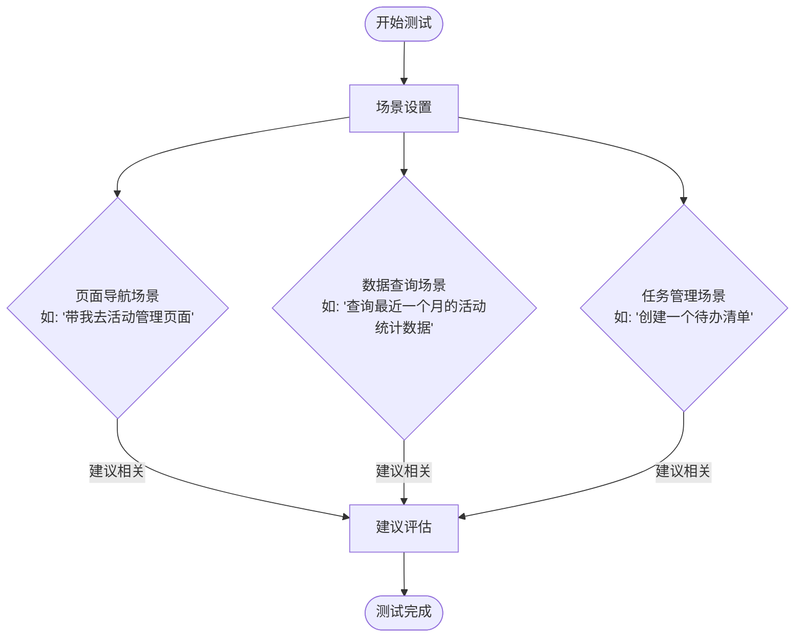
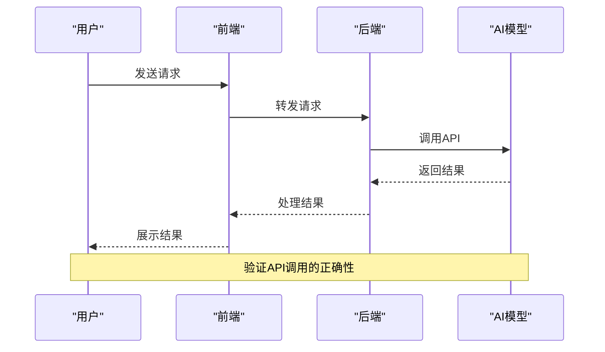
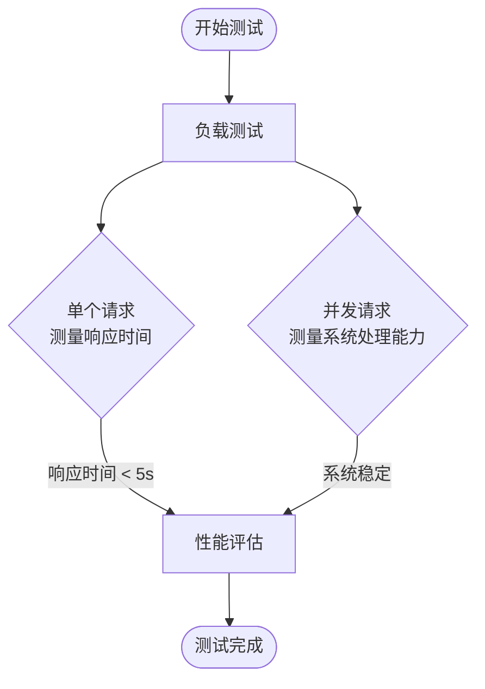

# AI功能测试

<cite>
**本文档引用的文件**   
- [ai-assistant-test-suite.js](file://unified-tenant-system/ai-assistant-test-suite.js)
- [ai-assistant-test-executor.js](file://unified-tenant-system/ai-assistant-test-executor.js)
- [comprehensive-ai-test.js](file://unified-tenant-system/comprehensive-ai-test.js)
- [ai-assistant-test-results.json](file://k.yyup.com/ai-assistant-test-results.json)
- [ai-assistant-simple-test-report.json](file://k.yyup.com/ai-assistant-simple-test-report.json)
- [ai-assistant-test-suite.js](file://unified-tenant-system/ai-assistant-test-suite.js)
- [ai-assistant-test-executor.js](file://unified-tenant-system/ai-assistant-test-executor.js)
- [comprehensive-ai-test.js](file://unified-tenant-system/comprehensive-ai-test.js)
- [ai-assistant-test-results.json](file://k.yyup.com/ai-assistant-test-results.json)
- [ai-assistant-simple-test-report.json](file://k.yyup.com/ai-assistant-simple-test-report.json)
</cite>

## 目录
1. [引言](#引言)
2. [AI助手对话交互测试](#ai助手对话交互测试)
3. [智能建议功能验证](#智能建议功能验证)
4. [AI模型集成测试](#ai模型集成测试)
5. [AI功能性能测试](#ai功能性能测试)
6. [边界情况与异常处理测试](#边界情况与异常处理测试)
7. [测试用例设计](#测试用例设计)
8. [结论](#结论)

## 引言
本指南旨在为k.yyupgame项目中的AI功能提供全面的测试方法。通过分析项目中的测试文件和报告，我们将详细介绍如何系统性地测试AI助手的对话交互、智能建议、模型集成、性能表现以及边界情况处理能力。文档基于实际的测试代码和结果，确保测试方法的实用性和有效性。

**Section sources**
- [ai-assistant-test-suite.js](file://unified-tenant-system/ai-assistant-test-suite.js#L1-L20)
- [comprehensive-ai-test.js](file://unified-tenant-system/comprehensive-ai-test.js#L1-L10)

## AI助手对话交互测试
AI助手的对话交互测试主要关注自然语言理解、上下文保持和响应生成的准确性。测试通过模拟用户与AI助手的多轮对话，验证其理解和响应能力。

### 自然语言理解测试
测试AI助手对不同类型的用户输入的理解能力，包括简单查询、复杂指令和模糊请求。测试用例覆盖了多种意图识别，如页面操作、数据可视化、任务管理等。

**Diagram sources**
- [comprehensive-ai-test.js](file://unified-tenant-system/comprehensive-ai-test.js#L133-L198)

### 上下文保持测试
验证AI助手在多轮对话中保持上下文的能力。测试通过连续发送相关消息，检查AI是否能正确理解并回应上下文相关的请求。

**Section sources**
- [ai-assistant-test-suite.js](file://unified-tenant-system/ai-assistant-test-suite.js#L69-L75)
- [comprehensive-ai-test.js](file://unified-tenant-system/comprehensive-ai-test.js#L201-L257)

### 响应生成准确性测试
评估AI助手生成响应的准确性和相关性。测试通过发送特定问题，验证返回的答案是否正确、完整且符合预期。

**Section sources**
- [ai-assistant-test-suite.js](file://unified-tenant-system/ai-assistant-test-suite.js#L71-L72)
- [ai-assistant-test-results.json](file://k.yyup.com/ai-assistant-test-results.json#L1-L100)

## 智能建议功能验证
智能建议功能的验证主要评估其相关性和实用性。测试通过分析AI助手在不同场景下提供的建议，确保其能够为用户提供有价值的指导。

### 建议相关性测试
测试AI助手提供的建议是否与当前上下文和用户需求相关。通过模拟不同场景，验证建议的相关性。

**Diagram sources**
- [ai-assistant-test-executor.js](file://unified-tenant-system/ai-assistant-test-executor.js#L177-L203)
- [comprehensive-ai-test.js](file://unified-tenant-system/comprehensive-ai-test.js#L260-L332)

### 建议实用性测试
评估AI助手提供的建议是否实用，能否真正帮助用户解决问题。测试通过实际执行建议，验证其效果。

**Section sources**
- [ai-assistant-test-suite.js](file://unified-tenant-system/ai-assistant-test-suite.js#L717-L798)
- [ai-assistant-simple-test-report.json](file://k.yyup.com/ai-assistant-simple-test-report.json#L1-L50)

## AI模型集成测试
AI模型集成测试验证API调用、数据处理和结果展示的正确性。测试确保AI模型能够正确集成到系统中，并正常工作。

### API调用测试
验证AI模型API的调用是否正确，包括请求格式、参数传递和响应处理。

**Diagram sources**
- [comprehensive-ai-test.js](file://unified-tenant-system/comprehensive-ai-test.js#L90-L131)
- [ai-assistant-test-suite.js](file://unified-tenant-system/ai-assistant-test-suite.js#L39-L86)

### 数据处理测试
测试AI模型接收到的数据是否被正确处理，包括数据格式转换、清洗和分析。

**Section sources**
- [comprehensive-ai-test.js](file://unified-tenant-system/comprehensive-ai-test.js#L201-L257)
- [ai-assistant-test-suite.js](file://unified-tenant-system/ai-assistant-test-suite.js#L280-L367)

### 结果展示测试
验证AI模型的处理结果是否被正确展示给用户，包括UI组件生成和数据可视化。

**Section sources**
- [comprehensive-ai-test.js](file://unified-tenant-system/comprehensive-ai-test.js#L334-L387)
- [ai-assistant-test-suite.js](file://unified-tenant-system/ai-assistant-test-suite.js#L66-L67)

## AI功能性能测试
AI功能的性能测试关注响应延迟和资源消耗，确保系统在高负载下仍能稳定运行。

### 响应延迟测试
测量AI助手从接收到请求到返回响应的时间，确保在可接受范围内。

**Diagram sources**
- [comprehensive-ai-test.js](file://unified-tenant-system/comprehensive-ai-test.js#L441-L489)
- [ai-assistant-test-executor.js](file://unified-tenant-system/ai-assistant-test-executor.js#L274-L296)

### 资源消耗测试
监控AI功能运行时的资源消耗，包括CPU、内存和网络带宽，确保不会对系统造成过大负担。

**Section sources**
- [comprehensive-ai-test.js](file://unified-tenant-system/comprehensive-ai-test.js#L441-L489)
- [ai-assistant-test-results.json](file://k.yyup.com/ai-assistant-test-results.json#L515-L530)

## 边界情况与异常处理测试
设计测试用例来评估AI功能在边界情况和异常情况下的表现，确保系统的健壮性。

### 边界情况测试
测试AI功能在极端条件下的表现，如超长输入、特殊字符和空输入。

**Diagram sources**
- [comprehensive-ai-test.js](file://unified-tenant-system/comprehensive-ai-test.js#L389-L439)
- [ai-assistant-test-suite.js](file://unified-tenant-system/ai-assistant-test-suite.js#L446-L482)

### 异常处理测试
验证AI功能在遇到错误时的处理能力，如网络中断、API故障和数据错误。

**Section sources**
- [comprehensive-ai-test.js](file://unified-tenant-system/comprehensive-ai-test.js#L389-L439)
- [ai-assistant-test-suite.js](file://unified-tenant-system/ai-assistant-test-suite.js#L78-L81)

## 测试用例设计
设计全面的测试用例，覆盖AI功能的各个方面，确保测试的完整性和有效性。

### 对话交互测试用例
设计测试用例验证AI助手的对话交互能力，包括自然语言理解、上下文保持和响应生成。

**Section sources**
- [ai-assistant-test-suite.js](file://unified-tenant-system/ai-assistant-test-suite.js#L28-L35)
- [comprehensive-ai-test.js](file://unified-tenant-system/comprehensive-ai-test.js#L137-L168)

### 智能建议测试用例
设计测试用例验证智能建议的相关性和实用性，确保建议能够真正帮助用户。

**Section sources**
- [ai-assistant-test-suite.js](file://unified-tenant-system/ai-assistant-test-suite.js#L717-L798)
- [ai-assistant-test-executor.js](file://unified-tenant-system/ai-assistant-test-executor.js#L181-L187)

### 性能测试用例
设计测试用例评估AI功能的性能表现，包括响应延迟和资源消耗。

**Section sources**
- [comprehensive-ai-test.js](file://unified-tenant-system/comprehensive-ai-test.js#L441-L489)
- [ai-assistant-test-executor.js](file://unified-tenant-system/ai-assistant-test-executor.js#L274-L296)

## 结论
本指南提供了k.yyupgame项目中AI功能测试的详细方法。通过系统性的测试，可以确保AI助手和智能功能的稳定性、准确性和性能。建议在实际测试中结合自动化测试和手动测试，全面覆盖各种场景和边界情况。

**Section sources**
- [ai-assistant-test-suite.js](file://unified-tenant-system/ai-assistant-test-suite.js#L82-L86)
- [comprehensive-ai-test.js](file://unified-tenant-system/comprehensive-ai-test.js#L521-L534)