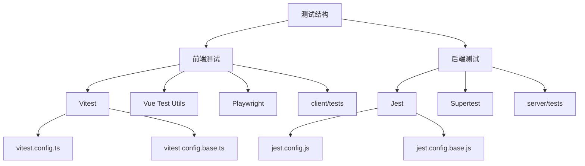
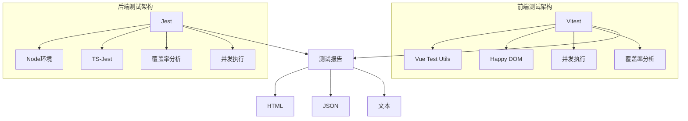
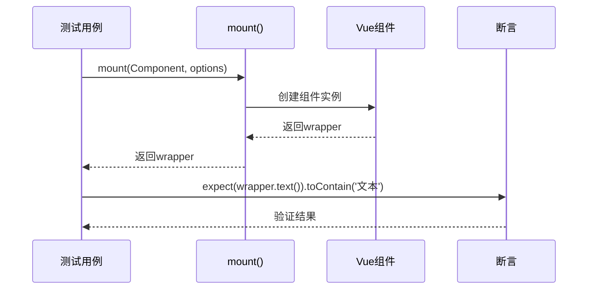
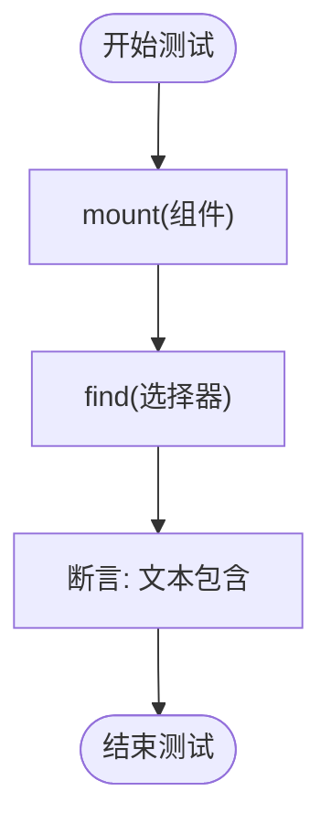
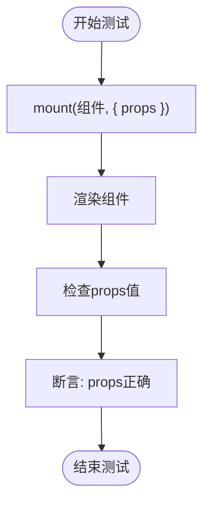
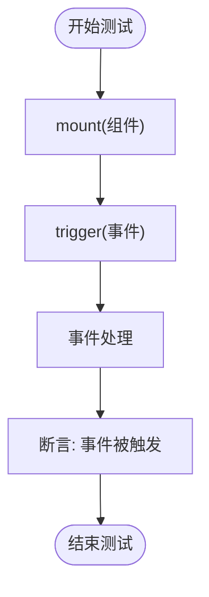
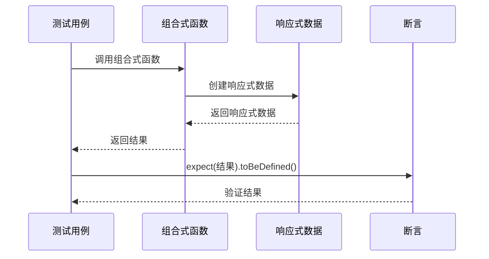
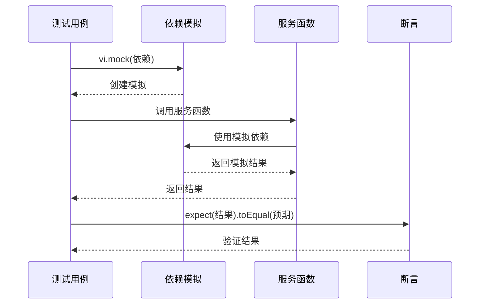
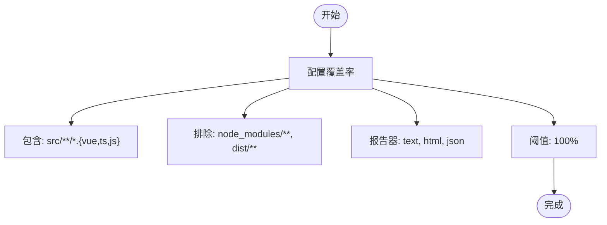
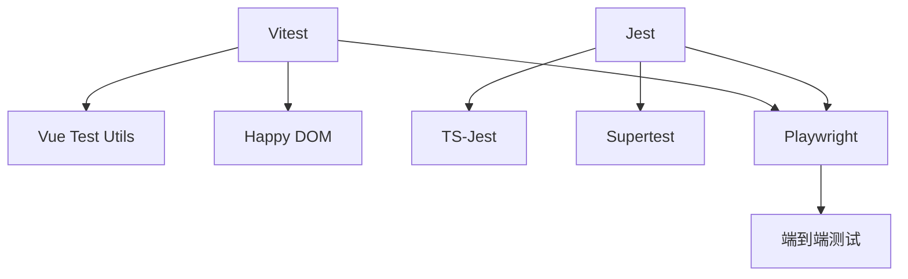

# 单元测试

<cite>
**本文档引用的文件**
- [vitest.config.ts](file://k.yyup.com/client/vitest.config.ts)
- [vitest.config.base.ts](file://k.yyup.com/test-config/vitest.config.base.ts)
- [jest.config.js](file://k.yyup.com/server/jest.config.js)
- [jest.config.base.js](file://k.yyup.com/test-config/jest.config.base.js)
- [ai-center.spec.ts](file://k.yyup.com/client/tests/e2e/ai-center.spec.ts)
- [Dashboard.test.js](file://k.yyup.com/client/src/tests/unit/pages/system/Dashboard.test.js)
- [function-tools.test.js](file://k.yyup.com/client/tests/unit/api/function-tools.test.js)
- [setup.ts](file://k.yyup.com/client/tests/setup.ts)
- [global-setup.ts](file://k.yyup.com/client/tests/global-setup.ts)
</cite>

## 目录
1. [简介](#简介)
2. [项目结构](#项目结构)
3. [核心组件](#核心组件)
4. [架构概述](#架构概述)
5. [详细组件分析](#详细组件分析)
6. [依赖分析](#依赖分析)
7. [性能考虑](#性能考虑)
8. [故障排除指南](#故障排除指南)
9. [结论](#结论)
10. [附录](#附录)（如有必要）

## 简介
本文档旨在为k.yyupgame项目创建一个全面的单元测试指南，重点介绍如何使用Vitest进行单元测试。文档详细说明了Vue3组件的测试方法，包括组件渲染、props传递和事件触发等场景。同时涵盖了组合式API（composables）的测试策略，以及后端服务层的单元测试方法。文档还包含了测试覆盖率的配置和分析方法，并提供了实际的代码示例来展示典型的测试用例编写模式。

## 项目结构
k.yyupgame项目的测试结构分为前端和后端两大部分。前端测试主要使用Vitest框架，配置文件位于`k.yyup.com/client/vitest.config.ts`和`k.yyup.com/test-config/vitest.config.base.ts`。后端测试使用Jest框架，配置文件位于`k.yyup.com/server/jest.config.js`和`k.yyup.com/test-config/jest.config.base.js`。测试文件主要分布在`client/tests`和`server/tests`目录下，包括单元测试、集成测试和端到端测试。

**图表来源**
- [vitest.config.ts](file://k.yyup.com/client/vitest.config.ts)
- [vitest.config.base.ts](file://k.yyup.com/test-config/vitest.config.base.ts)
- [jest.config.js](file://k.yyup.com/server/jest.config.js)
- [jest.config.base.js](file://k.yyup.com/test-config/jest.config.base.js)

**章节来源**
- [vitest.config.ts](file://k.yyup.com/client/vitest.config.ts)
- [vitest.config.base.ts](file://k.yyup.com/test-config/vitest.config.base.ts)
- [jest.config.js](file://k.yyup.com/server/jest.config.js)
- [jest.config.base.js](file://k.yyup.com/test-config/jest.config.base.js)

## 核心组件
本项目的核心测试组件包括Vitest配置、测试工具集成、覆盖率分析和测试报告生成。前端使用Vitest作为主要测试框架，结合Vue Test Utils进行Vue组件测试，使用Playwright进行端到端测试。后端使用Jest进行单元测试和集成测试。测试配置支持100%的覆盖率目标，并集成了多种报告格式。

**章节来源**
- [vitest.config.ts](file://k.yyup.com/client/vitest.config.ts)
- [vitest.config.base.ts](file://k.yyup.com/test-config/vitest.config.base.ts)
- [jest.config.js](file://k.yyup.com/server/jest.config.js)
- [jest.config.base.js](file://k.yyup.com/test-config/jest.config.base.js)

## 架构概述
k.yyupgame项目的测试架构采用分层设计，前端和后端分别使用不同的测试框架。前端测试架构基于Vitest，利用happy-dom作为测试环境，支持并发测试执行。后端测试架构基于Jest，使用node环境进行测试。两种架构都支持全面的覆盖率分析和多种报告格式输出。

**图表来源**
- [vitest.config.ts](file://k.yyup.com/client/vitest.config.ts)
- [vitest.config.base.ts](file://k.yyup.com/test-config/vitest.config.base.ts)
- [jest.config.js](file://k.yyup.com/server/jest.config.js)
- [jest.config.base.js](file://k.yyup.com/test-config/jest.config.base.js)

## 详细组件分析

### Vue3组件测试
Vue3组件的测试使用Vitest和Vue Test Utils进行。测试主要关注组件的渲染、props传递、事件触发和响应式行为。通过`mount`函数创建组件实例，然后使用断言验证组件的行为。

**图表来源**
- [Dashboard.test.js](file://k.yyup.com/client/src/tests/unit/pages/system/Dashboard.test.js)

#### 组件渲染测试
组件渲染测试验证组件是否正确渲染其模板内容。测试使用`mount`函数创建组件实例，然后检查渲染的HTML是否包含预期的内容。

**图表来源**
- [Dashboard.test.js](file://k.yyup.com/client/src/tests/unit/pages/system/Dashboard.test.js)

#### Props传递测试
Props传递测试验证组件是否正确接收和处理props。测试通过向`mount`函数传递props选项来模拟不同的输入场景。

**图表来源**
- [Dashboard.test.js](file://k.yyup.com/client/src/tests/unit/pages/system/Dashboard.test.js)

#### 事件触发测试
事件触发测试验证组件是否正确触发事件。测试通过模拟用户交互（如点击按钮）来触发事件，然后验证事件处理函数是否被正确调用。

**图表来源**
- [Dashboard.test.js](file://k.yyup.com/client/src/tests/unit/pages/system/Dashboard.test.js)

### 组合式API测试
组合式API的测试主要关注其返回值和响应式行为。测试通过调用组合式函数并验证其返回的响应式数据来确保其正确性。

**图表来源**
- [function-tools.test.js](file://k.yyup.com/client/tests/unit/api/function-tools.test.js)

### 后端服务层测试
后端服务层的测试使用Jest框架进行，主要测试业务逻辑函数的隔离行为。测试通过模拟依赖项来确保测试的独立性和可重复性。

**图表来源**
- [function-tools.test.js](file://k.yyup.com/client/tests/unit/api/function-tools.test.js)

### 测试覆盖率配置
测试覆盖率配置在Vitest和Jest的配置文件中定义，支持多种报告格式和100%的覆盖率目标。配置包括包含和排除的文件模式，以及覆盖率阈值。

**图表来源**
- [vitest.config.base.ts](file://k.yyup.com/test-config/vitest.config.base.ts)
- [jest.config.base.js](file://k.yyup.com/test-config/jest.config.base.js)

## 依赖分析
项目的测试依赖主要包括Vitest、Jest、Vue Test Utils、Playwright等。前端测试依赖Vitest作为主要测试框架，结合Vue Test Utils进行Vue组件测试。后端测试依赖Jest进行单元测试和集成测试。所有测试都依赖于相应的配置文件和设置文件。

**图表来源**
- [vitest.config.ts](file://k.yyup.com/client/vitest.config.ts)
- [jest.config.js](file://k.yyup.com/server/jest.config.js)

**章节来源**
- [vitest.config.ts](file://k.yyup.com/client/vitest.config.ts)
- [jest.config.js](file://k.yyup.com/server/jest.config.js)

## 性能考虑
测试框架的性能考虑主要包括并发执行、超时配置和资源管理。Vitest配置了并发执行池，最多使用4个线程。测试超时设置为30秒，防止测试无限期挂起。全局设置和清理函数确保测试环境的干净和一致性。

**章节来源**
- [vitest.config.base.ts](file://k.yyup.com/test-config/vitest.config.base.ts)
- [jest.config.base.js](file://k.yyup.com/test-config/jest.config.base.js)

## 故障排除指南
当测试失败时，首先检查控制台输出和错误信息。确保所有依赖项都已正确安装和配置。检查测试文件的路径和导入是否正确。对于异步测试，确保使用了正确的等待机制。如果问题仍然存在，可以尝试清理测试缓存并重新运行测试。

**章节来源**
- [setup.ts](file://k.yyup.com/client/tests/setup.ts)
- [global-setup.ts](file://k.yyup.com/client/tests/global-setup.ts)

## 结论
k.yyupgame项目建立了全面的单元测试体系，前端使用Vitest，后端使用Jest。测试覆盖了组件、组合式API和业务逻辑函数，支持100%的覆盖率目标。通过合理的配置和工具集成，确保了代码质量和稳定性。

## 附录
### 测试命令
- 运行所有测试：`npm run test`
- 运行前端测试：`npm run test:client`
- 运行后端测试：`npm run test:server`
- 生成覆盖率报告：`npm run test:coverage`

### 测试文件命名约定
- 单元测试：`*.test.ts` 或 `*.test.js`
- 集成测试：`*.integration.test.ts`
- 端到端测试：`*.e2e.test.ts`
- 组件测试：`*.component.test.ts`