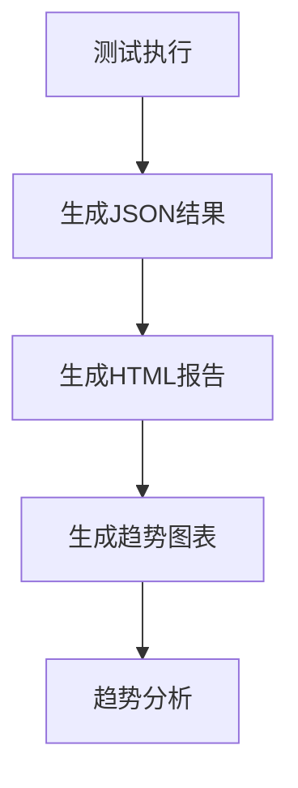

# 测试报告

<cite>
**本文档引用的文件**   
- [playwright.config.ts](file://k.yyup.com/playwright.config.ts)
- [admin-full-coverage-test.js](file://k.yyup.com/admin-full-coverage-test.js)
- [comprehensive-coverage-test.mjs](file://k.yyup.com/comprehensive-coverage-test.mjs)
- [coverage-reports/coverage-report.html](file://k.yyup.com/coverage-reports/coverage-report.html)
- [coverage-history.json](file://k.yyup.com/coverage-history.json)
- [admin-test-results/reports/admin-test-report-2025-11-20T01-54-20-450Z.json](file://k.yyup.com/admin-test-results/reports/admin-test-report-2025-11-20T01-54-20-450Z.json)
- [ai-assistant-test-results.json](file://k.yyup.com/ai-assistant-test-results.json)
</cite>

## 目录
1. [引言](#引言)
2. [测试结果生成与收集](#测试结果生成与收集)
3. [测试结果分析](#测试结果分析)
4. [测试覆盖率报告](#测试覆盖率报告)
5. [测试结果可视化](#测试结果可视化)
6. [测试失败诊断流程](#测试失败诊断流程)
7. [CI/CD集成](#cicd集成)
8. [结论](#结论)

## 引言
本指南旨在为k.yyupgame项目提供全面的测试报告指导，涵盖测试结果的生成、分析、可视化以及与CI/CD流程的集成。通过系统化的测试报告机制，确保软件质量的持续监控和改进。

## 测试结果生成与收集
### 测试类型与结果生成
项目中实施了多种测试类型，包括单元测试、集成测试和端到端测试，每种测试类型都有其特定的结果生成机制。

- **端到端测试**：使用Playwright框架进行，测试结果以JSON、HTML和JUnit格式生成。配置文件`playwright.config.ts`中定义了报告生成器，包括HTML报告、JSON结果文件和JUnit XML文件。
- **覆盖率测试**：通过`comprehensive-coverage-test.mjs`脚本执行，生成详细的覆盖率报告，记录每个页面的加载时间、控制台错误、页面错误和网络错误。
- **角色全覆盖测试**：`admin-full-coverage-test.js`脚本专门用于测试Admin角色的所有页面，生成详细的测试报告，包括页面状态、错误和警告。

### 测试结果整合
测试结果的整合通过自动化脚本完成，确保不同测试类型的结果能够统一管理和分析。

- **结果文件存储**：所有测试结果文件存储在特定目录中，如`admin-test-results/reports/`和`test-results/`，便于集中管理和访问。
- **结果合并**：通过脚本将不同测试类型的结果合并，生成综合报告，如`comprehensive-coverage-test.mjs`生成的综合覆盖报告。

**Section sources**
- [playwright.config.ts](file://k.yyup.com/playwright.config.ts#L1-L58)
- [comprehensive-coverage-test.mjs](file://k.yyup.com/comprehensive-coverage-test.mjs#L1-L546)
- [admin-full-coverage-test.js](file://k.yyup.com/admin-full-coverage-test.js#L1-L664)

## 测试结果分析
### 结果分析方法
测试结果的分析主要通过自动化脚本和手动审查相结合的方式进行。

- **自动化分析**：脚本自动分析测试结果，生成摘要和详细报告。例如，`admin-full-coverage-test.js`脚本在测试完成后生成详细的测试报告，包括通过、失败和错误的页面数量。
- **手动审查**：开发人员手动审查测试报告，特别是失败和错误的测试，以确定问题的根本原因。

### 结果解读
测试结果的解读包括对通过、失败和错误的测试进行分类和分析。

- **通过的测试**：确认功能正常，无需进一步操作。
- **失败的测试**：需要进一步调查，确定是测试脚本问题还是实际功能问题。
- **错误的测试**：通常表示测试环境或配置问题，需要优先解决。

**Section sources**
- [admin-test-results/reports/admin-test-report-2025-11-20T01-54-20-450Z.json](file://k.yyup.com/admin-test-results/reports/admin-test-report-2025-11-20T01-54-20-450Z.json#L1-L125)
- [ai-assistant-test-results.json](file://k.yyup.com/ai-assistant-test-results.json#L1-L800)

## 测试覆盖率报告
### 覆盖率报告生成
测试覆盖率报告通过`comprehensive-coverage-test.mjs`脚本生成，记录每个页面的访问情况和错误信息。

- **覆盖率数据**：包括页面加载时间、控制台错误、页面错误和网络错误。
- **报告格式**：生成JSON格式的详细报告和HTML格式的概览报告。

### 覆盖率解读
覆盖率报告的解读帮助识别代码覆盖的盲点和薄弱环节。

- **高覆盖率**：表示大部分代码路径已被测试覆盖，功能较为稳定。
- **低覆盖率**：表示存在未测试的代码路径，需要增加测试用例。

**Section sources**
- [comprehensive-coverage-test.mjs](file://k.yyup.com/comprehensive-coverage-test.mjs#L1-L546)
- [coverage-reports/coverage-report.html](file://k.yyup.com/coverage-reports/coverage-report.html#L1-L48)
- [coverage-history.json](file://k.yyup.com/coverage-history.json#L1-L8)

## 测试结果可视化
### 可视化方案
测试结果的可视化通过HTML报告和图表展示，提供直观的测试结果概览。

- **HTML报告**：`playwright.config.ts`配置生成HTML报告，包含测试结果的详细信息和截图。
- **图表展示**：使用图表展示测试结果的趋势，如通过率、失败率和错误率。

### 趋势分析
通过历史数据的趋势分析，监控测试结果的变化。

- **历史数据**：`coverage-history.json`文件记录了每次测试的覆盖率数据，用于趋势分析。
- **趋势图表**：生成趋势图表，展示测试覆盖率随时间的变化。

**Diagram sources**
- [playwright.config.ts](file://k.yyup.com/playwright.config.ts#L1-L58)
- [coverage-history.json](file://k.yyup.com/coverage-history.json#L1-L8)

## 测试失败诊断流程
### 诊断流程
测试失败的诊断流程包括以下步骤：

1. **查看测试报告**：首先查看测试报告，确定失败的测试用例。
2. **分析错误信息**：分析错误信息，确定是测试脚本问题还是实际功能问题。
3. **复现问题**：在本地环境中复现问题，确认问题的可复现性。
4. **修复问题**：根据问题的根本原因进行修复。
5. **重新测试**：修复后重新运行测试，确保问题已解决。

### 快速定位
通过详细的测试报告和日志信息，快速定位问题。

- **控制台错误**：查看控制台错误信息，确定问题的直接原因。
- **网络错误**：查看网络错误信息，确定API调用问题。

**Section sources**
- [ai-assistant-test-results.json](file://k.yyup.com/ai-assistant-test-results.json#L1-L800)
- [admin-test-results/reports/admin-test-report-2025-11-20T01-54-20-450Z.json](file://k.yyup.com/admin-test-results/reports/admin-test-report-2025-11-20T01-54-20-450Z.json#L1-L125)

## CI/CD集成
### 集成方法
测试报告的CI/CD集成通过自动化脚本和CI/CD工具完成。

- **自动化脚本**：在CI/CD流水线中运行测试脚本，生成测试报告。
- **报告上传**：将测试报告上传到CI/CD平台，便于团队成员查看。

### 自动化质量监控
通过CI/CD集成，实现自动化质量监控。

- **持续集成**：每次代码提交后自动运行测试，确保代码质量。
- **质量门禁**：设置质量门禁，确保只有通过所有测试的代码才能合并。

**Section sources**
- [playwright.config.ts](file://k.yyup.com/playwright.config.ts#L1-L58)
- [admin-full-coverage-test.js](file://k.yyup.com/admin-full-coverage-test.js#L1-L664)

## 结论
通过系统化的测试报告机制，k.yyupgame项目能够有效监控和改进软件质量。测试结果的生成、分析、可视化和CI/CD集成，确保了软件的稳定性和可靠性。