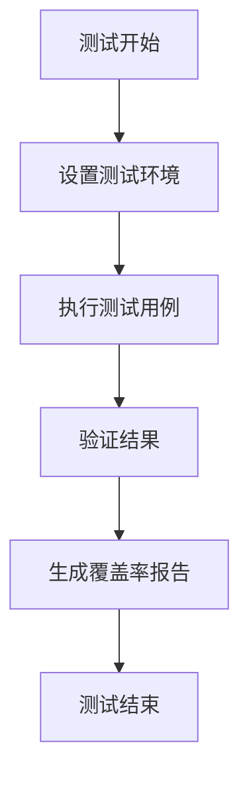
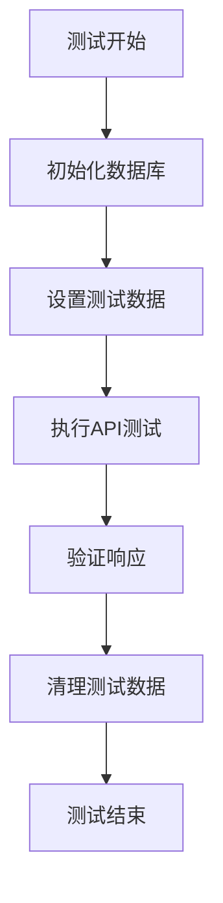
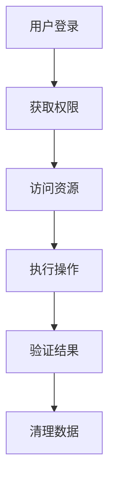
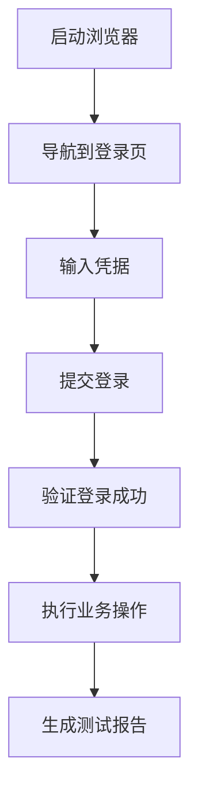
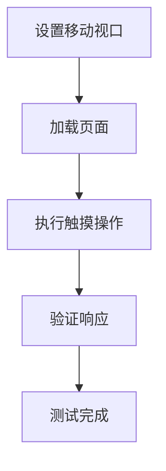
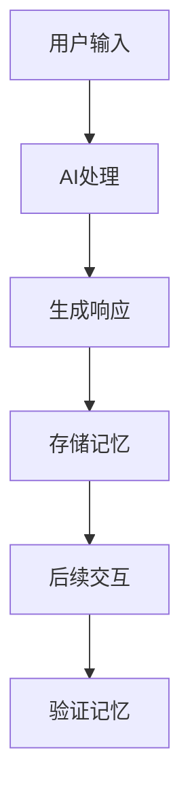
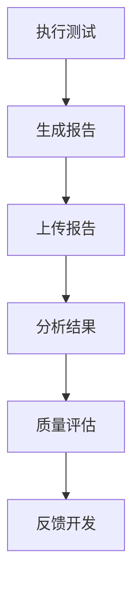

# 测试流程

<cite>
**本文档引用的文件**
- [playwright.config.ts](file://k.yyup.com/playwright.config.ts)
- [vitest.config.ts](file://k.yyup.com/client/vitest.config.ts)
- [jest.config.js](file://k.yyup.com/server/jest.config.js)
- [package.json](file://k.yyup.com/package.json)
- [ai-assistant-page.spec.ts](file://k.yyup.com/client/tests/e2e/ai-assistant-page.spec.ts)
- [ai-page.spec.ts](file://k.yyup.com/client/tests/ai-page.spec.ts)
- [setup.ts](file://k.yyup.com/server/tests/setup.ts)
- [TC-011-教师工作台测试.spec.js](file://k.yyup.com/client/src/tests/mobile/teacher-center/TC-011-教师工作台测试.spec.js)
- [test-config/vitest.config.base.ts](file://k.yyup.com/test-config/vitest.config.base.ts)
- [test-config/jest.config.base.cjs](file://k.yyup.com/test-config/jest.config.base.cjs)
</cite>

## 目录
1. [引言](#引言)
2. [单元测试](#单元测试)
3. [集成测试](#集成测试)
4. [端到端测试](#端到端测试)
5. [移动设备测试](#移动设备测试)
6. [AI功能测试](#ai功能测试)
7. [测试报告](#测试报告)

## 引言

k.yyupgame项目采用全面的测试策略，确保系统的稳定性和可靠性。测试体系涵盖了从单元测试到端到端测试的各个层面，特别针对AI功能进行了专门的测试设计。项目使用Vitest进行前端组件测试，Jest进行后端服务测试，Playwright进行UI自动化测试，形成了完整的测试闭环。

**Section sources**
- [package.json](file://k.yyup.com/package.json)

## 单元测试

### 前端组件测试

前端单元测试使用Vitest框架，配置文件位于`client/vitest.config.ts`。测试配置继承自`test-config/vitest.config.base.ts`中的基础配置，并针对客户端进行了特定调整。测试超时设置为10分钟，以适应复杂的前端测试场景。

**Diagram sources**
- [vitest.config.ts](file://k.yyup.com/client/vitest.config.ts)
- [test-config/vitest.config.base.ts](file://k.yyup.com/test-config/vitest.config.base.ts)

### 后端服务测试

后端单元测试使用Jest框架，配置文件位于`server/jest.config.js`。测试配置继承自`test-config/jest.config.base.cjs`中的基础配置，并针对服务器端进行了特定调整。测试环境设置包括全局设置文件和全局清理文件，确保测试的独立性和可靠性。

**Diagram sources**
- [jest.config.js](file://k.yyup.com/server/jest.config.js)
- [test-config/jest.config.base.cjs](file://k.yyup.com/test-config/jest.config.base.cjs)

**Section sources**
- [vitest.config.ts](file://k.yyup.com/client/vitest.config.ts)
- [jest.config.js](file://k.yyup.com/server/jest.config.js)
- [test-config/vitest.config.base.ts](file://k.yyup.com/test-config/vitest.config.base.ts)
- [test-config/jest.config.base.cjs](file://k.yyup.com/test-config/jest.config.base.cjs)

## 集成测试

### API端点测试

集成测试主要验证API端点、数据库操作和业务逻辑的集成。测试脚本通过`package.json`中的`test:api`命令执行，位于`server/APItest`目录下。测试覆盖了所有主要的API端点，确保前后端数据交互的正确性。

### 数据库操作测试

数据库操作测试验证了数据持久化和查询功能。测试使用Sequelize ORM进行数据库操作，通过`setup.ts`文件中的测试工具函数创建和清理测试数据。测试覆盖了增删改查等基本操作，以及复杂的事务处理。

### 业务逻辑集成测试

业务逻辑集成测试验证了多个组件协同工作的正确性。测试用例模拟真实用户场景，从用户登录到执行业务操作的完整流程。测试确保了业务逻辑的完整性和数据一致性。

**Diagram sources**
- [setup.ts](file://k.yyup.com/server/tests/setup.ts)

**Section sources**
- [setup.ts](file://k.yyup.com/server/tests/setup.ts)

## 端到端测试

### Playwright配置

端到端测试使用Playwright框架，配置文件位于`playwright.config.ts`。测试配置针对AI助手系统进行了优化，基础URL指向本地开发服务器`http://localhost:5173`。测试报告生成HTML、JSON和JUnit格式，便于结果分析和CI集成。

### UI自动化测试

UI自动化测试覆盖了主要用户界面的交互流程。测试用例包括用户登录、导航、表单提交等操作。测试确保了UI元素的可见性、可交互性和正确的行为响应。

**Diagram sources**
- [playwright.config.ts](file://k.yyup.com/playwright.config.ts)

### 测试执行

端到端测试通过`package.json`中的`test:e2e`命令执行。测试支持多种运行模式，包括无头模式、有头模式和调试模式。测试结果报告可以通过`test:e2e:report`命令查看。

**Section sources**
- [playwright.config.ts](file://k.yyup.com/playwright.config.ts)
- [package.json](file://k.yyup.com/package.json)

## 移动设备测试

### 设备兼容性测试

移动设备测试验证了应用在不同设备和屏幕尺寸下的功能。测试使用Vitest和Playwright结合的方式，模拟各种移动设备的视口尺寸。测试覆盖了iPhone、Android等主流设备的屏幕尺寸。

### 响应式布局测试

响应式布局测试确保了UI在不同屏幕尺寸下的正确显示。测试用例包括桌面、平板和移动设备的布局验证。测试验证了网格布局、弹性布局等响应式设计的正确性。

### 触摸交互测试

触摸交互测试验证了移动设备上的触摸操作。测试覆盖了点击、滑动、长按等常见触摸手势。测试确保了触摸事件的正确触发和响应。

**Section sources**
- [TC-011-教师工作台测试.spec.js](file://k.yyup.com/client/src/tests/mobile/teacher-center/TC-011-教师工作台测试.spec.js)

## AI功能测试

### AI助手交互测试

AI功能测试专门针对AI助手的交互进行验证。测试用例位于`client/tests/e2e/ai-assistant-page.spec.ts`，覆盖了AI对话、记忆管理、专家咨询和活动策划等功能。测试验证了AI助手的响应速度、对话质量和功能完整性。

### 智能建议验证

智能建议验证测试了AI生成建议的准确性和实用性。测试用例模拟用户输入各种查询，验证AI返回的建议是否符合预期。测试覆盖了招生咨询、活动策划等场景。

### 记忆系统测试

记忆系统测试验证了AI助手的记忆管理功能。测试用例包括记忆搜索、记忆统计和记忆生命周期管理。测试确保了短期记忆和长期记忆的正确处理。

**Diagram sources**
- [ai-assistant-page.spec.ts](file://k.yyup.com/client/tests/e2e/ai-assistant-page.spec.ts)

### 专家咨询测试

专家咨询测试验证了AI专家咨询功能的完整流程。测试用例包括启动咨询、提交问题和获取专业建议。测试确保了专家咨询流程的顺畅性和建议的专业性。

**Section sources**
- [ai-assistant-page.spec.ts](file://k.yyup.com/client/tests/e2e/ai-assistant-page.spec.ts)
- [ai-page.spec.ts](file://k.yyup.com/client/tests/ai-page.spec.ts)

## 测试报告

### 报告生成

测试报告通过Playwright的内置报告功能生成。测试配置中指定了多种报告格式，包括HTML、JSON和JUnit。HTML报告提供详细的测试结果和截图，便于问题定位。

### 报告分析

测试报告分析包括覆盖率分析、性能分析和错误分析。覆盖率报告显示了代码的测试覆盖情况，帮助识别未测试的代码路径。性能报告提供了页面加载时间和操作响应时间的统计数据。

### 持续集成

测试报告与CI/CD流程集成，通过`package.json`中的`ci:test`命令执行。测试结果自动上传到CI系统，失败的测试会阻止代码合并。测试报告的历史数据可用于趋势分析和质量评估。

**Diagram sources**
- [package.json](file://k.yyup.com/package.json)

**Section sources**
- [package.json](file://k.yyup.com/package.json)