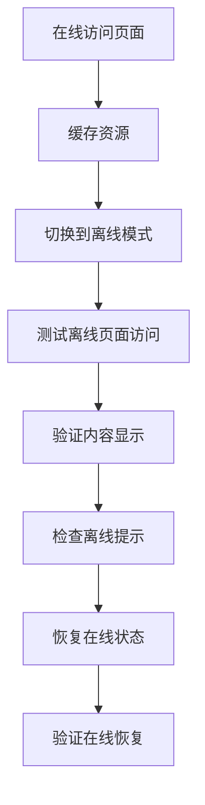
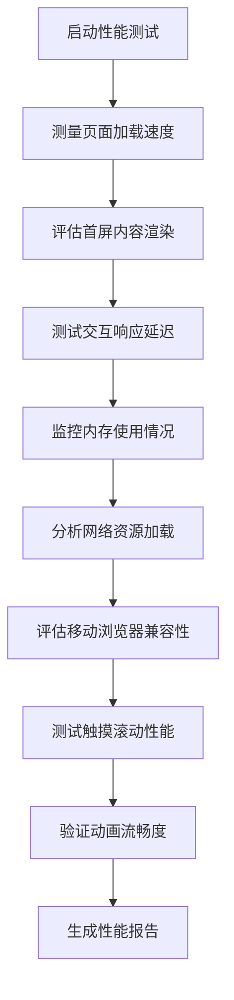

# 移动设备测试

<cite>
**本文档引用的文件**   
- [pwa-validation-suite.js](file://k.yyup.com/pwa-validation-suite.js)
- [mcp-mobile-qa-executor.js](file://k.yyup.com/mcp-mobile-qa-executor.js)
- [mobile-bug-detector.js](file://k.yyup.com/mobile-bug-detector.js)
- [test-mobile-adaptation.js](file://k.yyup.com/scripts/test-mobile-adaptation.js)
- [run-mobile-tests.js](file://k.yyup.com/scripts/run-mobile-tests.js)
- [test-all-mobile-pages.js](file://k.yyup.com/scripts/test-all-mobile-pages.js)
- [pwa-validation-suite.js](file://unified-tenant-system/pwa-validation-suite.js)
- [mcp-mobile-qa-executor.js](file://unified-tenant-system/mcp-mobile-qa-executor.js)
- [mobile-qa-testing-suite.js](file://unified-tenant-system/mobile-qa-testing-suite.js)
</cite>

## 目录
1. [简介](#简介)
2. [响应式设计测试](#响应式设计测试)
3. [移动端交互测试](#移动端交互测试)
4. [PWA功能测试](#pwa功能测试)
5. [移动设备性能测试](#移动设备性能测试)
6. [测试执行与工具](#测试执行与工具)
7. [模拟器与真实设备测试对比](#模拟器与真实设备测试对比)
8. [结论](#结论)

## 简介
本指南详细介绍了k.yyupgame项目中移动应用功能的测试方法。文档重点阐述了如何验证应用的响应式设计、移动端特有交互、PWA功能以及性能表现。通过系统化的测试策略，确保应用在各种移动设备上提供一致且优质的用户体验。

## 响应式设计测试
为确保应用在不同设备尺寸和屏幕分辨率下正常显示，项目采用多维度的响应式设计测试策略。测试覆盖了从iPhone 12（390x844）到Samsung Galaxy S21（360x800）再到iPad Air（820x1180）等多种设备配置。

测试重点关注以下方面：
- **布局适配**：验证页面在不同屏幕尺寸下的布局是否合理，确保内容不会溢出或出现不必要的滚动
- **触摸目标大小**：检查按钮和链接等交互元素的大小是否符合移动端标准（≥44px）
- **字体可读性**：评估文字大小在移动端的可读性，确保用户无需缩放即可轻松阅读
- **图片自适应**：验证图片和媒体内容能否根据屏幕尺寸自动调整大小
- **导航实现**：检查移动端导航菜单（如汉堡菜单、底部标签栏）的实现效果

通过`test-mobile-adaptation.js`脚本，系统化地验证了活动报名页面在移动端的响应式设计，包括海报高度（250px）、标题字体（20px）、信息卡片间距（12px）等具体设计规范。

**Section sources**
- [test-mobile-adaptation.js](file://k.yyup.com/scripts/test-mobile-adaptation.js#L77-L93)
- [mobile-bug-detector.js](file://k.yyup.com/mobile-bug-detector.js#L182-L215)

## 移动端交互测试
移动端特有的交互测试是确保应用可用性的关键环节。测试涵盖触摸事件、手势操作和移动端导航等多个方面。

### 触摸事件测试
测试应用对触摸事件的响应，包括：
- **触摸反馈**：验证按钮点击时的视觉反馈效果
- **触摸热区**：确保交互元素有足够的触摸空间
- **键盘适配**：检查表单输入时虚拟键盘的弹出和收起是否正常

### 手势操作测试
验证应用对手势操作的支持情况：
- **滑动操作**：测试页面间的滑动切换效果
- **双指缩放**：验证图片和内容的缩放功能
- **长按操作**：检查长按触发的上下文菜单等功能

### 移动端导航测试
评估移动端导航的便捷性：
- **底部导航栏**：验证底部标签栏的切换效果
- **侧滑菜单**：测试侧边栏的滑动展开和收起
- **返回手势**：检查从屏幕边缘滑动返回上一页的功能

`mobile-bug-detector.js`文件中包含了对移动端响应式问题的检测，特别关注了viewport meta标签配置、触摸目标大小和移动端导航实现等关键要素。

**Section sources**
- [mobile-bug-detector.js](file://k.yyup.com/mobile-bug-detector.js#L179-L215)
- [mcp-mobile-qa-executor.js](file://k.yyup.com/mcp-mobile-qa-executor.js#L208-L218)

## PWA功能测试
渐进式Web应用（PWA）功能的测试策略全面覆盖了离线访问、推送通知和安装流程等核心功能。

### 离线访问测试
使用`pwa-validation-suite.js`中的`validateOfflineCapability`方法，系统化地验证应用的离线功能：

**Diagram sources**
- [pwa-validation-suite.js](file://k.yyup.com/pwa-validation-suite.js#L407-L508)
- [pwa-validation-suite.js](file://unified-tenant-system/pwa-validation-suite.js#L407-L508)

### 推送通知测试
推送通知功能的测试包括：
- **API支持检查**：验证浏览器是否支持Notification API和PushManager
- **权限请求**：测试应用请求通知权限的流程
- **消息显示**：验证推送通知的显示效果和交互功能

### 安装流程测试
安装体验的测试重点包括：
- **安装条件**：检查manifest文件、Service Worker和HTTPS等安装条件
- **安装提示**：验证beforeinstallprompt事件的触发
- **安装UI**：检查应用内安装按钮或提示的存在和功能

PWA测试套件还评估了后台同步功能，确保应用在离线状态下收集的数据能够在网络恢复后自动同步到服务器。

**Section sources**
- [pwa-validation-suite.js](file://k.yyup.com/pwa-validation-suite.js#L407-L508)
- [pwa-validation-suite.js](file://k.yyup.com/pwa-validation-suite.js#L619-L710)
- [pwa-validation-suite.js](file://k.yyup.com/pwa-validation-suite.js#L510-L617)

## 移动设备性能测试
移动设备性能测试方法重点关注加载速度和内存使用情况，确保应用在移动设备上流畅运行。

### 加载速度测试
性能测试包括：
- **首屏渲染时间**：测量从页面开始加载到主要内容可见的时间
- **资源加载优化**：评估图片、脚本等资源的加载效率
- **网络请求**：分析HTTP请求的数量和大小

### 内存使用测试
内存使用情况的监控包括：
- **内存占用**：测量应用运行时的内存消耗
- **内存泄漏**：检测是否存在内存泄漏问题
- **垃圾回收**：评估JavaScript引擎的垃圾回收效率

`mcp-mobile-qa-executor.js`中的性能测试计划涵盖了页面加载速度、交互响应延迟、触摸滚动性能和动画流畅度等多个维度。

**Diagram sources**
- [mcp-mobile-qa-executor.js](file://k.yyup.com/mcp-mobile-qa-executor.js#L230-L246)
- [mcp-mobile-qa-executor.js](file://unified-tenant-system/mcp-mobile-qa-executor.js#L230-L246)

**Section sources**
- [mcp-mobile-qa-executor.js](file://k.yyup.com/mcp-mobile-qa-executor.js#L230-L256)
- [test-mobile-adaptation.js](file://k.yyup.com/scripts/test-mobile-adaptation.js#L122-L127)

## 测试执行与工具
项目采用多种工具和脚本进行移动设备测试，确保测试的全面性和自动化程度。

### 测试脚本
主要测试脚本包括：
- **run-mobile-tests.js**：运行所有移动端测试并生成详细报告
- **test-all-mobile-pages.js**：批量测试所有34个移动端页面
- **test-mobile-adaptation.js**：专门测试移动端适配性的脚本

### 测试框架
测试基于Vitest框架，提供以下功能：
- **单元测试**：验证单个组件和函数的正确性
- **集成测试**：测试多个组件的协同工作
- **覆盖率分析**：评估测试的完整性

测试配置中设定了严格的覆盖率阈值：
- 语句覆盖率：85%
- 分支覆盖率：80%
- 函数覆盖率：85%
- 行数覆盖率：85%

当测试通过率低于95%或覆盖率未达到阈值时，系统会生成相应的改进建议。

**Section sources**
- [run-mobile-tests.js](file://k.yyup.com/scripts/run-mobile-tests.js#L13-L44)
- [test-all-mobile-pages.js](file://k.yyup.com/scripts/test-all-mobile-pages.js#L8-L49)
- [run-mobile-tests.js](file://k.yyup.com/scripts/run-mobile-tests.js#L186-L245)

## 模拟器与真实设备测试对比
项目采用模拟器和真实设备相结合的测试策略，以获得更全面的测试结果。

### 模拟器测试
模拟器测试的优势：
- **快速迭代**：可以快速在多种设备配置间切换
- **自动化友好**：易于集成到CI/CD流程中
- **成本效益**：无需购买和维护大量物理设备

使用Playwright等工具在模拟器上进行自动化测试，可以高效地验证基本功能和响应式设计。

### 真实设备测试
真实设备测试的重要性：
- **真实体验**：能够准确反映用户在实际设备上的使用体验
- **性能评估**：提供真实的性能数据，包括加载速度和内存使用
- **硬件特性**：可以测试摄像头、GPS等硬件相关功能

建议的测试策略是先在模拟器上进行自动化测试，然后在关键的真实设备上进行验证，确保应用在各种环境下都能正常工作。

**Section sources**
- [mcp-mobile-qa-executor.js](file://k.yyup.com/mcp-mobile-qa-executor.js#L30-L47)
- [pwa-validation-suite.js](file://k.yyup.com/pwa-validation-suite.js#L31-L35)

## 结论
本指南详细介绍了k.yyupgame项目中移动设备测试的完整策略。通过系统化的响应式设计测试、移动端交互测试、PWA功能测试和性能测试，确保应用在各种移动设备上提供优质的用户体验。结合模拟器和真实设备的测试方法，既保证了测试效率，又确保了测试结果的真实性。建议持续执行这些测试策略，以维护和提升移动应用的质量。