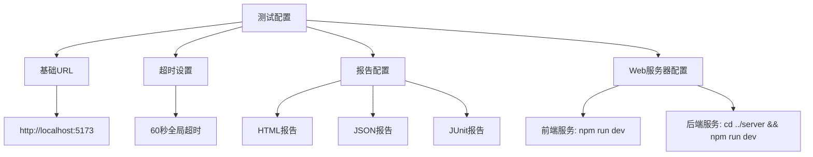
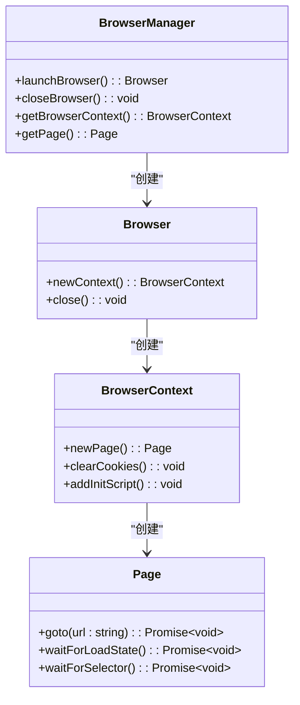
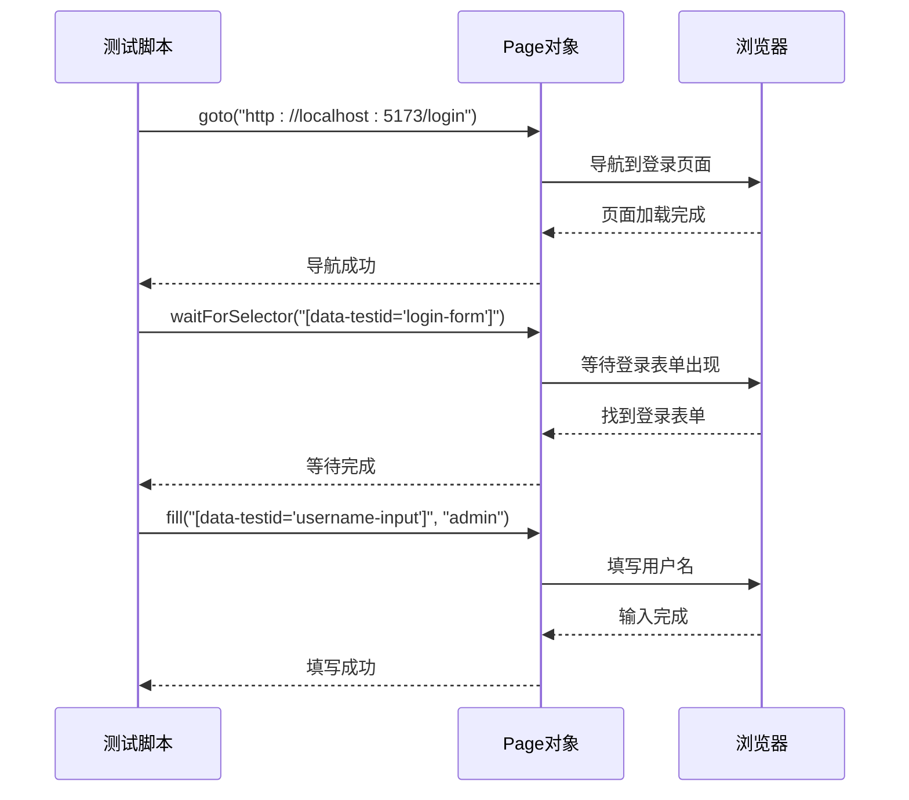
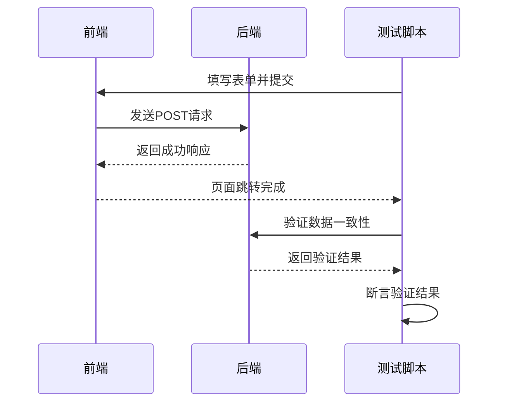
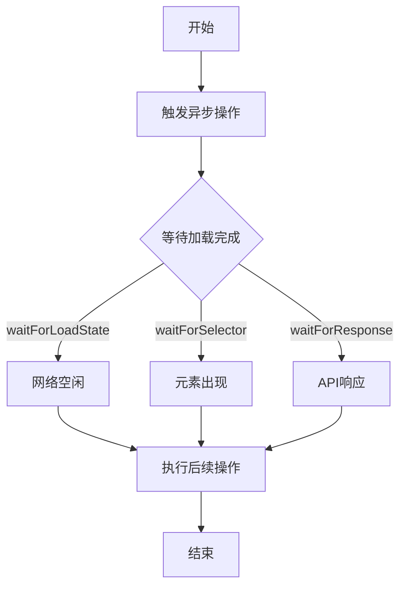
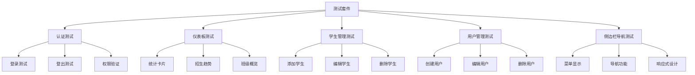
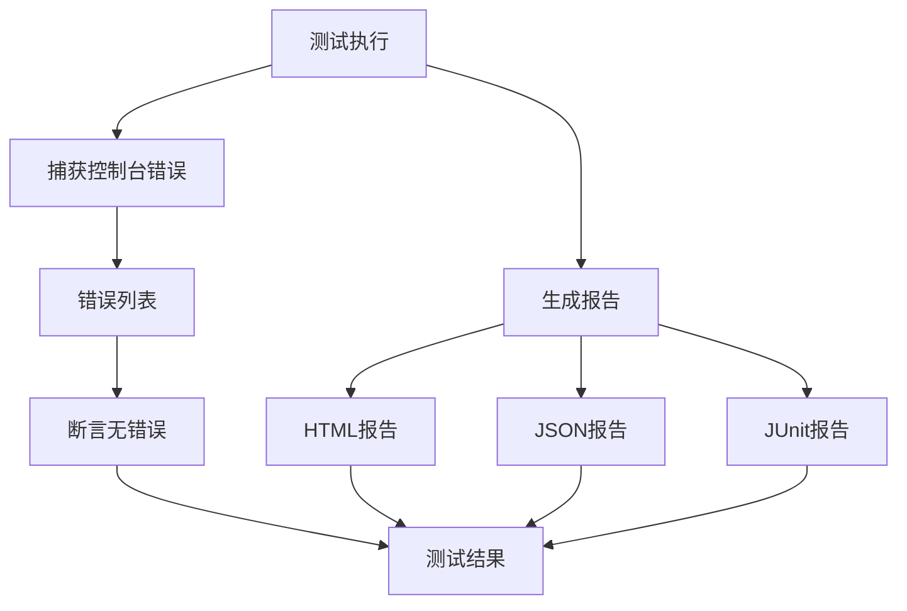

# 端到端测试

<cite>
**本文档引用的文件**   
- [playwright.config.ts](file://k.yyup.com/playwright.config.ts)
- [client/playwright.config.ts](file://k.yyup.com/client/playwright.config.ts)
- [client/tests/e2e/auth.e2e.test.ts](file://k.yyup.com/client/tests/e2e/auth.e2e.test.ts)
- [client/tests/e2e/dashboard-complete.e2e.test.ts](file://k.yyup.com/client/tests/e2e/dashboard-complete.e2e.test.ts)
- [client/tests/e2e/user-auth-flow.e2e.test.ts](file://k.yyup.com/client/tests/e2e/user-auth-flow.e2e.test.ts)
- [client/tests/e2e/student-management.e2e.test.ts](file://k.yyup.com/client/tests/e2e/student-management.e2e.test.ts)
- [client/tests/e2e/user-management-full.e2e.test.ts](file://k.yyup.com/client/tests/e2e/user-management-full.e2e.test.ts)
- [client/tests/e2e/sidebar-navigation.e2e.test.ts](file://k.yyup.com/client/tests/e2e/sidebar-navigation.e2e.test.ts)
- [client/tests/utils/test-helpers.ts](file://k.yyup.com/client/tests/utils/test-helpers.ts)
- [client/tests/utils/test-config.ts](file://k.yyup.com/client/tests/utils/test-config.ts)
</cite>

## 目录
1. [测试环境配置与启动](#测试环境配置与启动)
2. [浏览器实例管理](#浏览器实例管理)
3. [页面导航与元素定位](#页面导航与元素定位)
4. [用户交互操作](#用户交互操作)
5. [表单提交与数据验证](#表单提交与数据验证)
6. [异步操作与加载状态处理](#异步操作与加载状态处理)
7. [测试套件组织与运行](#测试套件组织与运行)
8. [测试结果收集与分析](#测试结果收集与分析)

## 测试环境配置与启动

本项目使用Playwright进行端到端UI自动化测试，测试环境的配置主要通过`playwright.config.ts`文件实现。项目中存在多个配置文件，包括根目录下的`playwright.config.ts`和客户端目录下的`client/playwright.config.ts`，这些配置文件为不同测试场景提供了灵活的配置选项。

测试配置文件定义了测试的基本参数，如测试目录、超时设置、报告生成等。例如，`client/playwright.config.ts`文件中配置了测试目录为`./tests/e2e`，设置了60秒的全局超时时间，并配置了多种报告格式，包括HTML、JSON和JUnit格式。此外，还配置了Web服务器，可以在测试前自动启动前端和后端服务，确保测试环境的完整性。



**Diagram sources**
- [client/playwright.config.ts](file://k.yyup.com/client/playwright.config.ts#L1-L128)

**Section sources**
- [playwright.config.ts](file://k.yyup.com/playwright.config.ts#L1-L58)
- [client/playwright.config.ts](file://k.yyup.com/client/playwright.config.ts#L1-L128)

## 浏览器实例管理

Playwright提供了强大的浏览器实例管理功能，支持Chromium、Firefox和WebKit等多种浏览器。在测试配置中，可以定义多个测试项目，每个项目可以使用不同的浏览器和设备配置。例如，`client/playwright.config.ts`文件中配置了五个测试项目：Chromium、Firefox、WebKit以及两个移动设备（Pixel 5和iPhone 12）。

浏览器实例的管理还包括无头模式的控制、启动参数的配置等。测试配置中默认使用无头模式运行，以提高测试效率。同时，为了解决某些安全策略问题，配置了特定的启动参数，如`--disable-web-security`和`--disable-features=VizDisplayCompositor`。



**Diagram sources**
- [client/playwright.config.ts](file://k.yyup.com/client/playwright.config.ts#L63-L107)

**Section sources**
- [client/playwright.config.ts](file://k.yyup.com/client/playwright.config.ts#L39-L40)
- [client/playwright.config.ts](file://k.yyup.com/client/playwright.config.ts#L69-L71)

## 页面导航与元素定位

页面导航是端到端测试的基础，Playwright提供了简单而强大的API来实现页面跳转和等待。通过`page.goto()`方法可以导航到指定URL，配合`waitForLoadState()`或`waitForSelector()`方法确保页面完全加载。

元素定位是UI自动化测试的核心，本项目主要使用`data-testid`属性进行元素定位，这是一种推荐的最佳实践，可以避免因CSS类名或文本内容变化而导致的测试失败。例如，在认证测试中，使用`[data-testid="username-input"]`和`[data-testid="password-input"]`来定位用户名和密码输入框。



**Diagram sources**
- [client/tests/e2e/auth.e2e.test.ts](file://k.yyup.com/client/tests/e2e/auth.e2e.test.ts#L134-L135)
- [client/tests/e2e/user-auth-flow.e2e.test.ts](file://k.yyup.com/client/tests/e2e/user-auth-flow.e2e.test.ts#L56-L57)

**Section sources**
- [client/tests/e2e/auth.e2e.test.ts](file://k.yyup.com/client/tests/e2e/auth.e2e.test.ts#L83-L84)
- [client/tests/e2e/user-auth-flow.e2e.test.ts](file://k.yyup.com/client/tests/e2e/user-auth-flow.e2e.test.ts#L50-L53)

## 用户交互操作

用户交互操作包括点击、输入、选择等常见操作。Playwright提供了直观的API来模拟这些用户行为。例如，`page.click()`用于模拟点击操作，`page.fill()`用于填写输入框，`page.check()`用于勾选复选框。

在实际测试中，这些操作通常组合使用来完成特定的用户流程。例如，在登录测试中，先使用`page.fill()`填写用户名和密码，然后使用`page.click()`点击登录按钮。为了确保操作的可靠性，Playwright会自动等待元素可交互状态。

```mermaid
flowchart TD
A[开始] --> B[填写用户名]
B --> C[填写密码]
C --> D[点击登录按钮]
D --> E[等待页面跳转]
E --> F[验证登录成功]
F --> G[结束]
B --> |page.fill()| H[输入框]
C --> |page.fill()| I[密码框]
D --> |page.click()| J[登录按钮]
E --> |waitForURL()| K[仪表板页面]
F --> |expect()| L[用户信息]
```

**Diagram sources**
- [client/tests/e2e/auth.e2e.test.ts](file://k.yyup.com/client/tests/e2e/auth.e2e.test.ts#L133-L135)
- [client/tests/e2e/user-auth-flow.e2e.test.ts](file://k.yyup.com/client/tests/e2e/user-auth-flow.e2e.test.ts#L56-L60)

**Section sources**
- [client/tests/e2e/auth.e2e.test.ts](file://k.yyup.com/client/tests/e2e/auth.e2e.test.ts#L133-L135)
- [client/tests/e2e/user-auth-flow.e2e.test.ts](file://k.yyup.com/client/tests/e2e/user-auth-flow.e2e.test.ts#L56-L60)

## 表单提交与数据验证

表单提交是端到端测试中的重要环节，通常涉及数据验证和页面跳转。在本项目中，表单提交测试不仅验证前端的表单验证逻辑，还验证后端数据的正确性和一致性。

数据验证包括前端验证和后端验证两个层面。前端验证主要检查必填字段、数据格式等，而后端验证则通过监听网络请求来验证API响应的结构和内容。例如，在学生管理测试中，通过`page.waitForResponse()`监听学生列表的API请求，并验证返回的数据与前端显示的数据是否一致。



**Diagram sources**
- [client/tests/e2e/student-management.e2e.test.ts](file://k.yyup.com/client/tests/e2e/student-management.e2e.test.ts#L107-L118)
- [client/tests/e2e/user-management-full.e2e.test.ts](file://k.yyup.com/client/tests/e2e/user-management-full.e2e.test.ts#L61-L67)

**Section sources**
- [client/tests/e2e/student-management.e2e.test.ts](file://k.yyup.com/client/tests/e2e/student-management.e2e.test.ts#L107-L118)
- [client/tests/e2e/user-management-full.e2e.test.ts](file://k.yyup.com/client/tests/e2e/user-management-full.e2e.test.ts#L61-L67)

## 异步操作与加载状态处理

异步操作和加载状态处理是确保测试稳定性的关键。由于现代Web应用大量使用异步加载，测试脚本必须能够正确处理各种加载状态。Playwright提供了多种等待机制来应对这种情况，包括`waitForLoadState()`、`waitForSelector()`和`waitForTimeout()`。

在实际测试中，通常会结合使用这些等待机制。例如，在登录测试中，通过`waitForURL()`等待页面跳转完成，同时通过`waitForSelector()`等待关键元素出现。此外，还可以通过监听网络请求来判断数据加载是否完成。



**Diagram sources**
- [client/tests/e2e/dashboard-complete.e2e.test.ts](file://k.yyup.com/client/tests/e2e/dashboard-complete.e2e.test.ts#L83-L84)
- [client/tests/e2e/auth.e2e.test.ts](file://k.yyup.com/client/tests/e2e/auth.e2e.test.ts#L414-L420)

**Section sources**
- [client/tests/e2e/dashboard-complete.e2e.test.ts](file://k.yyup.com/client/tests/e2e/dashboard-complete.e2e.test.ts#L83-L84)
- [client/tests/e2e/auth.e2e.test.ts](file://k.yyup.com/client/tests/e2e/auth.e2e.test.ts#L414-L420)

## 测试套件组织与运行

测试套件的组织遵循模块化原则，每个功能模块都有独立的测试文件。例如，`auth.e2e.test.ts`负责认证流程测试，`student-management.e2e.test.ts`负责学生管理测试。这种组织方式使得测试代码易于维护和扩展。

测试运行可以通过命令行工具执行，支持多种运行模式，包括全量运行、指定文件运行和并行运行。测试配置中启用了`fullyParallel`选项，允许测试用例并行执行，从而提高测试效率。



**Diagram sources**
- [client/tests/e2e/auth.e2e.test.ts](file://k.yyup.com/client/tests/e2e/auth.e2e.test.ts#L79-L291)
- [client/tests/e2e/student-management.e2e.test.ts](file://k.yyup.com/client/tests/e2e/student-management.e2e.test.ts#L58-L528)

**Section sources**
- [client/tests/e2e/auth.e2e.test.ts](file://k.yyup.com/client/tests/e2e/auth.e2e.test.ts#L79-L291)
- [client/tests/e2e/student-management.e2e.test.ts](file://k.yyup.com/client/tests/e2e/student-management.e2e.test.ts#L58-L528)

## 测试结果收集与分析

测试结果的收集和分析是测试流程的重要组成部分。Playwright支持多种报告格式，包括HTML、JSON和JUnit，这些报告可以用于不同目的的分析。HTML报告提供了直观的测试结果可视化，JSON报告便于程序化分析，而JUnit报告则与CI/CD系统集成良好。

除了标准报告外，测试还集成了控制台错误检测机制。通过监听`console.error`事件，可以捕获运行时错误，确保测试过程中没有未处理的异常。这种机制有助于提高测试的可靠性和应用的稳定性。



**Diagram sources**
- [client/playwright.config.ts](file://k.yyup.com/client/playwright.config.ts#L25-L30)
- [client/tests/e2e/auth.e2e.test.ts](file://k.yyup.com/client/tests/e2e/auth.e2e.test.ts#L65-L77)

**Section sources**
- [client/playwright.config.ts](file://k.yyup.com/client/playwright.config.ts#L25-L30)
- [client/tests/e2e/auth.e2e.test.ts](file://k.yyup.com/client/tests/e2e/auth.e2e.test.ts#L65-L77)