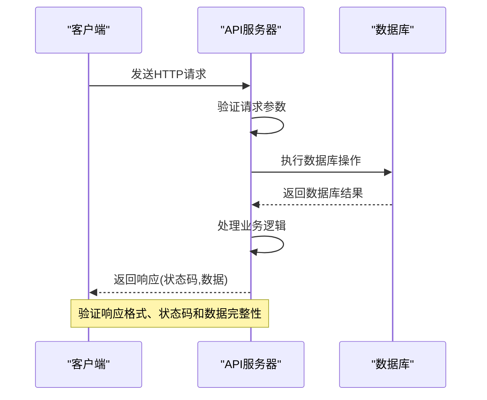
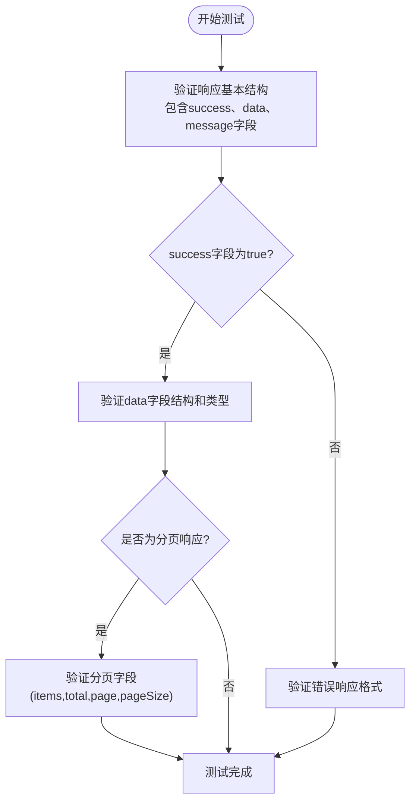
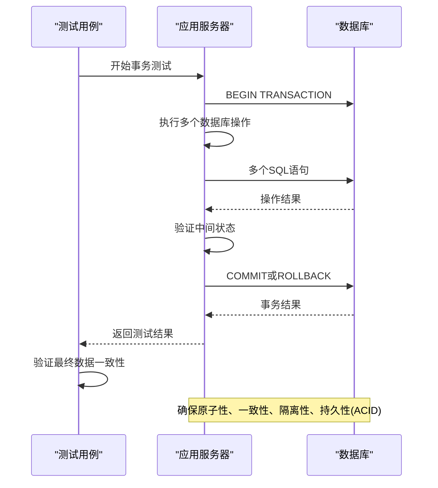
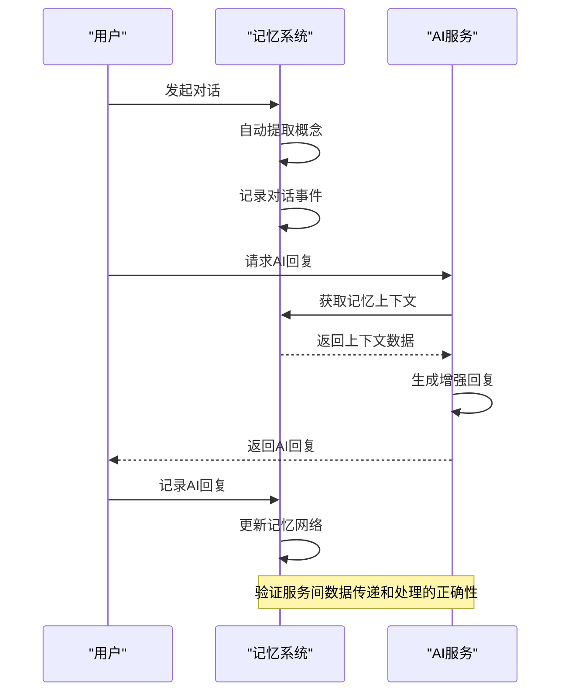
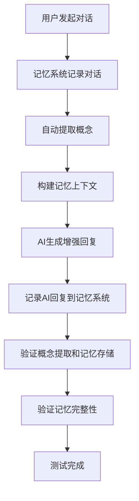
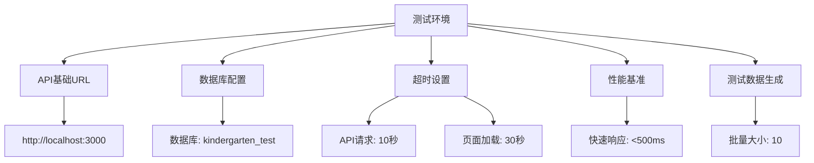
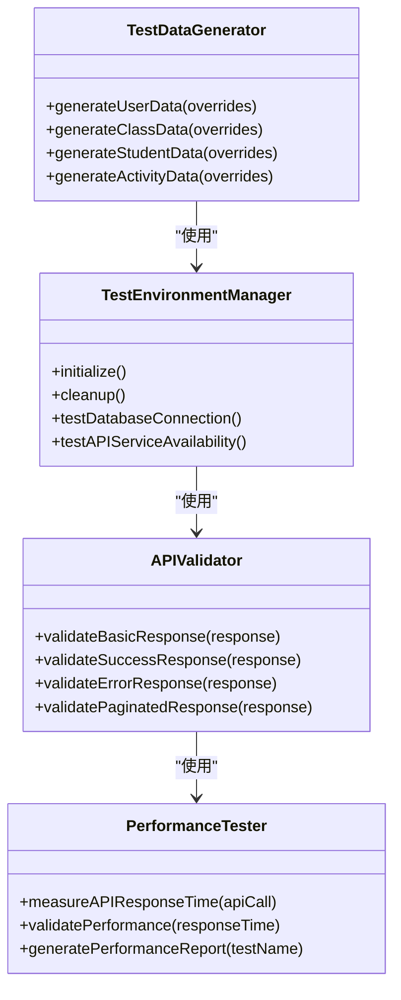
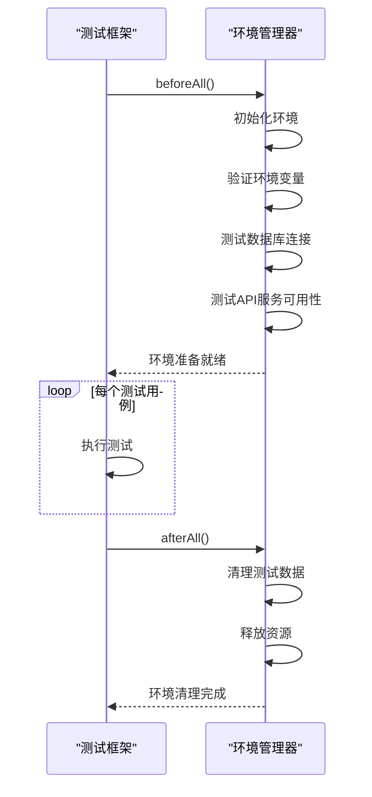

# 集成测试

<cite>
**本文档引用的文件**   
- [integration-tests.md](file://k.yyup.com/docs/six-dimension-memory-doubao-integration/testing/integration-tests.md)
- [database-transaction.test.ts](file://k.yyup.com/client/tests/integration/database-transaction.test.ts)
- [playwright.config.ts](file://k.yyup.com/client/tests/e2e-api-integration/playwright.config.ts)
- [playwright-basic.config.ts](file://k.yyup.com/client/tests/e2e-api-integration/playwright-basic.config.ts)
- [test-config.ts](file://k.yyup.com/client/tests/utils/test-config.ts)
</cite>

## 目录

1. [API端点集成测试](#api端点集成测试)
2. [数据库操作集成测试](#数据库操作集成测试)
3. [业务逻辑层集成测试](#业务逻辑层集成测试)
4. [测试数据准备与清理](#测试数据准备与清理)
5. [集成测试代码示例](#集成测试代码示例)

## API端点集成测试

本节详细说明如何测试k.yyupgame项目中RESTful API的请求响应流程，包括不同HTTP方法、状态码和数据格式的验证。

### HTTP方法与状态码验证

API集成测试覆盖了所有标准HTTP方法（GET、POST、PUT、DELETE）的正确实现。测试用例验证了每个端点在不同场景下的响应状态码，确保符合RESTful规范：

- **200系列**：成功响应，用于GET、PUT、DELETE操作
- **201 Created**：POST操作成功创建资源
- **400 Bad Request**：客户端请求错误，如参数验证失败
- **401 Unauthorized**：未授权访问
- **403 Forbidden**：权限不足
- **404 Not Found**：资源不存在
- **409 Conflict**：并发修改冲突
- **500 Internal Server Error**：服务器内部错误

### 请求响应流程测试

通过Playwright和Supertest等测试框架，验证API端点的完整请求响应流程。测试配置文件`playwright.config.ts`定义了测试环境的基本URL、超时设置和报告机制，确保测试的可靠性和可重复性。



**Diagram sources**
- [playwright.config.ts](file://k.yyup.com/client/tests/e2e-api-integration/playwright.config.ts)
- [test-config.ts](file://k.yyup.com/client/tests/utils/test-config.ts)

### 数据格式验证

使用`APIValidator`类对API响应数据格式进行系统性验证，确保所有响应都符合预定义的结构：



**Diagram sources**
- [test-config.ts](file://k.yyup.com/client/tests/utils/test-config.ts)

**Section sources**
- [test-config.ts](file://k.yyup.com/client/tests/utils/test-config.ts#L83-L180)

## 数据库操作集成测试

本节阐述数据库集成测试策略，包括模型与数据库的交互测试、事务处理和数据一致性验证。

### 事务完整性测试

通过`database-transaction.test.ts`文件中的测试用例，验证复杂业务操作中的事务完整性和数据一致性。测试覆盖了班级学生分配、活动管理、用户角色权限等关键业务场景。



**Diagram sources**
- [database-transaction.test.ts](file://k.yyup.com/client/tests/integration/database-transaction.test.ts)

### 数据关联完整性验证

测试用例验证了数据库的外键约束和级联操作，确保数据关联的完整性：

- 防止删除仍有学生的班级
- 验证删除学生时相关成长记录和活动报名的处理
- 测试并发操作下的数据隔离性

```mermaid
erDiagram
USER {
string id PK
string username
string email
string password
datetime created_at
datetime updated_at
}
ROLE {
string id PK
string name
string description
}
CLASS {
string id PK
string name
int capacity
string teacher_id FK
datetime created_at
}
STUDENT {
string id PK
string name
int age
string class_id FK
string parent_id FK
datetime created_at
}
ACTIVITY {
string id PK
string title
string description
datetime start_time
datetime end_time
int max_participants
string location
}
USER ||--o{ ROLE : "用户角色"
USER ||--o{ CLASS : "教师班级"
USER ||--o{ STUDENT : "家长学生"
CLASS ||--o{ STUDENT : "班级学生"
ACTIVITY ||--o{ STUDENT : "活动报名"
```

**Diagram sources**
- [database-transaction.test.ts](file://k.yyup.com/client/tests/integration/database-transaction.test.ts)

## 业务逻辑层集成测试

本节提供业务逻辑层集成测试方法，验证多个服务组件协同工作的正确性。

### 服务间集成测试

基于`integration-tests.md`文档中的测试策略，验证六维记忆系统与AI Bridge服务的集成：



**Diagram sources**
- [integration-tests.md](file://k.yyup.com/docs/six-dimension-memory-doubao-integration/testing/integration-tests.md)

### 业务工作流测试

验证完整的业务工作流，如"对话-记忆-AI增强"循环，确保各个组件协同工作：



**Diagram sources**
- [integration-tests.md](file://k.yyup.com/docs/six-dimension-memory-doubao-integration/testing/integration-tests.md)

**Section sources**
- [integration-tests.md](file://k.yyup.com/docs/six-dimension-memory-doubao-integration/testing/integration-tests.md#L380-L453)

## 测试数据准备与清理

本节包含测试数据准备和清理的最佳实践，说明如何使用测试数据库或内存数据库。

### 测试环境配置

使用`test-config.ts`中的`TEST_CONFIG`对象管理测试环境配置，包括API基础URL、数据库连接信息和超时设置。



**Diagram sources**
- [test-config.ts](file://k.yyup.com/client/tests/utils/test-config.ts)

### 测试数据生成

使用`TestDataGenerator`类生成各种测试数据，包括用户、班级、学生和活动数据，确保测试的全面性。



**Diagram sources**
- [test-config.ts](file://k.yyup.com/client/tests/utils/test-config.ts)

### 测试生命周期管理

通过`TestEnvironmentManager`类管理测试的生命周期，包括初始化和清理：



**Diagram sources**
- [test-config.ts](file://k.yyup.com/client/tests/utils/test-config.ts)

**Section sources**
- [test-config.ts](file://k.yyup.com/client/tests/utils/test-config.ts#L433-L543)

## 集成测试代码示例

本节提供实际的集成测试代码示例，展示如何编写有效的集成测试。

### API集成测试示例

```typescript
// tests/integration/api-integration.test.ts
import { describe, it, expect } from 'vitest';
import request from 'supertest';
import app from '../../server/src/app';
import { TEST_CONFIG, APIValidator } from '../utils/test-config';

describe('API Integration Tests', () => {
  it('should handle user registration successfully', async () => {
    const userData = {
      username: 'testuser',
      email: 'test@example.com',
      password: 'TestPass123!'
    };

    const response = await request(app)
      .post('/api/auth/register')
      .send(userData);

    // 验证响应格式和状态码
    APIValidator.validateSuccessResponse(response);
    expect(response.status).toBe(201);
    
    // 验证响应数据
    expect(response.body.data).toHaveProperty('id');
    expect(response.body.data.username).toBe(userData.username);
  });
});
```

### 数据库事务测试示例

```typescript
// tests/integration/database-transaction.test.ts
import { describe, it, expect, beforeAll, afterAll } from 'vitest';
import request from 'supertest';
import app from '../../../server/src/app';
import { Sequelize } from 'sequelize';
import { RealEnvironmentManager } from './real-env.config';

describe('Database Transaction Integrity Tests', () => {
  let envManager: RealEnvironmentManager;
  let sequelize: Sequelize;

  beforeAll(async () => {
    envManager = RealEnvironmentManager.getInstance();
    await envManager.initializeEnvironment();
    
    sequelize = new Sequelize({
      dialect: 'mysql',
      host: 'localhost',
      username: 'root',
      password: 'password',
      database: 'kindergarten_test'
    });

    await sequelize.authenticate();
  }, 60000);

  afterAll(async () => {
    await sequelize.close();
    await envManager.cleanupEnvironment();
  }, 30000);

  it('should ensure atomicity of class student assignment', async () => {
    const teacher = testEnv.testUsers.find((u: any) => u.role === 'teacher');
    const teacherToken = await envManager.getUserToken(teacher.id);

    // 记录初始状态
    const initialClassCount = await sequelize.query(
      'SELECT COUNT(*) as count FROM classes WHERE teacher_id = ?',
      { replacements: [teacher.id], type: 'SELECT' }
    );

    // 开始事务
    const t = await sequelize.transaction();

    try {
      // 创建班级
      const classResponse = await request(app)
        .post('/api/classes')
        .set('Authorization', `Bearer ${teacherToken}`)
        .send({
          name: '事务测试班级',
          capacity: 25
        });

      expect(classResponse.status).toBe(201);
      const classId = classResponse.body.data.id;

      // 添加学生到班级
      const studentsToAdd = testEnv.testStudents.slice(0, 3);
      const addStudentsResponse = await request(app)
        .post(`/api/classes/${classId}/students`)
        .set('Authorization', `Bearer ${teacherToken}`)
        .send({
          studentIds: studentsToAdd.map((s: any) => s.id)
        });

      expect(addStudentsResponse.status).toBe(200);
      await t.commit();
    } catch (error) {
      await t.rollback();
      throw error;
    }

    // 验证事务提交后的数据状态
    const finalClassCount = await sequelize.query(
      'SELECT COUNT(*) as count FROM classes WHERE teacher_id = ?',
      { replacements: [teacher.id], type: 'SELECT' }
    );

    expect(parseInt(finalClassCount[0].count)).toBe(parseInt(initialClassCount[0].count) + 1);
  });
});
```

### 性能测试示例

```typescript
// tests/performance/api-performance.test.ts
import { describe, it, expect } from 'vitest';
import request from 'supertest';
import app from '../../server/src/app';
import { PerformanceTester } from '../utils/test-config';

describe('API Performance Tests', () => {
  it('should handle concurrent requests efficiently', async () => {
    const requestFn = () => request(app).get('/api/classes').then(res => res.body);
    
    const result = await PerformanceTester.runConcurrentRequests(requestFn, 50);
    
    // 验证并发测试结果
    PerformanceTester.validateConcurrencyResult(result, 50, 0.95);
    
    console.log(`并发测试结果:
      - 成功: ${result.successCount}
      - 失败: ${result.failureCount}
      - 总耗时: ${result.totalTime}ms
    `);
  });

  it('should meet performance benchmarks', async () => {
    const metrics = await PerformanceTester.measureAPIResponseTime(
      () => request(app).get('/api/classes'),
      10
    );

    console.log(PerformanceTester.generatePerformanceReport('班级列表API', metrics));
    
    // 验证性能基准
    PerformanceTester.validatePerformance(metrics.average, 'NORMAL');
  });
});
```

**Section sources**
- [integration-tests.md](file://k.yyup.com/docs/six-dimension-memory-doubao-integration/testing/integration-tests.md)
- [database-transaction.test.ts](file://k.yyup.com/client/tests/integration/database-transaction.test.ts)
- [test-config.ts](file://k.yyup.com/client/tests/utils/test-config.ts)