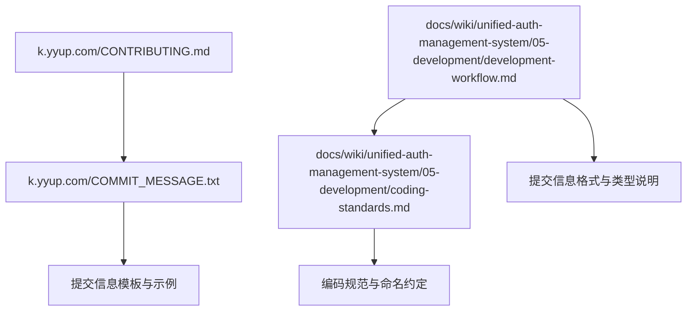
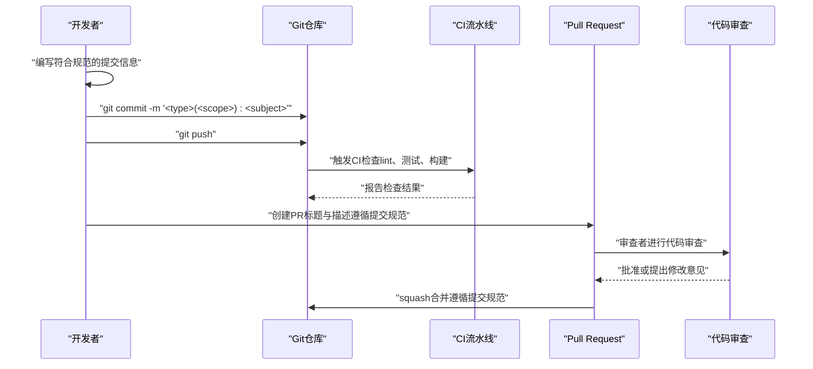
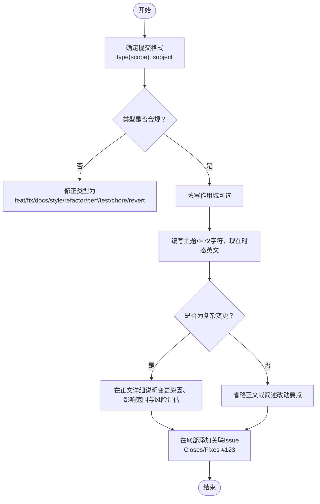
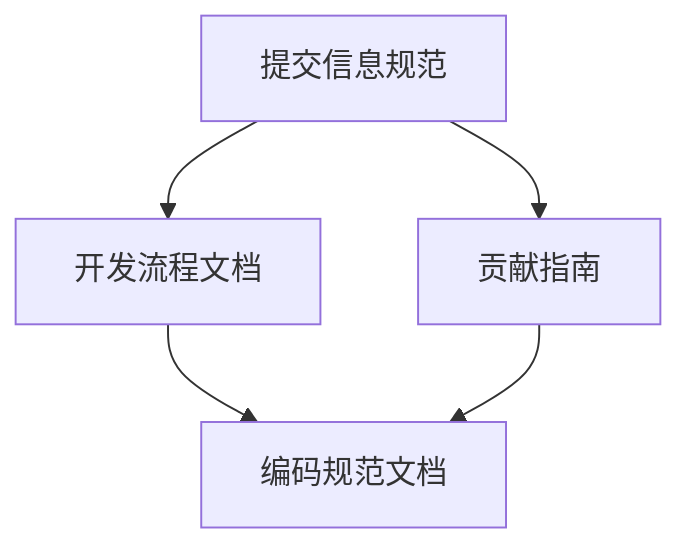

# Git提交规范

<cite>
**本文引用的文件**
- [k.yyup.com/CONTRIBUTING.md](file://k.yyup.com/CONTRIBUTING.md)
- [docs/wiki/unified-auth-management-system/05-development/development-workflow.md](file://docs/wiki/unified-auth-management-system/05-development/development-workflow.md)
- [docs/wiki/unified-auth-management-system/05-development/coding-standards.md](file://docs/wiki/unified-auth-management-system/05-development/coding-standards.md)
- [k.yyup.com/COMMIT_MESSAGE.txt](file://k.yyup.com/COMMIT_MESSAGE.txt)
</cite>

## 目录
1. [简介](#简介)
2. [项目结构](#项目结构)
3. [核心组件](#核心组件)
4. [架构总览](#架构总览)
5. [详细组件分析](#详细组件分析)
6. [依赖分析](#依赖分析)
7. [性能考虑](#性能考虑)
8. [故障排查指南](#故障排查指南)
9. [结论](#结论)
10. [附录](#附录)

## 简介
本文件基于仓库内现有的贡献与开发规范文档，制定适用于本项目的Git提交信息规范。规范以约定式提交（Conventional Commits）为基础，明确提交类型、作用域、主题与正文结构，并给出关联Issue的格式要求。同时结合项目现有实践，补充了提交信息的长度限制、复杂变更的正文说明要求以及与CI/PR流程的衔接方式。

## 项目结构
本项目包含两个主要子工程与大量测试与脚本文件，其中与提交规范直接相关的是：
- k.yyup.com：包含贡献指南与示例提交信息模板
- unified-tenant-system：包含统一认证与开发流程文档
- docs/wiki/unified-auth-management-system：包含开发流程与编码规范文档

图表来源
- [k.yyup.com/CONTRIBUTING.md](file://k.yyup.com/CONTRIBUTING.md#L226-L281)
- [docs/wiki/unified-auth-management-system/05-development/development-workflow.md](file://docs/wiki/unified-auth-management-system/05-development/development-workflow.md#L348-L378)
- [docs/wiki/unified-auth-management-system/05-development/coding-standards.md](file://docs/wiki/unified-auth-management-system/05-development/coding-standards.md#L68-L86)

章节来源
- [k.yyup.com/CONTRIBUTING.md](file://k.yyup.com/CONTRIBUTING.md#L226-L281)
- [docs/wiki/unified-auth-management-system/05-development/development-workflow.md](file://docs/wiki/unified-auth-management-system/05-development/development-workflow.md#L348-L378)
- [docs/wiki/unified-auth-management-system/05-development/coding-standards.md](file://docs/wiki/unified-auth-management-system/05-development/coding-standards.md#L68-L86)

## 核心组件
- 提交信息格式：采用约定式提交（Conventional Commits），包含类型、可选作用域与简短主题；正文用于说明变更原因与影响范围；底部用于关联Issue。
- 提交类型：feat、fix、docs、style、refactor、perf、test、chore、revert等。
- 作用域：反映功能模块，如auth、dashboard、api等；若涉及多模块，可用逗号分隔或在正文进一步说明。
- 主题与正文：主题使用简洁的现在时态英文，长度不超过72个字符；复杂变更需在正文详细说明背景、动机与影响范围。
- 关联Issue：使用“Closes #123”或“Fixes #123”格式，置于提交信息底部。

章节来源
- [k.yyup.com/CONTRIBUTING.md](file://k.yyup.com/CONTRIBUTING.md#L226-L281)
- [docs/wiki/unified-auth-management-system/05-development/development-workflow.md](file://docs/wiki/unified-auth-management-system/05-development/development-workflow.md#L348-L378)
- [k.yyup.com/COMMIT_MESSAGE.txt](file://k.yyup.com/COMMIT_MESSAGE.txt#L1-L20)

## 架构总览
下图展示了从本地开发到CI/PR审查的提交信息规范与流程衔接：

图表来源
- [k.yyup.com/CONTRIBUTING.md](file://k.yyup.com/CONTRIBUTING.md#L284-L331)
- [docs/wiki/unified-auth-management-system/05-development/development-workflow.md](file://docs/wiki/unified-auth-management-system/05-development/development-workflow.md#L658-L705)

## 详细组件分析

### 组件A：提交信息格式与类型
- 格式：type(scope): subject
- 类型：feat、fix、docs、style、refactor、perf、test、chore、revert
- 作用域：auth、dashboard、api、server、client等模块
- 主题：简洁的现在时态英文，长度不超过72个字符
- 正文：复杂变更需说明变更原因、影响范围与风险评估
- 底部：关联Issue（Closes/Fixes）

图表来源
- [k.yyup.com/CONTRIBUTING.md](file://k.yyup.com/CONTRIBUTING.md#L226-L281)
- [docs/wiki/unified-auth-management-system/05-development/development-workflow.md](file://docs/wiki/unified-auth-management-system/05-development/development-workflow.md#L348-L378)

章节来源
- [k.yyup.com/CONTRIBUTING.md](file://k.yyup.com/CONTRIBUTING.md#L226-L281)
- [docs/wiki/unified-auth-management-system/05-development/development-workflow.md](file://docs/wiki/unified-auth-management-system/05-development/development-workflow.md#L348-L378)

### 组件B：作用域定义与模块映射
- 建议作用域与模块对应关系：
  - auth：认证与授权相关
  - dashboard：仪表盘与控制台
  - api：API接口与路由
  - server：后端服务与控制器
  - client：前端组件与页面
  - db/migration：数据库迁移与模型
  - test：测试用例与测试工具
  - docs：文档更新
  - chore：构建与工具链变更
- 若涉及跨模块改动，可在作用域中列出多个模块，或在正文进一步说明

章节来源
- [docs/wiki/unified-auth-management-system/05-development/coding-standards.md](file://docs/wiki/unified-auth-management-system/05-development/coding-standards.md#L68-L86)
- [docs/wiki/unified-auth-management-system/05-development/development-workflow.md](file://docs/wiki/unified-auth-management-system/05-development/development-workflow.md#L348-L378)

### 组件C：复杂变更的正文说明
- 正文应包含但不限于：
  - 背景与动机
  - 影响范围与风险评估
  - 测试策略与验证结果
  - 回滚或降级方案（如适用）
- 与现有提交模板一致，复杂变更在正文详细展开，有助于审查与追溯

章节来源
- [k.yyup.com/COMMIT_MESSAGE.txt](file://k.yyup.com/COMMIT_MESSAGE.txt#L1-L20)
- [k.yyup.com/CONTRIBUTING.md](file://k.yyup.com/CONTRIBUTING.md#L269-L281)

### 组件D：关联Issue与PR流程
- 关联格式：Closes #123 或 Fixes #123
- PR标题与描述应与提交信息保持一致的格式与风格
- CI流水线会自动执行lint、类型检查、单元/集成/E2E测试，确保提交质量

章节来源
- [k.yyup.com/CONTRIBUTING.md](file://k.yyup.com/CONTRIBUTING.md#L284-L331)
- [docs/wiki/unified-auth-management-system/05-development/development-workflow.md](file://docs/wiki/unified-auth-management-system/05-development/development-workflow.md#L658-L705)

## 依赖分析
- 提交规范与开发流程文档强耦合：开发流程文档明确了提交信息格式与类型说明，贡献指南提供了PR模板与CI流程，两者共同构成提交信息的实施基础。
- 作用域与模块命名规范：编码规范文档中的文件命名与模块组织为作用域的定义提供了依据，确保提交信息与代码结构一致。

图表来源
- [docs/wiki/unified-auth-management-system/05-development/development-workflow.md](file://docs/wiki/unified-auth-management-system/05-development/development-workflow.md#L348-L378)
- [k.yyup.com/CONTRIBUTING.md](file://k.yyup.com/CONTRIBUTING.md#L284-L331)
- [docs/wiki/unified-auth-management-system/05-development/coding-standards.md](file://docs/wiki/unified-auth-management-system/05-development/coding-standards.md#L68-L86)

章节来源
- [docs/wiki/unified-auth-management-system/05-development/development-workflow.md](file://docs/wiki/unified-auth-management-system/05-development/development-workflow.md#L348-L378)
- [k.yyup.com/CONTRIBUTING.md](file://k.yyup.com/CONTRIBUTING.md#L284-L331)
- [docs/wiki/unified-auth-management-system/05-development/coding-standards.md](file://docs/wiki/unified-auth-management-system/05-development/coding-standards.md#L68-L86)

## 性能考虑
- 提交信息简洁且结构化有助于CI流水线快速解析与分类，减少不必要的检查开销。
- 复杂变更在提交信息中明确说明，可帮助审查者快速定位风险点，提升审查效率。
- 作用域清晰可降低跨模块变更的沟通成本，减少无效的二次提交。

## 故障排查指南
- 提交被拒绝或CI失败：
  - 检查提交类型是否在允许范围内
  - 确认主题长度是否超过72字符
  - 确认是否遗漏关联Issue（Closes/Fixes）
  - 确认复杂变更是否在正文中充分说明
- PR审查不通过：
  - 检查PR标题与描述是否与提交信息一致
  - 确认测试是否全部通过，覆盖率是否达标
  - 检查代码风格与命名规范是否符合编码规范文档

章节来源
- [k.yyup.com/CONTRIBUTING.md](file://k.yyup.com/CONTRIBUTING.md#L332-L350)
- [docs/wiki/unified-auth-management-system/05-development/development-workflow.md](file://docs/wiki/unified-auth-management-system/05-development/development-workflow.md#L658-L705)

## 结论
本规范以约定式提交为核心，结合项目现有的贡献指南与开发流程文档，明确了提交类型、作用域、主题与正文结构，并强调了复杂变更的说明要求与Issue关联格式。通过统一的提交规范，可显著提升代码审查效率、CI自动化质量与版本演进的可追溯性。

## 附录
- 提交信息模板与示例可参考贡献指南中的“提交规范”部分与COMMIT_MESSAGE.txt中的示例。
- 作用域建议与模块命名可参考编码规范文档中的项目结构与文件命名规范。

章节来源
- [k.yyup.com/CONTRIBUTING.md](file://k.yyup.com/CONTRIBUTING.md#L226-L281)
- [k.yyup.com/COMMIT_MESSAGE.txt](file://k.yyup.com/COMMIT_MESSAGE.txt#L1-L20)
- [docs/wiki/unified-auth-management-system/05-development/coding-standards.md](file://docs/wiki/unified-auth-management-system/05-development/coding-standards.md#L68-L86)