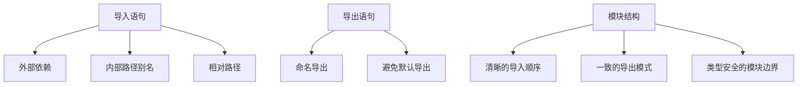
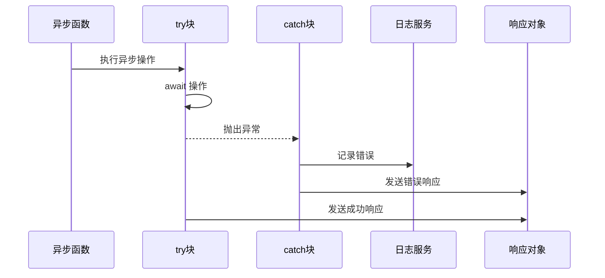
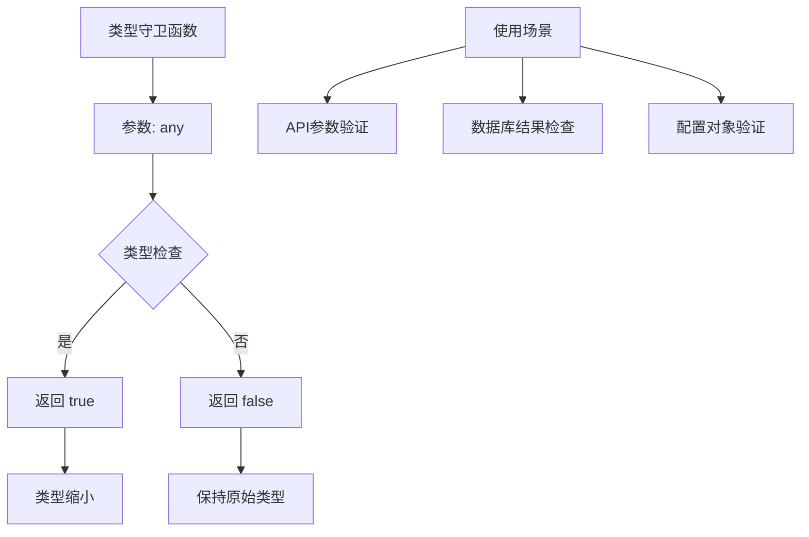
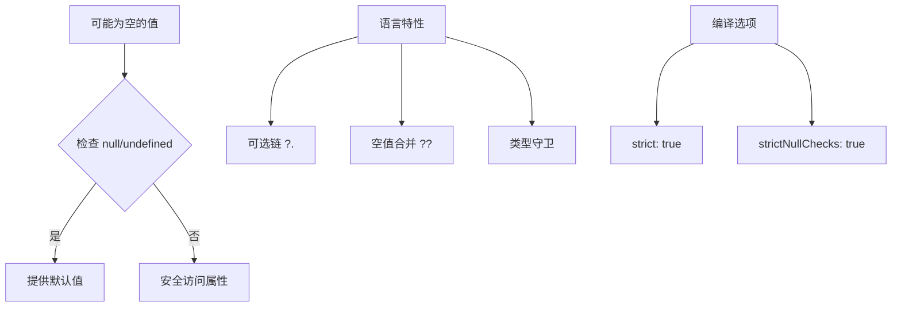
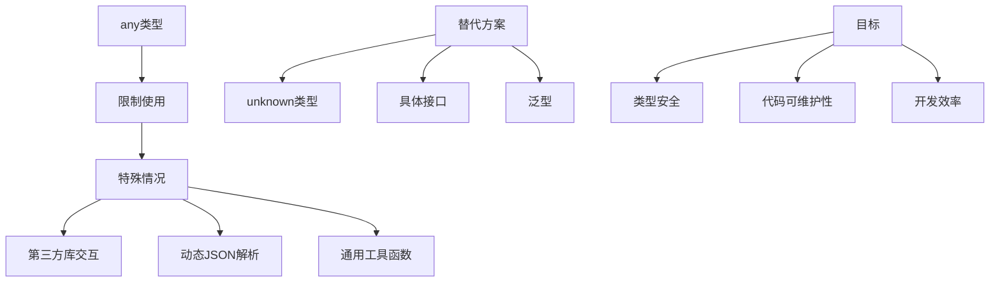

# TypeScript规范

<cite>
**本文档引用的文件**  
- [auth-shared-pool-example.middleware.ts](file://auth-shared-pool-example.middleware.ts)
- [database-initialization.ts](file://database-initialization.ts)
- [tenant-database-shared-pool.service.ts](file://tenant-database-shared-pool.service.ts)
- [tenant-resolver-shared-pool.middleware.ts](file://tenant-resolver-shared-pool.middleware.ts)
- [tsconfig.json](file://unified-tenant-system/tsconfig.json)
</cite>

## 目录
1. [简介](#简介)
2. [类型定义规范](#类型定义规范)
3. [模块导入导出规范](#模块导入导出规范)
4. [异步函数处理规范](#异步函数处理规范)
5. [类型守卫实现规范](#类型守卫实现规范)
6. [null和undefined安全处理](#null和undefined安全处理)
7. [any类型使用限制](#any类型使用限制)
8. [联合类型与交叉类型使用指导](#联合类型与交叉类型使用指导)

## 简介
本规范旨在为项目中的TypeScript编码提供统一的标准和最佳实践。通过分析项目代码库，我们总结出适用于本项目的类型系统使用规范，涵盖类型定义、模块管理、异步处理、类型安全等多个方面，以确保代码的一致性、可维护性和类型安全性。

## 类型定义规范

在项目中，接口和类型定义遵循清晰的命名约定和使用原则。接口名称采用PascalCase命名法，确保命名的可读性和一致性。

对于类型别名的使用，主要在以下场景中使用：
- 定义复杂的函数签名
- 创建联合类型或映射类型的别名
- 简化深层嵌套的对象结构

泛型约束在项目中被广泛使用，特别是在处理数据库操作和中间件时。通过泛型约束，可以确保类型参数满足特定的结构要求，提高代码的类型安全性。

```mermaid
classDiagram
class RequestWithUser {
+user? : any
+tenant? : { code : string }
+tenantDb? : any
}
class RequestWithTenant {
+tenant? : { code : string; domain : string; databaseName : string }
+tenantDb? : any
}
class ApiResponse {
+success : boolean
+message : string
+error? : string
+data? : any
}
class TenantDatabaseSharedPoolService {
-globalConnection : Sequelize | null
+initializeGlobalConnection() : Promise~Sequelize~
+getGlobalConnection() : Sequelize
+queryTenantDatabase(tenantCode : string, sql : string, options? : any) : Promise~any~
+getPoolStats() : Promise~any~
+healthCheck() : Promise~boolean~
+closeGlobalConnection() : Promise~void~
}
```

**图示来源**
- [auth-shared-pool-example.middleware.ts](file://auth-shared-pool-example.middleware.ts#L10-L14)
- [tenant-resolver-shared-pool.middleware.ts](file://tenant-resolver-shared-pool.middleware.ts#L14-L21)
- [tenant-database-shared-pool.service.ts](file://tenant-database-shared-pool.service.ts#L9-L176)

**本节来源**
- [auth-shared-pool-example.middleware.ts](file://auth-shared-pool-example.middleware.ts#L10-L14)
- [tenant-resolver-shared-pool.middleware.ts](file://tenant-resolver-shared-pool.middleware.ts#L14-L21)
- [tenant-database-shared-pool.service.ts](file://tenant-database-shared-pool.service.ts#L9-L176)

## 模块导入导出规范

项目中优先使用ES6模块语法进行模块的导入和导出，避免使用默认导出（default export），以提高代码的可预测性和可维护性。

所有导入语句按照以下顺序组织：
1. 外部依赖（如express、sequelize等）
2. 内部路径别名导入（如@/*）
3. 相对路径导入

在导出方面，推荐使用命名导出（named export），这样可以清晰地表明模块提供的功能，并且便于进行树摇优化（tree-shaking）。



**图示来源**
- [auth-shared-pool-example.middleware.ts](file://auth-shared-pool-example.middleware.ts#L6-L8)
- [database-initialization.ts](file://database-initialization.ts#L6-L7)
- [tenant-database-shared-pool.service.ts](file://tenant-database-shared-pool.service.ts#L6-L8)

**本节来源**
- [auth-shared-pool-example.middleware.ts](file://auth-shared-pool-example.middleware.ts#L6-L8)
- [database-initialization.ts](file://database-initialization.ts#L6-L7)
- [tenant-database-shared-pool.service.ts](file://tenant-database-shared-pool.service.ts#L6-L8)

## 异步函数处理规范

项目中统一使用async/await模式处理异步操作，避免使用回调函数或直接链式调用Promise.then()。这种模式使异步代码看起来更像同步代码，提高了代码的可读性和可维护性。

所有异步函数都应明确返回Promise类型，并使用try-catch块处理可能的异常情况。错误处理应包含适当的日志记录和用户友好的错误响应。



**图示来源**
- [auth-shared-pool-example.middleware.ts](file://auth-shared-pool-example.middleware.ts#L19-L136)
- [database-initialization.ts](file://database-initialization.ts#L13-L41)
- [tenant-database-shared-pool.service.ts](file://tenant-database-shared-pool.service.ts#L15-L56)

**本节来源**
- [auth-shared-pool-example.middleware.ts](file://auth-shared-pool-example.middleware.ts#L19-L136)
- [database-initialization.ts](file://database-initialization.ts#L13-L41)
- [tenant-database-shared-pool.service.ts](file://tenant-database-shared-pool.service.ts#L15-L56)

## 类型守卫实现规范

类型守卫在项目中用于在运行时验证对象的类型，确保类型安全。项目中通过自定义类型守卫函数来实现这一目的，这些函数返回类型谓词（type predicate）。

类型守卫主要用于：
- 验证API请求参数
- 检查数据库查询结果
- 确认配置对象的结构



**本节来源**
- [auth-shared-pool-example.middleware.ts](file://auth-shared-pool-example.middleware.ts#L10-L14)
- [tenant-resolver-shared-pool.middleware.ts](file://tenant-resolver-shared-pool.middleware.ts#L14-L21)

## null和undefined安全处理

项目强制启用strictNullChecks编译选项，确保对null和undefined的处理更加严格和安全。根据tsconfig.json配置，项目启用了"strict": true，这包括了strictNullChecks。

在代码中，必须显式处理可能为null或undefined的值，不能直接访问其属性或方法。推荐使用以下方式处理：
- 可选链操作符（?.）
- 空值合并操作符（??）
- 显式的null/undefined检查



**图示来源**
- [tsconfig.json](file://unified-tenant-system/tsconfig.json#L7)
- [auth-shared-pool-example.middleware.ts](file://auth-shared-pool-example.middleware.ts#L50-L53)
- [tenant-resolver-shared-pool.middleware.ts](file://tenant-resolver-shared-pool.middleware.ts#L44-L49)

**本节来源**
- [tsconfig.json](file://unified-tenant-system/tsconfig.json#L7)
- [auth-shared-pool-example.middleware.ts](file://auth-shared-pool-example.middleware.ts#L50-L53)
- [tenant-resolver-shared-pool.middleware.ts](file://tenant-resolver-shared-pool.middleware.ts#L44-L49)

## any类型使用限制

项目中严格限制any类型的使用，以维护类型系统的完整性。any类型仅在以下特殊情况下允许使用：
- 与未类型化的第三方库交互
- 处理动态JSON数据的初始解析
- 实现通用工具函数

替代any类型的推荐方案包括：
- 使用unknown类型进行更安全的类型处理
- 定义具体的接口或类型
- 使用泛型创建可重用的类型定义



**本节来源**
- [auth-shared-pool-example.middleware.ts](file://auth-shared-pool-example.middleware.ts#L11)
- [tenant-resolver-shared-pool.middleware.ts](file://tenant-resolver-shared-pool.middleware.ts#L16)
- [tenant-database-shared-pool.service.ts](file://tenant-database-shared-pool.service.ts#L10)

## 联合类型与交叉类型使用指导

联合类型和交叉类型在项目中被用于表示复杂的类型关系。联合类型（|）用于表示一个值可能是多种类型之一，而交叉类型（&）用于将多个类型合并为一个类型。

联合类型的典型使用场景：
- API响应的不同状态
- 配置选项的不同类型
- 事件处理的不同负载

交叉类型的典型使用场景：
- 扩展现有接口
- 组合多个功能接口
- 创建混合类型

```mermaid
classDiagram
class ApiResponseSuccess {
+success : true
+data : any
}
class ApiResponseError {
+success : false
+error : string
+message : string
}
class RequestWithUser {
+user? : User
}
class RequestWithTenant {
+tenant? : Tenant
}
class RequestWithUserAndTenant {
+user? : User
+tenant? : Tenant
}
ApiResponseSuccess <|-- ApiResponse
ApiResponseError <|-- ApiResponse
RequestWithUser <|-- RequestWithUserAndTenant
RequestWithTenant <|-- RequestWithUserAndTenant
note right of ApiResponse
联合类型示例 :
ApiResponse = ApiResponseSuccess | ApiResponseError
end note
note right of RequestWithUserAndTenant
交叉类型示例 :
RequestWithUserAndTenant = RequestWithUser & RequestWithTenant
end note
```

**图示来源**
- [auth-shared-pool-example.middleware.ts](file://auth-shared-pool-example.middleware.ts#L10-L14)
- [tenant-resolver-shared-pool.middleware.ts](file://tenant-resolver-shared-pool.middleware.ts#L14-L21)
- [auth-shared-pool-example.middleware.ts](file://auth-shared-pool-example.middleware.ts#L28-L32)

**本节来源**
- [auth-shared-pool-example.middleware.ts](file://auth-shared-pool-example.middleware.ts#L10-L14)
- [tenant-resolver-shared-pool.middleware.ts](file://tenant-resolver-shared-pool.middleware.ts#L14-L21)
- [auth-shared-pool-example.middleware.ts](file://auth-shared-pool-example.middleware.ts#L28-L32)