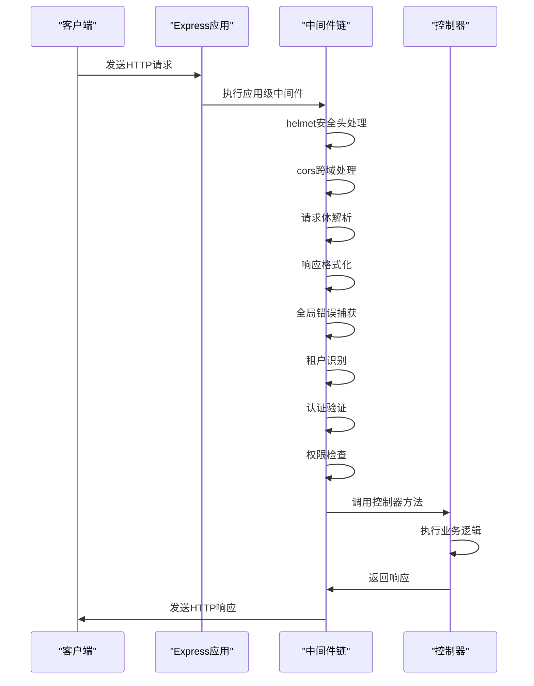
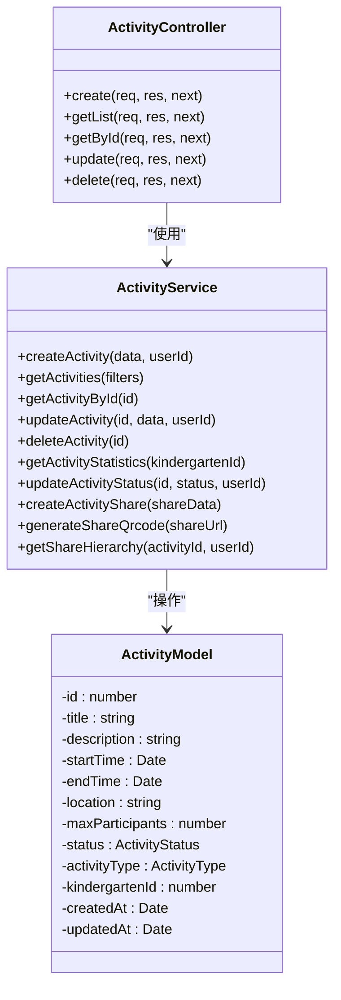
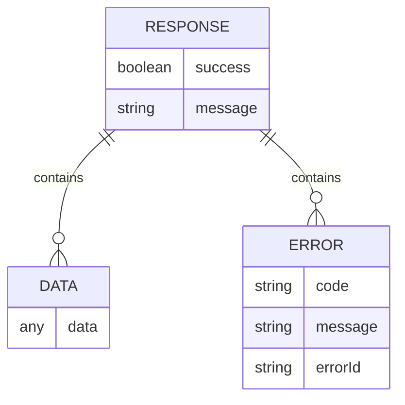

# 后端编码规范

<cite>
**本文档引用的文件**  
- [app.ts](file://k.yyup.com/server/src/app.ts)
- [index.ts](file://k.yyup.com/server/src/routes/index.ts)
- [activity.controller.ts](file://k.yyup.com/server/src/controllers/activity.controller.ts)
- [error.middleware.ts](file://k.yyup.com/server/src/middlewares/error.middleware.ts)
- [response-formatter.middleware.ts](file://k.yyup.com/server/src/middlewares/response-formatter.middleware.ts)
- [auth.middleware.ts](file://k.yyup.com/server/src/middlewares/auth.middleware.ts)
- [apiResponse.ts](file://k.yyup.com/server/src/utils/apiResponse.ts)
- [apiError.ts](file://k.yyup.com/server/src/utils/apiError.ts)
- [activity/index.ts](file://k.yyup.com/server/src/routes/activity/index.ts)
</cite>

## 目录
1. [Express路由定义与模块化组织](#express路由定义与模块化组织)
2. [控制器函数编写标准](#控制器函数编写标准)
3. [中间件使用原则](#中间件使用原则)
4. [业务逻辑与控制器分离](#业务逻辑与控制器分离)
5. [异步错误处理规范](#异步错误处理规范)
6. [API响应格式规范](#api响应格式规范)

## Express路由定义与模块化组织

在本项目中，Express路由采用模块化组织方式，通过主路由聚合文件统一管理所有路由。路由系统采用二级模块结构，将相关功能的路由组织在独立的模块中，提高了代码的可维护性和可读性。

路由模块的组织遵循以下原则：
- 每个功能模块拥有独立的路由文件
- 使用`index.ts`作为模块聚合文件，统一导入和注册该模块的所有路由
- 主路由文件`routes/index.ts`负责聚合所有模块路由
- 路由路径遵循RESTful设计原则，使用复数形式的资源名称

路由注册采用函数式编程模式，每个模块路由导出一个函数，接收Express的Router实例作为参数，在该实例上注册具体的路由规则。这种设计模式使得路由注册过程更加清晰和可控。

```mermaid
graph TB
subgraph "路由模块"
A[AI模块] --> |routes/ai/index.ts| B
C[认证模块] --> |routes/auth/index.ts| D
E[用户模块] --> |routes/users/index.ts| F
G[招生模块] --> |routes/enrollment/index.ts| H
I[活动模块] --> |routes/activity/index.ts| J
end
K[主路由聚合] --> |routes/index.ts| A
K --> C
K --> E
K --> G
K --> I
L[Express应用] --> |app.use('/api', routes)| K
```

**图示来源**
- [index.ts](file://k.yyup.com/server/src/routes/index.ts)
- [activity/index.ts](file://k.yyup.com/server/src/routes/activity/index.ts)

**本节来源**
- [app.ts](file://k.yyup.com/server/src/app.ts#L774)
- [index.ts](file://k.yyup.com/server/src/routes/index.ts)

## 控制器函数编写标准

控制器函数的编写遵循统一的标准，确保代码的一致性和可维护性。每个控制器类的方法都遵循相同的结构模式，包含请求验证、业务逻辑调用和响应处理三个主要部分。

控制器函数的标准结构如下：
1. **参数提取**：从请求对象中安全地提取路径参数、查询参数和请求体数据
2. **权限验证**：检查用户身份和操作权限
3. **业务逻辑调用**：调用服务层方法执行具体的业务逻辑
4. **响应处理**：使用统一的响应格式返回结果或错误

控制器方法使用async/await语法处理异步操作，通过try-catch块捕获异常，并将异常传递给错误处理中间件。控制器本身不直接处理错误，而是通过调用`next(error)`将错误传递给全局错误处理中间件。

```mermaid
flowchart TD
A[控制器方法入口] --> B[提取请求参数]
B --> C[验证用户权限]
C --> D[调用服务层方法]
D --> E{操作成功?}
E --> |是| F[使用ApiResponse返回成功响应]
E --> |否| G[调用next(error)传递异常]
G --> H[全局错误处理中间件]
F --> I[返回HTTP响应]
```

**图示来源**
- [activity.controller.ts](file://k.yyup.com/server/src/controllers/activity.controller.ts)
- [error.middleware.ts](file://k.yyup.com/server/src/middlewares/error.middleware.ts)

**本节来源**
- [activity.controller.ts](file://k.yyup.com/server/src/controllers/activity.controller.ts)
- [apiResponse.ts](file://k.yyup.com/server/src/utils/apiResponse.ts)

## 中间件使用原则

中间件的使用遵循分层原则，区分应用级中间件和路由级中间件。应用级中间件在应用启动时全局注册，影响所有请求；路由级中间件则在特定路由或路由组上注册，仅影响匹配的请求。

### 应用级中间件
应用级中间件在`app.ts`文件中通过`app.use()`方法全局注册，主要包括：
- 安全头中间件(helmet)
- 跨域资源共享中间件(cors)
- 请求体解析中间件(express.json和express.urlencoded)
- 响应格式化中间件(responseFormatter)
- 全局错误捕获中间件

### 路由级中间件
路由级中间件在路由定义时通过`router.use()`或直接在路由处理函数中指定，主要包括：
- 认证中间件(verifyToken)：验证用户身份
- 权限检查中间件(checkPermission)：验证用户操作权限
- 租户识别中间件(tenantResolverMiddleware)：识别请求所属的租户
- 调试日志中间件(apiDebugLogger)：记录API请求日志

中间件的执行顺序非常重要，通常按照以下顺序注册：
1. 租户识别中间件
2. 认证中间件
3. 权限检查中间件
4. 业务逻辑处理函数



**图示来源**
- [app.ts](file://k.yyup.com/server/src/app.ts)
- [auth.middleware.ts](file://k.yyup.com/server/src/middlewares/auth.middleware.ts)
- [error.middleware.ts](file://k.yyup.com/server/src/middlewares/error.middleware.ts)

**本节来源**
- [app.ts](file://k.yyup.com/server/src/app.ts#L112-L128)
- [auth.middleware.ts](file://k.yyup.com/server/src/middlewares/auth.middleware.ts)
- [error.middleware.ts](file://k.yyup.com/server/src/middlewares/error.middleware.ts)

## 业务逻辑与控制器分离

项目严格遵循关注点分离原则，将业务逻辑从控制器中分离到独立的服务层。这种设计模式确保了控制器的简洁性，使其仅负责请求处理和响应生成，而复杂的业务逻辑由专门的服务类处理。

### 分层架构
项目采用典型的三层架构：
1. **表示层**：由控制器组成，负责处理HTTP请求和响应
2. **业务逻辑层**：由服务类组成，负责实现核心业务逻辑
3. **数据访问层**：由模型和数据访问对象组成，负责数据持久化

### 依赖关系
各层之间的依赖关系是单向的，遵循依赖倒置原则：
- 控制器依赖服务层
- 服务层依赖数据访问层
- 数据访问层不依赖上层

这种分层设计使得各层可以独立开发、测试和维护，提高了代码的可测试性和可维护性。



**图示来源**
- [activity.controller.ts](file://k.yyup.com/server/src/controllers/activity.controller.ts)
- [activity.service](file://k.yyup.com/server/src/services/activity/activity.service)
- [activity.model](file://k.yyup.com/server/src/models/activity.model)

**本节来源**
- [activity.controller.ts](file://k.yyup.com/server/src/controllers/activity.controller.ts)
- [activity.service](file://k.yyup.com/server/src/services/activity/activity.service)

## 异步错误处理规范

项目采用统一的异步错误处理规范，确保所有异步操作的错误都能被正确捕获和处理。异步错误处理遵循以下原则：

### 统一错误处理机制
项目使用Express的错误处理中间件机制，通过`next(error)`函数将错误传递给全局错误处理中间件。这种方式避免了在每个控制器方法中重复编写错误处理代码，提高了代码的简洁性和一致性。

### 错误分类
错误被分为不同类别，每种类别对应不同的HTTP状态码和用户提示信息：
- **客户端错误**（4xx）：如请求参数错误、未授权、权限不足等
- **服务器错误**（5xx）：如数据库连接错误、内部服务器错误等
- **验证错误**：如数据验证失败、输入格式错误等

### 错误对象设计
项目定义了统一的错误对象`ApiError`，包含以下属性：
- `statusCode`：HTTP状态码
- `message`：错误消息
- `code`：错误代码
- `userMessage`：用户友好的错误提示

```mermaid
flowchart TD
A[异步操作] --> B{发生错误?}
B --> |是| C[创建ApiError实例]
C --> D[调用next(error)]
D --> E[全局错误处理中间件]
E --> F[记录错误日志]
F --> G[生成结构化错误响应]
G --> H[返回HTTP错误响应]
B --> |否| I[返回成功响应]
```

**图示来源**
- [error.middleware.ts](file://k.yyup.com/server/src/middlewares/error.middleware.ts)
- [apiError.ts](file://k.yyup.com/server/src/utils/apiError.ts)

**本节来源**
- [error.middleware.ts](file://k.yyup.com/server/src/middlewares/error.middleware.ts)
- [apiError.ts](file://k.yyup.com/server/src/utils/apiError.ts)
- [activity.controller.ts](file://k.yyup.com/server/src/controllers/activity.controller.ts)

## API响应格式规范

项目采用统一的API响应格式，确保前后端交互的一致性和可预测性。响应格式遵循RESTful设计原则，包含状态标识、数据内容和消息提示三个主要部分。

### 成功响应格式
成功响应的JSON结构如下：
```json
{
  "success": true,
  "data": {响应数据},
  "message": "操作成功"
}
```

### 错误响应格式
错误响应的JSON结构如下：
```json
{
  "success": false,
  "error": {
    "code": "错误代码",
    "message": "错误消息",
    "errorId": "错误ID"
  }
}
```

### 响应工具类
项目提供了`ApiResponse`工具类，封装了常用的响应方法，包括：
- `success()`：返回成功响应
- `error()`：返回错误响应
- `notFound()`：返回资源不存在响应
- `badRequest()`：返回请求参数错误响应
- `unauthorized()`：返回未授权响应
- `forbidden()`：返回禁止访问响应
- `serverError()`：返回服务器错误响应
- `paginated()`：返回分页数据响应

响应格式化中间件确保所有响应都符合统一格式，特别是处理分页数据时，确保`list`字段始终为数组类型，避免前端处理时出现类型错误。



**图示来源**
- [response-formatter.middleware.ts](file://k.yyup.com/server/src/middlewares/response-formatter.middleware.ts)
- [apiResponse.ts](file://k.yyup.com/server/src/utils/apiResponse.ts)

**本节来源**
- [response-formatter.middleware.ts](file://k.yyup.com/server/src/middlewares/response-formatter.middleware.ts)
- [apiResponse.ts](file://k.yyup.com/server/src/utils/apiResponse.ts)
- [app.ts](file://k.yyup.com/server/src/app.ts#L128)