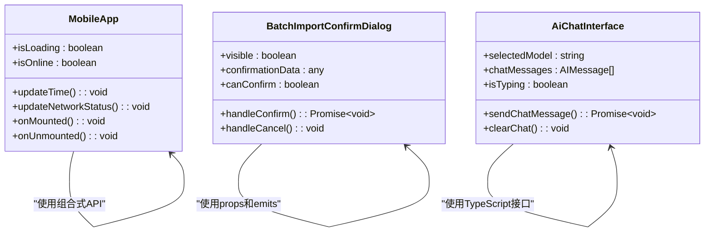
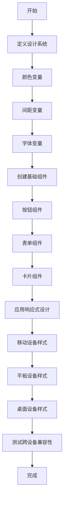

# 编码规范

<cite>
**本文档引用的文件**   
- [package.json](file://k.yyup.com/package.json)
- [tsconfig.json](file://k.yyup.com/tsconfig.json)
- [BatchImportConfirmDialog.vue](file://k.yyup.com/BatchImportConfirmDialog.vue)
- [ai-chat-interface-fixed.vue](file://k.yyup.com/ai-chat-interface-fixed.vue)
- [App.vue](file://k.yyup.com/client/aimobile/App.vue)
- [auth-shared-pool-example.middleware.ts](file://auth-shared-pool-example.middleware.ts)
</cite>

## 目录
1. [TypeScript编码规范](#typescript编码规范)
2. [Vue组件编写规范](#vue组件编写规范)
3. [Git提交信息规范](#git提交信息规范)
4. [代码格式化配置](#代码格式化配置)
5. [前端样式规范](#前端样式规范)
6. [后端Express路由与控制器规范](#后端express路由与控制器规范)

## TypeScript编码规范

本项目采用TypeScript作为主要开发语言，遵循严格的类型定义和模块管理规范。

### 类型定义与接口命名
- 所有接口名称必须使用PascalCase命名法，以`I`前缀开头，例如：`IUser`, `IProduct`
- 类型别名应使用有意义的名称，避免使用过于通用的名称如`Data`, `Info`
- 枚举类型使用PascalCase命名，值使用UPPER_CASE命名
- 所有API响应数据应定义明确的接口类型，继承自`ApiResponse<T>`基类

### 模块导入导出
- 使用ES模块语法进行导入导出
- 导入路径优先使用绝对路径别名`@/*`，例如：`import { UserService } from '@/services/user.service'`
- 避免使用相对路径导入超过两级的模块
- 默认导出仅用于组件和页面，工具函数和类应使用命名导出
- 导入语句按以下顺序分组：
  1. 标准库导入
  2. 第三方库导入
  3. 项目内导入（使用`@`别名）

**Section sources**
- [tsconfig.json](file://k.yyup.com/tsconfig.json#L1-L21)
- [package.json](file://k.yyup.com/package.json#L256-L295)

## Vue组件编写规范

### 组件命名
- 组件文件名采用PascalCase命名法，例如：`UserProfile.vue`, `DataTable.vue`
- 单文件组件使用`<script setup lang="ts">`语法糖
- 组件名称应具有描述性，避免使用过于宽泛的名称如`Component`, `View`
- 移动端组件以`Mobile`前缀开头，例如：`MobileHome.vue`, `MobileSidebar.vue`

### Props定义
- 所有props必须定义明确的类型
- 使用`defineProps`宏进行类型声明
- 必填props应设置`required: true`
- 为props提供合理的默认值
- 复杂类型的props应定义独立的接口

### 事件通信
- 使用`defineEmits`宏定义组件事件
- 事件名称采用kebab-case命名法，例如：`update-user`, `delete-item`
- 事件负载应使用对象传递，避免传递原始值
- 自定义事件应遵循语义化命名原则

### 组合式API使用
- 优先使用组合式API而非选项式API
- 逻辑相关的响应式数据和方法应组织在同一个组合函数中
- 使用`ref`定义基本类型响应式数据，`reactive`定义对象类型
- 生命周期钩子按以下顺序排列：`onMounted`, `onUpdated`, `onUnmounted`
- 使用`computed`定义计算属性，`watch`监听数据变化



**Diagram sources **
- [App.vue](file://k.yyup.com/client/aimobile/App.vue#L139-L468)
- [BatchImportConfirmDialog.vue](file://k.yyup.com/BatchImportConfirmDialog.vue#L205-L281)
- [ai-chat-interface-fixed.vue](file://k.yyup.com/ai-chat-interface-fixed.vue#L190-L203)

**Section sources**
- [App.vue](file://k.yyup.com/client/aimobile/App.vue#L139-L468)
- [BatchImportConfirmDialog.vue](file://k.yyup.com/BatchImportConfirmDialog.vue#L205-L281)
- [ai-chat-interface-fixed.vue](file://k.yyup.com/ai-chat-interface-fixed.vue#L190-L203)

## Git提交信息规范

Git提交信息必须遵循以下格式规范，确保变更记录清晰可追溯：

```
<功能模块>: <变更类型> <简要描述>

<详细描述（可选）>

<关联任务ID（可选）>
```

### 功能模块
- 使用英文小写字母，采用kebab-case命名
- 常见模块包括：`auth`, `user`, `dashboard`, `api`, `config`, `style`, `ci`, `docs`
- 示例：`user`, `payment-service`, `mobile-layout`

### 变更类型
- `feat`: 新功能开发
- `fix`: bug修复
- `refactor`: 代码重构（不新增功能，不修复bug）
- `style`: 代码格式调整（不影响代码运行）
- `perf`: 性能优化
- `test`: 测试相关修改
- `docs`: 文档更新
- `chore`: 构建过程或辅助工具的变动

### 简要描述
- 使用动词开头，采用英文现在时
- 描述应简洁明了，不超过72个字符
- 避免使用模糊词汇如"修改"、"调整"

### 示例
```
user: feat 添加用户个人资料编辑功能

实现用户头像上传和基本信息编辑功能
支持昵称、邮箱、手机号的修改

TASK-1234
```

```
auth: fix 修复登录Token验证失效问题

修复Token过期后未正确返回401状态码的问题
添加Token刷新机制

BUG-5678
```

**Section sources**
- [package.json](file://k.yyup.com/package.json#L40-L254)

## 代码格式化配置

### ESLint规则设置
本项目使用ESLint进行代码质量检查，核心规则包括：
- 强制使用TypeScript类型注解
- 禁止使用`any`类型
- 要求变量和函数命名符合camelCase规范
- 强制使用const声明不可变变量
- 要求导入语句按字母顺序排列
- 禁止使用console.log（生产环境）
- 要求函数有明确的返回类型

### Prettier规则设置
- 使用单引号而非双引号
- 行尾添加逗号
- Tab大小为2个空格
- 分号结尾
- 每行最大长度100字符
- 对象字面量的属性间换行
- JSX元素超过单行时每个属性占一行

### 集成配置
```json
{
  "eslintConfig": {
    "extends": [
      "eslint:recommended",
      "plugin:@typescript-eslint/recommended",
      "prettier"
    ],
    "plugins": ["@typescript-eslint"],
    "rules": {
      "@typescript-eslint/no-explicit-any": "error",
      "@typescript-eslint/explicit-module-boundary-types": "warn",
      "no-console": "warn"
    }
  },
  "prettier": {
    "singleQuote": true,
    "trailingComma": "all",
    "tabWidth": 2,
    "semi": true,
    "printWidth": 100
  }
}
```

**Section sources**
- [package.json](file://k.yyup.com/package.json#L1-L318)

## 前端样式规范

### SCSS编写标准
- 使用SCSS作为主要样式语言
- 遵循BEM（Block Element Modifier）命名方法
- 组件样式使用scoped属性隔离
- 定义统一的变量文件`variables.scss`管理颜色、间距、字体等
- 使用CSS自定义属性（CSS Variables）实现主题切换

### CSS类名命名约定
- 采用BEM命名规范：`block__element--modifier`
- 块（Block）表示独立组件，如`button`, `card`, `form`
- 元素（Element）表示块的子元素，用双下划线连接，如`card__header`, `form__input`
- 修饰符（Modifier）表示状态或变体，用双连字符连接，如`button--primary`, `card--compact`
- 避免使用ID选择器和深层嵌套

### 响应式设计原则
- 采用移动优先（Mobile First）设计策略
- 使用CSS Grid和Flexbox进行布局
- 断点定义遵循以下标准：
  - 手机：默认（max-width: 768px）
  - 平板：768px - 1024px
  - 桌面：1024px以上
- 使用相对单位（rem, em, %）而非绝对单位（px）
- 图片和媒体元素设置最大宽度100%
- 触摸目标大小至少44px×44px



**Diagram sources **
- [ai-chat-interface-fixed.vue](file://k.yyup.com/ai-chat-interface-fixed.vue#L206-L648)

**Section sources**
- [ai-chat-interface-fixed.vue](file://k.yyup.com/ai-chat-interface-fixed.vue#L206-L648)

## 后端Express路由与控制器规范

### 路由编写规范
- 路由路径采用kebab-case命名
- 路由按功能模块组织在独立的路由文件中
- 使用路由器（Router）进行模块化管理
- 路径参数使用`:paramName`格式
- 查询参数应在文档中明确说明

### 控制器编写规范
- 控制器方法应保持简洁，主要负责请求处理和响应
- 业务逻辑应委托给服务层处理
- 统一的响应格式：`{ success: boolean, message: string, data?: any, error?: string }`
- 错误处理使用统一的错误中间件
- 输入验证使用Joi等验证库
- 数据库操作使用完整表名访问租户数据库，格式为`tenant_${tenantCode}.tableName`

### 认证中间件示例
```typescript
/**
 * 改进的Token验证中间件 - 使用共享连接池
 */
export const verifyTokenSharedPool = async (
  req: RequestWithUser,
  res: Response,
  next: NextFunction
): Promise<void> => {
  // 获取token并验证
  const authHeader = req.headers.authorization;
  if (!authHeader || !authHeader.startsWith('Bearer ')) {
    return res.status(401).json({
      success: false,
      message: '缺少认证令牌',
      error: 'MISSING_TOKEN'
    });
  }

  // ✅ 关键改进：使用完整表名查询租户数据库
  const [userRows] = await req.tenantDb.query(`
    SELECT 
      u.id, 
      u.username, 
      u.email, 
      u.real_name
    FROM tenant_${tenantCode}.users u
    WHERE u.global_user_id = ? AND u.status = 'active'
    LIMIT 1
  `, {
    replacements: [globalUser.id]
  });
}
```

**Section sources**
- [auth-shared-pool-example.middleware.ts](file://auth-shared-pool-example.middleware.ts#L1-L255)