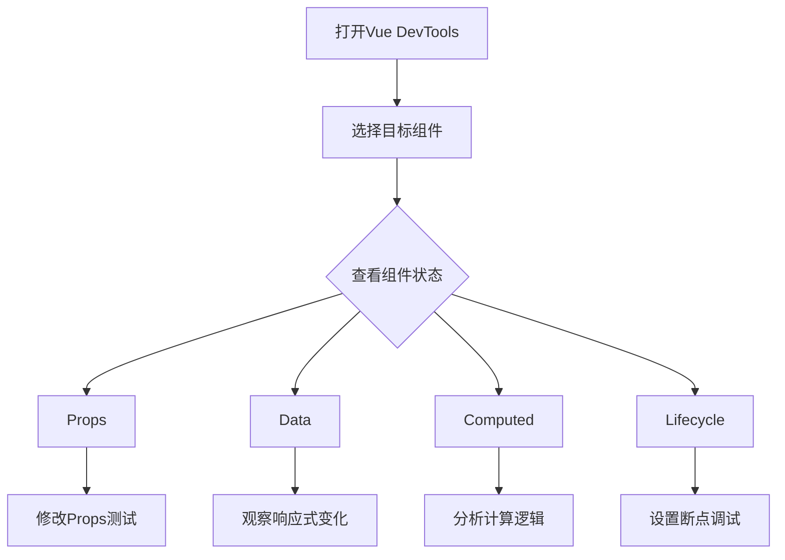
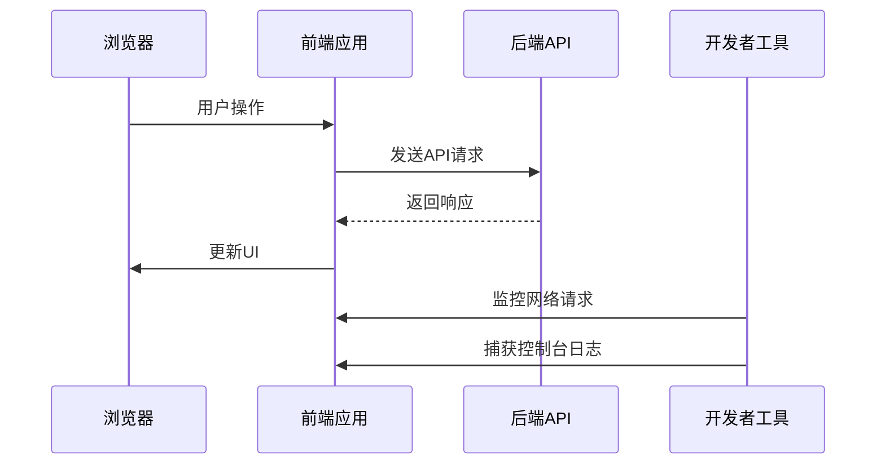
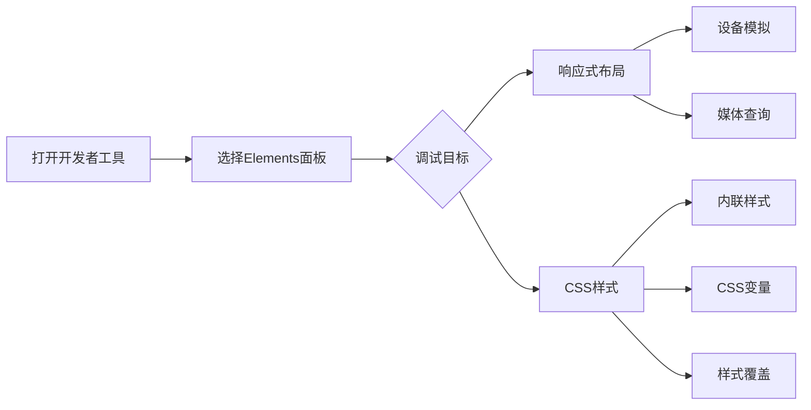
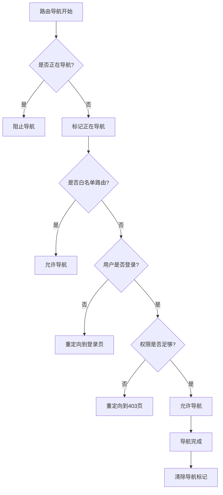
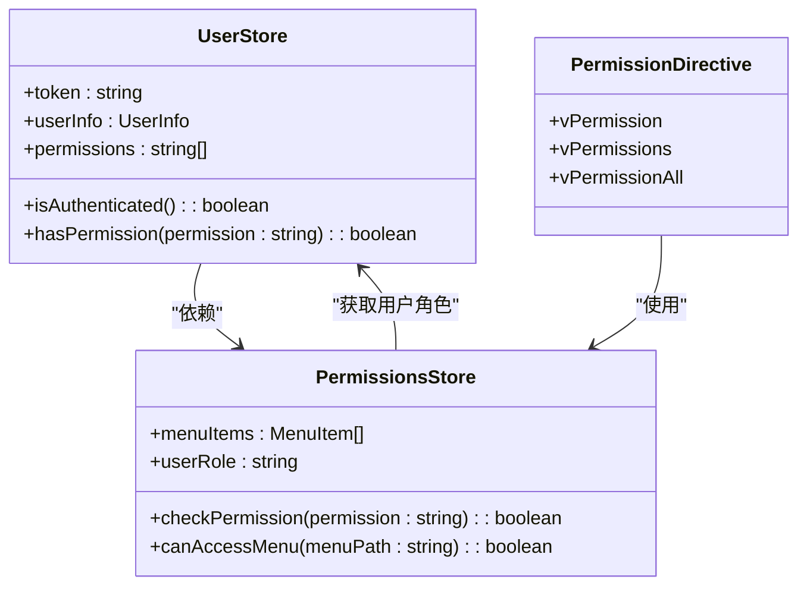

# 前端调试

<cite>
**本文档引用的文件**
- [main.ts](file://client/src/main.ts)
- [router/index.ts](file://client/src/router/index.ts)
- [directives/permission.ts](file://client/src/directives/permission.ts)
- [api/interceptors.ts](file://client/src/api/interceptors.ts)
- [stores/permissions-simple.ts](file://client/src/stores/permissions-simple.ts)
- [stores/user.ts](file://client/src/stores/user.ts)
</cite>

## 目录
1. [简介](#简介)
2. [Vue DevTools 调试](#vue-devtools-调试)
3. [API 请求调试](#api-请求调试)
4. [响应式布局与 CSS 样式调试](#响应式布局与-css-样式调试)
5. [路由导航调试](#路由导航调试)
6. [前端权限调试](#前端权限调试)
7. [常见前端 Bug 模式及解决方案](#常见前端-bug-模式及解决方案)

## 简介
k.yyupgame前端系统是一个基于Vue 3和Pinia的现代化前端应用，采用Vite作为构建工具。系统集成了Element Plus和Vant等UI组件库，并通过Axios进行API通信。本指南将详细介绍如何对这个系统进行高效调试，涵盖组件状态跟踪、API请求监控、路由问题排查和权限问题定位等关键方面。

## Vue DevTools 调试

### 组件状态跟踪
在k.yyupgame系统中，Vue DevTools是调试组件状态的核心工具。开发者可以通过Vue DevTools实时查看和修改组件的props、data、computed属性和生命周期钩子。

**props调试**：在Vue DevTools的组件树中，选择目标组件后，可以在"Props"面板查看传递给该组件的所有props。对于k.yyupgame系统中的`MobileAiAssistant.vue`等关键组件，可以实时修改props值来测试不同状态下的组件行为。

**data调试**：在"Data"面板中，可以查看组件的响应式数据。对于使用Pinia的全局状态管理，可以在"Pinia"标签页中查看所有store的状态，如`useUserStore`和`usePermissionsStore`。

**computed属性调试**：在"Computed"面板中，可以查看所有计算属性的当前值和依赖关系。这对于调试复杂的业务逻辑非常有用，例如在`permissions-simple.ts`中定义的权限计算逻辑。

**生命周期钩子调试**：在"Timeline"面板中，可以查看组件的生命周期事件。通过在`main.ts`中设置断点，可以跟踪应用的初始化过程，包括Pinia store的创建和路由的挂载。

**Section sources**
- [main.ts](file://client/src/main.ts#L1-L231)
- [stores/user.ts](file://client/src/stores/user.ts#L1-L481)
- [stores/permissions-simple.ts](file://client/src/stores/permissions-simple.ts#L1-L216)

### 性能分析
Vue DevTools的性能分析功能可以帮助识别性能瓶颈。在k.yyupgame系统中，可以通过以下方式使用：

1. **组件渲染性能**：在"Performance"标签页中，记录组件的渲染过程，分析哪些组件的渲染时间过长。
2. **响应式依赖追踪**：通过观察computed属性和watcher的触发频率，优化不必要的重新渲染。
3. **内存使用分析**：监控组件实例的创建和销毁，确保没有内存泄漏。

**Diagram sources**
- [main.ts](file://client/src/main.ts#L1-L231)
- [stores/user.ts](file://client/src/stores/user.ts#L1-L481)

## API 请求调试

### 使用浏览器开发者工具
在k.yyupgame系统中，API请求的调试主要通过浏览器开发者工具的Network面板完成。系统使用Axios进行HTTP通信，并通过拦截器处理认证和错误。

**请求监控**：在Network面板中，可以查看所有发出的API请求，包括请求URL、方法、请求头和请求体。特别关注`/api/`开头的请求，这些是系统的主要API端点。

**响应分析**：检查API响应的状态码、响应头和响应体。对于k.yyupgame系统，重点关注认证相关的401和403错误，这些通常与权限问题相关。

**错误排查**：当API请求失败时，可以在Console面板查看详细的错误信息。系统在`interceptors.ts`中实现了全局错误处理，会将错误信息输出到控制台。

**Diagram sources**
- [api/interceptors.ts](file://client/src/api/interceptors.ts#L1-L227)
- [main.ts](file://client/src/main.ts#L55-L58)

### Axios拦截器调试
k.yyupgame系统在`api/interceptors.ts`中配置了Axios拦截器，用于处理认证和错误。调试时需要注意：

1. **请求拦截器**：检查Authorization头是否正确添加。在开发环境中，系统会从localStorage读取token并添加到请求头中。
2. **响应拦截器**：分析401（未授权）和403（权限不足）错误的处理逻辑。系统会根据错误类型显示不同的提示信息或跳转到登录页。

**Section sources**
- [api/interceptors.ts](file://client/src/api/interceptors.ts#L1-L227)
- [main.ts](file://client/src/main.ts#L55-L58)

## 响应式布局与 CSS 样式调试

### 响应式布局调试
k.yyupgame系统需要支持多种设备尺寸，调试响应式布局时可以使用浏览器开发者工具的设备模拟功能。

1. **媒体查询调试**：在"Elements"面板中，可以查看当前应用的媒体查询状态，测试不同屏幕尺寸下的布局表现。
2. **Flexbox和Grid布局**：使用布局检查器可视化Flexbox和Grid容器，确保子元素的排列符合预期。

### CSS 样式调试
系统在`styles/`目录下组织了全局样式文件，调试CSS样式时需要注意：

**内联样式**：检查组件中的内联样式是否正确应用。在Vue组件中，内联样式通常通过`:style`绑定实现。

**CSS变量**：系统使用CSS变量进行主题管理。在"Elements"面板中，可以查看CSS变量的当前值，并实时修改以测试不同主题效果。

**样式覆盖**：由于系统引入了多个UI库（Element Plus和Vant），需要注意样式覆盖问题。在`main.ts`中，样式导入顺序确保了自定义样式能够正确覆盖库的默认样式。

**Diagram sources**
- [main.ts](file://client/src/main.ts#L11-L23)
- [styles/index.scss](file://client/src/styles/index.scss)

## 路由导航调试

### 路由问题排查
k.yyupgame系统的路由配置在`router/index.ts`中，使用Vue Router 4。调试路由问题时可以关注以下几个方面：

**导航守卫**：系统实现了全局的`beforeEach`导航守卫，用于处理认证和权限检查。在控制台中可以看到详细的导航日志，帮助定位跳转问题。

**智能路由重定向**：系统实现了基于用户角色的智能路由重定向。在`router/index.ts`中，`smartRedirect`函数根据用户角色决定首页跳转目标。

**循环跳转防护**：代码中实现了`isNavigating`标志和`navigationLock`集合，防止路由的循环跳转。

### 页面跳转问题定位
当遇到页面跳转异常时，可以按照以下步骤排查：

1. 检查控制台是否有路由相关的错误日志
2. 验证目标路由是否在`optimizedRoutes`或`mobileRoutes`中定义
3. 确认用户是否有访问目标页面的权限
4. 检查导航守卫中的条件逻辑

**Diagram sources**
- [router/index.ts](file://client/src/router/index.ts#L1-L120)
- [main.ts](file://client/src/main.ts#L73-L78)

**Section sources**
- [router/index.ts](file://client/src/router/index.ts#L1-L120)
- [main.ts](file://client/src/main.ts#L73-L78)

## 前端权限调试

### 权限相关显示问题
k.yyupgame系统实现了多层级的权限控制，调试权限问题时需要理解其工作原理。

**指令权限**：系统使用自定义的Vue指令`v-permission`、`v-permissions`和`v-permission-all`来控制元素的显示。这些指令在`directives/permission.ts`中定义，支持`.hide`和`.disable`修饰符。

**路由权限**：在路由守卫中，通过`permissionsStore.canAccessMenu()`方法检查用户是否有访问特定路由的权限。

**按钮权限**：对于操作按钮，使用权限指令进行细粒度控制。例如，只有拥有`EDIT_STUDENT`权限的用户才能看到编辑按钮。

### 权限调试步骤
1. 检查用户角色和权限：通过Vue DevTools查看`useUserStore`和`usePermissionsStore`的状态
2. 验证权限代码：确认UI元素使用的权限代码是否正确
3. 测试不同角色：切换用户角色测试权限控制是否按预期工作
4. 检查localStorage：验证`kindergarten_user_info`中的权限数据是否正确

**Diagram sources**
- [stores/user.ts](file://client/src/stores/user.ts#L1-L481)
- [stores/permissions-simple.ts](file://client/src/stores/permissions-simple.ts#L1-L216)
- [directives/permission.ts](file://client/src/directives/permission.ts#L1-L260)

**Section sources**
- [directives/permission.ts](file://client/src/directives/permission.ts#L1-L260)
- [stores/permissions-simple.ts](file://client/src/stores/permissions-simple.ts#L1-L216)
- [stores/user.ts](file://client/src/stores/user.ts#L1-L481)

## 常见前端 Bug 模式及解决方案

### 常见 Bug 模式
1. **权限相关Bug**：用户无法访问应有权限的页面，通常是由于权限代码不匹配或store状态未正确初始化。
2. **API认证失败**：401错误频繁出现，可能是token过期处理逻辑有问题。
3. **路由循环跳转**：页面在登录页和首页之间无限循环，通常是导航守卫逻辑错误。
4. **响应式布局错乱**：在特定设备尺寸下UI显示异常，可能是媒体查询或Flexbox配置问题。
5. **状态同步问题**：多个组件间的状态不同步，可能是Pinia store的响应式问题。

### 解决方案
1. **权限问题**：检查`permission.ts`中的权限代码和`permissions-simple.ts`中的权限映射，确保前后端权限定义一致。
2. **API问题**：在`interceptors.ts`中增强错误处理，添加详细的日志输出。
3. **路由问题**：在`router/index.ts`的导航守卫中添加更详细的调试日志，使用`isNavigating`标志防止循环。
4. **布局问题**：使用浏览器的设备模拟工具系统性地测试各种屏幕尺寸。
5. **状态问题**：确保所有状态变更都通过Pinia的actions进行，避免直接修改state。

**Section sources**
- [directives/permission.ts](file://client/src/directives/permission.ts#L1-L260)
- [api/interceptors.ts](file://client/src/api/interceptors.ts#L1-L227)
- [router/index.ts](file://client/src/router/index.ts#L1-L120)
- [stores/user.ts](file://client/src/stores/user.ts#L1-L481)