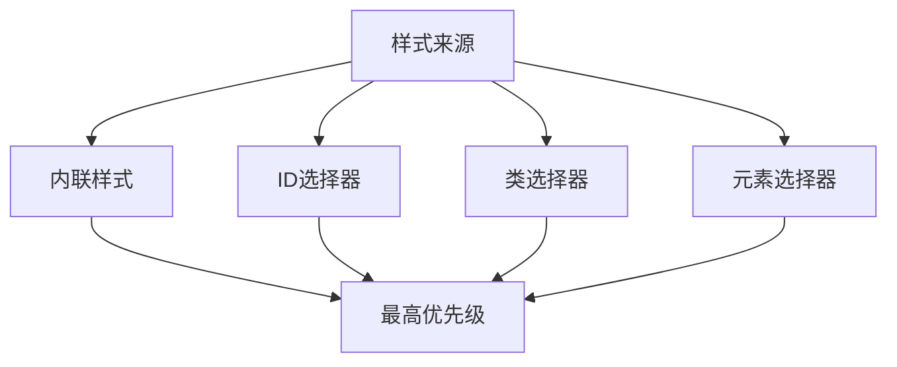
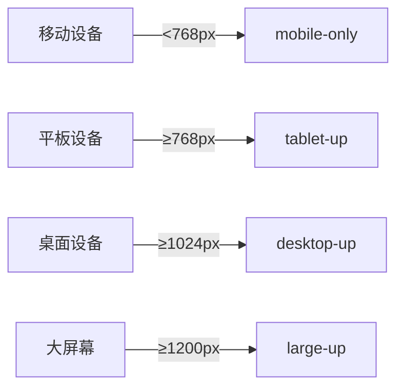
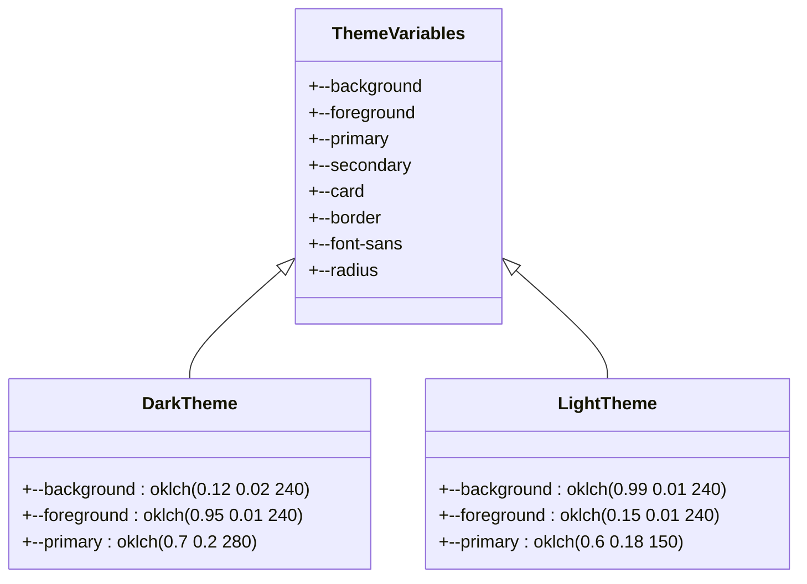

# 样式调试

<cite>
**本文档引用的文件**
- [theme_dark.css](file://k.yyup.com/.superdesign/design_iterations/theme_dark.css)
- [theme_light.css](file://k.yyup.com/.superdesign/design_iterations/theme_light.css)
- [mobile.scss](file://k.yyup.com/client/aimobile/styles/mobile.scss)
- [chart-fixes.css](file://k.yyup.com/chart-fixes.css)
- [dashboard_dark_1.html](file://k.yyup.com/.superdesign/design_iterations/dashboard_dark_1.html)
- [dashboard_light_1.html](file://k.yyup.com/.superdesign/design_iterations/dashboard_light_1.html)
</cite>

## 目录
1. [简介](#简介)
2. [浏览器开发者工具使用](#浏览器开发者工具使用)
3. [CSS变量与内联样式调试](#css变量与内联样式调试)
4. [样式冲突与优先级问题](#样式冲突与优先级问题)
5. [响应式布局调试](#响应式布局调试)
6. [主题切换功能调试](#主题切换功能调试)
7. [样式性能优化](#样式性能优化)
8. [跨浏览器与设备一致性验证](#跨浏览器与设备一致性验证)

## 简介
本文档提供k.yyupgame前端系统中CSS和内联样式的详细调试指南。文档涵盖了使用浏览器开发者工具检查和修改样式、调试CSS变量和内联样式、定位样式冲突和优先级问题、处理响应式布局中的样式异常、调试主题切换功能（特别是深色模式和浅色模式）以及样式性能优化建议。

**本节不分析具体源文件，因此不提供来源**

## 浏览器开发者工具使用
使用浏览器开发者工具可以检查和修改CSS样式。通过右键点击页面元素并选择"检查"，可以打开开发者工具并查看选中元素的样式信息。在"Elements"面板中，可以查看元素的HTML结构和应用的CSS规则，实时修改样式并立即看到效果。

**本节不分析具体源文件，因此不提供来源**

## CSS变量与内联样式调试
k.yyupgame系统使用CSS自定义属性（CSS变量）来管理设计令牌。在`mobile.scss`文件中定义了完整的颜色、间距、字体等设计系统变量。通过`:root`选择器定义的变量可以在整个应用中使用。调试时，可以在开发者工具的"Computed"面板中查看元素最终计算的样式值，检查CSS变量是否正确应用。

**本节来源**
- [mobile.scss](file://k.yyup.com/client/aimobile/styles/mobile.scss#L10-L133)

## 样式冲突与优先级问题
当多个CSS规则应用于同一元素时，可能会出现样式冲突。CSS优先级遵循特定规则：内联样式 > ID选择器 > 类选择器 > 元素选择器。在k.yyupgame系统中，通过使用BEM命名约定和CSS模块化来减少样式冲突。对于必须覆盖样式的场景，如图表容器的尺寸修复，在`chart-fixes.css`中使用`!important`声明确保样式优先级。

**图示来源**
- [chart-fixes.css](file://k.yyup.com/chart-fixes.css#L3-L33)

**本节来源**
- [chart-fixes.css](file://k.yyup.com/chart-fixes.css#L3-L33)

## 响应式布局调试
k.yyupgame系统采用移动端优先的响应式设计策略。在`mobile.scss`文件中定义了基于Sass的断点混合宏（mixin），包括`mobile-only`、`tablet-up`、`desktop-up`等，用于在不同屏幕尺寸下应用不同的样式规则。调试响应式布局时，可以使用开发者工具的设备模拟功能，测试不同屏幕尺寸下的布局表现。

**图示来源**
- [mobile.scss](file://k.yyup.com/client/aimobile/styles/mobile.scss#L244-L266)

**本节来源**
- [mobile.scss](file://k.yyup.com/client/aimobile/styles/mobile.scss#L244-L266)

## 主题切换功能调试
k.yyupgame系统支持深色模式和浅色模式的主题切换。系统通过两种机制实现主题切换：CSS自定义属性和媒体查询。在`.superdesign/design_iterations/`目录下的`theme_dark.css`和`theme_light.css`文件中定义了完整的主题变量。同时，在`mobile.scss`中使用`@media (prefers-color-scheme: dark)`查询来根据系统偏好自动切换主题。

**图示来源**
- [theme_dark.css](file://k.yyup.com/.superdesign/design_iterations/theme_dark.css#L2-L50)
- [theme_light.css](file://k.yyup.com/.superdesign/design_iterations/theme_light.css#L2-L50)

**本节来源**
- [theme_dark.css](file://k.yyup.com/.superdesign/design_iterations/theme_dark.css#L2-L50)
- [theme_light.css](file://k.yyup.com/.superdesign/design_iterations/theme_light.css#L2-L50)
- [mobile.scss](file://k.yyup.com/client/aimobile/styles/mobile.scss#L136-L151)

## 样式性能优化
为优化样式性能并减少重绘和重排，k.yyupgame系统采用了一系列最佳实践。在`mobile.scss`中定义了动画相关的CSS变量，如`--mobile-duration-base`和`--mobile-ease-in-out`，确保动画效果的一致性。避免使用会触发重排的属性（如width、height、margin、padding等）进行动画，优先使用transform和opacity属性。通过使用CSS变量和预定义的工具类，减少CSS文件大小和样式计算开销。

**本节来源**
- [mobile.scss](file://k.yyup.com/client/aimobile/styles/mobile.scss#L104-L113)

## 跨浏览器与设备一致性验证
为确保样式在不同浏览器和设备上的一致性，k.yyupgame系统使用了CSS重置和标准化技术。在`mobile.scss`中，通过设置`box-sizing: border-box`和统一的字体渲染设置，确保基础样式的跨浏览器一致性。使用`env(safe-area-inset-top)`等环境变量处理移动设备的安全区域适配。通过Playwright等自动化测试工具进行跨浏览器测试，确保在主流浏览器中样式表现一致。

**本节来源**
- [mobile.scss](file://k.yyup.com/client/aimobile/styles/mobile.scss#L155-L185)