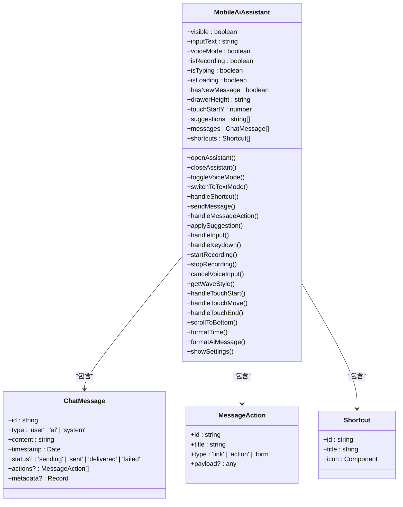
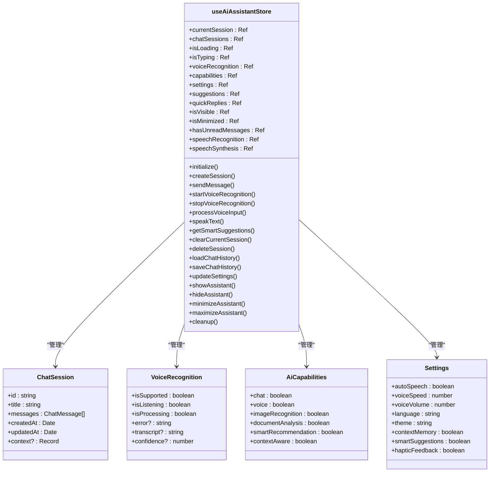
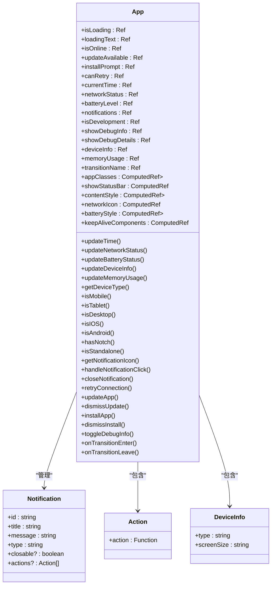
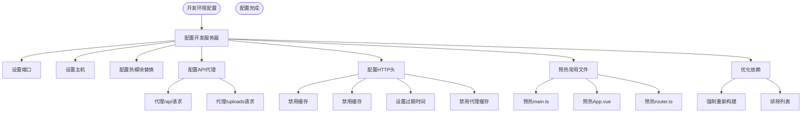
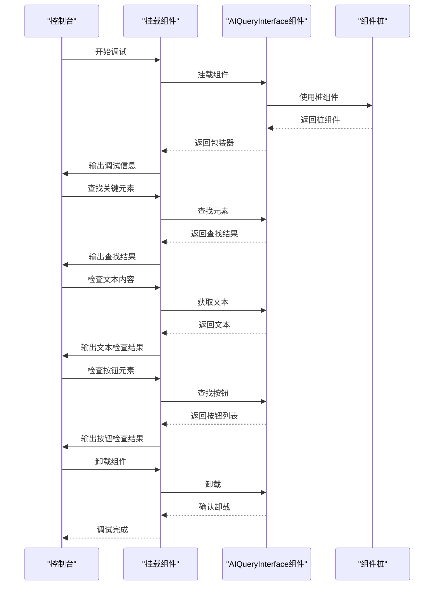
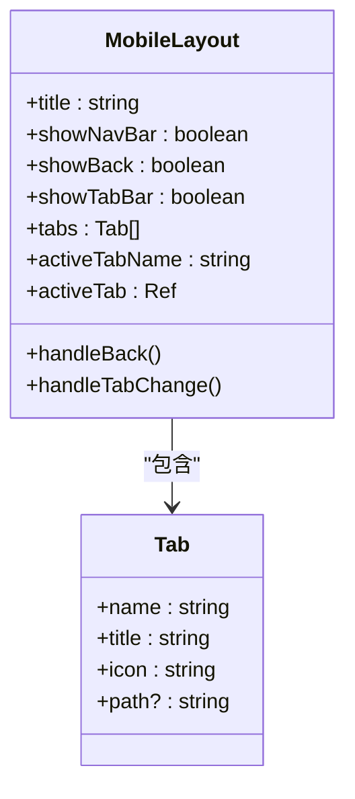
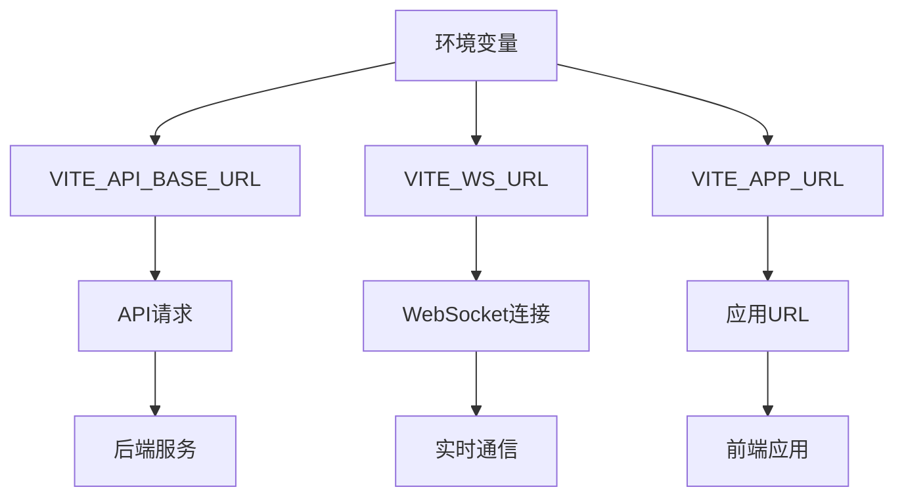

# 组件调试

<cite>
**本文档引用的文件**   
- [main.ts](file://client/aimobile/main.ts)
- [MobileAiAssistant.vue](file://client/aimobile/components/MobileAiAssistant.vue)
- [ai-assistant.ts](file://client/aimobile/stores/ai-assistant.ts)
- [App.vue](file://client/aimobile/App.vue)
- [MobileLayout.vue](file://client/src/pages/mobile/layouts/MobileLayout.vue)
- [vite.config.ts](file://client/vite.config.ts)
- [debug-component.js](file://client/debug-component.js)
- [.env.development](file://.env.development)
</cite>

## 目录
1. [简介](#简介)
2. [Vue DevTools 调试](#vue-devtools-调试)
3. [组件状态跟踪](#组件状态跟踪)
4. [性能分析](#性能分析)
5. [开发环境配置](#开发环境配置)
6. [断点调试](#断点调试)
7. [动态组件调试](#动态组件调试)
8. [组件通信问题](#组件通信问题)
9. [结论](#结论)

## 简介
本文档详细介绍了k.yyupgame前端系统中Vue组件的调试方法。通过分析项目结构和代码实现，重点阐述了如何使用Vue DevTools进行组件状态跟踪和性能分析，以及如何调试Vue组件的props、data、computed属性和生命周期钩子。

**Section sources**
- [main.ts](file://client/aimobile/main.ts#L1-L432)
- [MobileAiAssistant.vue](file://client/aimobile/components/MobileAiAssistant.vue#L1-L800)

## Vue DevTools 调试
Vue DevTools是调试Vue组件的强大工具。在k.yyupgame系统中，可以通过Vue DevTools监控组件的渲染过程和更新机制。通过分析`MobileAiAssistant.vue`组件，可以观察到组件的props、data、computed属性和生命周期钩子的执行情况。

**Diagram sources **
- [MobileAiAssistant.vue](file://client/aimobile/components/MobileAiAssistant.vue#L250-L629)

**Section sources**
- [MobileAiAssistant.vue](file://client/aimobile/components/MobileAiAssistant.vue#L250-L629)

## 组件状态跟踪
在k.yyupgame系统中，组件状态跟踪主要通过Pinia状态管理实现。`ai-assistant.ts`文件定义了AI助手的状态管理，包括聊天会话、语音识别、AI能力等状态。

**Diagram sources **
- [ai-assistant.ts](file://client/aimobile/stores/ai-assistant.ts#L58-L648)

**Section sources**
- [ai-assistant.ts](file://client/aimobile/stores/ai-assistant.ts#L58-L648)

## 性能分析
性能分析是组件调试的重要环节。在k.yyupgame系统中，通过`App.vue`组件实现了应用级别的性能监控，包括内存使用、网络状态等。

**Diagram sources **
- [App.vue](file://client/aimobile/App.vue#L139-L467)

**Section sources**
- [App.vue](file://client/aimobile/App.vue#L139-L467)

## 开发环境配置
开发环境的配置对于组件调试至关重要。在k.yyupgame系统中，通过`vite.config.ts`文件配置了开发服务器和API代理。

**Diagram sources **
- [vite.config.ts](file://client/vite.config.ts#L13-L220)

**Section sources**
- [vite.config.ts](file://client/vite.config.ts#L13-L220)

## 断点调试
断点调试是定位问题的有效方法。在k.yyupgame系统中，通过`debug-component.js`文件实现了组件的调试。

**Diagram sources **
- [debug-component.js](file://client/debug-component.js#L1-L82)

**Section sources**
- [debug-component.js](file://client/debug-component.js#L1-L82)

## 动态组件调试
动态组件的调试需要特别注意加载和更新机制。在k.yyupgame系统中，通过`MobileLayout.vue`组件实现了动态布局。

**Diagram sources **
- [MobileLayout.vue](file://client/src/pages/mobile/layouts/MobileLayout.vue#L42-L102)

**Section sources**
- [MobileLayout.vue](file://client/src/pages/mobile/layouts/MobileLayout.vue#L42-L102)

## 组件通信问题
组件通信问题是调试中的常见问题。在k.yyupgame系统中，通过环境变量配置了API基础URL和WebSocket URL。

**Diagram sources **
- [.env.development](file://.env.development#L1-L7)

**Section sources**
- [.env.development](file://.env.development#L1-L7)

## 结论
本文档详细介绍了k.yyupgame前端系统中Vue组件的调试方法。通过使用Vue DevTools、Pinia状态管理、Vite开发服务器配置等工具和技术，可以有效地进行组件状态跟踪、性能分析和问题定位。建议在开发过程中充分利用这些工具，提高调试效率和代码质量。