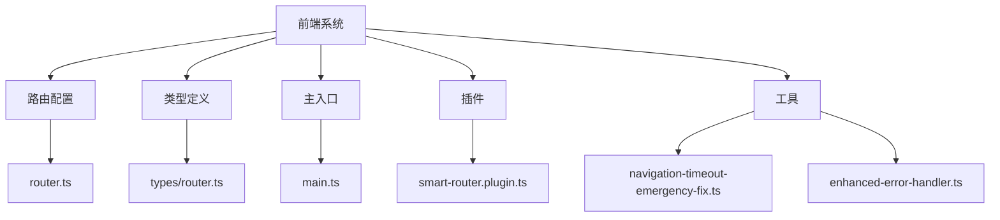
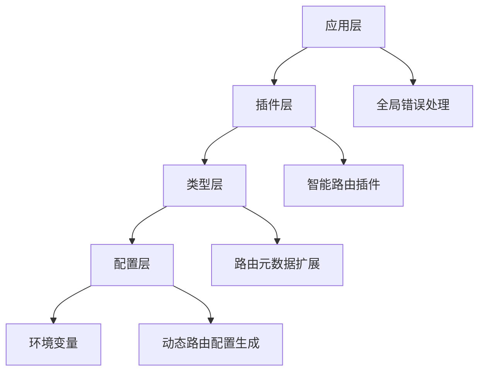
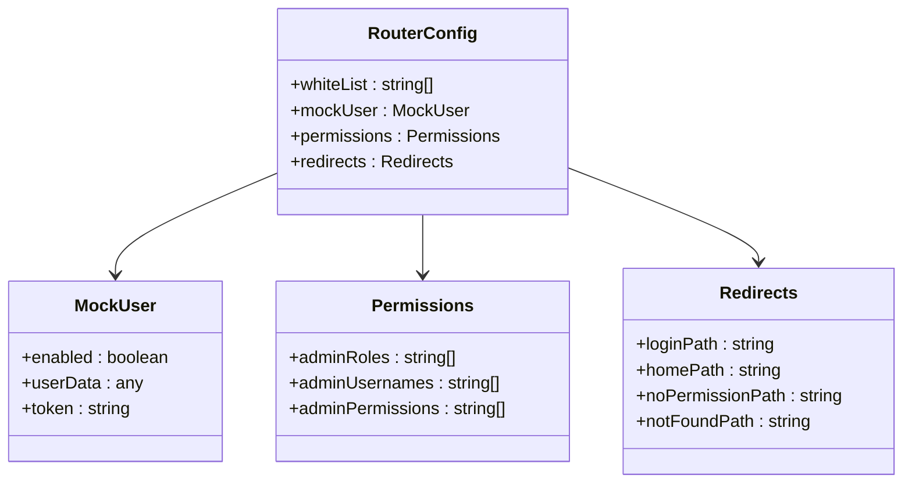
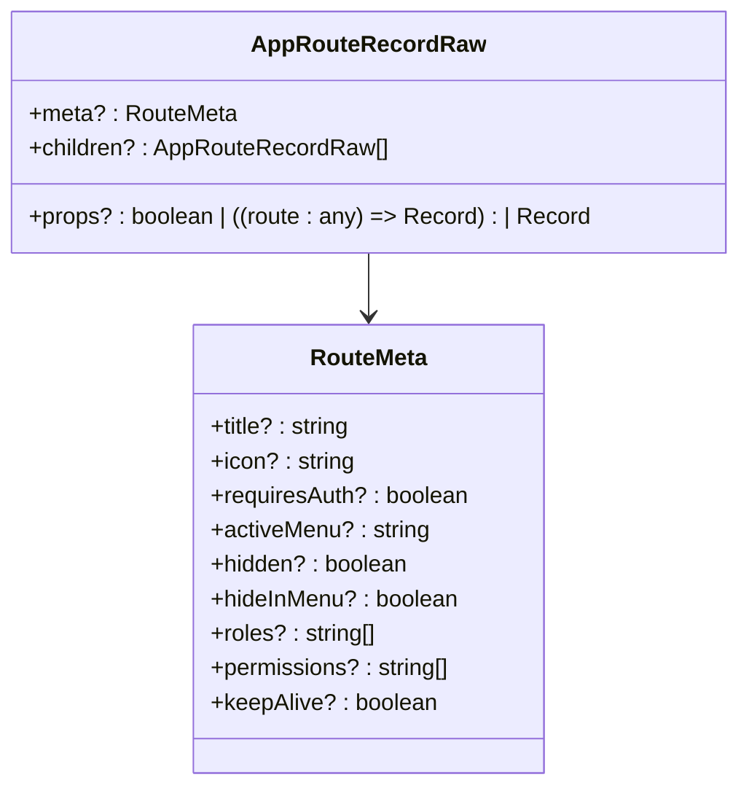
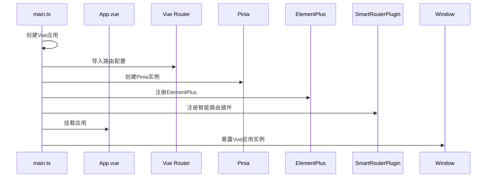
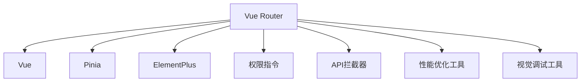

# 路由调试

<cite>
**本文档引用的文件**  
- [router.ts](file://k.yyup.com/client/src/config/router.ts)
- [types/router.ts](file://k.yyup.com/client/src/types/router.ts)
- [main.ts](file://k.yyup.com/client/src/main.ts)
- [smart-router.plugin.ts](file://k.yyup.com/client/plugins/smart-router.plugin.ts)
- [navigation-timeout-emergency-fix.ts](file://k.yyup.com/client/utils/navigation-timeout-emergency-fix.ts)
- [enhanced-error-handler.ts](file://k.yyup.com/client/utils/enhanced-error-handler.ts)
</cite>

## 目录
1. [简介](#简介)
2. [项目结构](#项目结构)
3. [核心组件](#核心组件)
4. [架构概述](#架构概述)
5. [详细组件分析](#详细组件分析)
6. [依赖分析](#依赖分析)
7. [性能考虑](#性能考虑)
8. [故障排除指南](#故障排除指南)
9. [结论](#结论)

## 简介
本文档提供k.yyupgame前端系统中Vue Router的详细调试指南。重点介绍如何调试路由配置、导航守卫和路由参数传递，监控路由跳转过程和状态变化。阐述如何诊断和解决路由404错误、权限路由拦截和动态路由加载问题。提供调试嵌套路由和命名视图的技巧，以及如何处理路由缓存和组件复用问题。包含分析路由性能和优化路由懒加载的建议，以及如何验证路由在不同用户角色下的正确性。

## 项目结构
k.yyupgame前端系统的路由相关文件主要位于`client/src`目录下，包括路由配置、类型定义和主入口文件。系统采用模块化设计，将路由配置与应用逻辑分离，便于维护和调试。

**图示来源**  
- [router.ts](file://k.yyup.com/client/src/config/router.ts)
- [types/router.ts](file://k.yyup.com/client/src/types/router.ts)
- [main.ts](file://k.yyup.com/client/src/main.ts)

**本节来源**  
- [router.ts](file://k.yyup.com/client/src/config/router.ts)
- [types/router.ts](file://k.yyup.com/client/src/types/router.ts)
- [main.ts](file://k.yyup.com/client/src/main.ts)

## 核心组件
系统的核心路由组件包括路由配置、类型定义、主入口文件和智能路由插件。这些组件协同工作，实现灵活的路由管理和调试功能。

**本节来源**  
- [router.ts](file://k.yyup.com/client/src/config/router.ts)
- [types/router.ts](file://k.yyup.com/client/src/types/router.ts)
- [main.ts](file://k.yyup.com/client/src/main.ts)
- [smart-router.plugin.ts](file://k.yyup.com/client/plugins/smart-router.plugin.ts)

## 架构概述
k.yyupgame前端系统的路由架构采用分层设计，包括配置层、类型层、插件层和应用层。这种设计使得路由系统具有良好的可维护性和可扩展性。

**图示来源**  
- [main.ts](file://k.yyup.com/client/src/main.ts)
- [smart-router.plugin.ts](file://k.yyup.com/client/plugins/smart-router.plugin.ts)
- [types/router.ts](file://k.yyup.com/client/src/types/router.ts)
- [router.ts](file://k.yyup.com/client/src/config/router.ts)

## 详细组件分析
### 路由配置分析
路由配置文件定义了系统的白名单路由、模拟用户配置、权限配置和重定向配置。通过环境变量可以动态调整路由行为，便于不同环境下的调试。

**图示来源**  
- [router.ts](file://k.yyup.com/client/src/config/router.ts)

**本节来源**  
- [router.ts](file://k.yyup.com/client/src/config/router.ts)

### 类型定义分析
类型定义文件扩展了Vue Router的元数据类型，添加了标题、图标、权限等自定义属性，为路由调试提供了类型安全支持。

**图示来源**  
- [types/router.ts](file://k.yyup.com/client/src/types/router.ts)

**本节来源**  
- [types/router.ts](file://k.yyup.com/client/src/types/router.ts)

### 主入口分析
主入口文件负责初始化应用，注册路由、状态管理、UI组件库和插件。通过全局暴露Vue应用实例，便于调试和组件监控。

**图示来源**  
- [main.ts](file://k.yyup.com/client/src/main.ts)

**本节来源**  
- [main.ts](file://k.yyup.com/client/src/main.ts)

## 依赖分析
路由系统依赖于Vue、Vue Router、Pinia和ElementPlus等核心库，同时与权限指令、API拦截器和性能优化工具等模块紧密集成。

**图示来源**  
- [main.ts](file://k.yyup.com/client/src/main.ts)
- [router.ts](file://k.yyup.com/client/src/config/router.ts)

**本节来源**  
- [main.ts](file://k.yyup.com/client/src/main.ts)
- [router.ts](file://k.yyup.com/client/src/config/router.ts)

## 性能考虑
路由系统在性能方面进行了多项优化，包括移动端性能优化、生产环境HMR禁用、WebSocket连接拦截等，确保应用在各种环境下都能快速响应。

**本节来源**  
- [main.ts](file://k.yyup.com/client/src/main.ts)
- [navigation-timeout-emergency-fix.ts](file://k.yyup.com/client/utils/navigation-timeout-emergency-fix.ts)

## 故障排除指南
当遇到路由相关问题时，可以按照以下步骤进行排查：
1. 检查路由配置是否正确
2. 验证路由参数传递是否正常
3. 确认导航守卫逻辑是否正确执行
4. 检查权限配置是否符合预期
5. 查看控制台错误日志

**本节来源**  
- [enhanced-error-handler.ts](file://k.yyup.com/client/utils/enhanced-error-handler.ts)
- [main.ts](file://k.yyup.com/client/src/main.ts)

## 结论
k.yyupgame前端系统的路由调试指南提供了全面的调试方法和技巧，帮助开发者快速定位和解决路由相关问题。通过合理的架构设计和性能优化，系统能够稳定高效地运行。