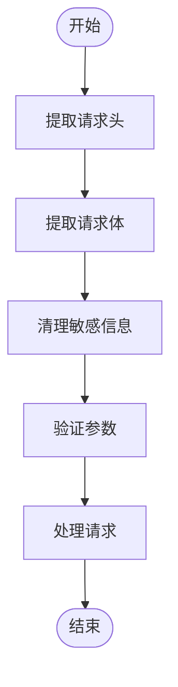

# API调试

<cite>
**本文档引用的文件**
- [.env](file://k.yyup.com/.env)
- [.env.development](file://k.yyup.com/.env.development)
- [.env.production](file://k.yyup.com/.env.production)
- [error.middleware.ts](file://k.yyup.com/server/src/middlewares/error.middleware.ts)
- [debug-log.middleware.ts](file://k.yyup.com/server/src/middlewares/debug-log.middleware.ts)
- [auth.middleware.ts](file://k.yyup.com/server/src/middlewares/auth.middleware.ts)
- [api-route-scan.mjs](file://k.yyup.com/api-route-scan.mjs)
- [backend-route-scanner.py](file://k.yyup.com/backend-route-scanner.py)
</cite>

## 目录
1. [API调试概述](#api调试概述)
2. [API调用流程调试](#api调用流程调试)
3. [API配置调试](#api配置调试)
4. [端点调试技术](#端点调试技术)
5. [错误处理机制调试](#错误处理机制调试)
6. [性能监控技巧](#性能监控技巧)

## API调试概述

k.yyupgame系统提供了一套完整的API调试机制，包括请求拦截、参数解析、响应生成、错误处理和性能监控等功能。本指南详细说明了如何调试API调用流程，配置API参数，测试具体端点，分析错误处理机制以及监控系统性能。

**本节来源**
- [error.middleware.ts](file://k.yyup.com/server/src/middlewares/error.middleware.ts)
- [debug-log.middleware.ts](file://k.yyup.com/server/src/middlewares/debug-log.middleware.ts)
- [auth.middleware.ts](file://k.yyup.com/server/src/middlewares/auth.middleware.ts)

## API调用流程调试

### 请求拦截与日志记录

系统提供了调试日志中间件，用于拦截和记录API请求的详细信息。`apiDebugLogger`中间件会记录请求方法、URL、请求头和令牌信息。


**图示来源**
- [debug-log.middleware.ts](file://k.yyup.com/server/src/middlewares/debug-log.middleware.ts)

### 参数解析与验证

系统通过中间件链对请求参数进行解析和验证。`error.middleware.ts`文件中的`sanitizeBody`函数会清理请求体中的敏感信息，如密码和令牌。



**图示来源**
- [error.middleware.ts](file://k.yyup.com/server/src/middlewares/error.middleware.ts)

### 响应生成流程

API响应生成遵循统一的格式标准，包括成功响应和错误响应。错误处理中间件会捕获异常，记录日志，并返回结构化的错误信息。


**图示来源**
- [error.middleware.ts](file://k.yyup.com/server/src/middlewares/error.middleware.ts)

## API配置调试

### 环境变量配置

系统使用环境变量进行API配置，主要配置文件包括`.env`、`.env.development`和`.env.production`。


**图示来源**
- [.env](file://k.yyup.com/.env)
- [.env.development](file://k.yyup.com/.env.development)
- [.env.production](file://k.yyup.com/.env.production)

### 路由配置检查

系统提供了路由扫描工具来检查API路由配置。可以使用`api-route-scan.mjs`和`backend-route-scanner.py`脚本分析路由定义。


**图示来源**
- [api-route-scan.mjs](file://k.yyup.com/api-route-scan.mjs)
- [backend-route-scanner.py](file://k.yyup.com/backend-route-scanner.py)

### 中间件链检查

API请求经过一系列中间件处理，形成中间件链。认证中间件`auth.middleware.ts`实现了统一的认证流程。


**图示来源**
- [auth.middleware.ts](file://k.yyup.com/server/src/middlewares/auth.middleware.ts)

## 端点调试技术

### 使用Postman或curl测试

可以使用Postman或curl工具测试API端点。以下是使用curl测试的示例：

```bash
curl -X GET https://k.yyup.cc/api/users \
  -H "Authorization: Bearer <your_token>" \
  -H "Content-Type: application/json"
```

### 请求头分析

调试时需要重点关注以下请求头：

- `Authorization`: 认证令牌，格式为"Bearer <token>"
- `Content-Type`: 请求体类型，通常为"application/json"
- `X-Internal-Service`: 内部服务调用标识

### 查询参数和请求体分析

系统对查询参数和请求体进行严格验证。调试时应注意：

1. 查询参数的格式和类型
2. 请求体的JSON结构
3. 必填字段和可选字段
4. 数据类型验证

## 错误处理机制调试

### 异常捕获与处理

错误处理中间件`error.middleware.ts`捕获所有未处理的异常，并返回统一格式的错误响应。


**图示来源**
- [error.middleware.ts](file://k.yyup.com/server/src/middlewares/error.middleware.ts)

### 错误日志记录

系统记录详细的错误日志，包括：

- 错误ID（用于追踪）
- 错误类型
- 请求信息（方法、URL、用户代理、IP）
- 请求参数（查询、参数、请求体）
- 错误详情（名称、消息、代码、堆栈）

### HTTP状态码分析

系统使用标准的HTTP状态码，并定义了对应的错误代码：

| 状态码 | 错误代码 | 用户消息 |
|--------|---------|---------|
| 400 | BAD_REQUEST | 请求参数错误，请检查输入信息 |
| 401 | UNAUTHORIZED | 登录已过期，请重新登录 |
| 403 | FORBIDDEN | 没有权限执行此操作 |
| 404 | NOT_FOUND | 请求的资源不存在 |
| 500 | INTERNAL_SERVER_ERROR | 服务器内部错误，我们将尽快修复 |

**图示来源**
- [error.middleware.ts](file://k.yyup.com/server/src/middlewares/error.middleware.ts)

## 性能监控技巧

### 响应时间测量

可以通过以下方法测量API响应时间：

1. 使用浏览器开发者工具的网络面板
2. 使用curl的`-w`参数
3. 在代码中添加时间戳日志

```bash
curl -w "响应时间: %{time_total}s\n" -o /dev/null -s https://k.yyup.cc/api/endpoint
```

### 瓶颈识别

通过分析日志和监控数据识别性能瓶颈：

1. 数据库查询性能
2. 外部API调用延迟
3. 复杂业务逻辑处理时间
4. 内存使用情况


**本节来源**
- [error.middleware.ts](file://k.yyup.com/server/src/middlewares/error.middleware.ts)
- [debug-log.middleware.ts](file://k.yyup.com/server/src/middlewares/debug-log.middleware.ts)
- [auth.middleware.ts](file://k.yyup.com/server/src/middlewares/auth.middleware.ts)