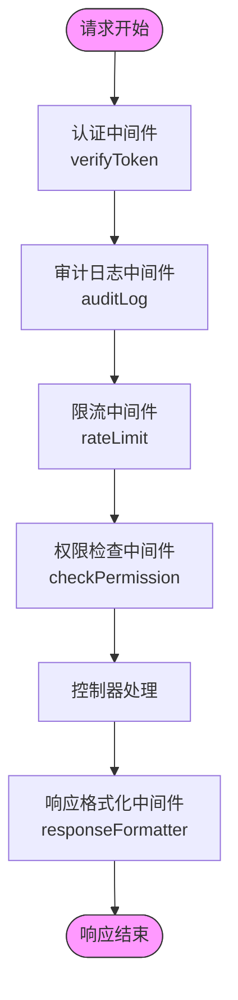
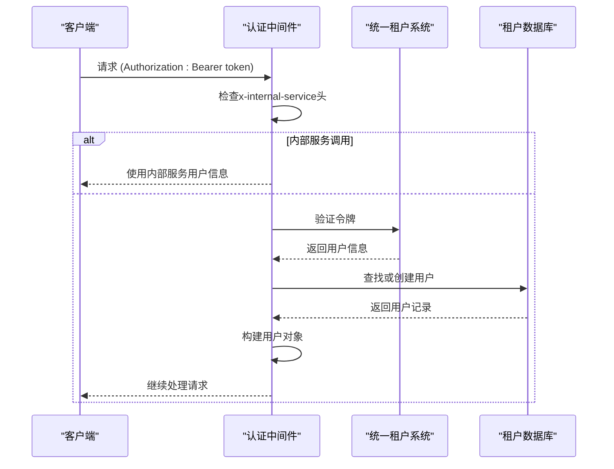
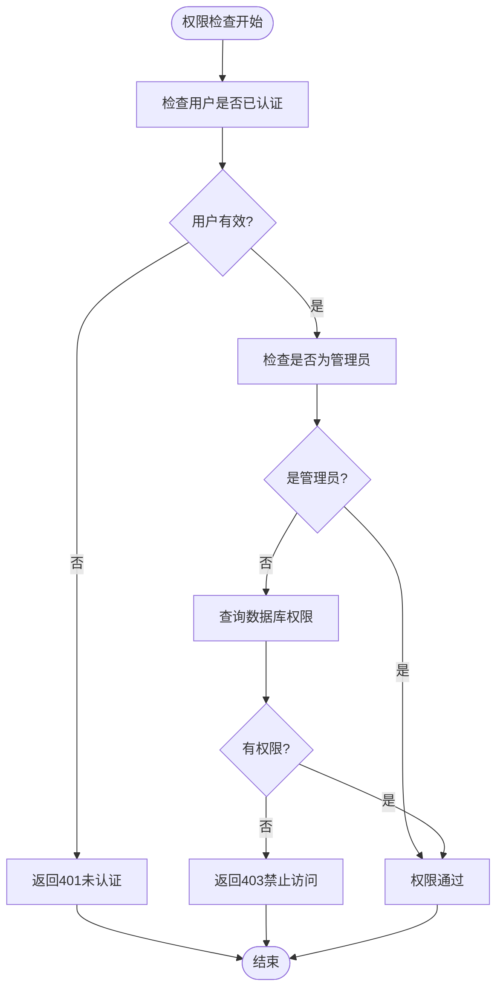
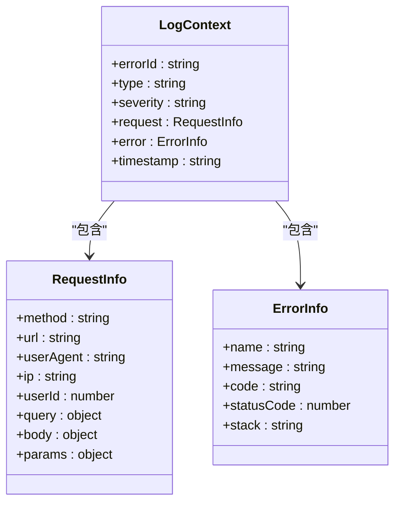
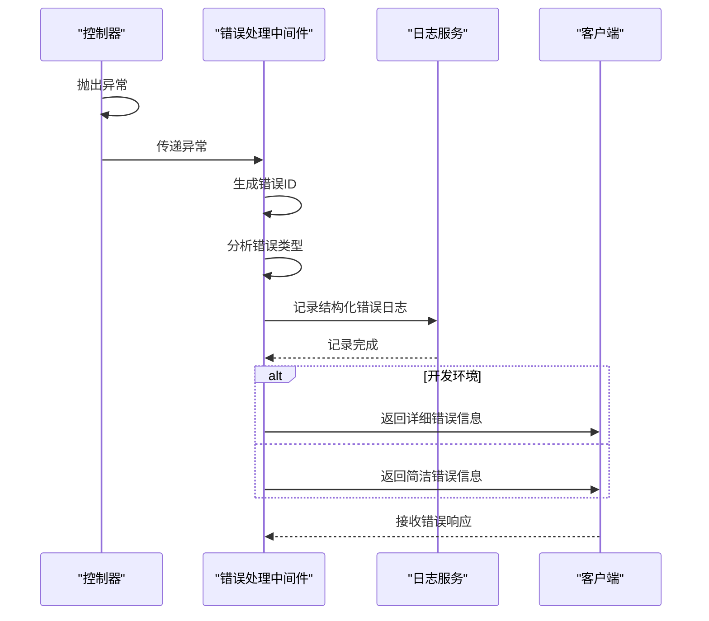
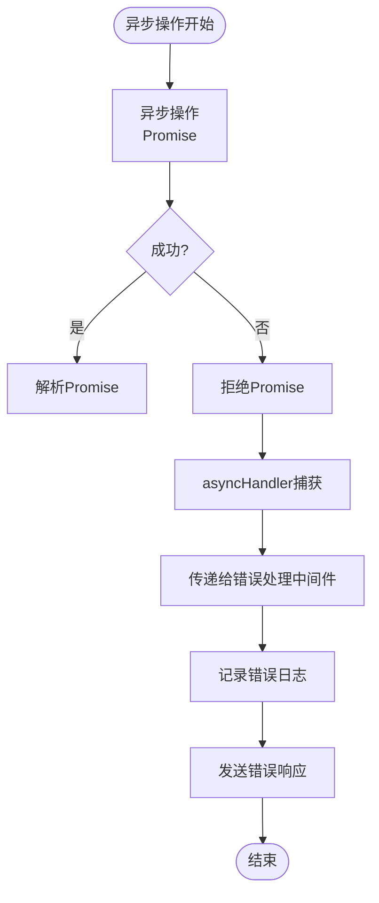

# 中间件调试

<cite>
**本文档引用的文件**  
- [auth.middleware.ts](file://k.yyup.com/server/src/middlewares/auth.middleware.ts)
- [error.middleware.ts](file://k.yyup.com/server/src/middlewares/error.middleware.ts)
- [debug-log.middleware.ts](file://k.yyup.com/server/src/middlewares/debug-log.middleware.ts)
- [audit-log.middleware.ts](file://k.yyup.com/server/src/middlewares/audit-log.middleware.ts)
- [rate-limit.middleware.ts](file://k.yyup.com/server/src/middlewares/rate-limit.middleware.ts)
- [response-formatter.middleware.ts](file://k.yyup.com/server/src/middlewares/response-formatter.middleware.ts)
- [async-handler.ts](file://k.yyup.com/server/src/middlewares/async-handler.ts)
- [index.ts](file://k.yyup.com/server/src/middlewares/index.ts)
</cite>

## 目录
1. [引言](#引言)
2. [中间件执行流程分析](#中间件执行流程分析)
3. [认证中间件调试](#认证中间件调试)
4. [日志记录中间件调试](#日志记录中间件调试)
5. [错误处理中间件调试](#错误处理中间件调试)
6. [其他关键中间件分析](#其他关键中间件分析)
7. [最佳实践与调试技巧](#最佳实践与调试技巧)
8. [结论](#结论)

## 引言

本指南旨在为开发者提供一套完整的Express中间件调试方案，重点针对认证、日志记录和错误处理中间件的调试方法。通过深入分析中间件的注册顺序、执行上下文和请求响应周期，帮助开发者快速定位和解决中间件相关的问题。

**Section sources**
- [auth.middleware.ts](file://k.yyup.com/server/src/middlewares/auth.middleware.ts#L1-L1378)
- [error.middleware.ts](file://k.yyup.com/server/src/middlewares/error.middleware.ts#L1-L213)

## 中间件执行流程分析

在Express应用中，中间件的执行顺序至关重要。中间件按照它们被注册的顺序依次执行，每个中间件都有机会修改请求和响应对象，或者终止请求-响应周期。

**Diagram sources**
- [auth.middleware.ts](file://k.yyup.com/server/src/middlewares/auth.middleware.ts#L142-L529)
- [audit-log.middleware.ts](file://k.yyup.com/server/src/middlewares/audit-log.middleware.ts#L68-L186)
- [rate-limit.middleware.ts](file://k.yyup.com/server/src/middlewares/rate-limit.middleware.ts#L40-L133)
- [response-formatter.middleware.ts](file://k.yyup.com/server/src/middlewares/response-formatter.middleware.ts#L27-L67)

**Section sources**
- [auth.middleware.ts](file://k.yyup.com/server/src/middlewares/auth.middleware.ts#L1-L1378)
- [audit-log.middleware.ts](file://k.yyup.com/server/src/middlewares/audit-log.middleware.ts#L1-L186)
- [rate-limit.middleware.ts](file://k.yyup.com/server/src/middlewares/rate-limit.middleware.ts#L1-L283)

## 认证中间件调试

### JWT令牌验证调试

认证中间件`verifyToken`负责验证JWT令牌的有效性。调试时需要关注以下几个关键点：

1. **令牌提取**：从`Authorization`头中提取Bearer令牌
2. **内部服务绕过**：通过`x-internal-service`头标识内部服务调用
3. **统一租户验证**：调用统一租户系统的API验证令牌
4. **用户信息同步**：在租户数据库中查找或创建用户记录

**Diagram sources**
- [auth.middleware.ts](file://k.yyup.com/server/src/middlewares/auth.middleware.ts#L142-L377)

### 会话管理检查

会话管理通过`SessionService`实现，调试时需要验证：

1. **会话创建**：用户登录后是否正确创建会话
2. **会话存储**：会话数据是否正确存储在Redis中
3. **会话过期**：会话是否在指定时间后自动过期
4. **会话验证**：每次请求是否正确验证会话状态

**Section sources**
- [auth.middleware.ts](file://k.yyup.com/server/src/middlewares/auth.middleware.ts#L7-L8)
- [auth.middleware.ts](file://k.yyup.com/server/src/middlewares/auth.middleware.ts#L142-L377)

### 权限验证流程分析

权限验证通过`checkPermission`中间件实现，其调试要点包括：

1. **权限代码检查**：验证传入的权限代码是否正确
2. **管理员特权**：管理员用户是否自动通过所有权限检查
3. **数据库查询**：是否正确查询角色权限表
4. **开发环境调试**：在开发环境中是否记录详细的权限信息

**Diagram sources**
- [auth.middleware.ts](file://k.yyup.com/server/src/middlewares/auth.middleware.ts#L380-L498)

**Section sources**
- [auth.middleware.ts](file://k.yyup.com/server/src/middlewares/auth.middleware.ts#L380-L498)

## 日志记录中间件调试

### 日志级别配置

日志记录中间件需要正确配置日志级别，以确保在不同环境下输出适当的信息量：

1. **开发环境**：输出详细的调试信息
2. **生产环境**：仅输出错误和警告信息
3. **敏感信息**：确保不记录密码、令牌等敏感数据

**Section sources**
- [error.middleware.ts](file://k.yyup.com/server/src/middlewares/error.middleware.ts#L7-L8)
- [debug-log.middleware.ts](file://k.yyup.com/server/src/middlewares/debug-log.middleware.ts#L6-L7)

### 输出格式验证

日志输出格式需要保持一致，便于日志分析和监控：

1. **时间戳**：每条日志都应包含精确的时间戳
2. **错误ID**：为每个错误生成唯一的错误ID，便于追踪
3. **上下文信息**：包含请求方法、URL、用户ID等上下文信息
4. **堆栈跟踪**：在开发环境中包含完整的堆栈跟踪

**Diagram sources**
- [error.middleware.ts](file://k.yyup.com/server/src/middlewares/error.middleware.ts#L22-L44)

### 性能影响评估

日志记录可能对系统性能产生影响，需要进行评估：

1. **异步记录**：确保日志记录是异步的，不影响主请求处理
2. **批量写入**：考虑使用批量写入策略减少I/O操作
3. **采样策略**：对于高频日志，可以采用采样策略
4. **监控指标**：监控日志记录的性能指标，如写入延迟

**Section sources**
- [error.middleware.ts](file://k.yyup.com/server/src/middlewares/error.middleware.ts#L13-L84)
- [audit-log.middleware.ts](file://k.yyup.com/server/src/middlewares/audit-log.middleware.ts#L120-L160)

## 错误处理中间件调试

### 异常捕获机制

错误处理中间件`errorHandler`负责捕获和处理所有未处理的异常：

1. **错误类型识别**：根据错误类型和状态码确定错误严重程度
2. **结构化日志**：生成结构化的错误日志，便于分析
3. **用户友好消息**：向客户端返回用户友好的错误消息
4. **敏感信息保护**：确保不向客户端暴露敏感信息

**Diagram sources**
- [error.middleware.ts](file://k.yyup.com/server/src/middlewares/error.middleware.ts#L13-L84)

### 错误响应生成

错误响应需要遵循统一的格式，便于前端处理：

1. **成功标志**：`success: false`表示操作失败
2. **错误对象**：包含用户消息、错误代码和错误ID
3. **详细信息**：在开发环境中包含详细的错误信息
4. **HTTP状态码**：根据错误类型返回适当的HTTP状态码

**Section sources**
- [error.middleware.ts](file://k.yyup.com/server/src/middlewares/error.middleware.ts#L65-L84)

### 错误传播路径分析

理解错误在中间件链中的传播路径对于调试至关重要：

1. **同步错误**：直接抛出的错误会被错误处理中间件捕获
2. **异步错误**：Promise拒绝的错误需要通过`next()`传递
3. **未捕获异常**：未处理的Promise拒绝会导致进程崩溃
4. **包装器**：使用`asyncHandler`确保异步错误被正确捕获

**Diagram sources**
- [async-handler.ts](file://k.yyup.com/server/src/middlewares/async-handler.ts#L8-L25)

**Section sources**
- [async-handler.ts](file://k.yyup.com/server/src/middlewares/async-handler.ts#L1-L36)
- [error.middleware.ts](file://k.yyup.com/server/src/middlewares/error.middleware.ts#L13-L84)

## 其他关键中间件分析

### 审计日志中间件

审计日志中间件自动记录所有CRUD操作，用于安全审计和操作追踪：

1. **操作类型映射**：根据HTTP方法确定操作类型
2. **响应拦截**：拦截响应以确定操作结果
3. **异步记录**：使用`setImmediate`异步记录日志
4. **错误处理**：确保日志记录失败不会影响主流程

**Section sources**
- [audit-log.middleware.ts](file://k.yyup.com/server/src/middlewares/audit-log.middleware.ts#L1-L186)

### 限流中间件

限流中间件防止恶意请求和API滥用：

1. **Redis存储**：使用Redis存储请求计数
2. **多种策略**：提供IP、用户、路径等多种限流策略
3. **统计信息**：维护限流统计信息
4. **灵活配置**：支持自定义时间窗口和最大请求数

**Section sources**
- [rate-limit.middleware.ts](file://k.yyup.com/server/src/middlewares/rate-limit.middleware.ts#L1-L283)

### 响应格式化中间件

响应格式化中间件统一API响应格式：

1. **方法拦截**：重写`res.send`和`res.json`方法
2. **数据标准化**：确保数据格式的一致性
3. **分页处理**：特殊处理分页响应
4. **错误处理**：确保格式化失败时仍能正常响应

**Section sources**
- [response-formatter.middleware.ts](file://k.yyup.com/server/src/middlewares/response-formatter.middleware.ts#L1-L68)

## 最佳实践与调试技巧

### 调试工具配置

1. **启用详细日志**：在开发环境中启用详细的中间件日志
2. **使用调试中间件**：临时添加调试中间件输出请求和响应信息
3. **设置断点**：在关键中间件中设置断点进行逐步调试
4. **监控指标**：集成APM工具监控中间件性能

### 常见问题排查

1. **中间件顺序错误**：确保认证中间件在权限检查中间件之前
2. **next()调用遗漏**：确保每个中间件都正确调用`next()`
3. **异步错误未捕获**：使用`asyncHandler`包装异步中间件
4. **响应头冲突**：避免多个中间件设置相同的响应头

### 性能优化建议

1. **缓存验证结果**：缓存JWT验证结果减少重复验证
2. **批量日志写入**：批量写入日志减少I/O开销
3. **条件执行**：根据条件跳过不必要的中间件
4. **连接池优化**：优化数据库和Redis连接池配置

## 结论

通过本指南，开发者可以系统地理解和调试Express中间件的各个方面。关键是要理解中间件的执行流程，正确配置和使用各种中间件，并掌握有效的调试技巧。在实际开发中，建议遵循最佳实践，确保中间件的可靠性和性能。