# 后端调试

<cite>
**本文档中引用的文件**  
- [app.ts](file://k.yyup.com/server/src/app.ts)
- [package.json](file://k.yyup.com/package.json)
- [start-debug.sh](file://k.yyup.com/server/start-debug.sh)
- [start-debug-watch.sh](file://k.yyup.com/server/start-debug-watch.sh)
- [middleware](file://k.yyup.com/server/src/middlewares)
- [routes](file://k.yyup.com/server/src/routes)
- [controllers](file://k.yyup.com/server/src/controllers)
- [services](file://k.yyup.com/server/src/services)
- [database.config.ts](file://k.yyup.com/server/src/config/database.config.ts)
- [jwt.config.ts](file://k.yyup.com/server/src/config/jwt.config.ts)
- [tenant-resolver.middleware.ts](file://k.yyup.com/server/src/middlewares/tenant-resolver.middleware.ts)
- [error.middleware.ts](file://k.yyup.com/server/src/middlewares/error.middleware.ts)
- [response-formatter.middleware.ts](file://k.yyup.com/server/src/middlewares/response-formatter.middleware.ts)
- [database-optimization.ts](file://k.yyup.com/server/src/config/database-optimization.ts)
- [db-optimizer.ts](file://k.yyup.com/server/src/cli/db-optimizer.ts)
</cite>

## 目录
1. [简介](#简介)
2. [项目结构](#项目结构)
3. [Node.js调试器配置](#nodejs调试器配置)
4. [Express中间件调试](#express中间件调试)
5. [API端点调试](#api端点调试)
6. [数据库调试](#数据库调试)
7. [认证与授权调试](#认证与授权调试)
8. [性能瓶颈分析](#性能瓶颈分析)
9. [常见后端异常诊断](#常见后端异常诊断)
10. [附录](#附录)

## 简介
本文档为k.yyupgame后端服务提供全面的调试指南，涵盖从开发环境配置到生产问题诊断的完整技术栈。文档详细说明了如何配置Node.js调试器进行断点调试，如何调试Express中间件的执行流程和请求处理，阐述API端点调试方法，包括请求参数验证、响应数据检查和错误堆栈分析。同时提供数据库调试技巧，如SQL查询分析、ORM模型调试和数据库连接问题排查。包含调试认证和授权流程的方法，以及如何分析和解决API性能瓶颈，并列举常见的后端异常及其诊断步骤。

## 项目结构
k.yyupgame后端服务采用TypeScript + Express + Sequelize技术栈，项目结构清晰，遵循模块化设计原则。核心代码位于`k.yyup.com/server/src`目录下，主要包含app.ts作为应用入口，middleware目录存放各种中间件，routes目录管理API路由，controllers处理业务逻辑，services封装核心服务，models定义数据模型。

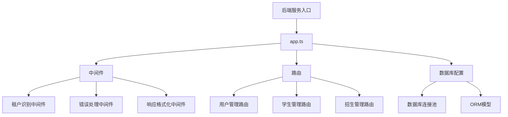

**Diagram sources**
- [app.ts](file://k.yyup.com/server/src/app.ts)
- [middleware](file://k.yyup.com/server/src/middlewares)
- [routes](file://k.yyup.com/server/src/routes)
- [database.config.ts](file://k.yyup.com/server/src/config/database.config.ts)

**Section sources**
- [app.ts](file://k.yyup.com/server/src/app.ts)
- [package.json](file://k.yyup.com/package.json)

## Node.js调试器配置
k.yyupgame后端服务提供了专门的调试启动脚本，支持断点调试和热重载功能。通过`start-debug.sh`和`start-debug-watch.sh`脚本可以轻松启动调试模式。

```bash
# 启动调试模式（不带热重载）
npm run start:debug

# 启动调试模式（带热重载）
npm run start:debug:watch
```

调试配置在`package.json`中定义，使用`--inspect`参数启动Node.js调试器，监听9229端口。开发人员可以使用VS Code等IDE连接调试器，设置断点并进行单步调试。

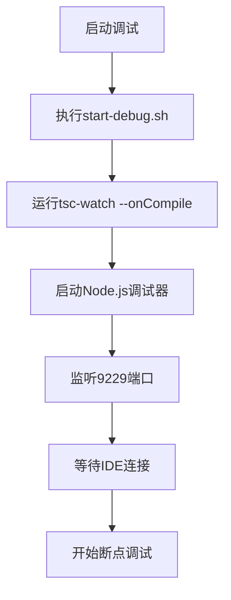

**Diagram sources**
- [start-debug.sh](file://k.yyup.com/server/start-debug.sh)
- [start-debug-watch.sh](file://k.yyup.com/server/start-debug-watch.sh)
- [package.json](file://k.yyup.com/package.json)

**Section sources**
- [start-debug.sh](file://k.yyup.com/server/start-debug.sh)
- [start-debug-watch.sh](file://k.yyup.com/server/start-debug-watch.sh)
- [package.json](file://k.yyup.com/package.json)

## Express中间件调试
Express中间件是k.yyupgame后端服务的核心组件，负责处理请求的各个阶段。调试中间件执行流程对于理解请求处理机制至关重要。

### 中间件执行流程
在`app.ts`中，中间件按特定顺序注册，形成请求处理管道。每个中间件都有机会修改请求和响应对象，或终止请求处理。

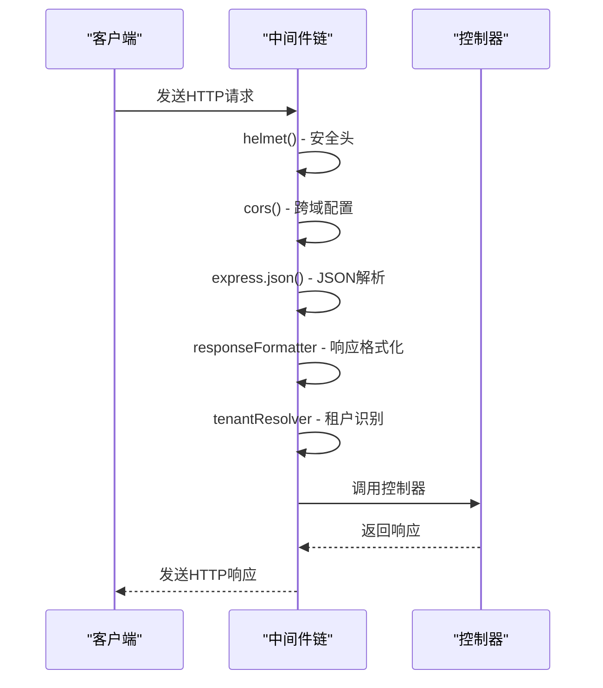

**Diagram sources**
- [app.ts](file://k.yyup.com/server/src/app.ts)
- [middlewares](file://k.yyup.com/server/src/middlewares)

### 关键中间件调试
#### 租户识别中间件
`tenant-resolver.middleware.ts`负责识别请求所属的租户，是多租户架构的核心。调试时需要关注租户信息的提取和数据库连接的切换。

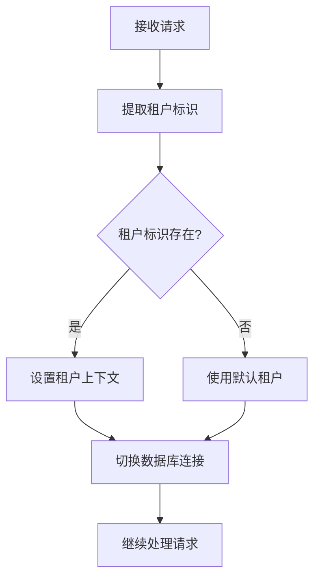

**Diagram sources**
- [tenant-resolver.middleware.ts](file://k.yyup.com/server/src/middlewares/tenant-resolver.middleware.ts)

#### 错误处理中间件
`error.middleware.ts`捕获并处理所有未处理的异常，确保返回一致的错误响应格式。

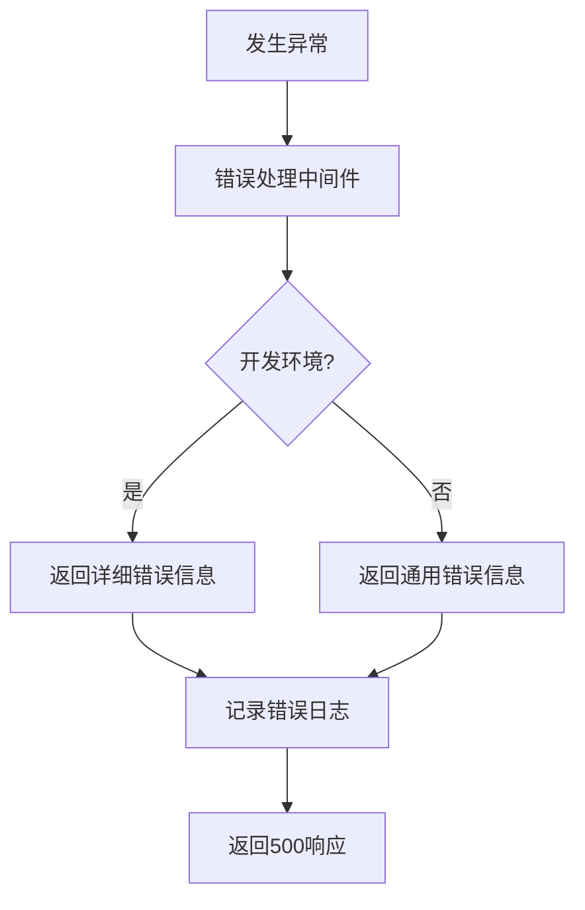

**Diagram sources**
- [error.middleware.ts](file://k.yyup.com/server/src/middlewares/error.middleware.ts)

#### 响应格式化中间件
`response-formatter.middleware.ts`确保所有API响应遵循统一的格式规范，特别是将单个对象包装为数组以保持一致性。

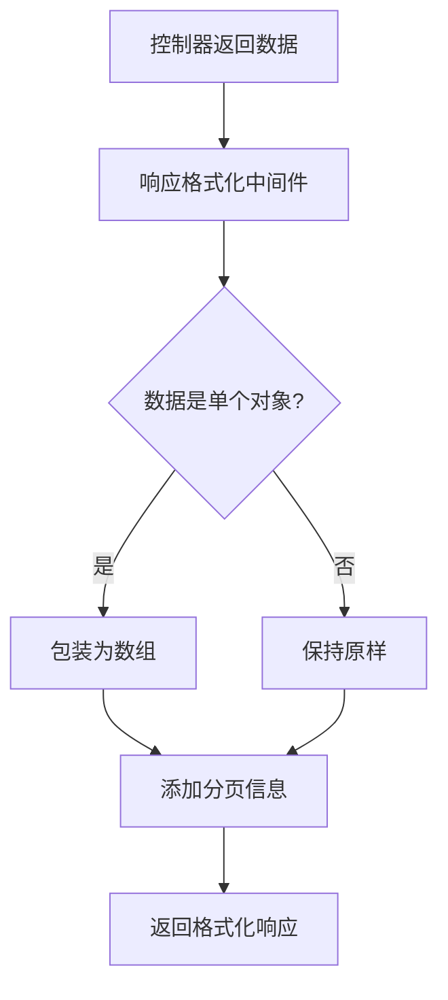

**Diagram sources**
- [response-formatter.middleware.ts](file://k.yyup.com/server/src/middlewares/response-formatter.middleware.ts)

**Section sources**
- [app.ts](file://k.yyup.com/server/src/app.ts)
- [tenant-resolver.middleware.ts](file://k.yyup.com/server/src/middlewares/tenant-resolver.middleware.ts)
- [error.middleware.ts](file://k.yyup.com/server/src/middlewares/error.middleware.ts)
- [response-formatter.middleware.ts](file://k.yyup.com/server/src/middlewares/response-formatter.middleware.ts)

## API端点调试
API端点调试是后端开发的核心任务，涉及请求参数验证、响应数据检查和错误堆栈分析。

### 请求参数验证
k.yyupgame使用Joi等验证库对API请求参数进行严格验证。调试时需要检查验证规则是否正确应用。

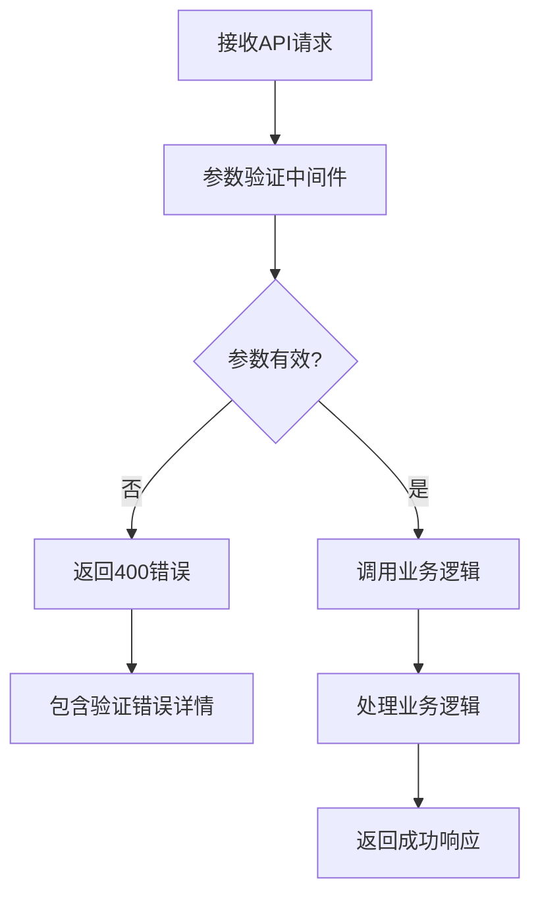

**Diagram sources**
- [app.ts](file://k.yyup.com/server/src/app.ts)
- [routes](file://k.yyup.com/server/src/routes)
- [controllers](file://k.yyup.com/server/src/controllers)

### 响应数据检查
通过`/api/test-formatter`等测试端点可以验证响应格式化中间件的行为，确保所有API响应遵循统一格式。

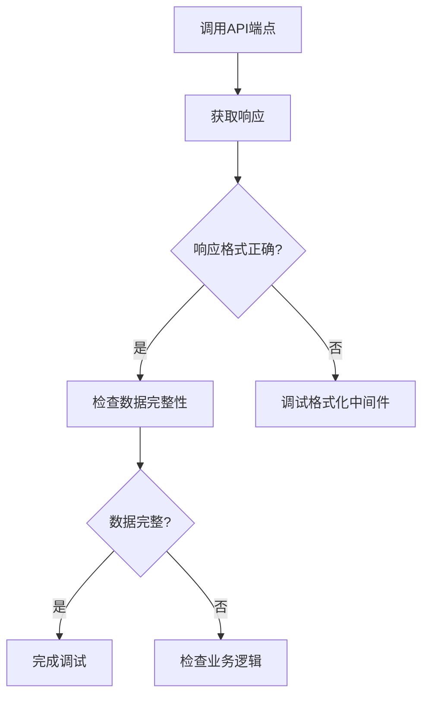

**Diagram sources**
- [app.ts](file://k.yyup.com/server/src/app.ts#L688-L709)

### 错误堆栈分析
当API调用失败时，需要分析错误堆栈来定位问题根源。开发环境会返回详细的错误信息，而生产环境则返回通用错误。

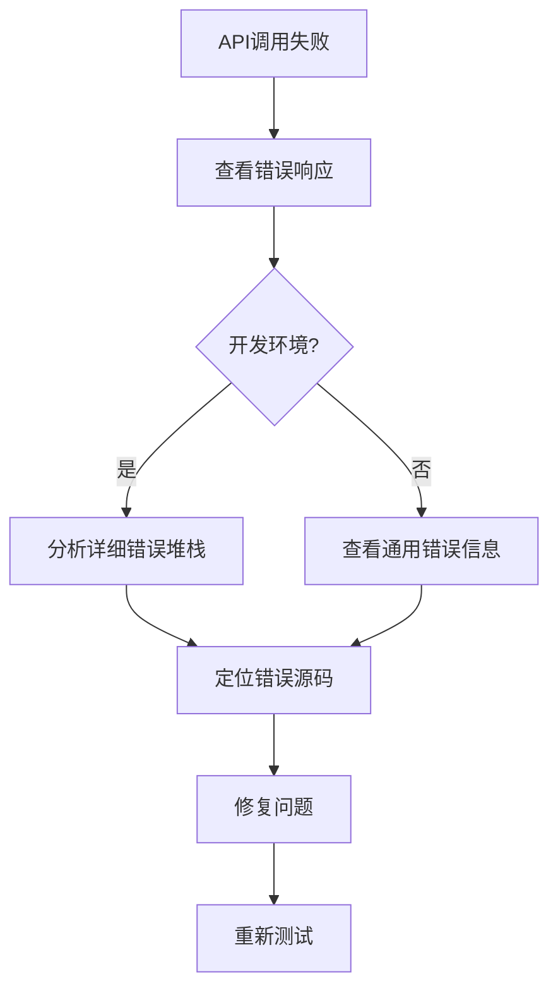

**Section sources**
- [app.ts](file://k.yyup.com/server/src/app.ts)
- [routes](file://k.yyup.com/server/src/routes)
- [controllers](file://k.yyup.com/server/src/controllers)

## 数据库调试
数据库调试是后端性能优化的关键环节，涉及SQL查询分析、ORM模型调试和数据库连接问题排查。

### SQL查询分析
k.yyupgame使用Sequelize ORM，可以通过日志查看生成的SQL查询，分析查询性能。

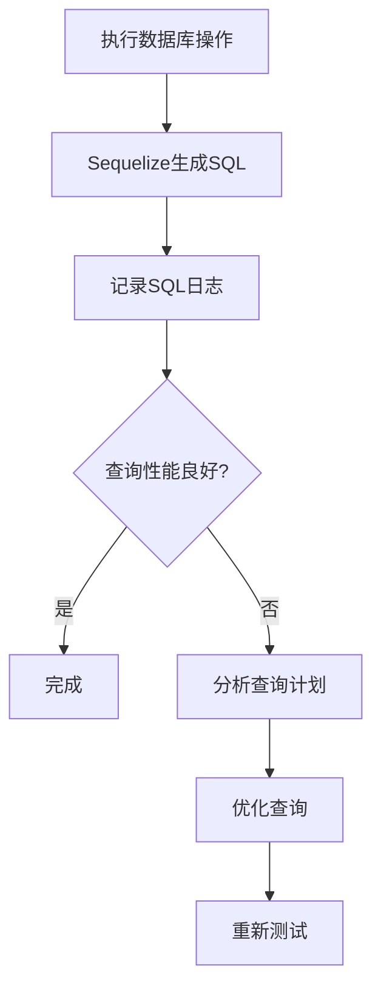

**Diagram sources**
- [app.ts](file://k.yyup.com/server/src/app.ts#L94-L108)

### ORM模型调试
通过`db-optimizer.ts` CLI工具可以诊断和优化数据库模型，包括索引优化和慢查询分析。

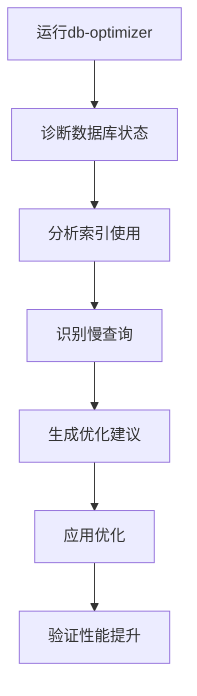

**Diagram sources**
- [db-optimizer.ts](file://k.yyup.com/server/src/cli/db-optimizer.ts)

### 数据库连接问题排查
`database.config.ts`配置了数据库连接池，调试连接问题需要检查连接池配置和网络状况。

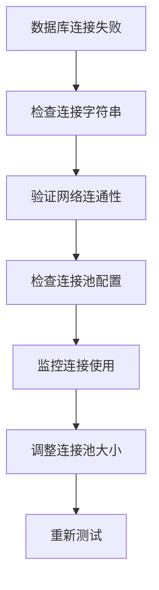

**Diagram sources**
- [database.config.ts](file://k.yyup.com/server/src/config/database.config.ts)

**Section sources**
- [database.config.ts](file://k.yyup.com/server/src/config/database.config.ts)
- [db-optimizer.ts](file://k.yyup.com/server/src/cli/db-optimizer.ts)

## 认证与授权调试
认证与授权是k.yyupgame安全架构的核心，调试这些流程对于确保系统安全至关重要。

### JWT认证调试
`jwt.config.ts`配置了JWT令牌的生成和验证，调试时需要检查令牌的签发、验证和过期处理。

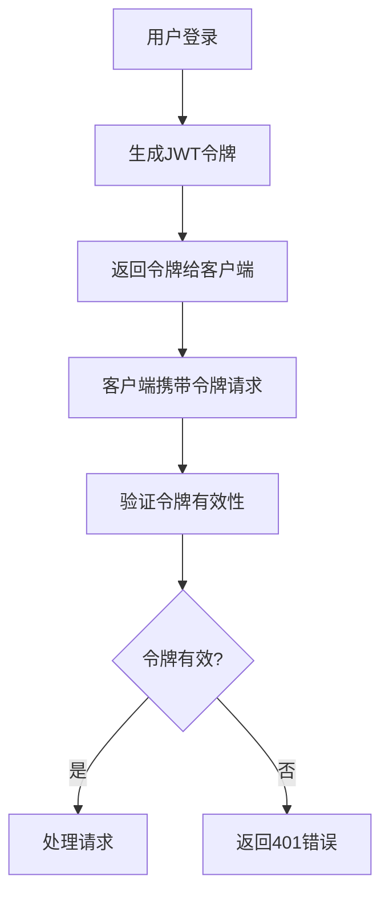

**Diagram sources**
- [jwt.config.ts](file://k.yyup.com/server/src/config/jwt.config.ts)

### 权限系统调试
通过`/api/fix`等临时路由可以调试和修复权限配置，确保用户只能访问授权的资源。

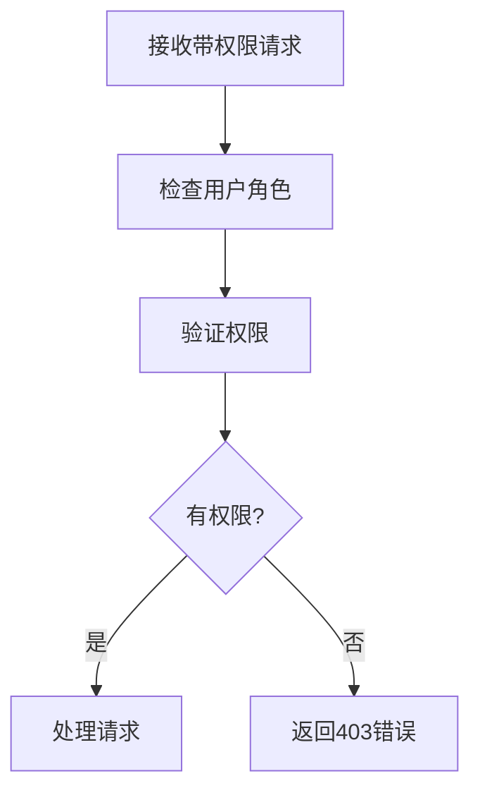

**Section sources**
- [jwt.config.ts](file://k.yyup.com/server/src/config/jwt.config.ts)
- [routes](file://k.yyup.com/server/src/routes)
- [middlewares](file://k.yyup.com/server/src/middlewares)

## 性能瓶颈分析
性能瓶颈分析是确保系统稳定运行的关键，涉及API性能监控和数据库优化。

### API性能监控
通过API请求日志可以监控每个端点的响应时间，识别性能瓶颈。

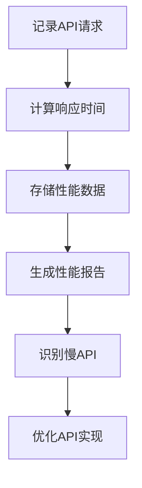

**Diagram sources**
- [app.ts](file://k.yyup.com/server/src/app.ts#L94-L108)

### 数据库性能优化
使用`database-optimization.ts`配置和`db-optimizer.ts`工具进行数据库性能优化，包括索引优化和查询重构。

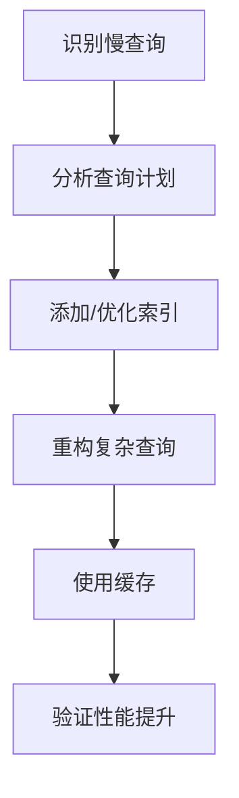

**Diagram sources**
- [database-optimization.ts](file://k.yyup.com/server/src/config/database-optimization.ts)
- [db-optimizer.ts](file://k.yyup.com/server/src/cli/db-optimizer.ts)

**Section sources**
- [app.ts](file://k.yyup.com/server/src/app.ts)
- [database-optimization.ts](file://k.yyup.com/server/src/config/database-optimization.ts)
- [db-optimizer.ts](file://k.yyup.com/server/src/cli/db-optimizer.ts)

## 常见后端异常诊断
### 数据库连接异常
当出现数据库连接异常时，按照以下步骤进行诊断：

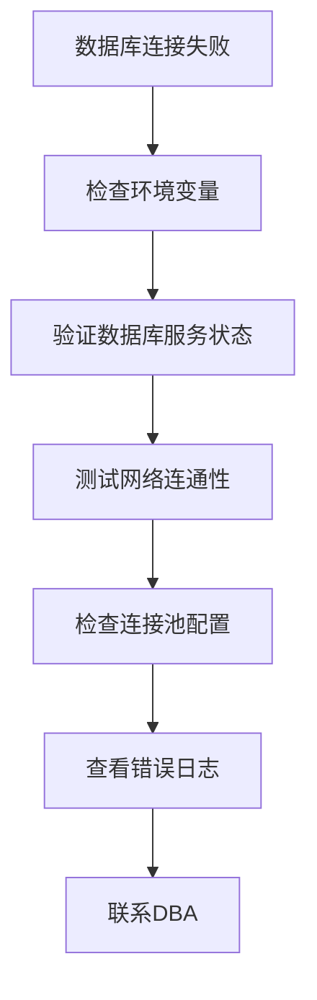

### 认证失败异常
当出现认证失败异常时，按照以下步骤进行诊断：

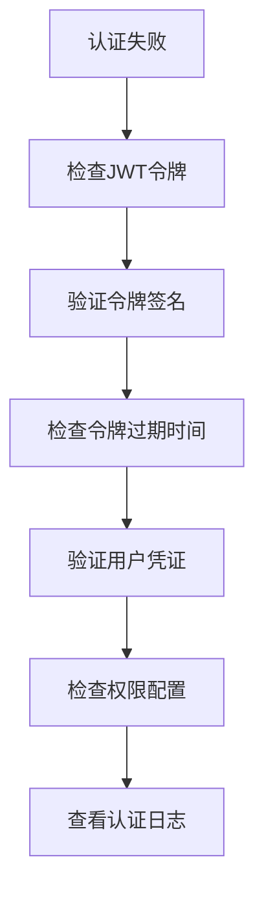

### API响应超时
当出现API响应超时时，按照以下步骤进行诊断：

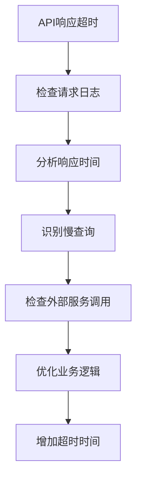

**Section sources**
- [app.ts](file://k.yyup.com/server/src/app.ts)
- [error.middleware.ts](file://k.yyup.com/server/src/middlewares/error.middleware.ts)
- [database.config.ts](file://k.yyup.com/server/src/config/database.config.ts)

## 附录
### 调试命令速查
| 命令 | 说明 |
|------|------|
| `npm run start:debug` | 启动调试模式 |
| `npm run start:debug:watch` | 启动调试模式（带热重载） |
| `npm run db:diagnose` | 诊断数据库状态 |
| `npm run db:slow-queries` | 分析慢查询 |

### 环境变量配置
关键环境变量包括：
- `JWT_SECRET`: JWT令牌密钥
- `DATABASE_URL`: 数据库连接字符串
- `PORT`: 服务端口
- `NODE_ENV`: 环境模式（development/production）